# AWS Basics & Fundamentals

---

# Part 1: Networking & Web Architecture Fundamentals


---

## 1. Architecture

**Client** is one who requests a resource. **Server** is the one which responds to the request of that resource.

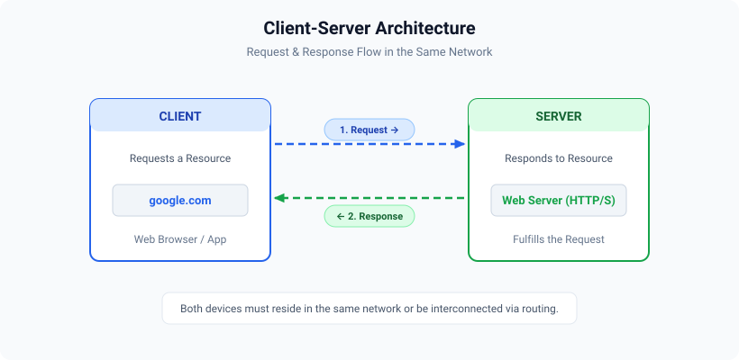

Both should be in the same network. Each device (hub/switch) can be either client or server — if it is requesting then it is a client, if fulfilling the request then it is a server.

---

### Types of Architecture

#### 1-Tier Architecture
You develop your code on local — no one else can access it. DB is also on the same computer. Your laptop acts as both client and server. It is **not good** to keep client and server on the same machine.

#### 2-Tier Architecture

Logic and DB in the server; UI in a different machine.

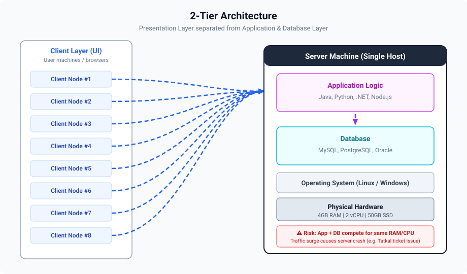

If there are memory issues (Application and DB taking too much space), the server might crash — like Tatkal ticket booking on IRCTC. So it is **not good** to keep Application and DB on the same machine.

**Advantages of Two-Tier Client/Server Structure:**
- Easy to maintain and modify.
- Communication between client and server (request/response) is quite fast.

**Disadvantages of Two-Tier Client/Server Structure:**
- If client nodes increase beyond capacity, the server cannot handle the request overflow and performance degrades.

To test code before going to production, code is tested in a **Test Environment**. After testing we have a **Pre-Prod environment** (similar to prod).

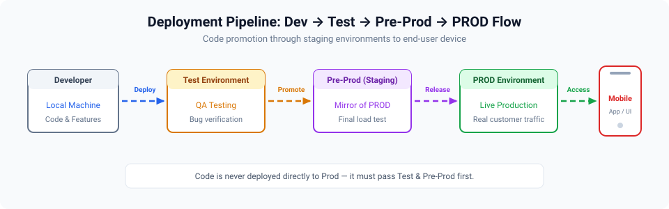

#### 3-Tier Architecture

The disadvantage of 2-tier is that application and DB are in the same environment causing memory issues. So we separate them — that gives us 3-tier.

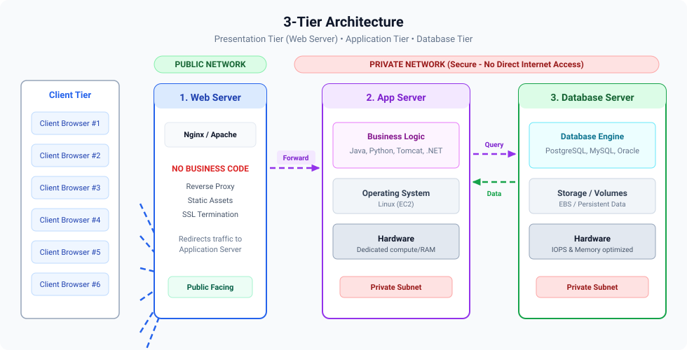

- **IP** is the unique identifier of a computer in a network (like an Aadhar card for a person).
- Your **application server** must be in a private network — we do not want everyone to see the code.
- The **client** is in a public network. To let the client access the app server, we use a **Web Server** — it takes requests from the client and redirects to the application server. No code lives here.

#### N-Tier (Microservices)
Each service runs independently and communicates over the network.

---

## 2. DNS (Domain Name System)

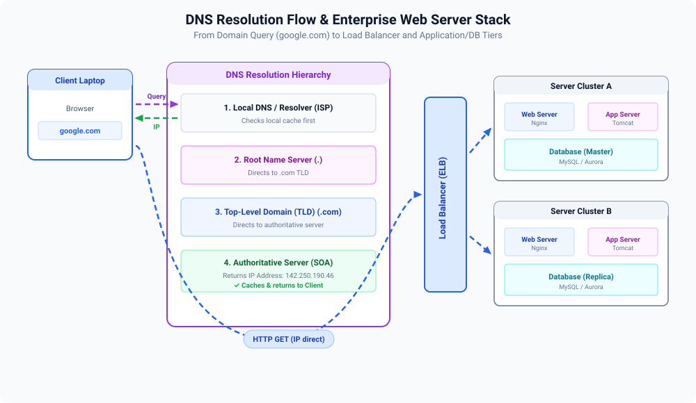

You access `google.com`. The hostname is `google.com`, but the browser understands IP addresses. Remembering every website's IP address is impractical — that is why DNS exists.

**DNS is like a distributed map of `<Hostname, IP Address>`.**
The local cache is called **Local DNS**.

### Steps to Resolving a Domain Name

1. Web browser and OS first check whether the domain is in their **cache**. If yes, done.
2. The browser sends a request to a **DNS Resolver** (a local server hosted with your ISP).
3. The resolver checks its cache. If not found, it queries **Root Name Servers** recursively.
4. Root servers respond with the address of the **Top-Level Domain (TLD)** server (e.g., `.com`).
5. The TLD server responds with the **Authoritative Name Server** for `google.com`.
6. The Authoritative Name Server responds with the **IP address** of `www.google.com`.
7. The resolver caches this IP, and the OS also caches it for future use.

> DNS is organized in an upside-down tree-like structure — we go to the top (Root) and search downward.

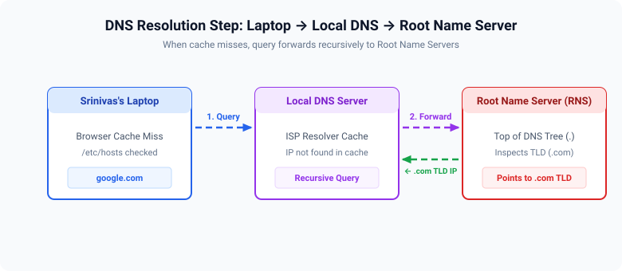

The Root Name Server checks the domain extension (`.com`, `.uk`, etc.) and routes accordingly.

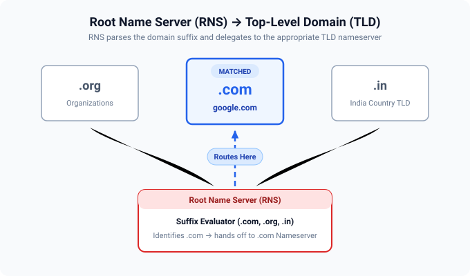

The Root Name Server sends the request to the `.com` Top-Level Domain.

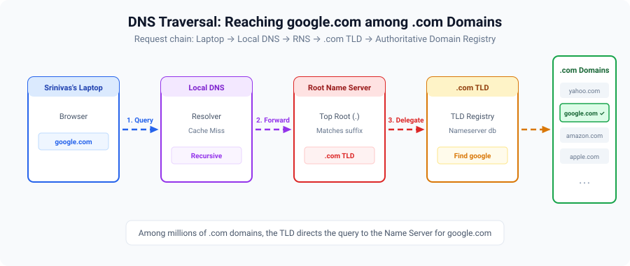

Among all `.com` domains, we now find `google.com` using the **Name Server** (NS) which identifies the hostname, and then routes to the **SOA (Start of Authority)** record where we get the IP.

**What is a DNS SOA record?**
The DNS *Start of Authority* (SOA) record stores important info about a domain/zone: the administrator's email, when the domain was last updated, and how long the server should wait between refreshes. All DNS zones need an SOA record to conform to IETF standards.

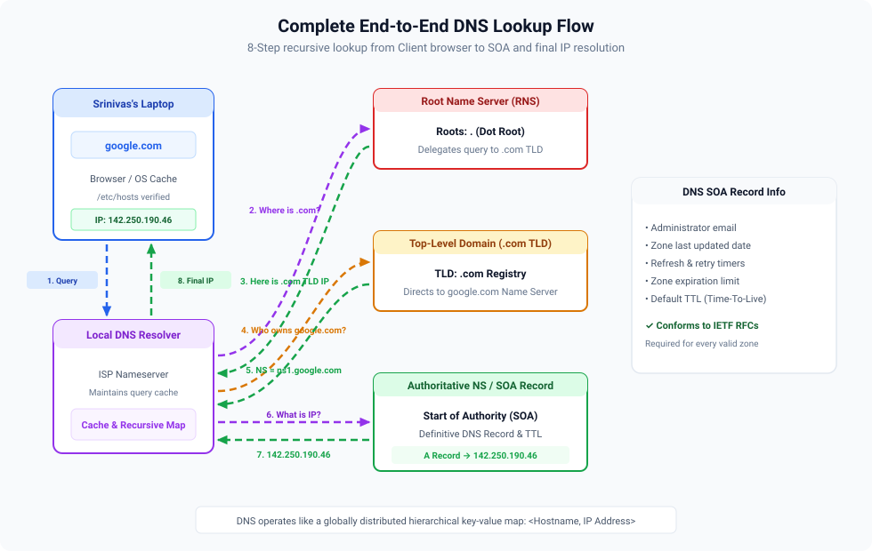

---

## 3. Firewall

Now that we have the IP address, we can reach the Google server. At that server there is a **Firewall** — which allows/blocks traffic by allow and deny rules.

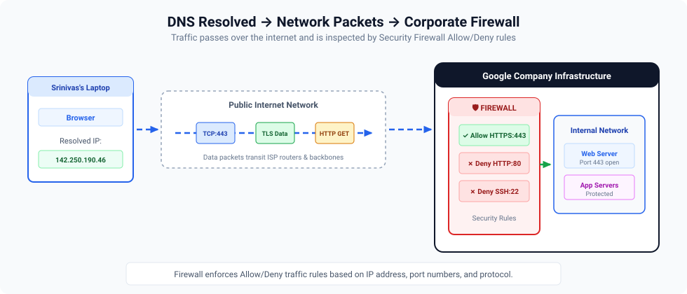

On the firewall we put rules like: **disallow HTTP, allow HTTPS**.

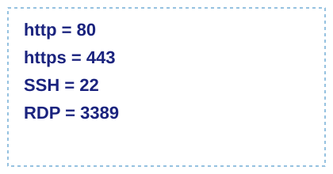

| Protocol | Port |
|----------|------|
| HTTP     | 80   |
| HTTPS    | 443  |
| SSH      | 22   |
| RDP      | 3389 |

- **HTTP** — not a secure connection to a website.
- **HTTPS** — secure connection to a website.
- **SSH** — used to connect to Linux machines.
- **RDP** — used to connect to Windows machines.

> **Firewall stops unauthorized access to the network.**

---

## 4. Load Balancer

On a Google request, it first goes to the **Web Server**, then **App Server**, then **DB Server**.

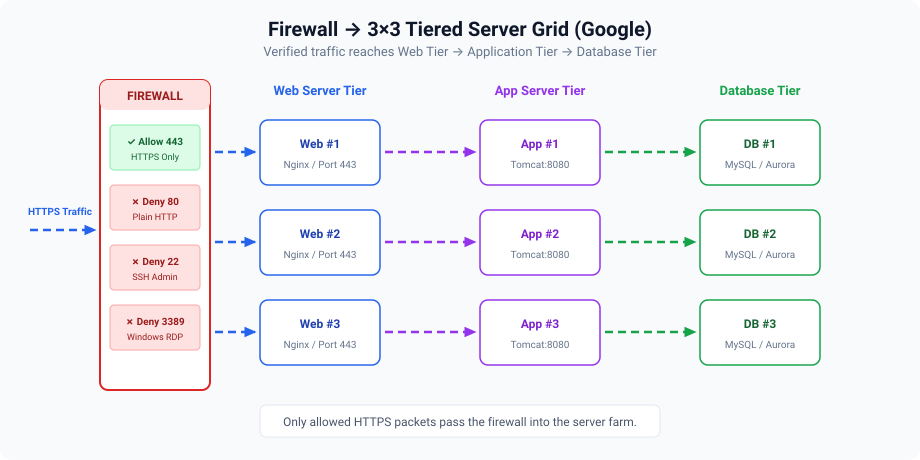

The request goes to one of multiple web servers.

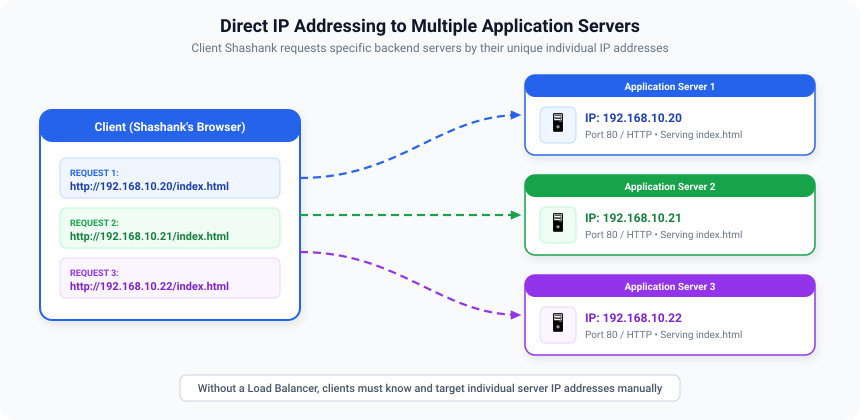

A user needs a domain name, not 3 raw IPs. That is why we use a **Load Balancer** which exposes a hostname.

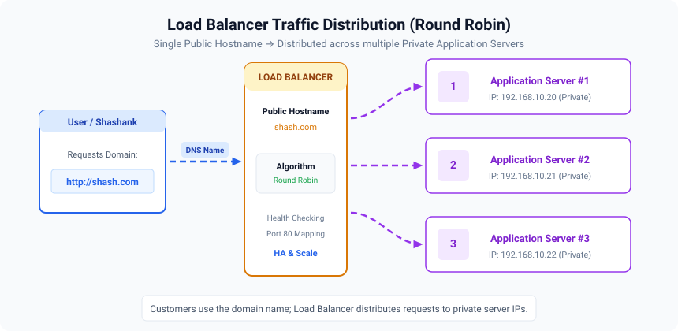

> **Load Balancer distributes traffic to multiple servers using Round Robin.**

The name of the load balancer is the domain name. It is **exposed to the public**.

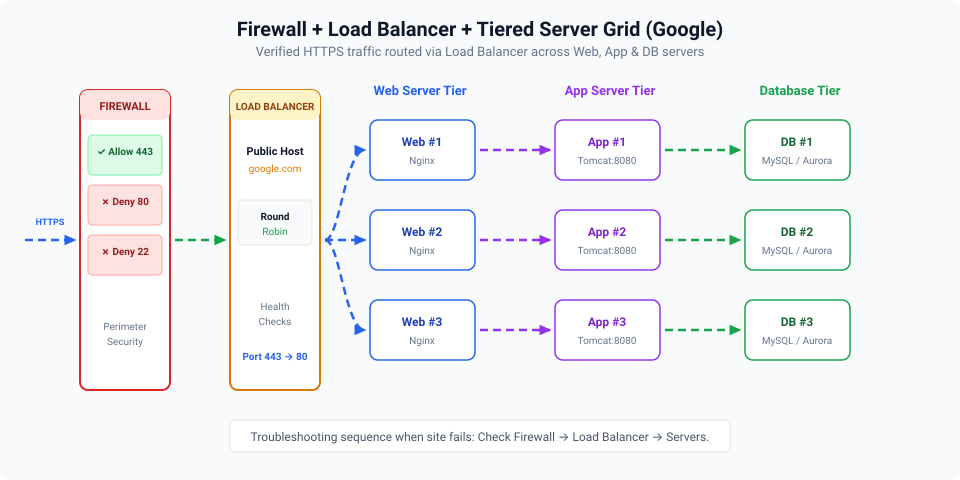

If a website is not working, you check: Firewall → Load Balancer → Servers.

---

## 5. HTTP

### DNS Done — Now HTTP

The browser follows **HTTP (HyperText Transport Protocol)** to send a GET request to google.com.

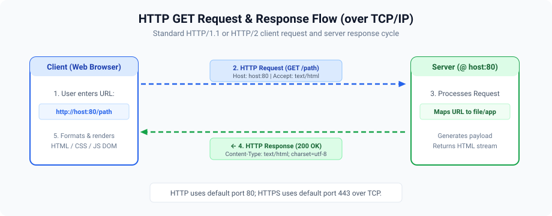

- HTTP is the protocol used to transfer data to and from a website.
- `WWW` indicates it is a website using the HTTP protocol.
- `HTTP://anything.com`, `WWW.anything.com`, `HTTP://WWW.anything.com` all lead to the same site.

**HTTP default port number is 80** (not 8080).

**URL Syntax:** `Protocol :// DomainName : Port`

We never include the port number in URLs because HTTP defaults to 80 and HTTPS defaults to 443 — the browser infers it from the protocol.

> If you use a non-default port (e.g., `https://google.com:143`), the browser returns an `ERR_UNSAFE_PORT` error — customers never need to remember port numbers.

```
HTTP  = HyperText Transfer Protocol    -> http://google.com
HTTP  default port = 80                -> Protocol :// DomainName : Port
HTTPS default port = 443               -> Always use 80 or 443 for customers
```

### Application Server Port Mapping

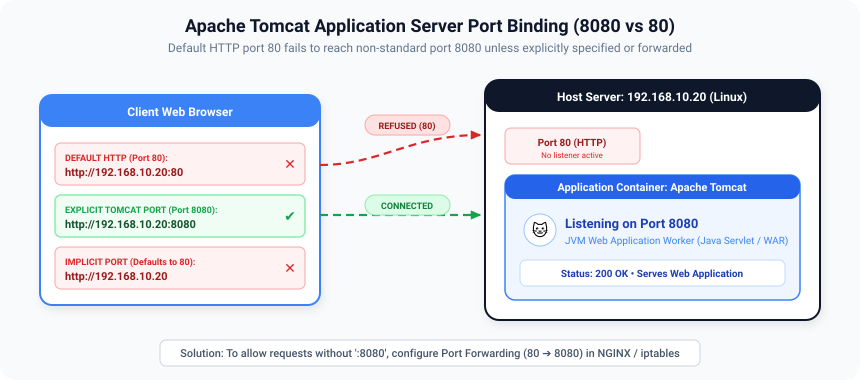

Tomcat runs on port 8080 internally. However, we **never expose raw IPs and port 8080** to customers.

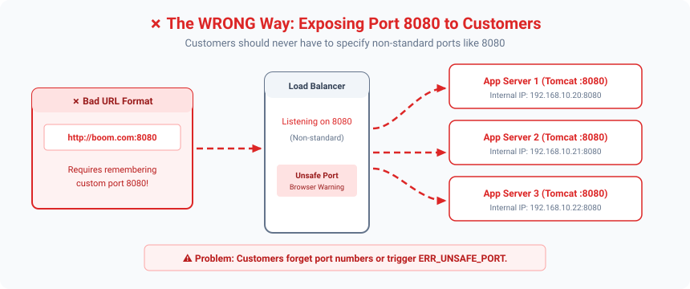

The **correct way**: The Load Balancer maps port **80 to 8080** internally. Customers only see the default port.

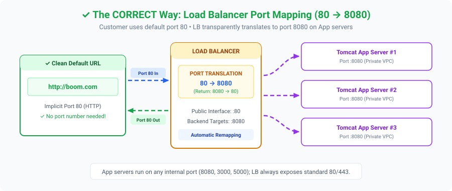

> Inside the server you can use any port, but the **Load Balancer always exposes the default port externally**.

### HTTP Data Format

HTTP transfers data as **hypertext** (formatted text). HTTP request/response messages include headers:

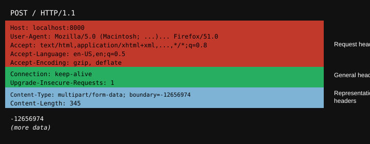

### HTTP Response Status Codes

Responses are grouped in five classes:

| Range     | Category                |
|-----------|-------------------------|
| 100–199   | Informational responses |
| 200–299   | Successful responses    |
| 300–399   | Redirection messages    |
| 400–499   | Client error responses  |
| 500–599   | Server error responses  |

**Common codes:**
- `200` — Page found / Success
- `404` — Page Not Found
- `500` — Internal Server Error (internal service is down)
- `503` — Service Unavailable (server down)

### HTTP Disadvantage — Not Secure

HTTP sends all data as **clear text** over the network.

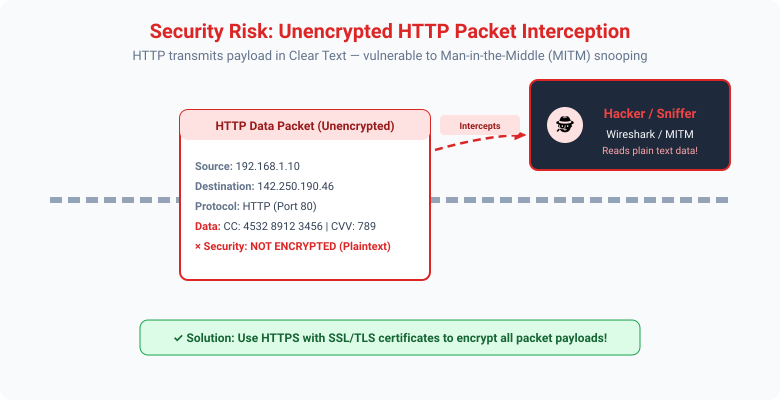

If you put a credit card number or CVV, HTTP sends it in plain text — anyone on the network can read it.

---

## 6. HTTPS (HTTP Secure)

We use **HTTPS** — all data is in encrypted format. Always check you are using HTTPS.

This security relies on **SSL/TLS Certificates** (also called HTTPS certificates), obtained from providers like GoDaddy.

> **Tomcat** is an application server; **Nginx** is a web server.

---

## 7. HTTP Over TCP/IP

**TCP** connects two servers via a **3-Way Handshake**. HTTP/HTTPS protocols work on top of TCP.

> TCP is like a bridge; HTTP/HTTPS packets are people crossing it.
> Or: TCP is the **track**, HTTP packets are the **metro trains**.

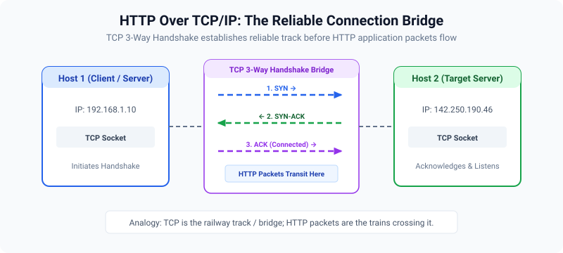

**UDP (User Datagram Protocol)** is an alternative — but it is **not reliable** (no guaranteed delivery).

---

## 8. OSI Model

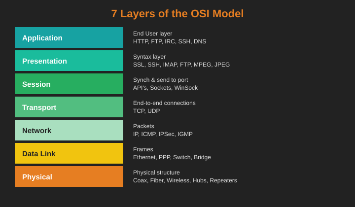

The 7 layers (bottom to top):

| # | Layer        | Role                                        |
|---|--------------|---------------------------------------------|
| 1 | Physical     | Physical hardware connection                |
| 2 | Data Link    | Node-to-node data transfer (MAC)            |
| 3 | Network      | Routing via IP addresses                    |
| 4 | Transport    | TCP/UDP — reliable delivery                 |
| 5 | Session      | Manages sessions between hosts              |
| 6 | Presentation | Encryption, compression, formatting         |
| 7 | Application  | HTTP, FTP, SMTP — end user facing           |

**Analogy (Boy meets Girl at a bus stop):**

1. Both need to be **physically present** — Physical Layer
2. They communicate via **speech** (data link in networks) — Data Link Layer
3. Both are at the **same bus stop** (same network) — Network Layer

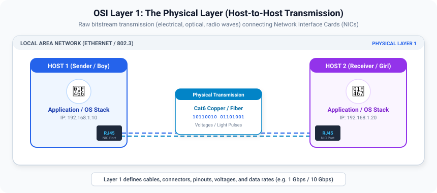

4. A **friend** (TCP) establishes a connection between them. If it is a UDP friend — he is not trusted! — Transport Layer

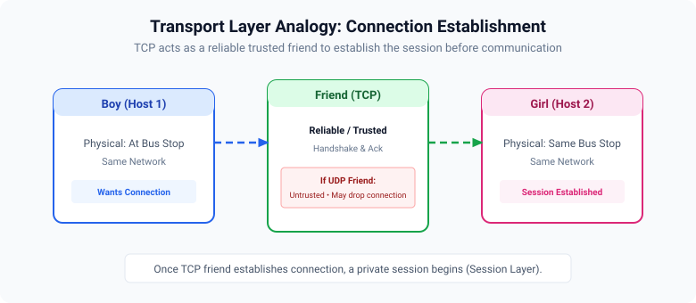

5. The connection is established — now they have a **private session** — Session Layer
6. He **presents** himself to the girl — Presentation Layer
7. They go to a **movie together** — Application Layer

---

## 9. TCP/IP Analogy — Grandma's Cookies

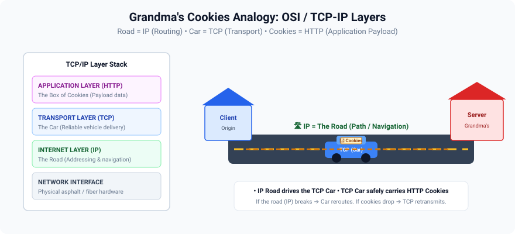

1. **IP** = the road on which we drive
2. **TCP** = the car
3. **HTTP** = the box of cookies moving from one location to another (Client to Grandma's House / Server)

---

## 10. SSL/HTTPS Handshake

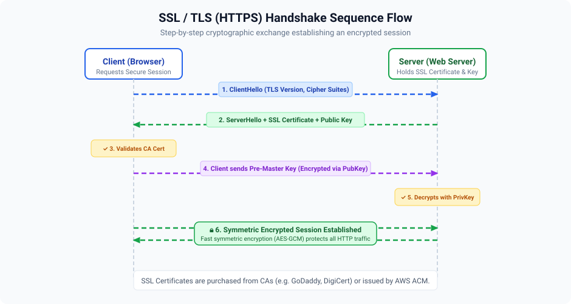

**Steps:**
1. Client says **Hello**
2. Server says **Hello** (and sends its certificate)
3. Client generates a **symmetric key**
4. Server verifies the key
5. Once verification is successful — **Secure data transfer begins**

---

## 11. Full Stack: Load Balancer to Web Server to App Server to Database

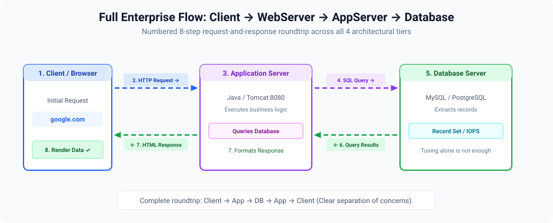

| Component          | Role                                                                                  |
|--------------------|---------------------------------------------------------------------------------------|
| **Load Balancer**  | Distributes incoming traffic across multiple servers (Round Robin)                    |
| **Web Server**     | Supplies web content for browsers; delivers what the browser requests (e.g., Nginx)  |
| **App Server**     | Hosts and executes application logic; communicates with the database (e.g., Tomcat)  |
| **Database**       | Stores and retrieves persistent data                                                  |

---

> **Summary:** Client to DNS to IP to Firewall to Load Balancer to Web Server to App Server to DB
> Every layer adds security, scalability, and reliability to the system.

---

# Part 2: Cloud Computing Concepts


---

## 1. Server Room / Data Center

A data center contains wires, servers, and CPUs, typically handled by 1–10 people who manage all resources.

**Common data center problems:**
- A cleaning person trips on a wire → 8 hours of downtime and thousands of dollars lost
- Hard disk crashes → customers lose data; recovery depends on vendor
- Rats eat wires
- Servers need physical space (rooms) to be housed

When a business wants to host a website, an operations person buys a physical server. As traffic grows, more servers are added. This room of servers is the **data center**.

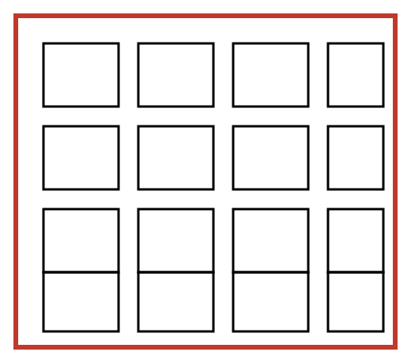

**On-Premises**: A data center handled by your own team is called **on-premises**. This requires significant effort — adding/removing servers is entirely manual and physical.

Servers also have warranties. After the warranty expires, you must replace the hardware. New servers bring new issues.

---

## 2. Virtualization

After struggling with physical machines, a new technology appeared: **Virtualization**.

**Virtualization Concept:**
- Creating a virtual machine (VM) over an existing OS and hardware is called **Virtualization**.
- VMs provide an environment **logically separated** from the underlying hardware.
- The machine on which the VM is created = **Host Machine**; the VM itself = **Guest Machine**.
- The software/firmware that manages VMs = **Hypervisor**.

**Before Virtualization:**
- Single OS image per machine
- Software and hardware tightly coupled
- Running multiple apps on the same machine often creates conflicts
- Underutilized resources
- Inflexible and costly infrastructure

**After Virtualization:**
- Hardware-independence of OS and applications
- VMs can be provisioned to any system
- OS and application managed as a single unit by encapsulating them into VMs

**Virtualization Approaches:**
- **Hosted Architecture**: Installs and runs as an application. Relies on host OS for device support and physical resource management.
- **Bare Metal (Hypervisor) Architecture**: Hypervisor is installed directly on hardware — no host OS required. Results in better performance, scalability, and stability.

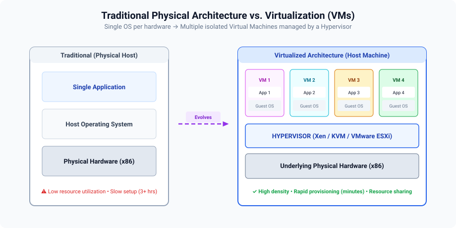

Setting up a physical machine takes at least 3 hours. A VM can be created and deleted in minutes — just need an OS. VMs use the host machine's hardware. The number of VMs you can create depends on the available hardware.

> Example: Need 100 machines? Use 5 big physical machines + 95 VMs.

10–11 years ago, most physical machines migrated to VMs.

---

## 3. Cloud Computing — The Move to AWS

With more VMs, risk increased. A new idea emerged: **a company (AWS) that manages the entire data center for you.**

AWS said to every customer: *"I will handle the data center — no need to set up your own."*

This migration from virtual machines to AWS is called **V2C Migration** (Virtual to Cloud).

**AWS Key Facts:**
- AWS has data centers throughout the globe
- In India: Mumbai and Hyderabad
- Mumbai is preferred (Hyderabad is newer, and newer infra may have bugs — like avoiding a newly opened restaurant)
- AWS uses **Xen Virtualization Technology** (like VMware, but AWS's own)

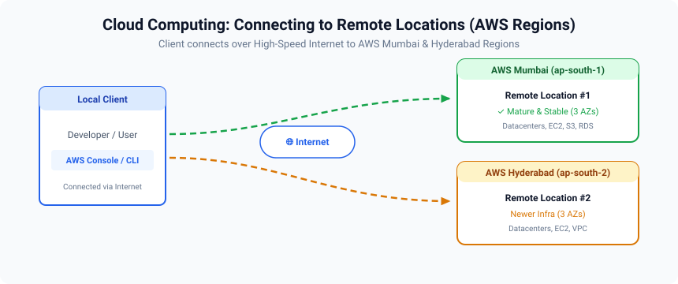

**Cloud terminology:**
- Sitting here and accessing a remote location computer = **Cloud**
- Remote Location = Data Centers
- Data Center = Infrastructure (servers, storage, databases, etc.)

**Cloud Computing:**
> Instead of doing computing on a local machine / on-premises, you do computing in a Remote Location (Cloud). That is called **Cloud Computing**.

**Summary points:**
- We need the internet to connect to the Cloud
- AWS is a Cloud Provider who provides **Infrastructure as a Service**
- AWS is a group of services
- You access AWS through the **Amazon Management Console (AMC)**

---

## 4. Deployment Models (Types of Cloud)

**Analogy:** A restaurant only for family members = private. A restaurant open for everyone = public.

- **Public Cloud**: Accessible by everyone (e.g., AWS, Azure, GCP). Less secure due to openness.
- **Private Cloud**: Accessible only within an organization (e.g., Samsung Cloud Platform — SCP). More secure due to private nature.
- **Hybrid Cloud**: Public + Private. Example: A bank puts user profiles on AWS but handles transactions via a private cloud.
- **Community Cloud**: Systems accessible by a group of organizations.

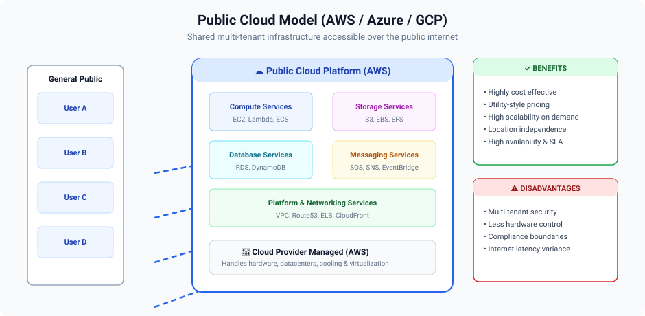

**Public Cloud — Benefits:** Cost Effective, Reliability, Flexibility, Location Independence, Utility Style Costing, High Scalability  
**Public Cloud — Disadvantages:** Low Security, Less customizable

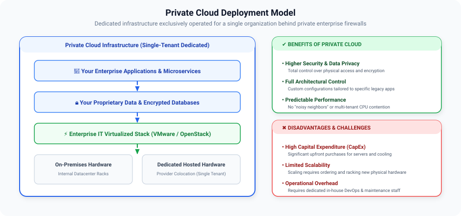

**Private Cloud — Benefits:** Higher Security and Privacy, More Control, Cost and Energy Efficiency  
**Private Cloud — Disadvantages:** Restricted Area, Inflexible Pricing, Limited Scalability, Additional Skills Required

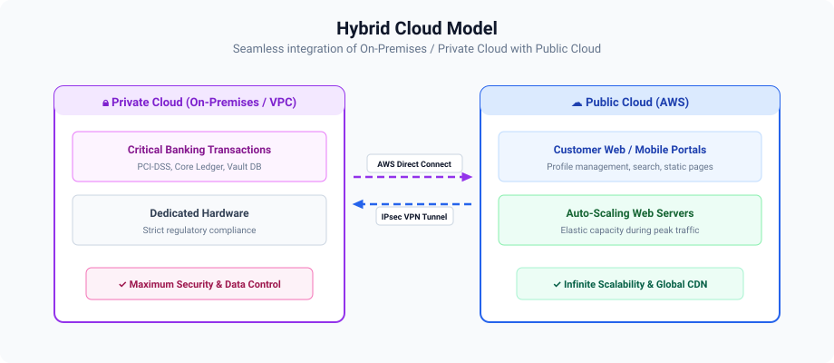

**Hybrid Cloud — Benefits:** Best of both worlds — security of private + scalability of public  
**Hybrid Cloud — Disadvantages:** Complexity in management and integration

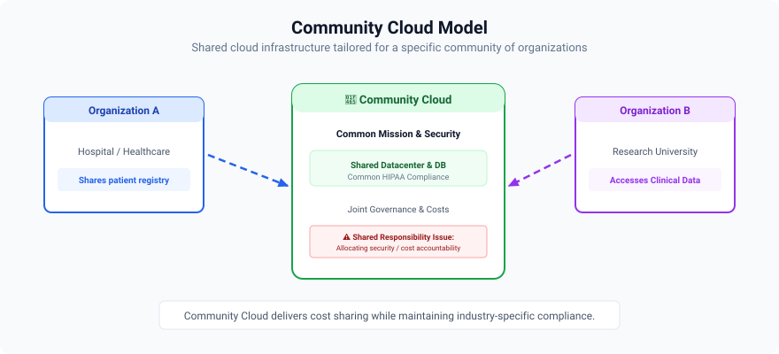

**Community Cloud — Benefits:** Cost effective, Sharing between organizations, Security  
**Community Cloud — Issues:** Data is shared at one location — must be careful; responsibility for governance, security, and cost allocation is challenging.

**Evolution path:**
```
Physical DC --> Virtualization --> Cloud --> AWS (Remote Location / Data Centers)
```

**Key terms:** Virtualization, Host Machine, DNS, VMs, Infrastructure, DataCenters, Load Balancer, Firewalls, Protocols, Hypervisor, Cloud, Remote Location

---

## 5. Service Models

There are three primary cloud service models:

| Service Model | Full Name | Description |
|---|---|---|
| **IaaS** | Infrastructure as a Service | Access to fundamental resources: physical machines, VMs, virtual storage |
| **PaaS** | Platform as a Service | Deploy apps without managing virtual servers |
| **SaaS** | Software as a Service | Ready-to-use software applications |

### Pizza Analogy for Service Models

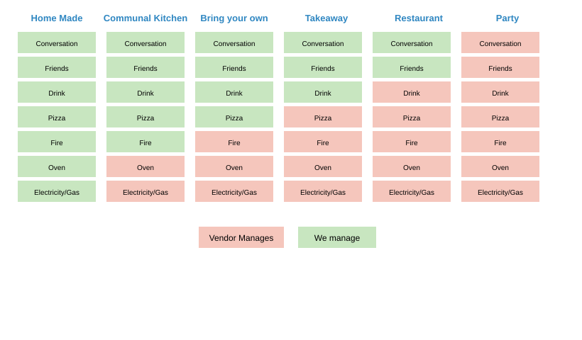

| Model | Pizza Analogy | Who handles what |
|---|---|---|
| **On-Premises** | Home Made | You arrange everything: electricity, gas, oven, pizza, drinks, friends |
| **IaaS** | Communal Kitchen | Kitchen and oven provided; you make the pizza and arrange everything else |
| **CaaS** | Bring Your Own | Oven ready and preheated; you just make the pizza |
| **PaaS** | Takeaway | Order by phone, pick up pizza; you arrange drinks and company |
| **FaaS** | Restaurant | Everything served; you just enjoy |
| **SaaS** | Party | Show up, everything is arranged; just have a good time |

### Cloud Service Models Visual

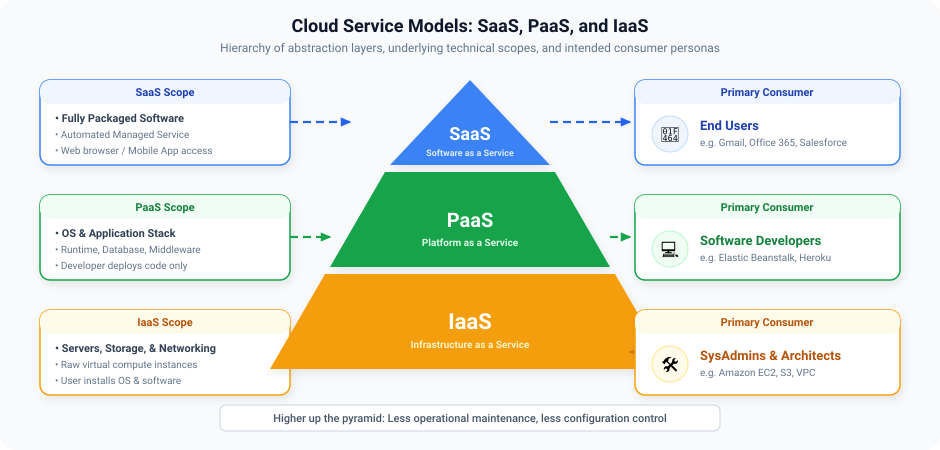

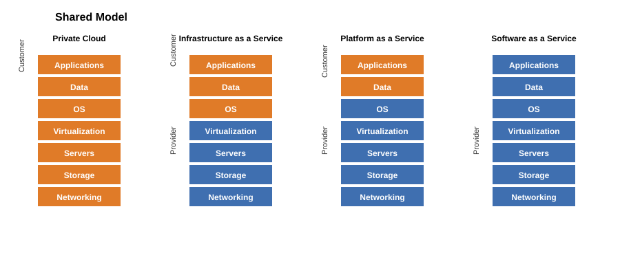

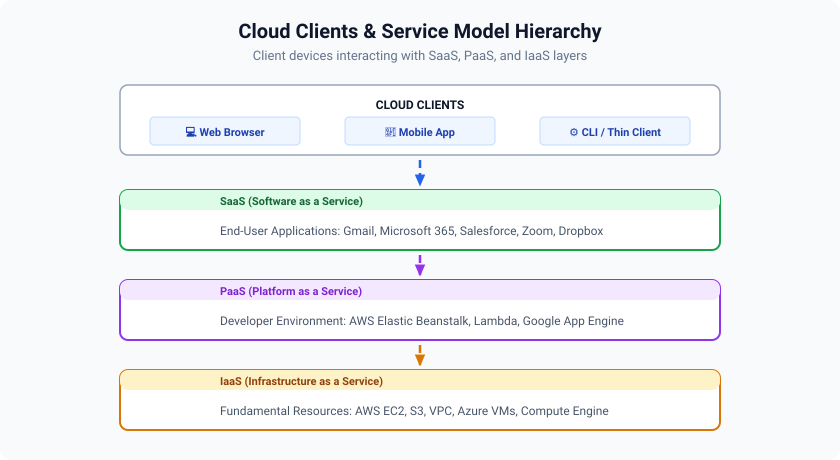

**Cloud Service Models & Services:**

| Cloud Service Model | Service Examples |
|---|---|
| IaaS | AWS EC2, Microsoft Azure Virtual Machines, Google Compute Engine |
| PaaS | AWS Elastic Beanstalk, AWS Lambda, Azure Logic Apps, Azure Functions, Google App Engine |
| SaaS | Office 365, Google Workspace, Facebook, Twitter |

---

## 6. IaaS — Infrastructure as a Service

AWS is the most well-known IaaS provider. A person with a zip file of Java code gives it to AWS. AWS says: *"I provide everything — network, data center, virtualization — you do what you want."*

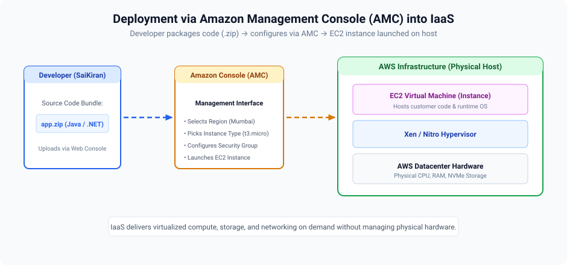

- To create virtual machines on AWS: use **EC2** (Elastic Compute Cloud)
- We call a server in AWS an **EC2 instance** (a virtual machine)
- In AWS under IaaS: **Network and Virtualization are managed by AWS (Provider)**; **OS, Data, and Application are managed by the Customer**

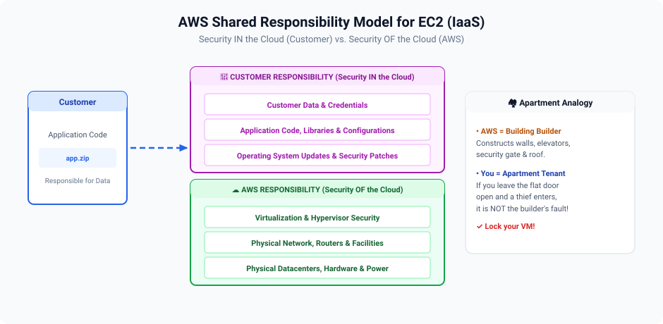

**IaaS by Cloud Platform:**

| Cloud Platform | Services |
|---|---|
| AWS | Amazon EC2 and Amazon S3 |
| Microsoft Azure | Azure Virtual Machine, VM Scale Sets, Azure Virtual Networks |
| Google Cloud Platform | Google Compute Engine and Google Cloud Storage |

### Shared Responsibility Model (IaaS)

If a hacker attacks your data — whose responsibility is it? **The customer's.** AWS does not have access inside the VM.

> Analogy: You took a flat from a builder. You left it open and a thief entered. It is not the builder's (AWS's) fault — it is your responsibility.

AWS has formalized this as the **Shared Responsibility Model**:
- OS, Data, Application → **Customer's responsibility**
- Network, Virtualization, Data Centers → **AWS's responsibility**

### IaaS Advantages

- **Virtual machines replace physical hardware** — frees up time and creates/destroys on demand
- **Quickly scale up or down** — add or remove machines based on workload
- **Pay only for what you use** — no need to over-provision upfront
- **Suitable for high-performance computing** — vast configurations available in minutes
- **Suitable for predictable workloads** — complete control, cost-effective

### IaaS Drawbacks

- **Operations management** — you are responsible for upgrading, patching, and securing VMs
- **Expensive** — infrastructure is always running; pay for uptime even when idle; capacity planning is critical

---

## 7. PaaS — Platform as a Service

PaaS says: *"Just give me your application — I'll do everything else. You only manage data and application."*

- No need to create or manage servers
- OS is handled by PaaS
- If a new version of the OS doesn't support your previous version, you are stuck — that's a PaaS drawback

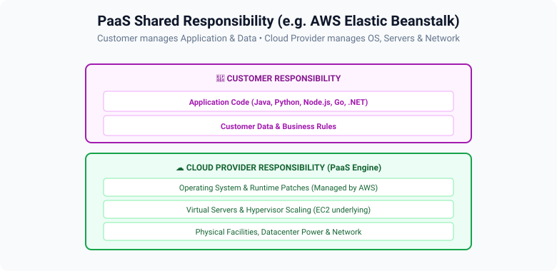

**PaaS by Cloud Platform:**

| Cloud Platform | Services |
|---|---|
| AWS | AWS Elastic Beanstalk, AWS Lambda |
| Microsoft Azure | Azure Logic Apps, Azure App Service, Azure Functions, Azure Cosmos DB |
| Google Cloud Platform | Google App Engine, Google Cloud Run |

### PaaS Advantages

- **Faster time to market** — tools, frameworks, and infrastructure provided by vendor
- **Develop for multiple platforms** — build for web and mobile from same environment
- **Common development environment** — centrally available, always ready
- **More cost-effective than IaaS** in many cases
- **Ease of licensing** — cloud vendor handles license management

### PaaS Drawbacks

- **Vendor lock-in** — development tools are platform-specific, hard to move to other platforms
- **Security and compliance** — no control over where data is hosted; due diligence required for compliance

> Note: **Azure** is most well known as a PaaS provider (though it offers all three). **AWS Elastic Beanstalk** is AWS's primary PaaS service — used for easy and quick deployment.

---

## 8. SaaS — Software as a Service

SaaS says: *"I'll do everything — and I don't host your software, I have my own."*

SaaS is essentially **all online software applications** (Gmail, Zoom, Office365, etc.). The customer only uses the software — no control over infrastructure, OS, or even the application itself.

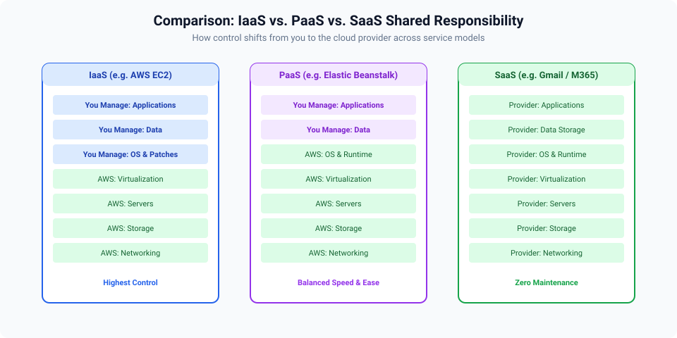

**SaaS by Service Provider:**

| Service Provider | Services |
|---|---|
| Dropbox and Salesforce | Dropbox, Salesforce |
| Microsoft | Office 365 |
| Google | Google Workspace, Gmail |
| Twitter | Twitter |
| Meta | Facebook, WhatsApp, Instagram |

### SaaS Advantages

- **Faster deployment** — subscribe and start immediately; provider does all heavy lifting
- **Usage-based pricing / reduced financial risk** — no upfront license cost; pay as you subscribe; end subscriptions you don't need
- **Reduced need for on-premises resources** — no physical servers needed to run applications
- **Easier upgrades** — provider rolls out upgrades automatically; nothing to plan or deploy

### SaaS Drawbacks

- **Data security** — no control over how the provider manages your data; evaluate vendor security policies carefully
- **Limited customizations** — one product for all users; limited ability to add features
- **Harder to integrate** — restricted to integration capabilities the SaaS offers
- **Lack of control** — vendor decides features, capabilities, and level of customization

---

## 9. The 3 T's — Cloud Basic Concepts

Elasticity, Scalability, and High Availability are the three most important concepts in cloud:

---

### 9a. Elasticity

> "Elastic" = stretch when needed, then return to original state.  
> Elasticity in AWS = **increasing or decreasing the number of servers based on load**.

**Elasticity is short-term.**

Example: Flipkart's Big Billion Days — on normal days 2 servers are enough; on sale day we need more → we **stretch** (add servers). After the sale → we **shrink** (remove servers).

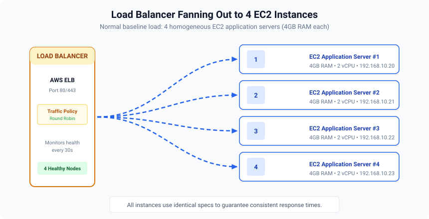

When load increases, instead of increasing RAM on existing server (which requires stopping it), we **add more servers** — and added 2 more:

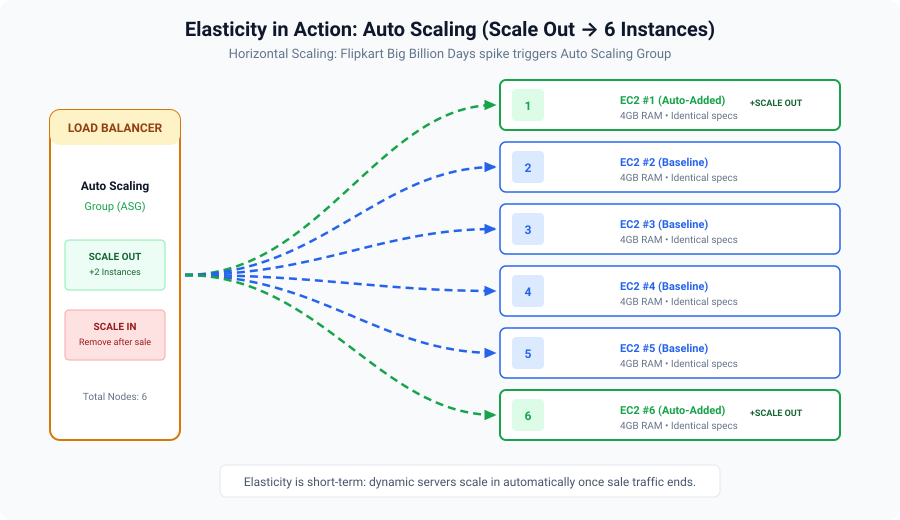

When the sale ends, we remove those 2 servers → **this is Elasticity**.

**Key facts:**
- Elasticity = adding/removing servers based on load
- Achieved in AWS using **Auto Scaling**
- Auto Scaling = **Scale Out** (add servers) + **Scale In** (remove servers)
- Elasticity is also called **Horizontal Scaling**
- Always use the **same capacity** servers in Auto Scaling (equal RAM/CPU) so all users get consistent performance
- Group of EC2 instances managed together = **Auto Scaling Group (ASG)**

---

### 9b. Scalability

> Scalability = **increasing the capacity of the server** itself (RAM, CPU).

**Scalability is long-term.**

Example: Your laptop is slow → you increase the RAM. Same idea for a DB server — if it's slow, increase its RAM/CPU.

To do this, you must **stop the machine** and change the capacity (instance type).

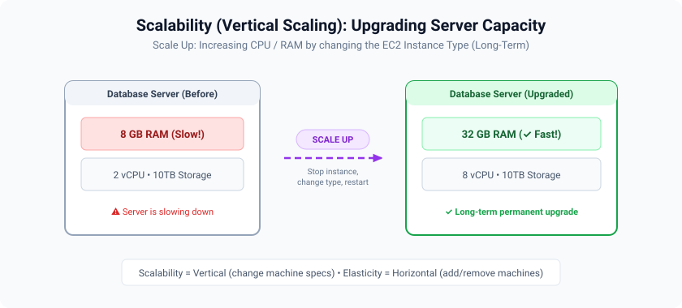

- Use **Elasticity (horizontal scaling)** for application servers at runtime (while customers are using it)
- Use **Scalability (vertical scaling)** for DB servers where stopping briefly is acceptable
- Scalability includes both **Scale Up** and **Scale Down**
- Achieved in AWS by **changing the instance type** (CPU + Memory)
- Scalability is also called **Vertical Scaling**

| | Elasticity | Scalability |
|---|---|---|
| Direction | Horizontal (add/remove servers) | Vertical (upgrade/downgrade one server) |
| Duration | Short-term | Long-term |
| AWS mechanism | Auto Scaling (Scale Out / In) | Change instance type (Scale Up / Down) |
| Downtime needed | No | Yes (brief stop required) |

---

### 9c. High Availability (HA)

> The period of time a service is available to customers = **High Availability (HA)**  
> The period of time a service is NOT available = **Downtime**

**HA is measured in percentages (nines).**

> Never promise 100% availability to a customer — if it ever goes down, you owe them everything back. Promise 99.9999% (like Dettol: "kills 99.99% of germs").

**Three rules for High Availability (RMF):**
1. **Redundancy** = Duplicate — same application running on different machines
2. **Monitoring** = Load Balancer health-checks the application (not just the server) — checks every 30 sec for HTTP 200
3. **Failover** = If one server goes down, another takes over its requests

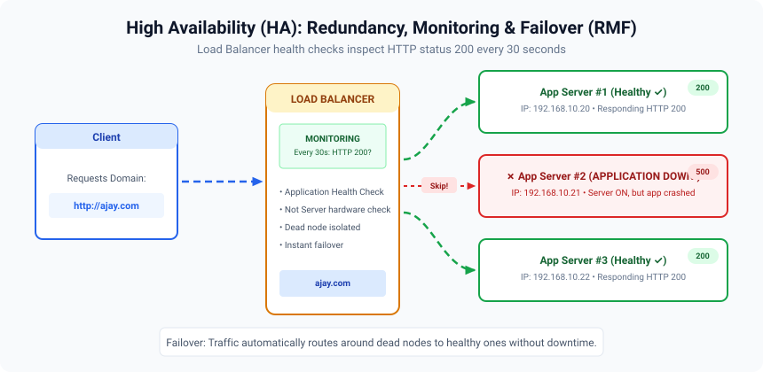

> **Note:** Load Balancer does health checks on the **application**, not the server. If the app is down but the server is up, LB still considers it dead (no 200 response).

If **all** servers go down → implement Auto Scaling to replace them automatically = **Fault Tolerance** (zero downtime).

**HA Availability Table:**

| Availability | Downtime (year) | Downtime (month) |
|---|---|---|
| 90% ("one nine") | 36.5 days | 72 hours |
| 95% | 18.25 days | 36 hours |
| 97% | 10.96 days | 21.6 hours |
| 98% | 7.30 days | 14.4 hours |
| 99% ("two nines") | 3.65 days | 7.2 hours |
| 99.5% | 1.83 days | 3.6 hours |
| 99.8% | 17.52 hours | 86.23 minutes |
| 99.9% ("three nines") | 4.38 hours | 21.56 minutes |
| 99.99% ("four nines") | 52.56 minutes | 4.32 minutes |
| 99.999% ("five nines") | 5.26 minutes | 25.9 seconds |

> **Five nines** = only 5 min downtime per year and 25 seconds per month.

**HA is in the eye of the beholder:**
- **CEO**: We don't lose sales
- **Sales**: We can extend our offers based on HA level
- **Accounts**: We don't upset customers (that often)
- **Developers**: Our services are working
- **System Engineers**: We can sleep well
- **Technical Support**: No calls → back to gaming

---

## 10. Load Balancer, Failover & HA Architecture

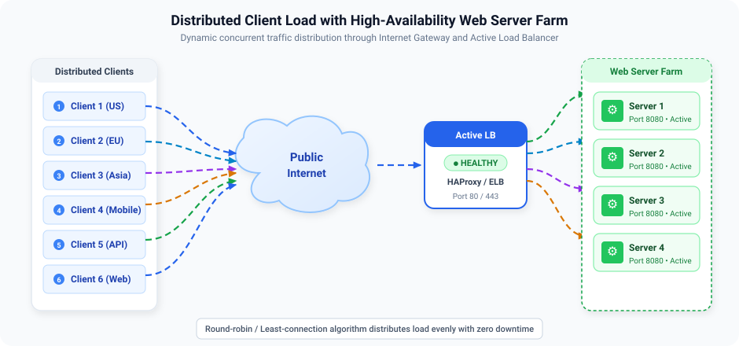

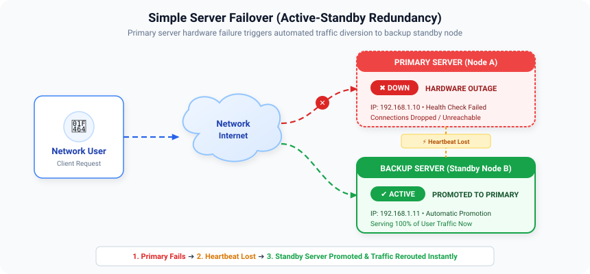

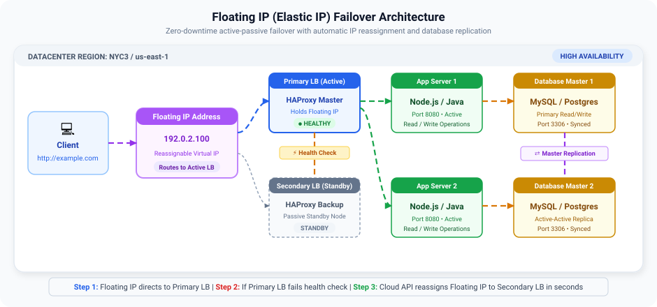

**Is this setup Highly Available?**
- ✅ Redundancy — 2 machines
- ✅ Monitoring — Load Balancer doing health checks
- ✅ Failover — If App Server 1 goes down, Server 2 takes over
→ **Yes, it is highly available.**

### HA Cluster: Happy Day

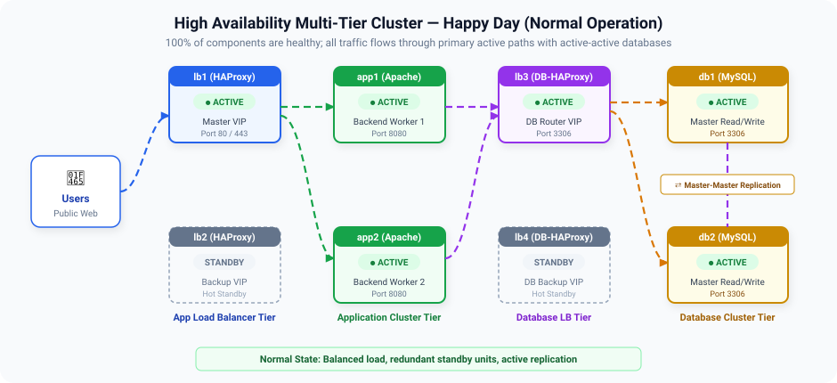

### HA Cluster: lb1 Down

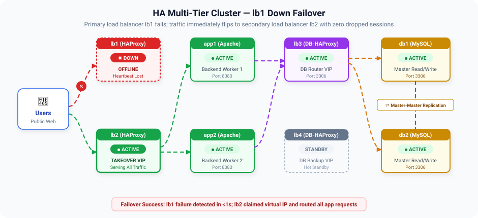

lb1 goes down → no impact to customer. lb2 takes over.

### HA Cluster: app1 Down

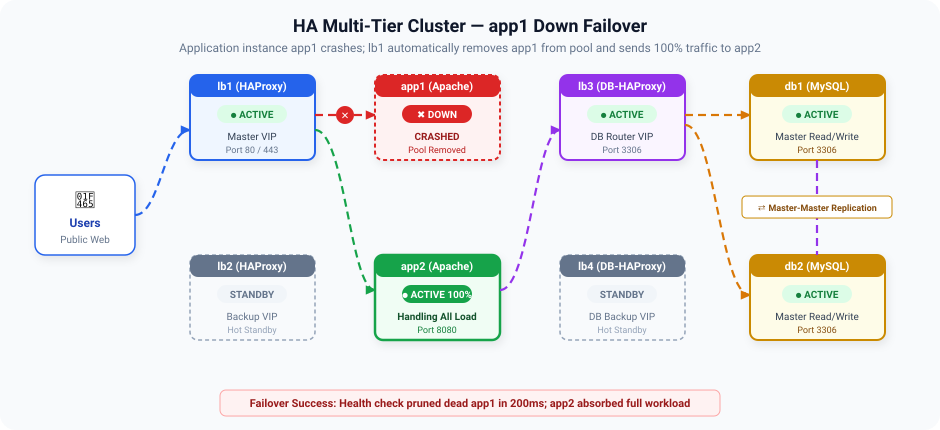

### HA Cluster: Worst Case (4 Components Down)

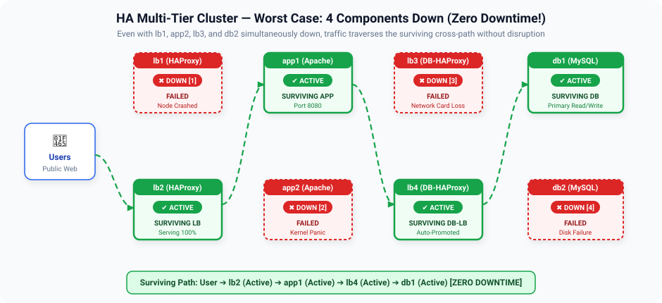

Even with half the infrastructure down, the application stays available for users.

> A website's reliability is built by the **system engineer's design** — not just the developer's code.

---

## 11. AWS: Single Instance vs Redundant Multi-AZ

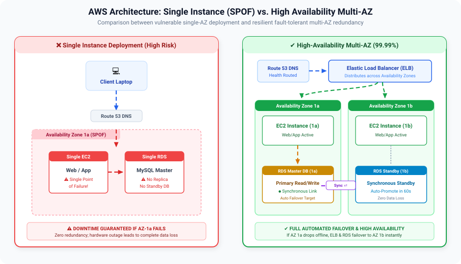

- **Single Instance** (left): One instance in one Availability Zone — no redundancy, single point of failure
- **Redundant Multi-AZ** (right): DNS → Load Balancer → Instances in AZ(A) and AZ(B) → Master/Slave database with replication — highly available

> **Now we start with AWS purely!**

---

## Quick Reference Summary

| Concept | Definition | AWS Implementation |
|---|---|---|
| **IaaS** | Infra as a Service — you manage OS, data, app | EC2, S3 |
| **PaaS** | Platform as a Service — you manage data, app only | Elastic Beanstalk, Lambda |
| **SaaS** | Software as a Service — you just use the software | Gmail, Office 365 |
| **Elasticity** | Add/remove servers based on load (short-term) | Auto Scaling Group (Scale Out/In) |
| **Scalability** | Upgrade/downgrade server capacity (long-term) | Change EC2 instance type (Scale Up/Down) |
| **High Availability** | % of time service is available | Redundancy + Monitoring + Failover |
| **Fault Tolerance** | Zero downtime — auto-replace failed servers | Auto Scaling + Multi-AZ |

---

# Part 3: Regions & Availability Zones (AWS Global Infrastructure)

## Region and AZs

Region is place where AWS has infrastructure!!
Region has multiple data centres!!
That data centre is called as AZs!!

Data centre==AZs
So servers are present in AZs!!

We have mumbai and hyderabad region!!

**Regions and Avalability Zones**
Region = Its a Geo-Graphical area , Ex AWS-Region = Mumbai
Availability Zone = Simply a DataCenter (AZ)

**Redundant AZs**
Ideally, you design your application to be across more than one AZ that way if one AZ goes down you have another.

When designing an application you try to have redundancy between the three AZs. That way if AZ1 goes down due to a power failure, AZ2 will be alive and will not be affected and in turn, your applications and their underlying data are not affected.

Every region has a code like mumbai has ap-south-1


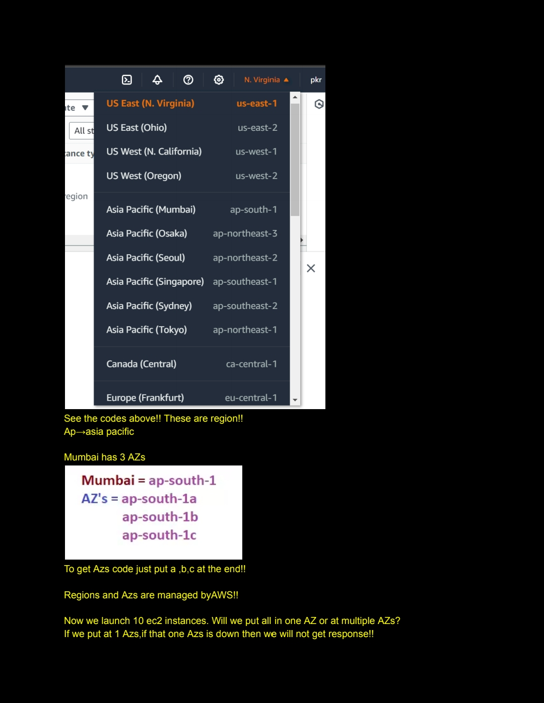 

So we distribute!!
But all AZs are connected by internet !! so can launch few in one Az and other is some other Az
Suppose we are talking about mumbai region!! So 3 Azs

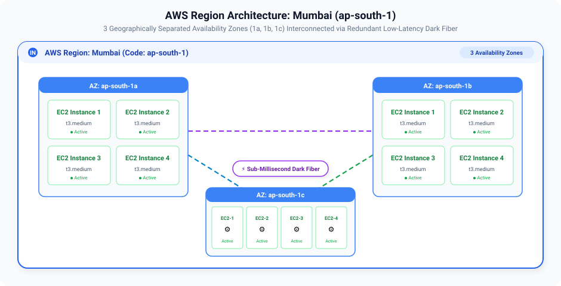

Red line tells interconnected AZs
 Green boxes are ec2 instances!!


**AWS has Global Infrastructure**
Region is a place where AWS has its Infrastructure
A Region contains multiple DataCenters
A Region contains multiple AZ's
    Servers = Instances
Servers / Instances are placed in AZ's
AZ's are sync with each other (network), not data
If required we can share the data to other AZ's in same Region.
Best practise is to distribute the EC2 instances across multiple AZ's

By default data will not be sync across multiple AZs you need to sync them !!
Till now ,there is no such time when Az goes down!!

1a is not a data center its a group of data center!!
So thats why AZ never goes down!

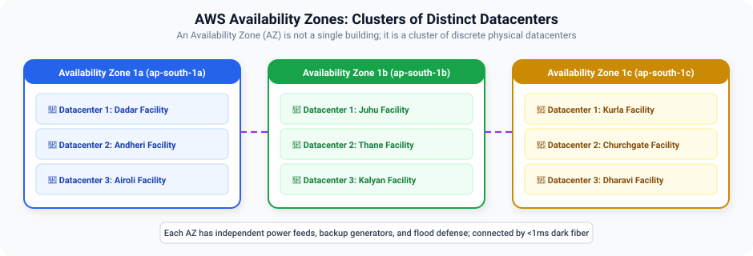

A ec2 instance in 1a wil not be replicated to 1b or 1c!!


**(recap)**
AZ's are sync with each other (network), not data
If required we can share the data to other AZ's in same Region.
Best practise is to distribute the EC2 instances across multiple AZ's
very very less chances that 1AZ goes down
1a or 1b or 1c = group of DC's
1 AZ is a group of DC's
Instances across AZ's can share the data if required as AZ's network are inter-connected with each other

Latency

1.high latency→ not wanted

2.low latency→we want (time need to load a website) (very low response time)

If customer from India set server in India only not in germany as germany servers will have high latency!!

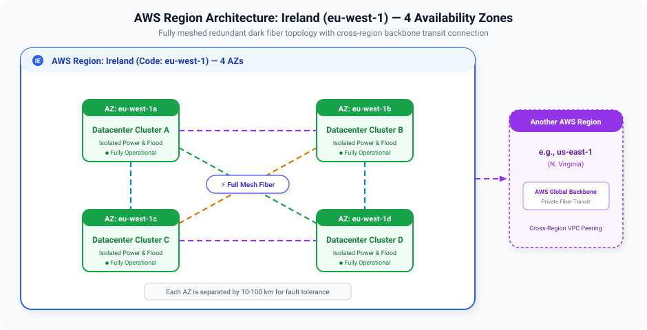

Now we have another region!!
Now Two Azs in a region can communicate with each other
But two regions cant communicate with each other!!
Mumbai region cant communicate with ireland by default!If required they can communicate!


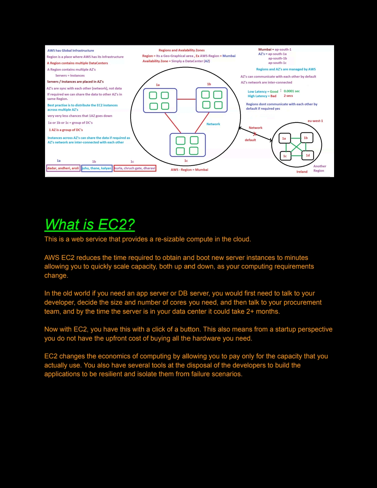 

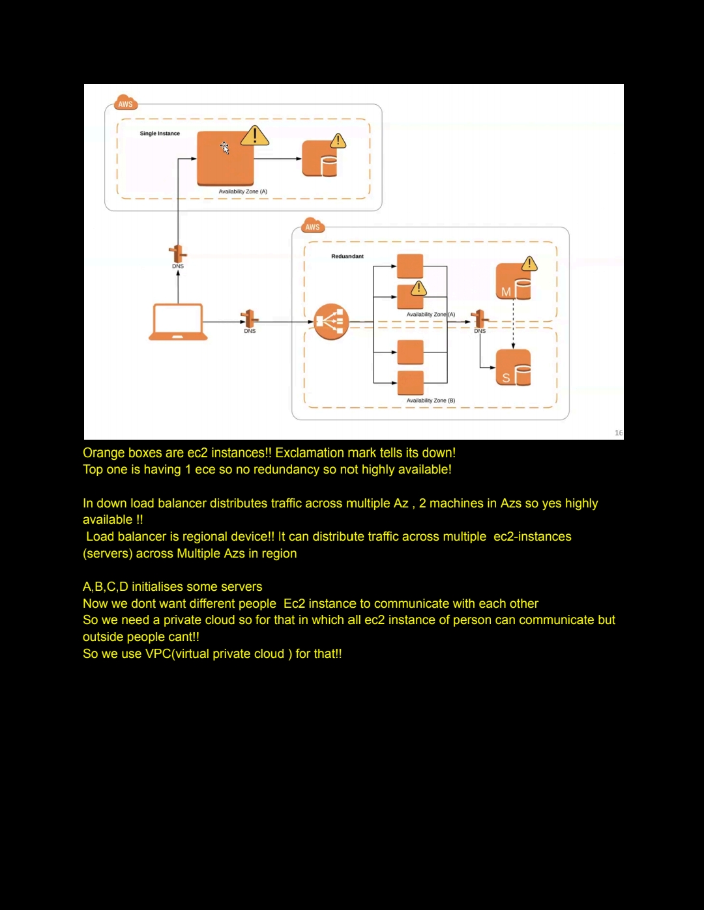 

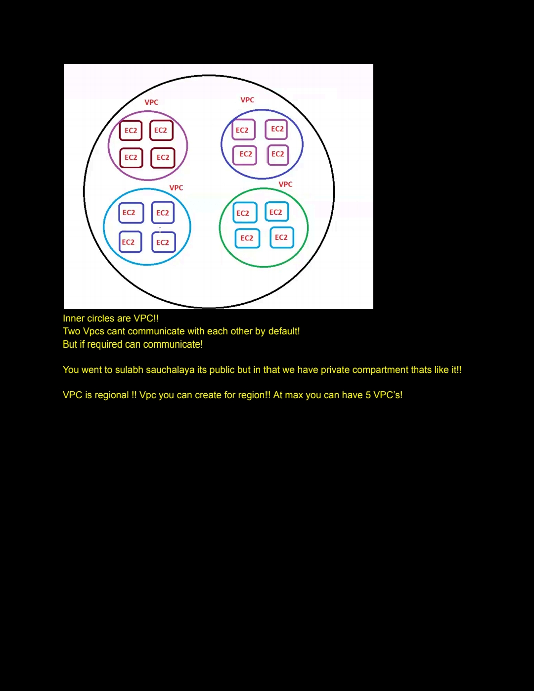 

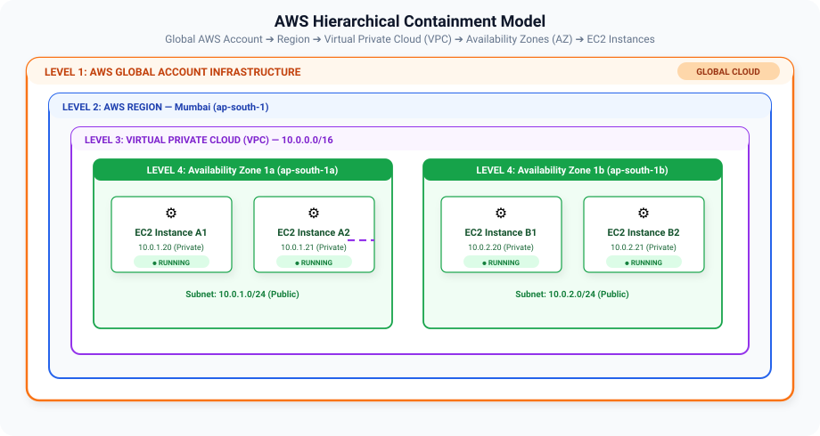

VPC is like private cloud ab poora aws thdi private kr doge islie we put limit of 5 max VPC's!


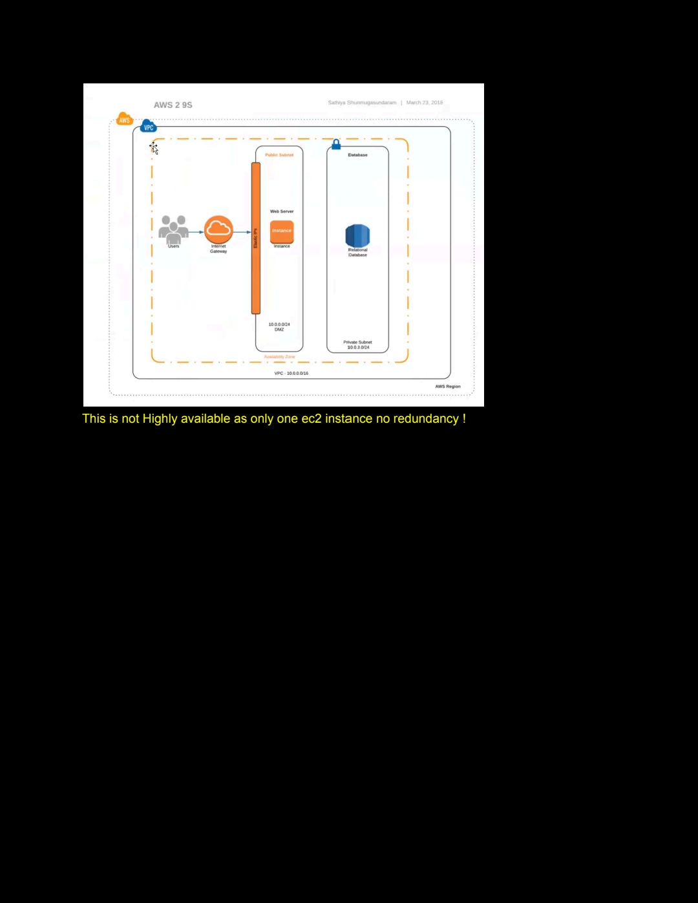

---

# Part 4: Core Services Overview (EC2, ELB, Beanstalk, Lightsail, Lambda)

## Overview

If you want to set up infra in Aws ,it should be private so for that  we use VPC's.
Let's first talk about Ec2 (Elastic Compute cloud)!!
There is no concept of create Instance!! We just launch Instances!!
Never ever say create an instance!!

**Ec2 operations**
Launch
Stop
Start
Reboot
Terminate ---> Delete
           Destory
           Kill

Above are operations in Ec2!!
Ec2 is the biggest service in AWS!!
Every service in AWS is either regional or global!!

I launched Ec2 in Mumbai. Can I see that in Ireland !! no! So it's not global!!It's regional!95% of services is regional!!

Do you think on-premises(physical machines) it is easy to set high availability? Auto scaling??  Scalability??
There is high chance that load balancer goes down!!Load balancer is a software that you need to install on server!!eg engine x,apache!!

But with Aws, you no need to handle Load balancer!!
Load balancer never goes down!!


Load balancer is a service in AWS and a service never goes down in AWS!!This load balancer is called as ELB(Elastic load balancer) .

 Elastic we know that we can increase and decrease based on traffic!!

**AWS Services can be either Regional or Global**
EC2 = Elastic Compute Cloud     In EC2 service, we can launch EC2 instances
EC2 is Regional Service         Servers = Instances / EC2 instances (VM's)
                                 Load Balancer = Which distribute the traffic to multiple Servers
                                 Elastic Load Balancer (ELB) = ELB distribute the traffic to multiple EC2 instances across AZ's

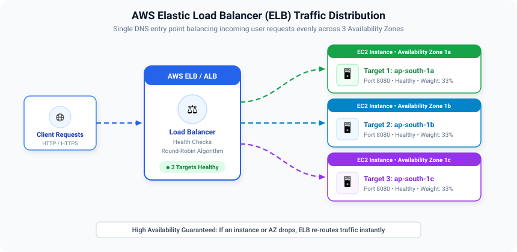

ELB is managed by AWS!! ELB is a service!!
We can access ELB not login!!

Whenever you create load balancer AWS gives you DNS name or URL!!we access ELB by URL or DNS name!!

**AWS Services can be either Regional or Global**
EC2 = Elastic Compute Cloud     In EC2 service, we can launch EC2 instances
EC2 is Regional Service         Servers = Instances / EC2 instances (VM's)
                                 Load Balancer = Which distribute the traffic to multiple Servers
                                 Elastic Load Balancer (ELB) = ELB distribute the traffic to multiple EC2 instances across AZ's
                                 ELB is completely managed by AWS (HA, AS, Scalability, Performance etc)
                                 ELB is not a Server, ELB is a Service
                                 You cannot login to the ELB, you can access ELB with DNS Name
                                 ELB dosent have any AZ's , it is created at Regional Level

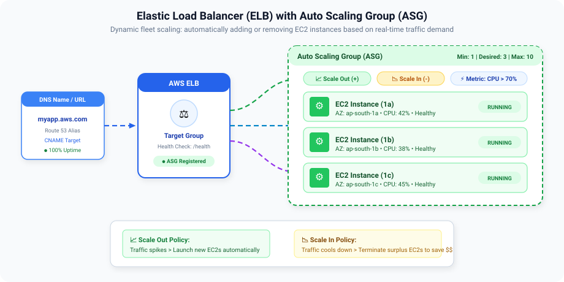

ASG→Auto scaling group!!

Deployment models we have learnt at start
PAAS(Platform as a service)→Elastic BeanStalk(easy and quick deployment of applications in AWS) we no need to worry about server only application and data!!

In BeanStalk ,beanstalk take the application and create server own and deploy application on servers!!
Backbone of beanStalk is EC2 so background it launch only EC2!!

In BeanStalk we have control over EC2 but  we do not need to have any control over servers!!it is not recommended to control EC2!!

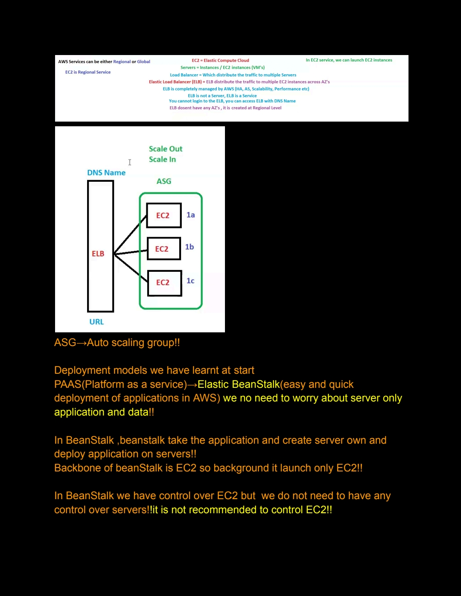
If you are very lazy use benaStalk!!Ec2 we deploy manually !! in beanStalk ,it do everything by itself!


If no control needed go for beanstalk
If need control go to ec2

**Elastic BeanStalk** = Easy and Quick deployment of applications in AWS
In General, PAAS --> you dont have any control on the Servers
In AWS BeanStalk --> you have full control on EC2 instances launched by BeanStalk
BeanStalk handles EC2 instances behalf of us
Back Bone of BeanStalk is EC2 instance

 Call it beanstalk or elastic bean satlk but dont call EBS !! it has some other meaning!!

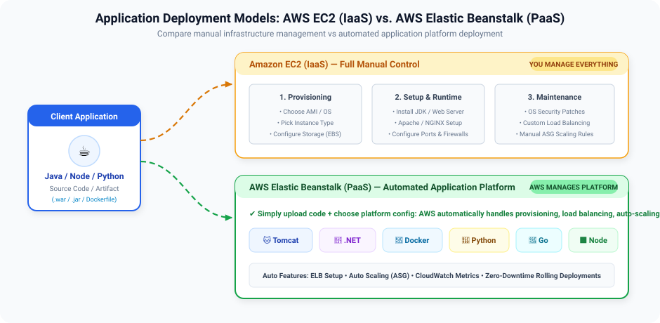

Tell platform according to tech stack!! Like java needs tomcat!!
Beanstalk automatically creates EC2 instances and put application their!

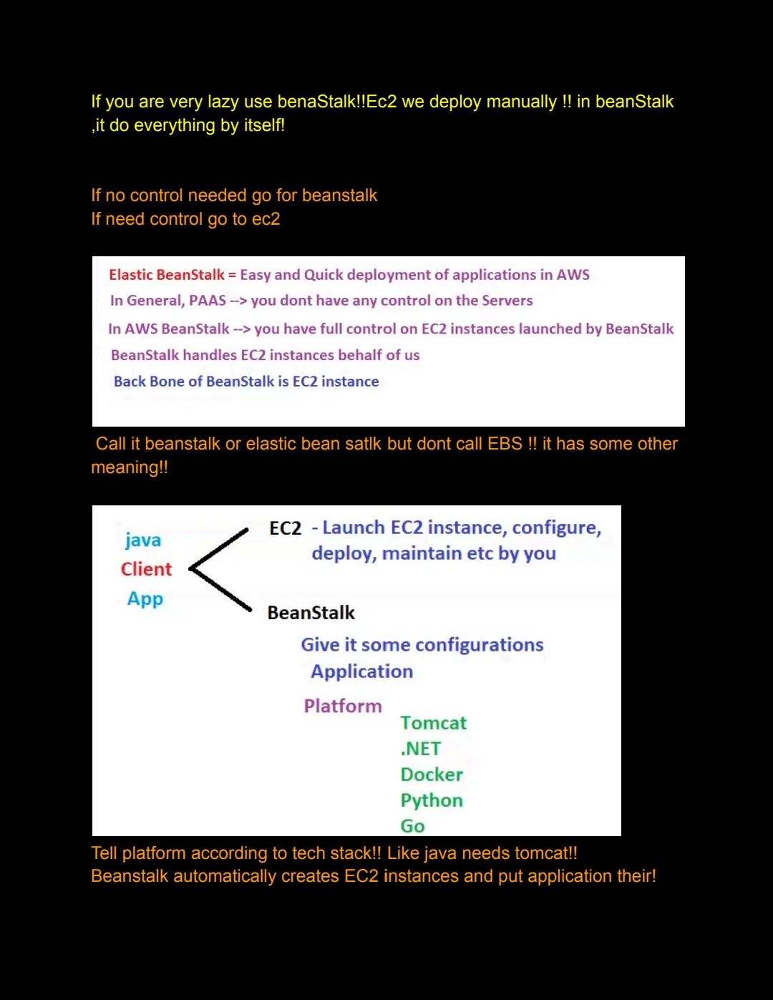
   
Configurations include whether load balancer needed ,auto scaling needed or not!!

People says we want something that we click and everything done!!we have lightsail service!! Doesnt support heavy machines!! Max ram 32 GB!!

Amazon Lightsail is the easiest way to get started with Amazon Web Services (AWS) for anyone who needs to build websites or web applications. It includes everything you need to launch your project quickly—instances (virtual private servers), container services, managed databases, content delivery network (CDN) distributions, load balancers, SSD-based block storage, static IP addresses, DNS management of registered domains, and resource snapshots (backups)—for a low, predictable monthly price.

There is no autoscaling here!!as very light!!all latest applications will be already present!!like github ,gitbucket etc!!

**LightSail** = If you want to setup and create a virtual LightSail instance which already has everything installed (wordpress, Gitlab, Joomla, Nodejs, drupal, Redmine, Nginx , Cpanel etc etc)

Here we call it as lightsail instance!!

We have a service called Lambda!! (Lambda mostly related to automation)

Lambda run application without server!!

Server based → when you login to server!
Server less →when you not need to login to server!! Eg gmail ,google drive
In backend we have server but no need to worry about that!!

Here we create function without application!!


Here we create lambda function!!

Whenever you do anything in AWS ,an event is generated in AWS!!
We want a person not launch EC2 !! so whenever launch event is generated we want to terminate EC2!!

All events of all services are stored in service called event bridge!!

So we create a rule in event bridge !! whenever launch of ec2 is done!!
We create a lambda function to terminate EC2!!

We can write lambda functions in any language like java ,python ,ruby etc!!
Python  goes very well with the AWS Lambda function!!!!

We write function in LAMBDA!!(used for automation to start some ec2 at some time ,to stop ec2 after some time))
