## Cloud computing

### Server Room or DATA Center
Here you see wires, servers , CPU's
1 to 10 people handle data centers !! all people using data centre resources!
People come to the data center guy and ask we are not able to connect to the data center!!

We troubleshoot and check each and every thing!! All people will be free meanwhile!!

Cleaning guy just stepped into some wire and it took 8 hours we wasted on data center to clear the issue and it cause 1000's of dollars!!

We have everything db ,appplication server on different machine!!
There might be a hard disk crash!!
Now customers want data back!! And we go to vendor please help!!

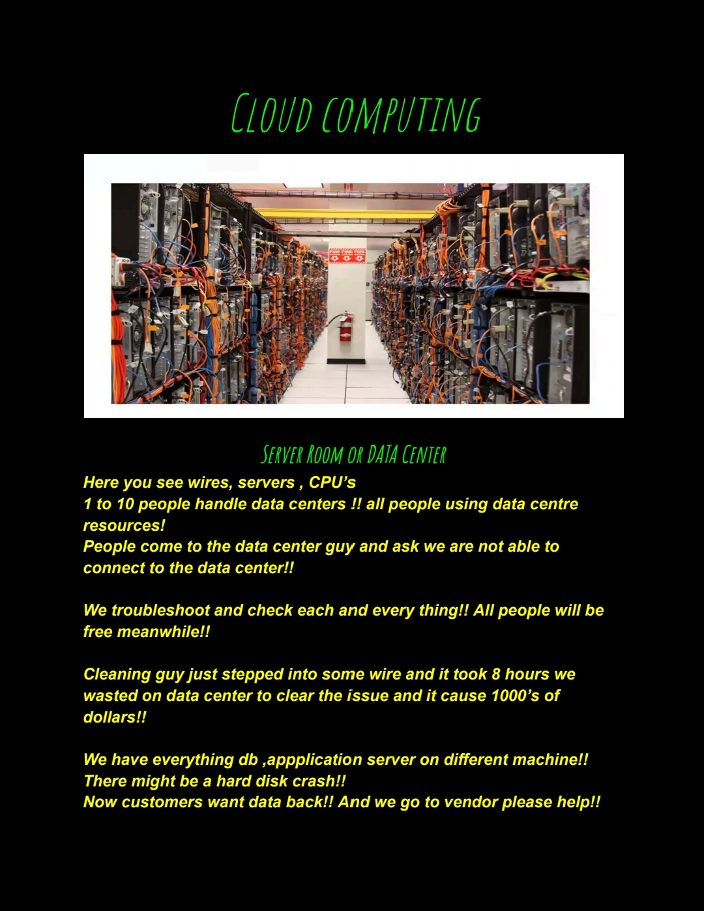 
Sometimes rat eats the wire!!
So datacentre is not easy to handle data centre!!

Business person said we have a website put it to a server!!
So operations guy buys a server (physical)!!
He asked how many people will access it !! business people told 5 people!!
 Now they are happy too fast!!
 Now 5 people gives url to 100 people !!
 Now website gets slow!!
So operations guy purchased one more server!!

As people grows operations guy keeps on adding server!!
Now as the server is physical it needs space to be put in!!
So a room is needed !! place where server is put is called as data center!!

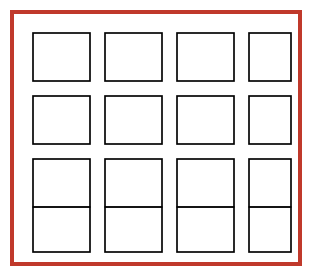

Data center handled by us is called on-Premises !!
Handling on-premises takes a lot of effort!! Sometimes manager tells operation guy to give me 10 servers !! we need to physically take out 10 server!! Take the plug out!! And everything physical!!

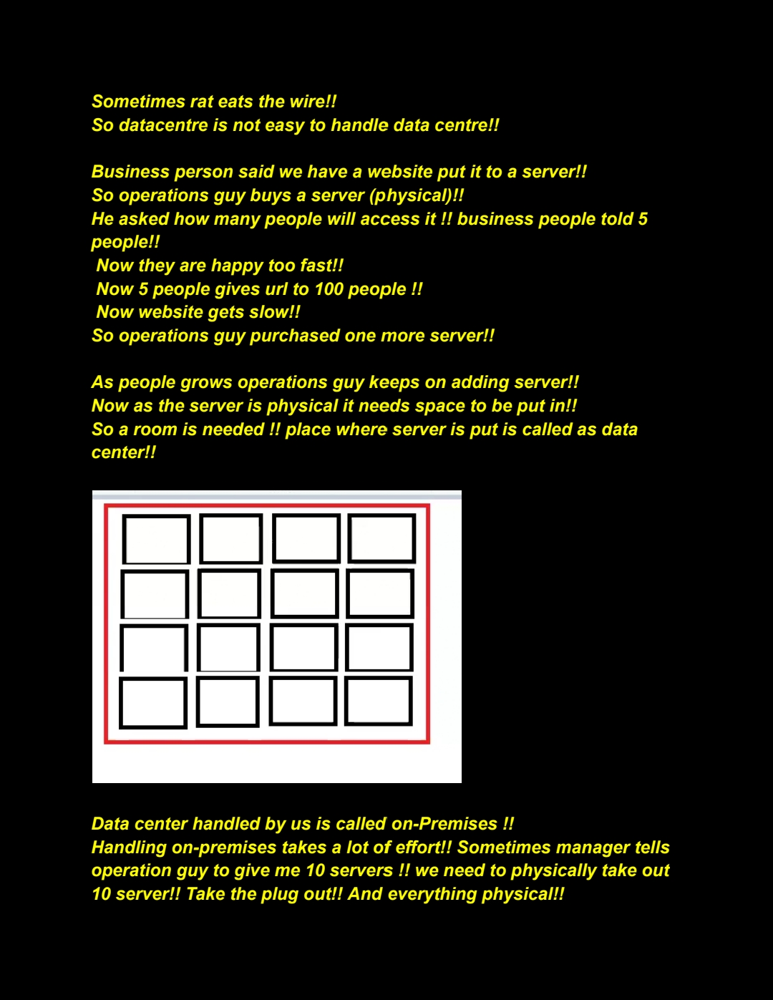 
[image: "On-Premise Infrastructure" bar split 30% "Your Business" / 70% "Managing All of the Undifferentiated Heavy Lifting"]

Also servers have warranty !!
So after the warranty is over , change the server!!

Data center is not easy to handle!! People need new server need to set up whole team servers!!

New servers ⇒new issues!!

Now on reels he saw a new technology called as virtualisation!!

**Virtualization Concept**
- Creating a virtual machine over existing operating system and hardware is referred as **Virtualization**.
- Virtual Machines provide an environment that is **logically** separated from the underlying hardware.
- The machine on which the virtual machine is created is known as **host machine** and **virtual machine** is referred as a **guest machine**.
- This virtual machine is managed by a software or firmware which is known as **hypervisor**.

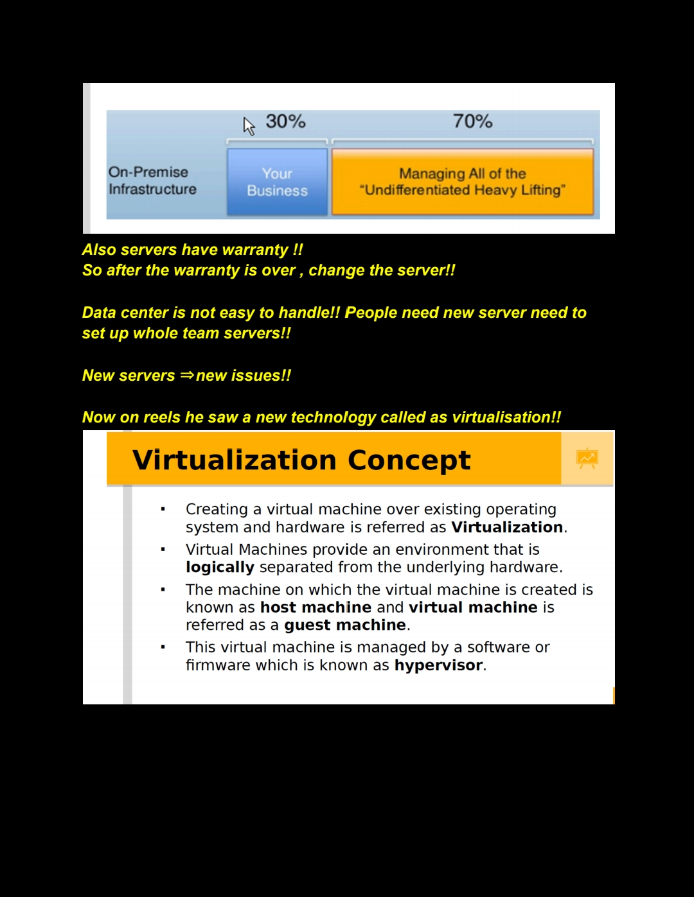
**Before Virtualization**
- Single OS image per machine
- Software and hardware tightly coupled
- Running multiple applications on same machine often creates conflict
- Underutilized resources
- Inflexible and costly infrastructure
[image: single server box — Application / Operating System / x86 Architecture / CPU, Memory, NIC, Disk]

**After Virtualization**
- Hardware-independence of operating system and applications
- Virtual machines can be provisioned to any system
- Can manage OS and application as a single unit by encapsulating them into virtual machines
[image: server box split into two VMs, each with Application / Operating System, sitting on a VMware Virtualization Layer / x86 Architecture / CPU, Memory, NIC, Disk]

 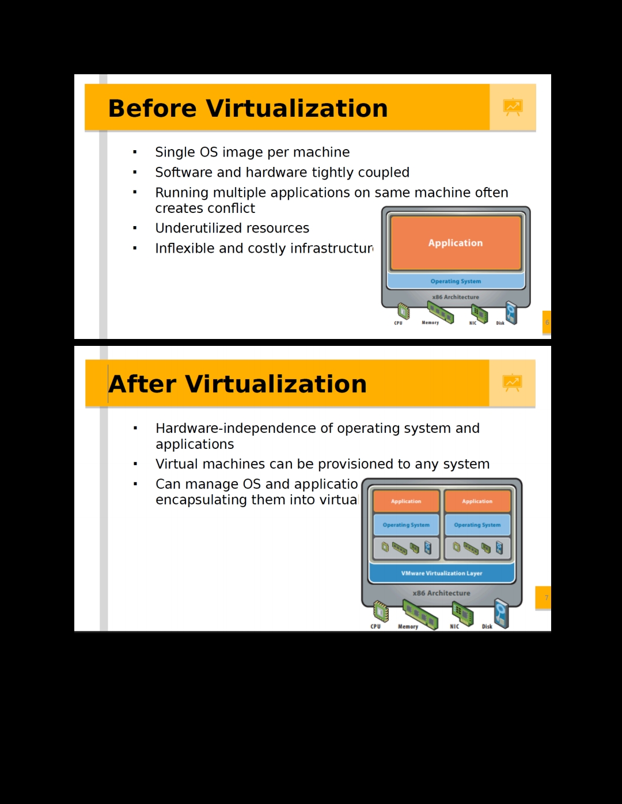 
[image: "Traditional Server Architecture" (Application/Operating System box) vs "Virtualized Server Architecture" (6x App+OS boxes on a Virtualization Layer)]

**Virtualization Approaches**
- **Hosted Architecture**: Installs and runs as an application. Relies on host OS for device support and physical resource management
- **Bare Metal (Hypervisor) Architecture**: A bare-metal virtualization hypervisor does not require admins to install a server operating system first. Bare-metal virtualization means the hypervisor has direct access to hardware resources, which results in better performance, scalability and stability

Hypervisor is a virtualisation layer!!
Bare metal architecture on hardware we have a virtualisation layer ,no host OS!!

 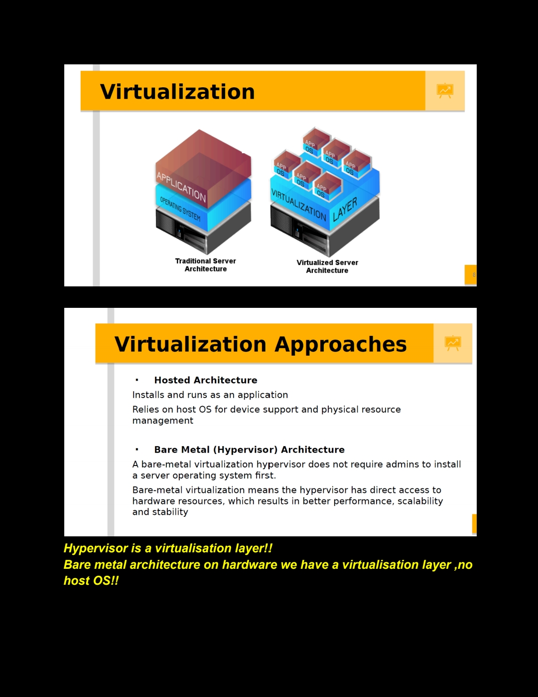 
On hardware when we have an OS we say it as host based virtualisation!!

[image: "Virtualization Approaches" — hosted architecture (Application/Guest OS/Virtualization Layer/Host OS) vs VMware virtualization layer with 4 App+OS pairs plus Clustering Software/Service Console, both on x86 Architecture]

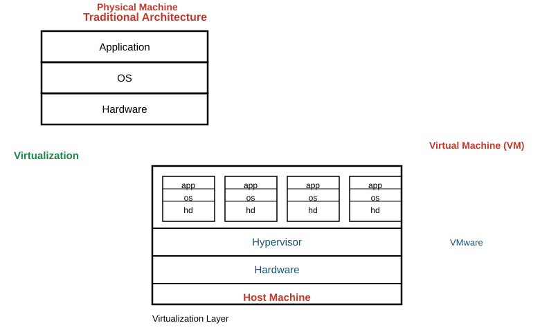

To set up physical machine we need at least 3 hours!! But Vm you just create and delete in just an hour!! Just need OS !

 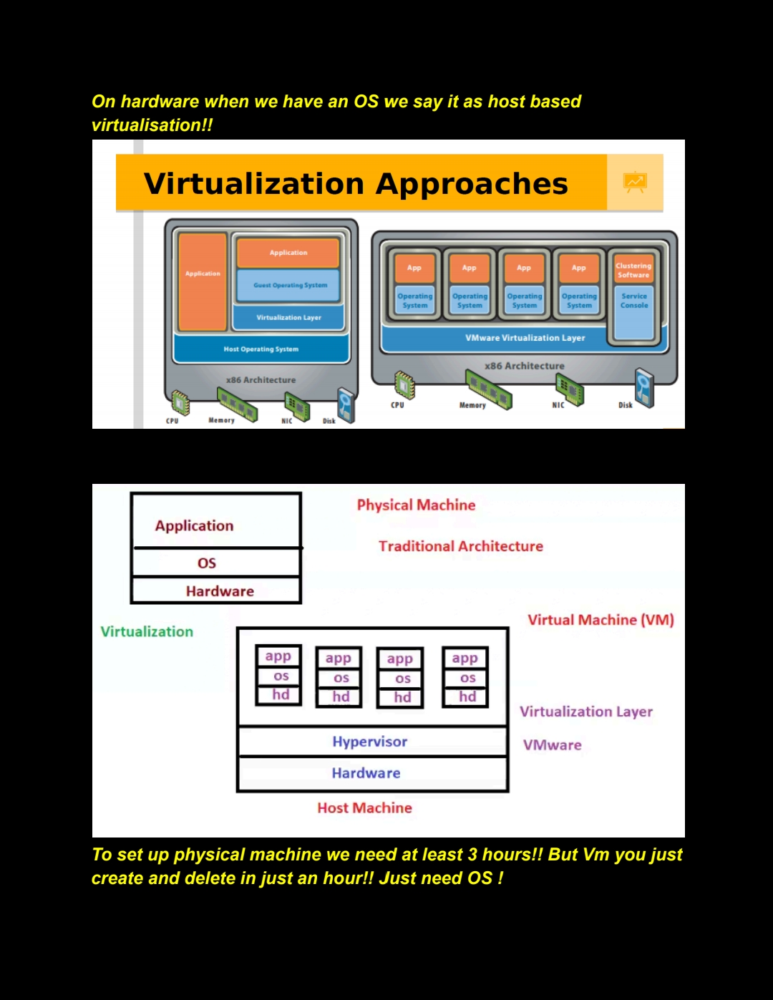 
Vm uses host machine Hardware!!

No of Vm you can create depends on hardware!!

Need 100 machines⇒ 5 big machines and 95 VM's

10 to 11 years back these majorly physical machines moved to VM's!!

Now also a new project has come!!

Now each server has multiple VM's so now risk increased!!
Now new tech came and this new tech says i will be handling all data centers for you!!

Aws said to each and every customer ki im going to handle data centre for you!! So no need to set up a data centre for your company!!
This migration from virtual to aws is called V2C migration!!
(Virtual to cloud migration)

AWS had data centres throughout the globe!Data centers contain infrastructure (data centre)!!

In india aws infra in mumbai and hyderabad!!
If in delhi use any of these!! We see mumbai!! As hyderabad is latest infra!! And latest one is always having some bugs!!
For restaurant you never go to latest restaurant!!

Pani vala as a service , zomato as food delivery service.
AWS is infrastructure as a service!! Everything in the backend handled by aws!

 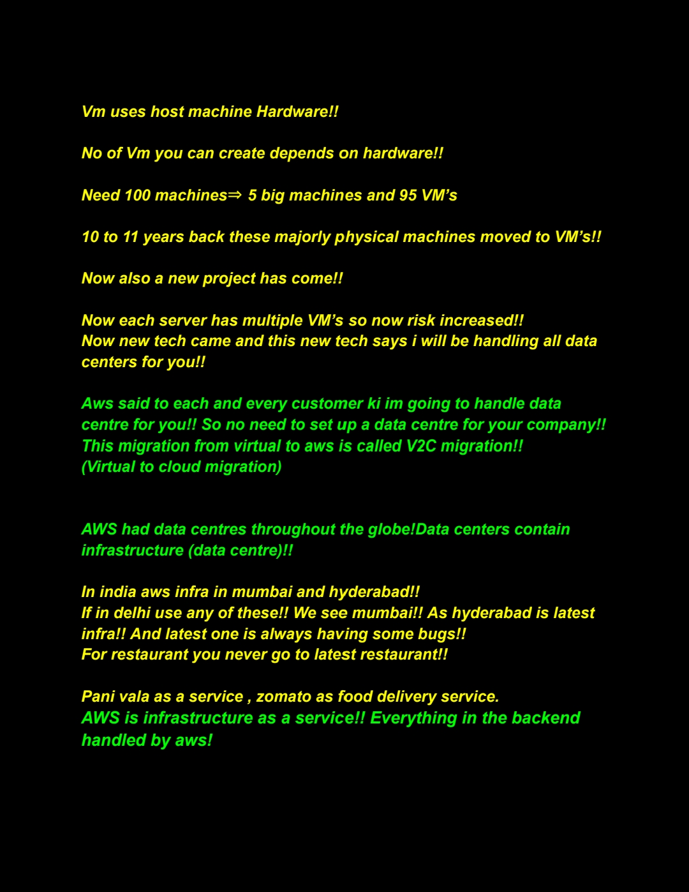 
AWS using virtualisation technology called Xen (pronounced as zen) like we have VMware technology!!

Sitting here and accessing remote location computer !!that remote location is called a cloud!! That remote location has cloud which has infrastructure which has servers!!

- AWS has Global Infrastructure
- AWS is providing Infrastructure as a Service
- AWS is using Xen Virtualization Technology
- Cloud is Present in the Remote Location
- Remote Location = DataCenters
- DataCenter = Infrastructure
- Infrastructure contains servers, storage, db's etc

AWS provides Infrastructure as service!!
To connect to cloud we need internet!!
AWS is a cloud provider which provides infrastructure as a service!
AWS is a group of services!!

To create anything on AW we have an Amazon management console!!

 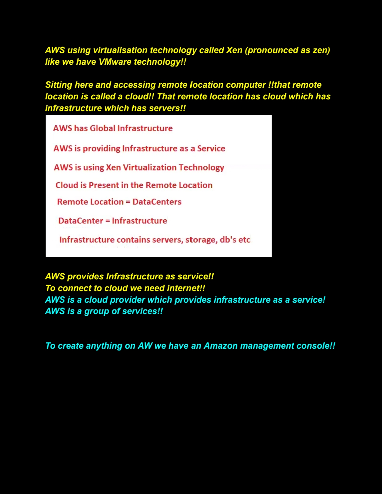 
- We need internet to connect to the Cloud
- AWS is a Cloud Provider, who provides infrastructure as a Service
- Amazon Web Services
- AWS is a group of services
- You will access AWS through AMC (Amazon Management Console)

Remote location is identified as cloud so named as cloud computing!!
Cloud⇒ Remote location

- Amazon Web Services
- AWS is a group of services
- You will access AWS through AMC (Amazon Management Console)

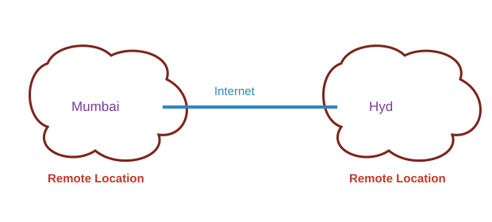

See above Mumbai ,Hyderabad looks like a remote location!!

**Cloud Computing**
Instead of doing computing on local machine / on-premises, you will be now doing computing in Remote Location (Cloud) that is called Cloud Computing

 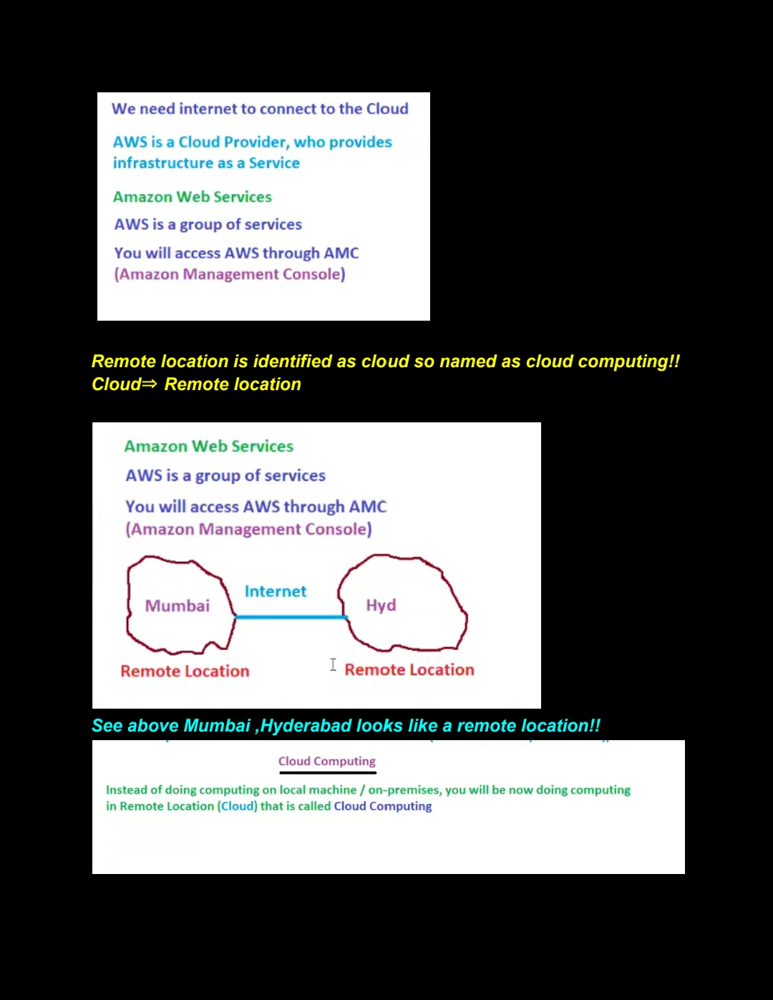 
Types of cloud/deployment models
1.Public cloud
2.private cloud
3.hybrid

Restaurant only for family members is private!
Restaurant for everyone is public!

Public cloud -aws accessible by everyone
Private cloud-  samsung has its own cloud used by itself SCP (Samsung cloud platform)

Hybrid →public + private!! Using aws + also using private cloud
Like bank put profile on aws but for transactions have private cloud!!

**Deployment Models**
- **PUBLIC CLOUD**: The public cloud allows systems and services to be easily accessible to the general public. Public cloud may be less secure because of its openness.
- **PRIVATE CLOUD**: The private cloud allows systems and services to be accessible within an organization. It is more secured because of its private nature.
- **COMMUNITY CLOUD**: The community cloud allows systems and services to be accessible by a group of organizations.
- **HYBRID CLOUD**: The hybrid cloud is a mixture of public and private cloud, in which the critical activities are performed using private cloud while the non-critical activities are performed using public cloud.

 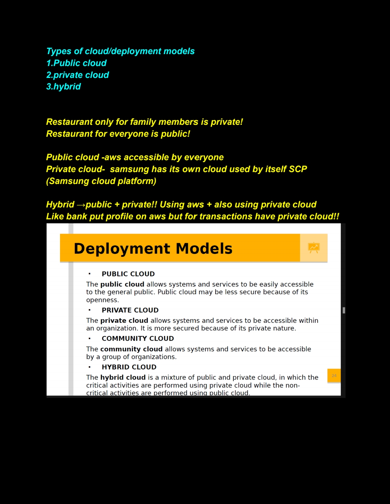 
 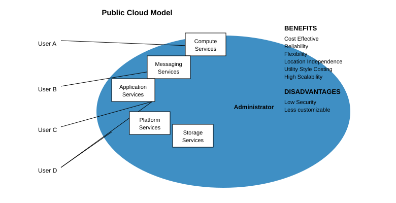

**BENEFITS**: Cost Effective, Reliability, Flexibility, Location Independence, Utility Style Costing, High Scalability
**DISADVANTAGES**: Low Security, Less customizable

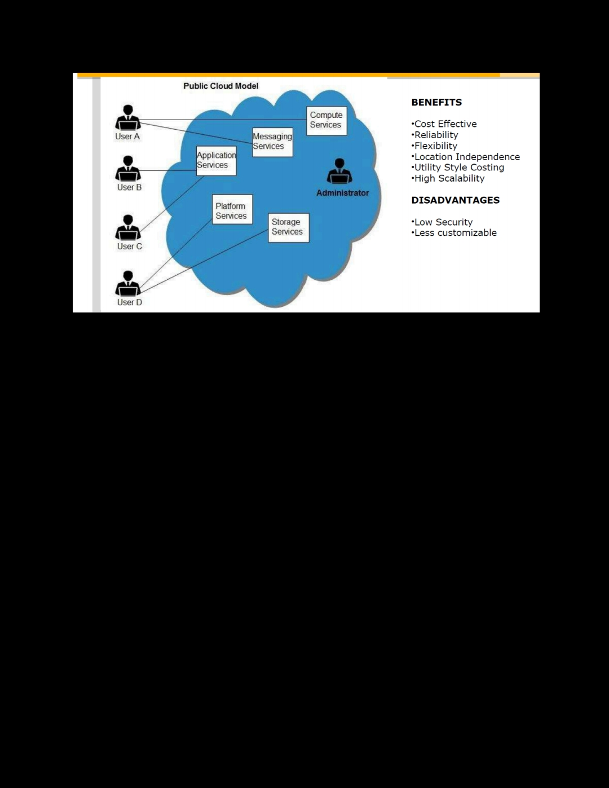
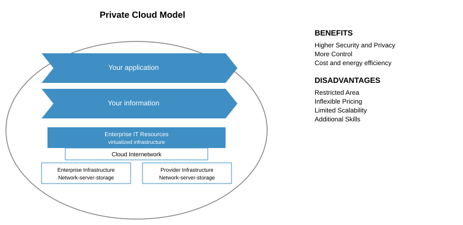

**BENEFITS**: Higher Security and Privacy, More Control, Cost and energy efficiency
**DISADVANTAGES**: Restricted Area, Inflexible Pricing, Limited Scalability, Additional Skills

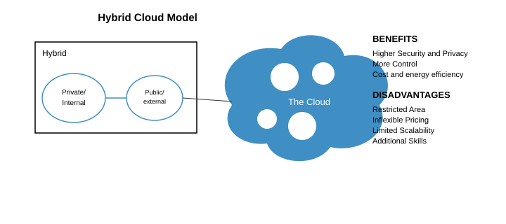

**BENEFITS**: Higher Security and Privacy, More Control, Cost and energy efficiency
**DISADVANTAGES**: Restricted Area, Inflexible Pricing, Limited Scalability, Additional Skills

  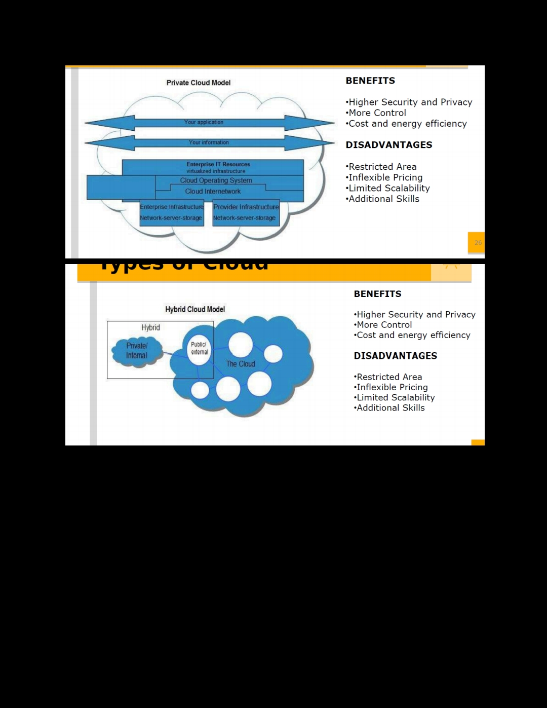 
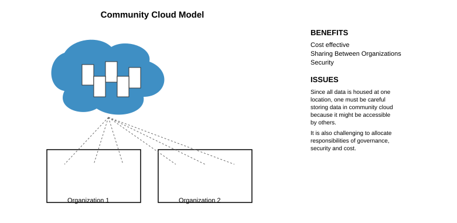

**BENEFITS**: Cost effective, Sharing Between Organizations, Security
**ISSUES**: Since all data is housed at one location, therefore one must be careful in storing data in community cloud because it might be accessible by others. It is also challenging to allocate responsibilities of governance, security and cost.

**Key-Words**
Virtualization, Host Machine, DNS, VM's, Infrastructure, DataCenters, Load Balancer, Firewalls, Protocols, Hypervisor, Cloud, Remote Location.

Physical DC ----> Virtualization ---> Cloud ---> AWS (Remote Location(DataCenters))

**Cloud Computing**
Instead of doing computing on local machine / on-premises, you will be now doing computing in Remote Location (Cloud) that is called Cloud Computing

**Deployment Models (Types of Clouds)**
Public Cloud = The Provider's Services which are accessed by everyone like AWS, Azure, Gcp etc
Private Cloud = The Provider's Services which are accessed within the organization like Oracle
Hybrid Cloud  = The Combination of Public and Private Cloud

  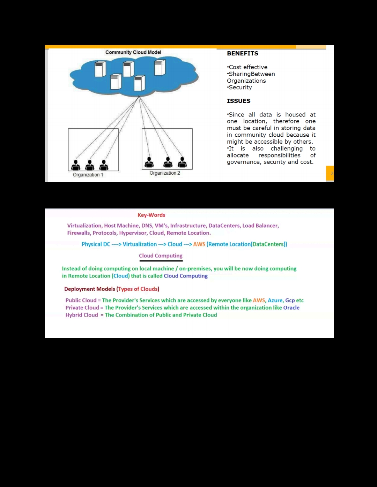 
**Service Models**
- **INFRASTRUCTURE-AS-A-SERVICE (IAAS)**: IaaS provides access to fundamental resources such as physical machines, virtual machines, virtual storage, etc.
- **PLATFORM-AS-A-SERVICE (PAAS)**: Deploy application without managing virtual servers (Google App Engine, AWS Elastic Beanstalk, Windows Azure, Heroku, Force.com)
- **SOFTWARE-AS-A-SERVICE (SAAS)**: Ready to use software applications (Gmail, Office365, Google Apps, Dropbox, Salesforce, Cisco WebEx, Concur, GoToMeeting)

### Service Models

**Service Models**
- Infrastructure as a Service (IAAS)
- Platform as a Service (PAAS)
- Software as a Service (SAAS)

AWS is a Public Cloud Provider, who provides infrastucture as a Service

IAAS → infra as service eg AWS

  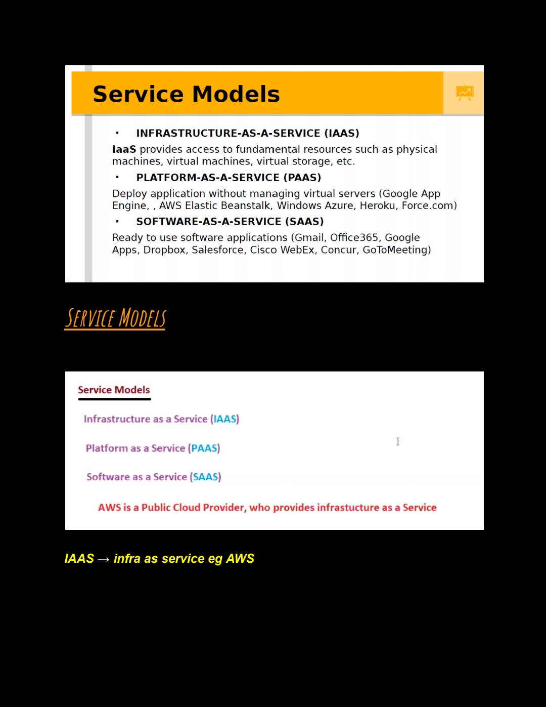 
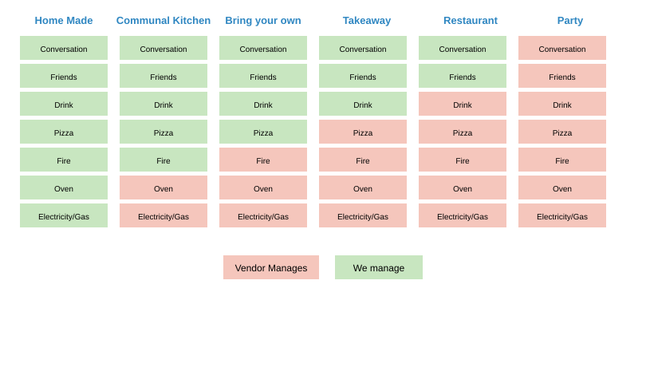

**Various models**

**Homemade (On-premises)**
We make pizza from scratch at home. Here, we are responsible for arranging the necessary infrastructure such as electricity, gas, an oven, making fire, making the pizza, getting some drinks, calling a bunch of friends, and enjoying the evening.

**Communal kitchen (IaaS)**
We book a communal kitchen which is equipped with an oven. Then, we need to fire up the oven and make pizzas. We are still responsible for arranging the rest of the stuff so we can have a fun time with friends.

**Bring your own (CaaS)**
In this case, we have reduced our responsibility even further than in the previous scenario. It's like we show up at a place where the oven is all

  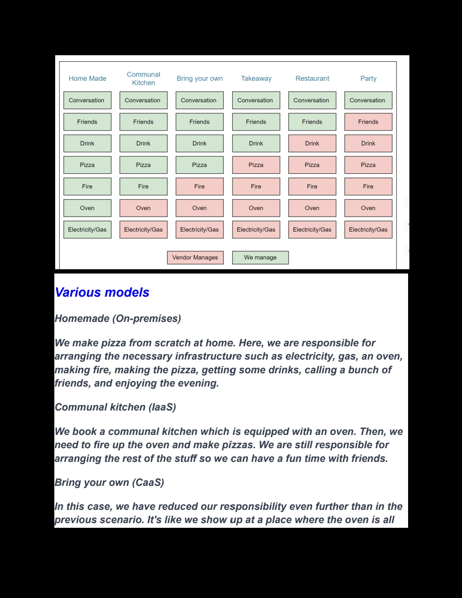 
set and ready for us to start making pizzas. So, we keep making pizzas while enjoying the company of good friends.

**Takeaway (PaaS)**
We continue to delegate our responsibilities. In this scenario, we place an order via the phone or website, show up at the pizzeria, and pick up our order. In the meantime, we can arrange drinks, call our mates and enjoy the evening.

**Restaurant (FaaS)**
In this scenario, we, as a group of friends, turn up at a restaurant that covers all the aspects. We get all the food and beverages and only enjoy a great time with each other.

**Party (SaaS)**
Now, we are at a party. We simply show up at a party where food and drinks are arranged, and our friends are also at the party. No need to organize anything at all. We focus on having a good time.

**Cloud service models and services**

| Cloud Service Model | Service Examples |
|---|---|
| IaaS | AWS EC2, Microsoft Azure Virtual Machines, Google Compute Engine |
| PaaS | AWS Beanstalk, AWS lamba, Azure Logic Apps, Azure Functions, Google App Engine |
| SaaS | Office 365, Google Workspace, Facebook, Twitter |

  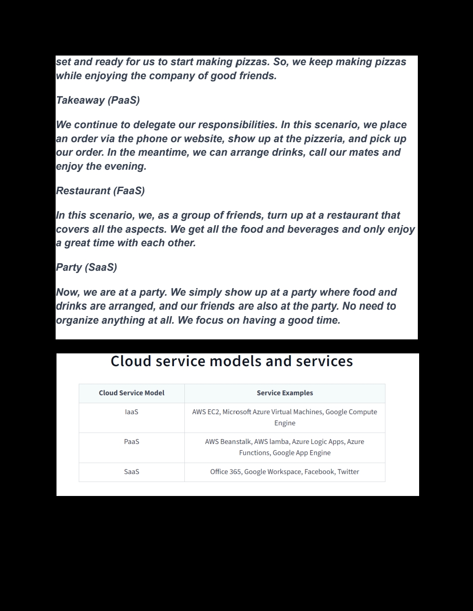 
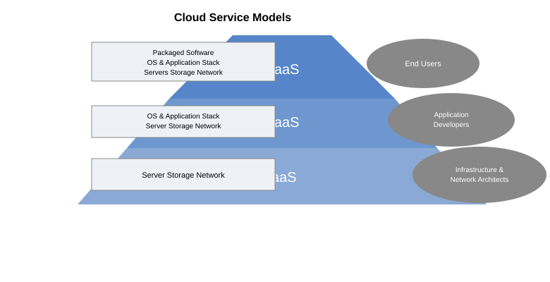

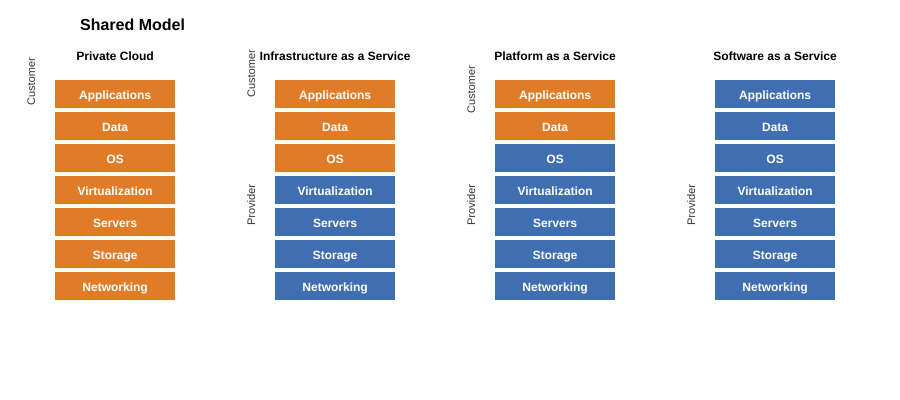

  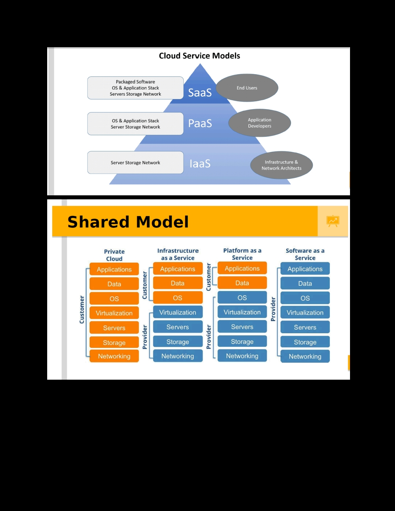 
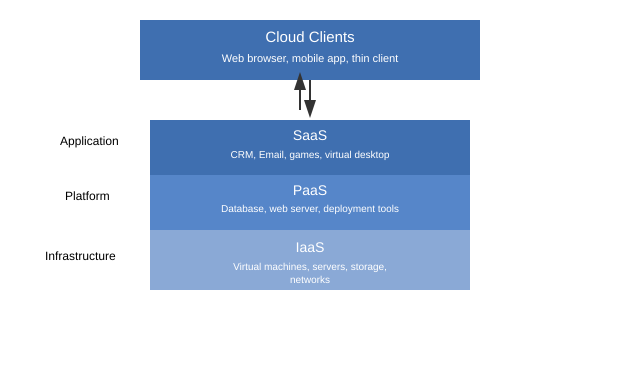

A person has zip file of java code he wants to put that in server and get URL of that!!
IAAS comes to that person and asks him ki i provide everything you do anything you want!!
IAAS has its own network ,data centre and everything!!

How we connect to AWS? Amazon management console(AMC)

For db we have a service, for virtualisation we have another service!!
Uer no need to  worry about anything just use the services!!

  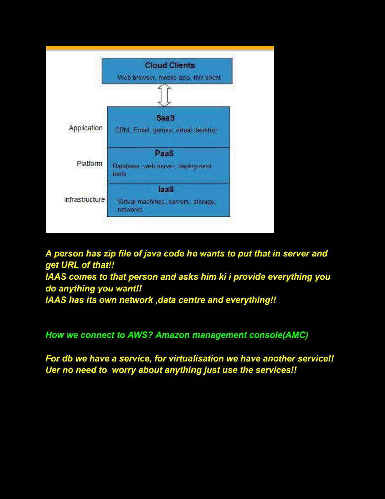 
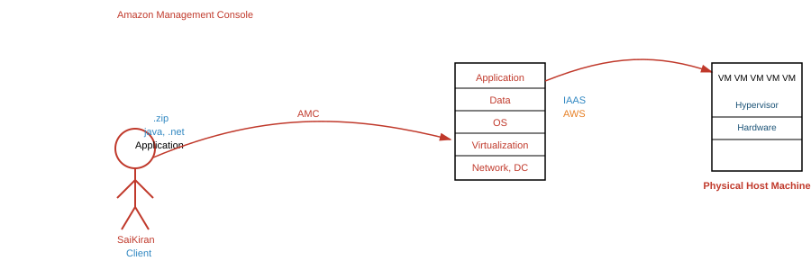

For creating virtual machines we have ec2- service!!
EC2(Elastic compute cloud)
We call the server an ec-2 instance in AWS  which is a virtual machine!!

In aws ,network,virtualisation managed by Provider!!

Os,data ,application managed by application!!

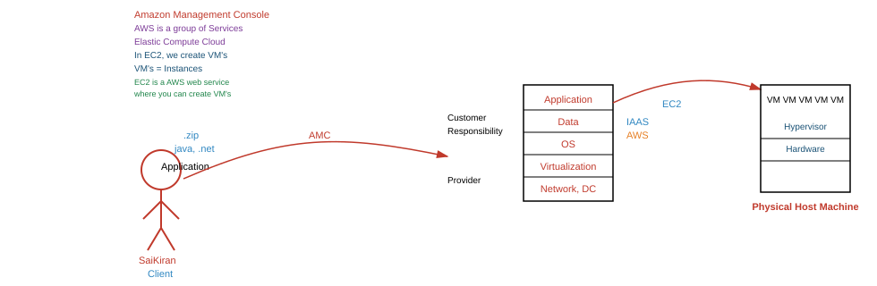

  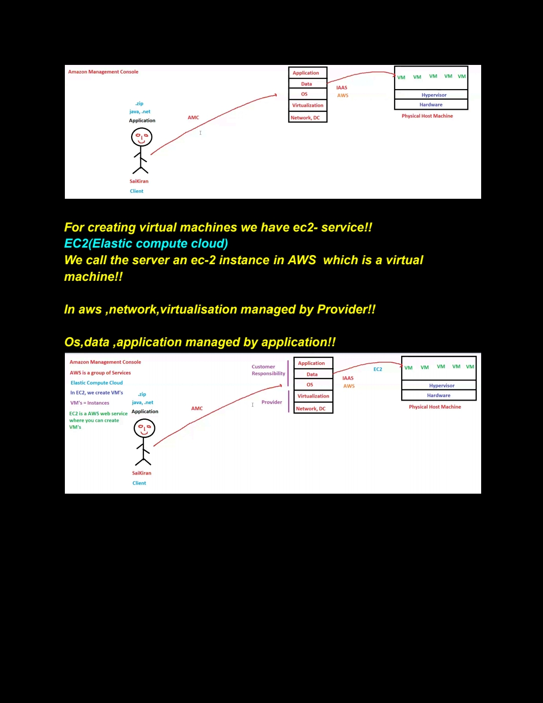 
**IaaS Services by Cloud Platforms**

| Cloud Platform | Services |
|---|---|
| AWS | Amazon Elastic Compute Cloud (EC2) and Amazon Simple Storage Service (S3) |
| Microsoft Azure | Azure Virtual Machine, Virtual Machine Scale Sets and Azure Virtual Networks |
| Google Cloud Platform | Google Compute Engine and Google Cloud Storage |

Now some hacker hacks the data!! Whose responsibility is it??
Its customer responsibility!!as customer is responsible for application,data and OS!! You application needs to be secured by you!!

Suppose a flat you have taken from builder !! now you left flat open and some thief enter your flat!! So here its not builder fault(aws) its customer fault!!
As AWS don't have access inside the VM!!

AWS said we know you blame us thats why we have put shared responsibility model!! These os ,data and application is your responsibility!!

**Advantages**
Let's discuss some advantages of the IaaS model:

**Virtual machines replace physical hardware**

  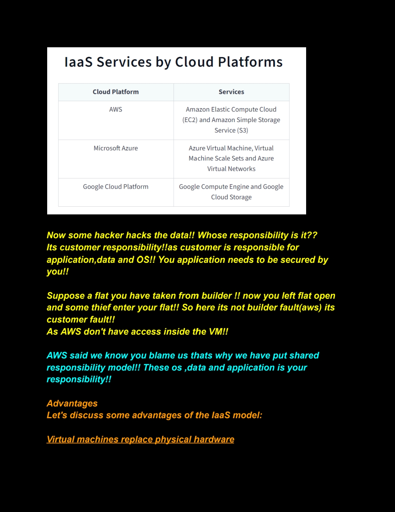 
Moving physical machines to the cloud platforms frees up the time that can be utilized elsewhere. We can create virtual machines as much or as little based on business needs.

**The ability to quickly scale up or down**
With virtual machines running on cloud platforms, it becomes easier to add more machines, when needed, to handle more workload and bring them down when it's not required anymore. It allows us to respond much more quickly as a business, which can directly impact the bottom line.

**Pay only for what we use**
In the traditional approach, we would procure hardware to handle the workload. More often than not, we'll have extra capacity lying around in case the business needs to grow. Acquiring hardware and setting it up takes significant time. This additional capacity costs more to business. By moving workloads to the cloud, we free up that capital as it's trivial to add more capacity now.

**Suitable for high-performance computing workloads**
The IaaS model works best when we need to run high-performance computing workloads. Acquiring and maintaining a high-performance computing capacity can be expensive if we want to do it on our own. Cloud platforms offer a vast amount of configurations to pick from while creating virtual machines or clusters of machines. It makes it very convenient to spin up some high-performance computing when needed in minutes, if not seconds. The IaaS model has made computing power more approachable and accessible to everyone.

**Suitable for predictable workloads**
If our workload is predictable, where we can confidently estimate the needed capacity, IaaS makes it a very cost-effective model to run in the cloud. Moreover, we have complete control over the environment that enables us to optimize our applications for extra performance. It has become a desirable option.

  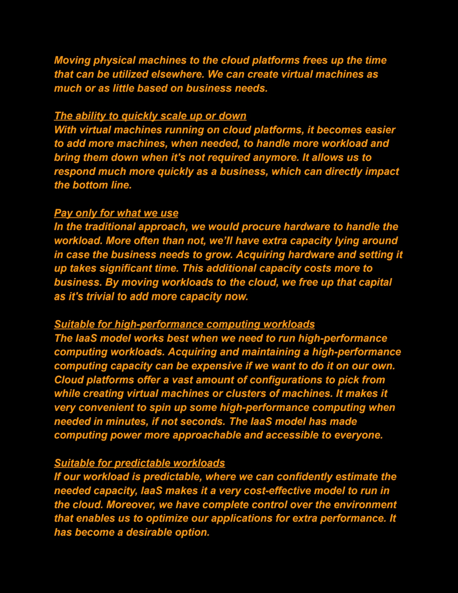 
**Drawbacks**
There are certain aspects we need to keep in mind when picking up IaaS.

**Operations management**
We are responsible for upgrading, patching, and securing virtual machines running in the cloud. However, cloud platforms provide tools and capabilities that help manage all of this. But an important thing to remember is that the responsibility lies with us when it comes to IaaS.

**Expensive**
The IaaS model can still be expensive relative to other cloud service models since the underlying infrastructure is up and running all the time, and we have to pay for that uptime. Other models offer flexibility in this area, where we pay only for what we consume. So, capacity planning becomes crucial when we work with the IaaS model to avoid over-provisioning infrastructure resources. We must continuously monitor the utilization and adjust accordingly to gain maximum benefits.

Now someone called you and that is PAAS!!
PAAS says just give me application ,i will do everything for you!!
I also have everything as of IAAS !! but server you dont need to create !! OS we will handle !! you only have data and application!!

  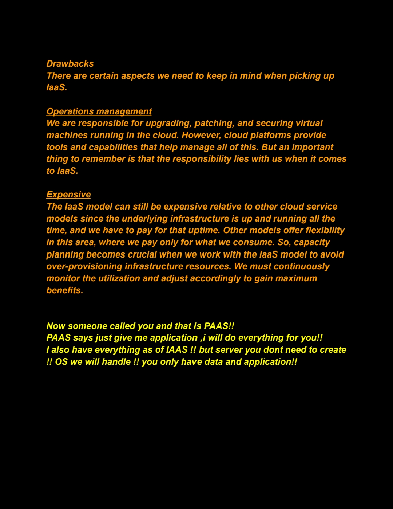 
**PaaS Services by Cloud Platforms**

| Cloud Platform | Services |
|---|---|
| AWS | AWS Elastic Beanstalk and AWS Lambda |
| Microsoft Azure | Azure Logic Apps, Azure App Service, Azure Functions and Azure Cosmos DB |
| Google Cloud Platform | Google App Engine and Google Cloud Run |

**Advantages#**
The PaaS model offers several benefits. Let's discuss some of them.

**Faster time to market**
The PaaS models allow businesses to reach their customers faster since development tools and frameworks, as well as the underlying infrastructure, are provided by the cloud vendors.

**Develop for multiple platforms**
PaaS tools often allow us to build applications targeted at different platforms, such as web and mobile.

**Common development environment**
Since this model is delivered over the Internet, everyone can access a centrally available environment that is always ready for anyone to start immediately.

**Price**
PaaS could be the most cost-effective option than IaaS in many cases.

  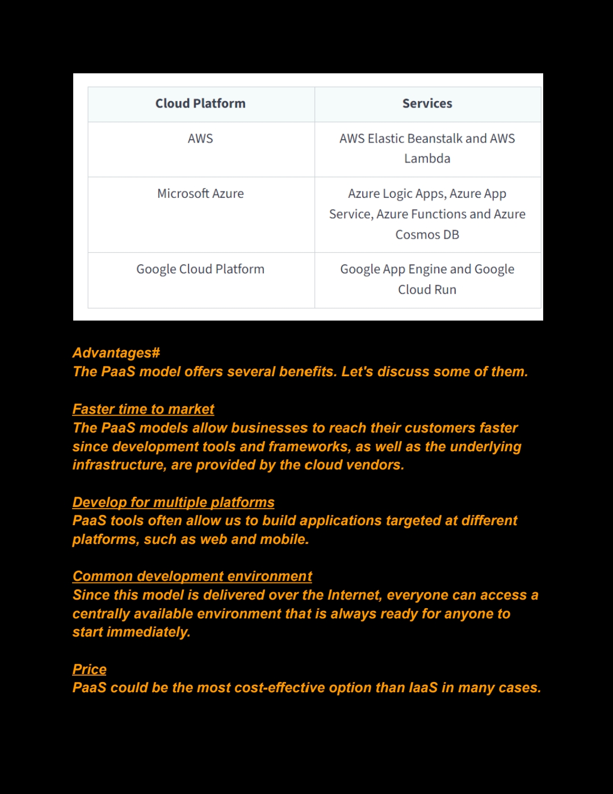 
**Ease of licensing**
The cloud vendor handles license management, which saves us a lot of time and effort as a business.

**Drawbacks**
We need to be mindful of some drawbacks while working with the PaaS model:

**Vendor lock-in**
As PaaS provides its own tools and frameworks that developers use to build applications, it is difficult to move applications or associated data to other platforms. The development and deployment tools are platform-specific and not portable to other platforms. This is a trade-off we make by going with the convenience of infrastructure management.

**Security and compliance**
Another drawback of the PaaS model is security and compliance. Since we don't have any control over the infrastructure and where the data is hosted, there is nothing much we can do. Due diligence is required to ensure the services and data are hosted within the geographical boundaries if that's a concern. For example, it is easily achievable by picking up the right cloud region.

Customer only responsible for application and data!! No need to worry about servers!!

  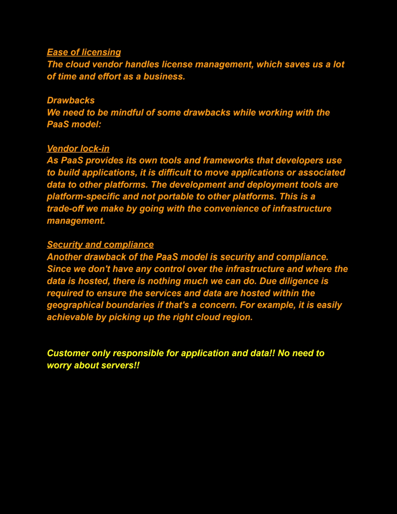 
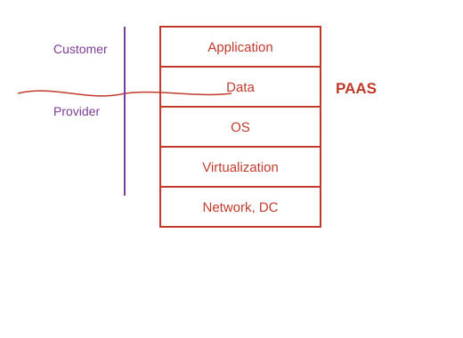

Now he was thinking about whether to use IAAS or PAAS ,SAAS came!!
SAAS told i will do everything for you!! Now customer give application to SAAS but SAAS says i have my own application !!
I dont host your software!! Like zoom ,gmail etc !!
SAAS is basically allll online software applications!!

In PAAS ,supoose it has application!! Now we want to change something!!
But OS is managed by PAAS !! so need to ask each time as OS compatibility managed by PAAS!! If new version dosent support

  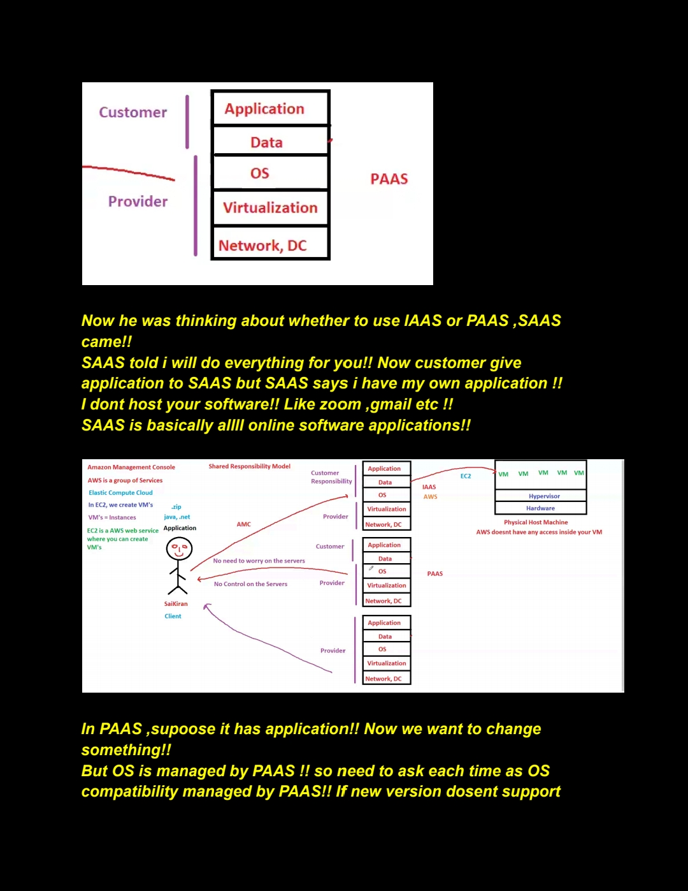
previous OS , then cant upgrade!!

**SaaS Services by Cloud Platforms**

| Service Provider | Services |
|---|---|
| Dropbox and Salesforce | Dropbox and Salesforce |
| Microsoft | Office 365 |
| Google | Google Workspace and Gmail |
| Twitter | Twitter |
| Meta | Facebook, WhatsApp and Instagram |

AWS provide platform ,software too but well know as IAAS
Azure also provide all but well known for PAAS!!

ElasticBeanStack is another service in AWS !! which is PAAS so AWS is PAAS .BeanStack is used for easy and quick deployment in AWS!!

**Advantages**
The SaaS model offers many advantages over other cloud service models. Below are some of the benefits of using SaaS:

**Faster deployment**
Onboarding SaaS applications is quite fast. We can start using the service as soon as we subscribe or sign-up. The service provider does all the heavy lifting.

**Usage-based pricing and reduced financial risk**
Before the subscription-based model, we had to acquire licenses to use the software services or products. That often meant we would be stuck with that license for a certain period (either perpetual or annual)

 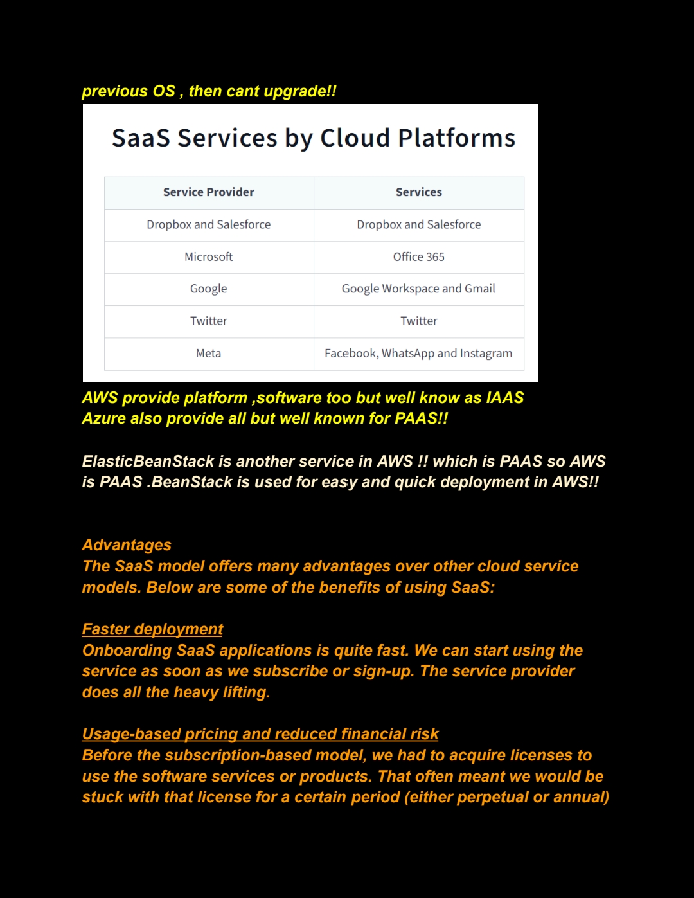 
and had to pay that money upfront. With the subscription-based model, we don't have to pay the upfront cost.

This model also allows businesses to end subscriptions to services they are not using anymore. It reduces the financial burden on businesses.

**Reduced need for on-premises resources**
As the adoption of SaaS services increases, companies don't need to maintain physical servers to run their applications. It reduces the operational overhead and frees up the resources for other areas of importance.

**Easier upgrades**
SaaS is a fully managed service model, which makes it easier for providers to roll out upgrades to their software applications over the wire. Businesses using SaaS don't need to plan or roll out changes to their users. It's one more thing they don't need to worry about.

**Drawbacks**
There are certain limitations with the SaaS model that we need to be aware of.

**Data security**
Since we rely on a third party to run applications, everything is abstracted from us as consumers. We don't have any control over how service providers manage our data. It poses a serious security concern for many organizations. It becomes critical to evaluate and understand the security policies of any SaaS vendor before signing up with them.

**Limited customizations**
One of the main benefits of SaaS for service providers is that they can deliver the same or similar product to all users. It serves them great, but it could pose serious limitations for end-users since customers

 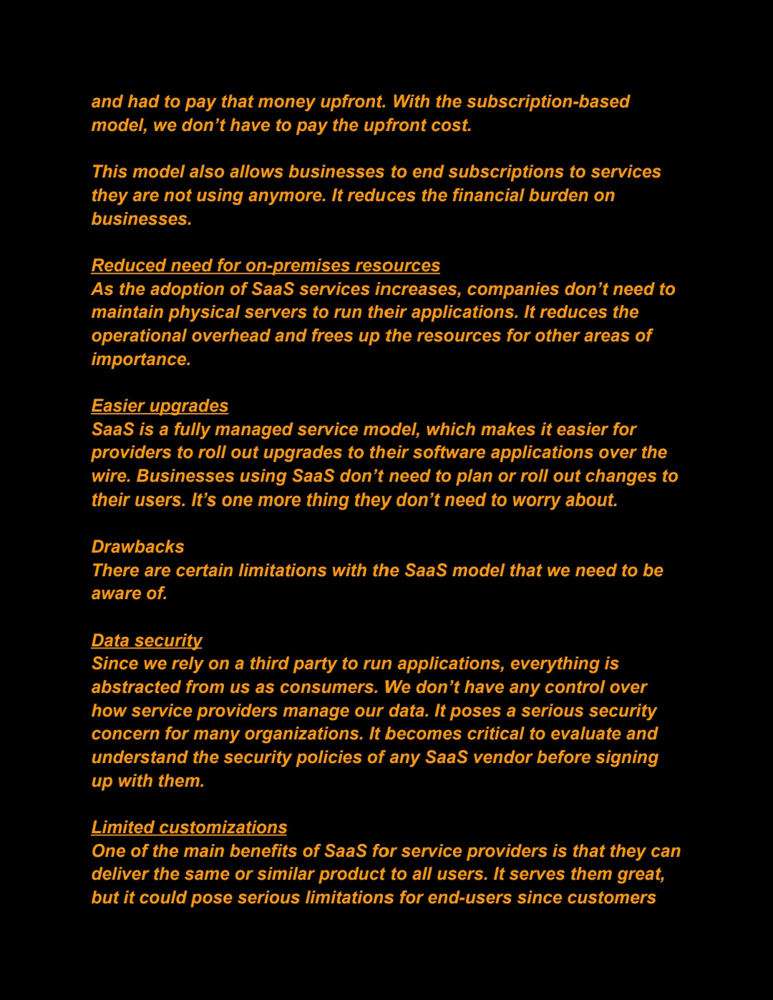 
don't have much control over how the product should look and what features it should contain. If a business needs some feature that is valuable to them, they have limited options.

**Harder to integrate**
Even though many SaaS providers make their products extendable so that customers can hook up with other tools and products, it can be very limited. If a business wants to integrate with different products, they are restricted to the integration capabilities that SaaS offers.

**Lack of control**
One of the main trade offs we make when we pick up any software that is not created in-house is that we lose control. It is up to the vendor to provide capabilities, features, and levels of customization. We need to be prepared for this drawback when we opt for the SaaS model and plan accordingly.

Similarity between EC2 and elasticBeanStalk ⇒ Elastic!
Elastic
Mostly Aws services start from Elastic let's see what is elastic!!

**3 T's**
Elasticity
Scalability
High Availability

 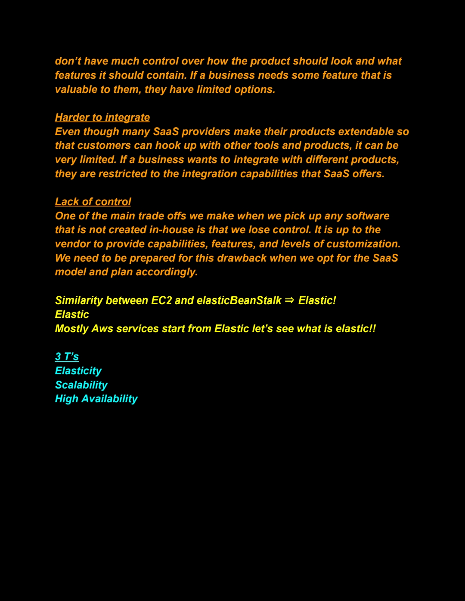 
**Cloud Basic Concepts**
- **High Availability**: In computing, the term availability is used to describe the period of time when a service is available or continuously operational without failure for a long time
- **Fault Tolerant**: refers to the ability of a system to continue working without loss of service in the event of an unexpected error or problem.
- **Scalability**: "Increasing" the capacity to meet the "increasing" workload. Or ability of a system to increase the workload on its current hardware resources (scale up or vertical scaling) / adding new servers with more capacity.
- **Elasticity**: "Increasing or reducing" the capacity to meet the "increasing or reducing" workload. ELASTICITY - ability of a system to increase the workload on its current and additional (dynamically added on demand) hardware resources (scale

**Cloud Basic Concepts**
- **Redundancy**: In computing, redundancy means that there are multiple components that can perform the same task. This eliminates the single point of failure problem by allowing a second server to take over a task if the first one goes down.
- **Monitoring**: In a highly available setup, the system needs to be able to monitor itself for failure. This means that there are regular checks to ensure that all components are working properly
- **Failover**: Failover is the process by which one node takes over the job of another in the event that one becomes disabled or when the server gets terminated without a warning..

Elastic → stretch if you want else back!!
 Elastic in aws refers to increasing decreasing load!!

 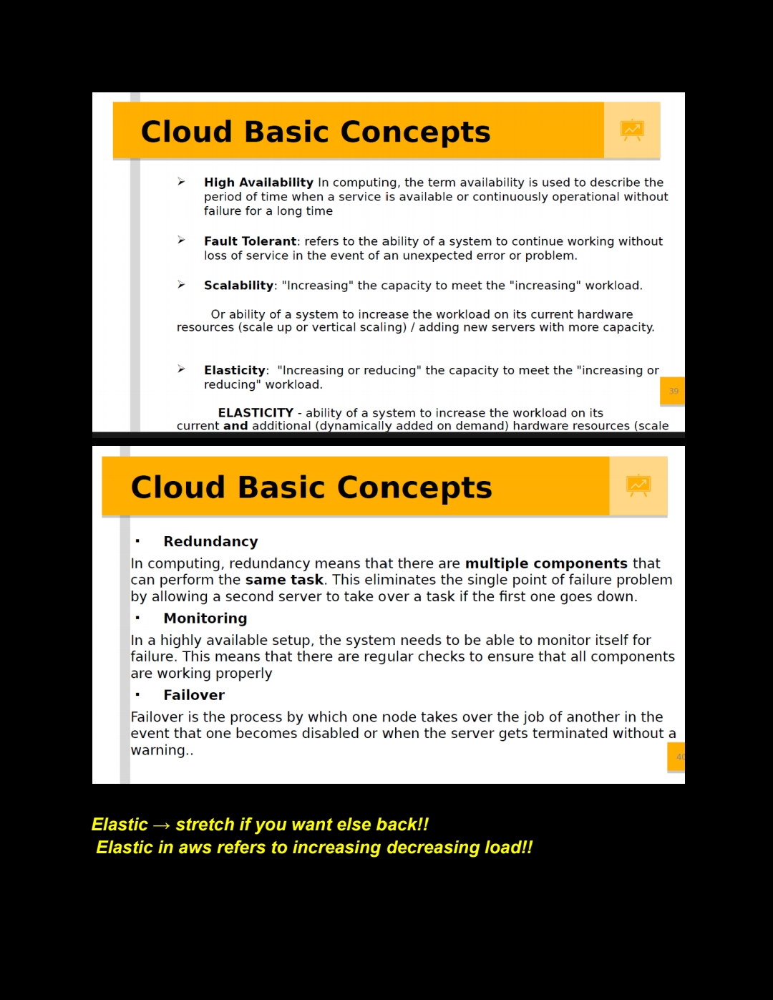 
Like in flipkart we have big billion days ! on normal day 2 server are sufficient! But on Big billion days we need more servers so we stretch!!

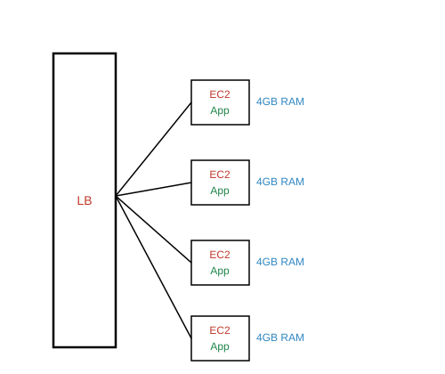

Suppose we are using and now load increase? Now what we do increase 4 GB ram ? or increase servers?

We increase servers as if we increase capacity we need to  stop the server and then change the capacity!! So instead we go to increase the servers!!soa added 2 more servers

 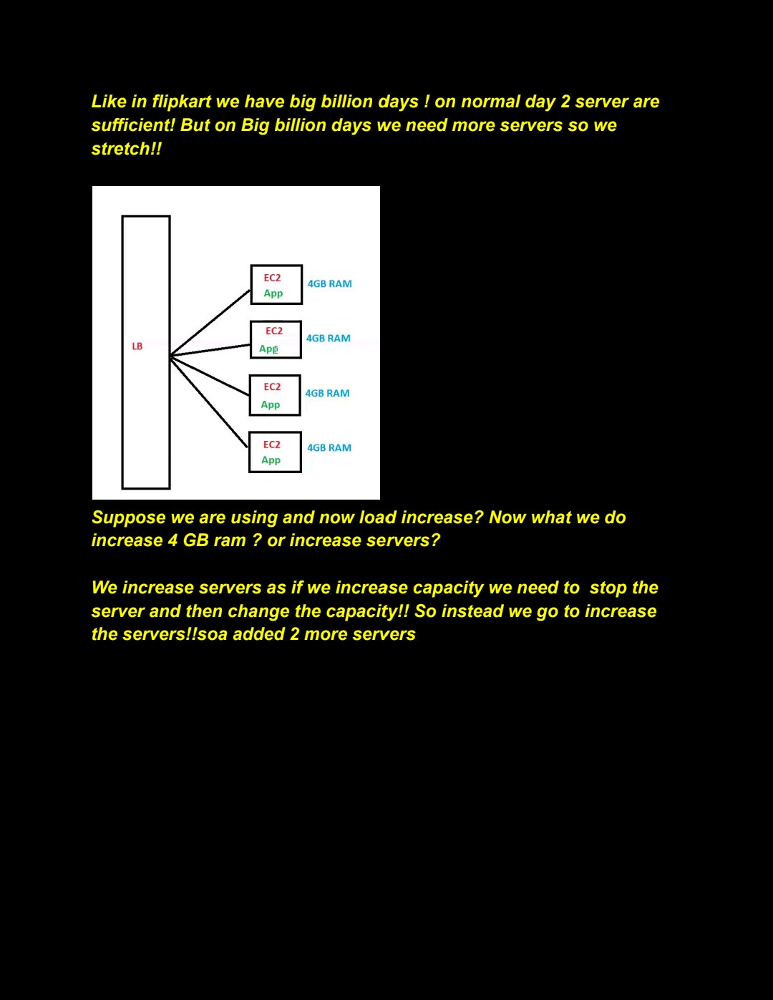
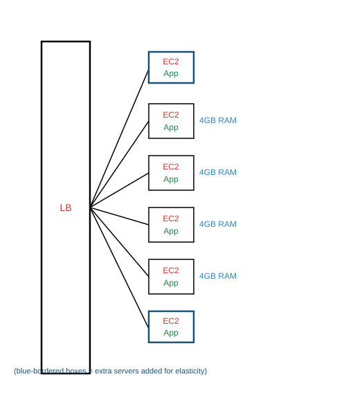

Now sale ends we need to stop rest 2 server so this is elasticity!!
This elasticity is short term!!
We achieve this in AWS based on AutoScaling( number of server increase or decrease automatically depending on load)

Increase server → scale out
Decrease server→ scale in

**Elasticity**
Increasing or decreasing the number of servers based on the load
Elasticity is Short term
Elasticity can be acheived in AWS using Auto-Scaling
Auto-Scaling = Scale Out and Scale In
  adding / removing, increasing / decreasing

Elasticity is called as horizontal scaling!!

 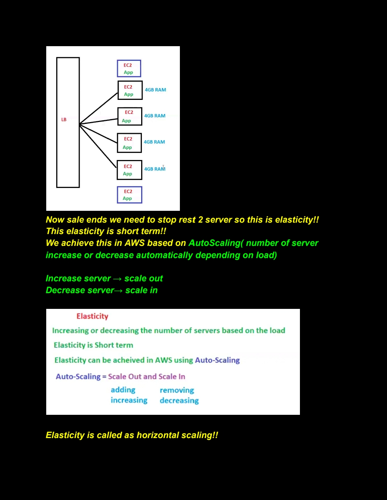
Use same capacity server in autoscaling!!
As load balancer gives request to different server ! if you have different RAM on different server than for some customer application will be fast and for some it will be slow!!

This all elasticity happens in group so called as AutoScaling Group(ASG)(group of ec2 server that we want to autoscale)

Lets now see scalability!!

Suppose your laptop is slow ! then what would you do? Increase the RAM!!

Now a DB server has 8GB ram !! now people say its slow!!
So here we increase RAM of server!!

So here we need to stop the machine!! And increase the capacity!

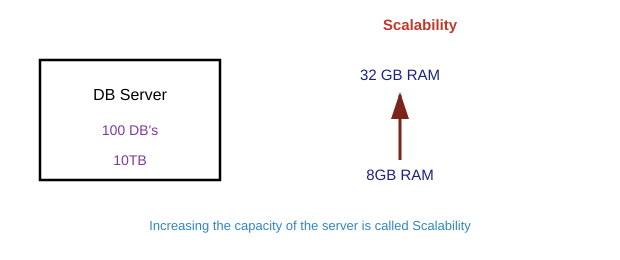

In runtime like application used by customer we use elasticity (horizontal Scaling)
In case of Db server we can use scalability or vertical scaling!!

Observation→ scale up hi hoga hmesha !! kbhi laptop fast chl rha hai toh uski RAM km thdi kr doge!!

  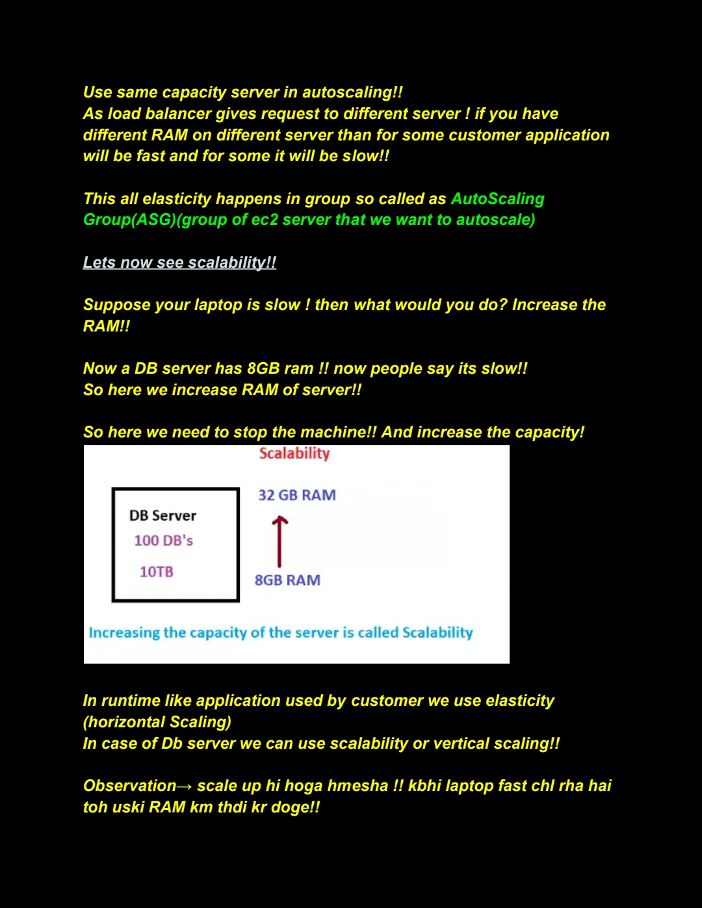 
But yha pe scale up ke sath sath scale down bhi hota hai!!

To achieve the scalability we change the instance type!!

Scalability is long term !! laptop upgrade ke baad km thdi kroge!!
Elasticity is short term as we reduce server once load is down!!

**Scalability**
Increasing the capacity of the server is called Scalability
Scalability = Scale Up and Scale Down
Scalability can be acheived in AWS using ? (By changing the instance type)
Instance type = CPU + Memory
Scalability is Long term
Scalability is also called as Vertical Scaling

HIghly available→ mostly working!

If a website not working then this time  duration is called as downtime!!

**High Availability**
The period of time the service is available to the customer is called HA
The period of time the service is NOT available to the customer is called Downtime

HA is measured in percentage!!
Google ia available for 100%!!

  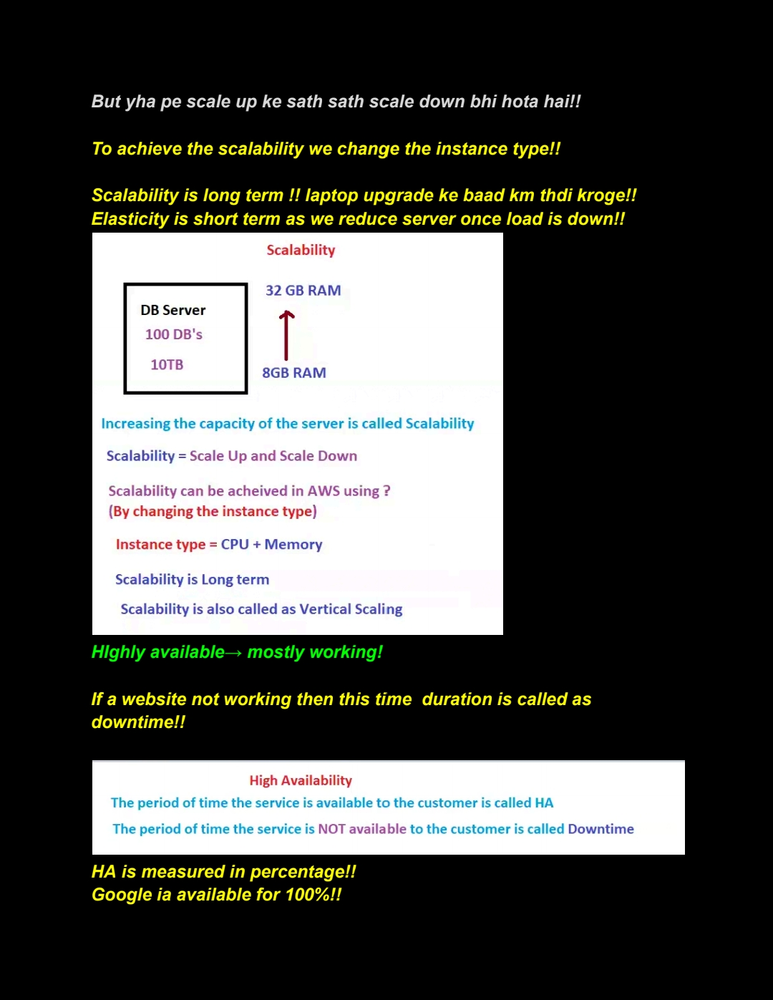 
Never tell a customer ki website will be available 100% !!
If sometime it goes down , you need to pay back the whole money to the customer !! you can say 99.9999 % like dettol!!

It kills 99.99% germs!

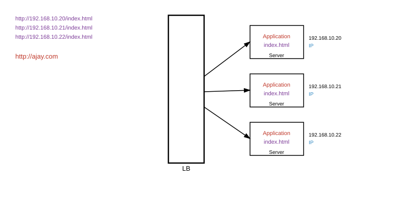

We have same application on all servers !! so their is redundancy (duplicacy)!
 Igf 1st sever goes down !! then how load balancer know ki server down hai? Uss server se response aana bnd ho jaega?

This is called as monitoring of application which is done by load balancers!!

Sometimes application is down and sever is up!! Then also load balancer will not send request to that server as application down!!
Load balancer do health check of the application not server!!

If application responds as status code 200 then okay else load balancer thinks it is dead!! Every 30 sec load balancer check with server ki application 200 code de rhi ya nhi!!
Time is adjustable but 30 sec is good  to have!!

If 1st server goes down other server will pick that server's request that is called a failover!!

  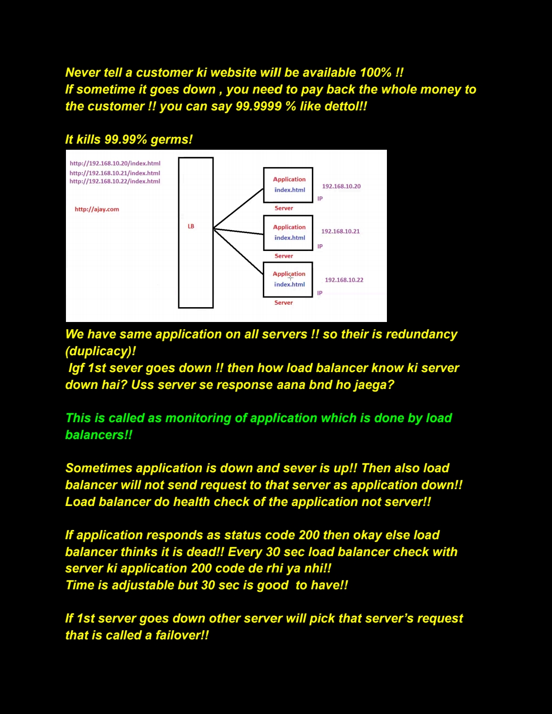 
**High Availability**
- Redundancy
- Monitoring
- Failover
RMF

LB will do the health checks for application not Server
LB is doing the monitoring

3 rules for high availability:
**Redunancy** = Duplicate/ having same application on diff machines
**Monitoring** = LB will check the application is reachable or not using health checks
**Failover** = If one server goes down, other server will take the requests sent by LB

If application is down doesn't matter if the server is up or running!!
For load balancer that server is down!!

If all servers goes down then??
You can implement auto scaling!! If you want zero downtime!!!

0 downtime⇒ Fault Tolerance(does not tolerate fault)

  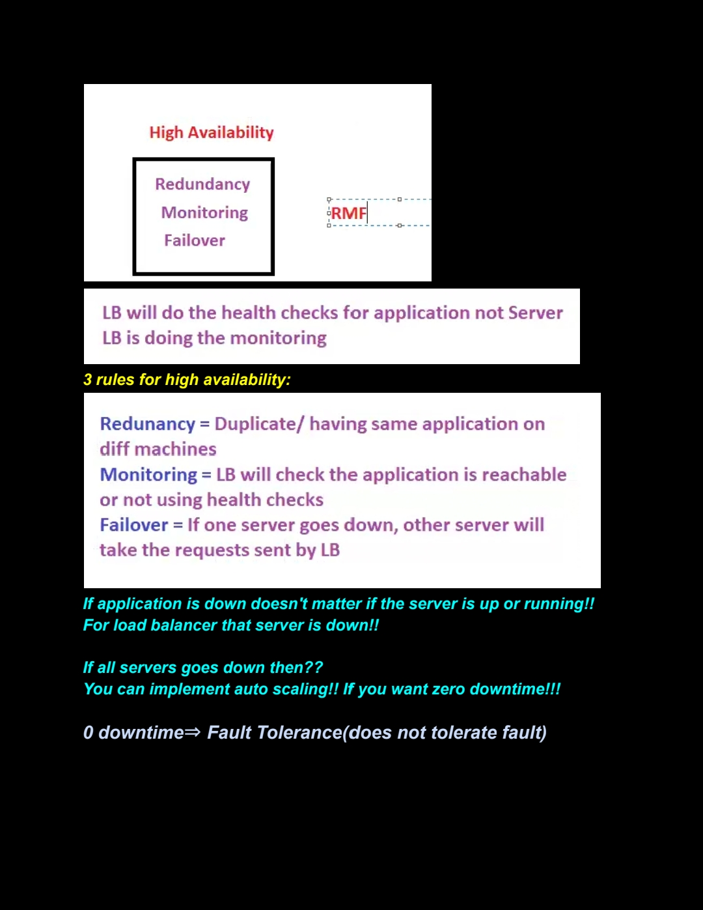 
**High Availability is in the Eye of the beholder**
- CEO: we don't loose sales
- Sales: we can extend our offer basing on HA level
- Accounts managers: we don't upset our customers (that often)
- Developers: we can be proud — our services are working ;)
- System engineers: we can sleep well (and fsck, we love to!)
- Technical support: no calls? Back to WoW then.. ;)

HA is measured in percentages of 9's

Monthly: 1 hour of outage means 100% - 0.13888 ~= 99.86112 of availability
Yearly: 1 hour of outage means 100% - 0.01142 ~= 99.98858 of availability

| Availability | Downtime (year) | Downtime (month) |
|---|---|---|
| 90% ("one nine") | 36.5 days | 72 hours |
| 95% | 18.25 days | 36 hours |
| 97% | 10.96 days | 21.6 hours |
| 98% | 7.30 days | 14.4 hours |
| 99% ("two nines") | 3.65 days | 7.2 hours |
| 99.5% | 1.83 days | 3.6 hours |
| 99.8% | 17.52 hours | 86.23 minutes |
| 99.9% ("three nines") | 4.38 hours | 21.56 minutes |
| 99.99 ("four nines") | 52.56 minutes | 4.32 minutes |
| 99.999 ("five nines") | 5.26 minutes | 25.9 seconds |

Five nines => downtime of 5 min in year and in month 25 sec

  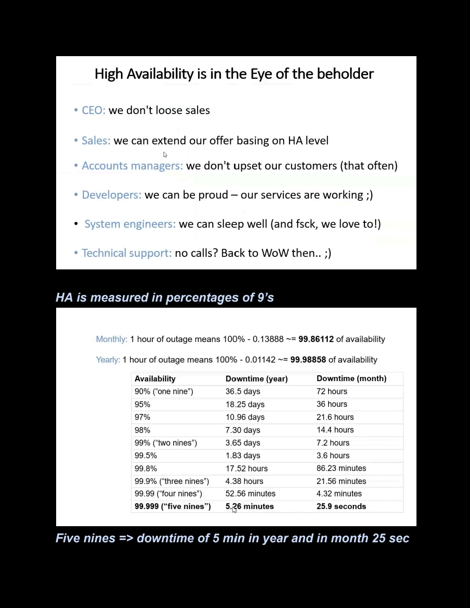 
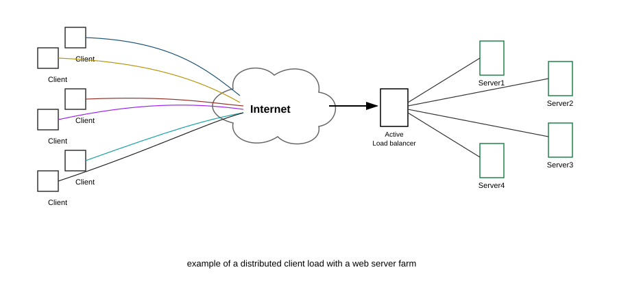

See concept of load balancer!!

  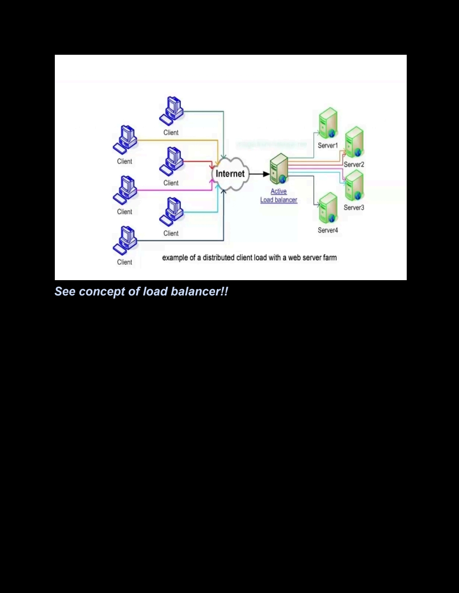 
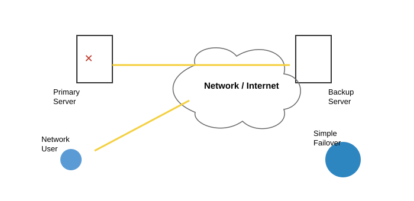

See concept of failover!!

See is this highly available?
 Redundancy 2 machines so yes
Then load balancer doing monitoring!

  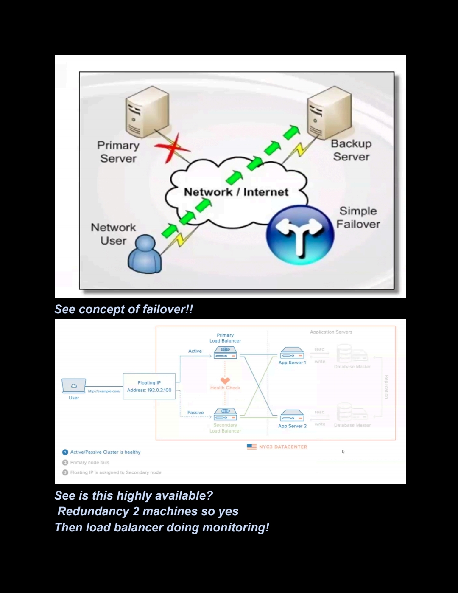 
Failover if app server 1 goes down other server 2 take over!
So yes it is highly available

Lb1 down no impact to customer!!

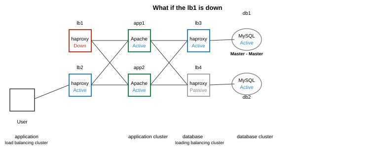

Now app1 down

  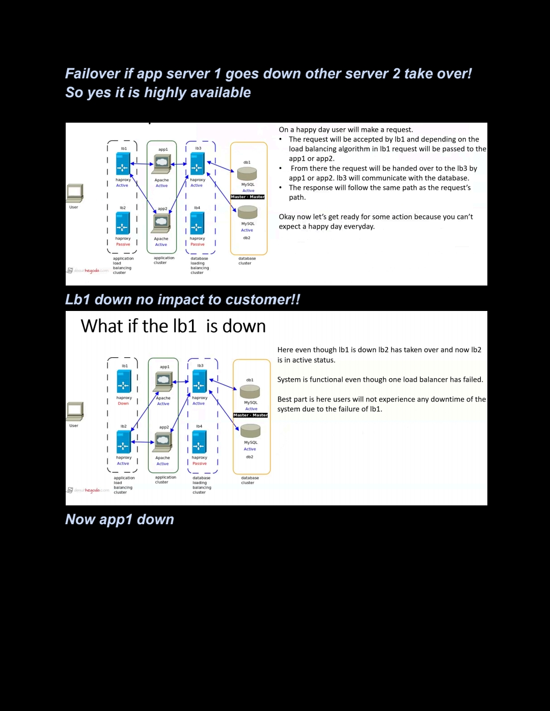 
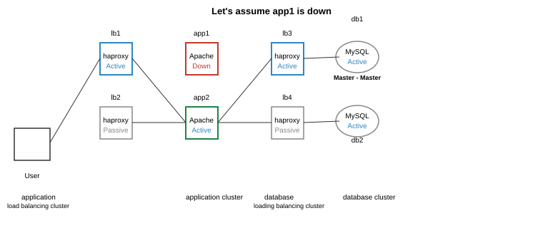

Half of infra is down!!

You never say developer ne kya code kia !!
Its always system engineer that designs well!! A website get good things only when highly available system!!

  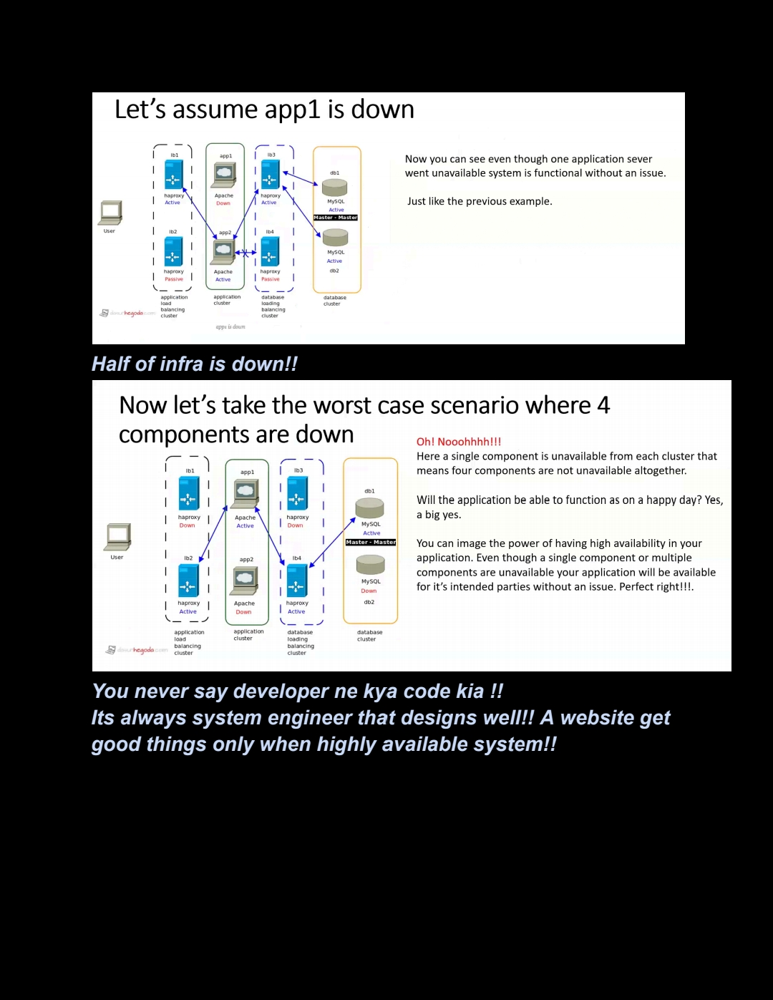 

Now we will be starting aws purely!!

  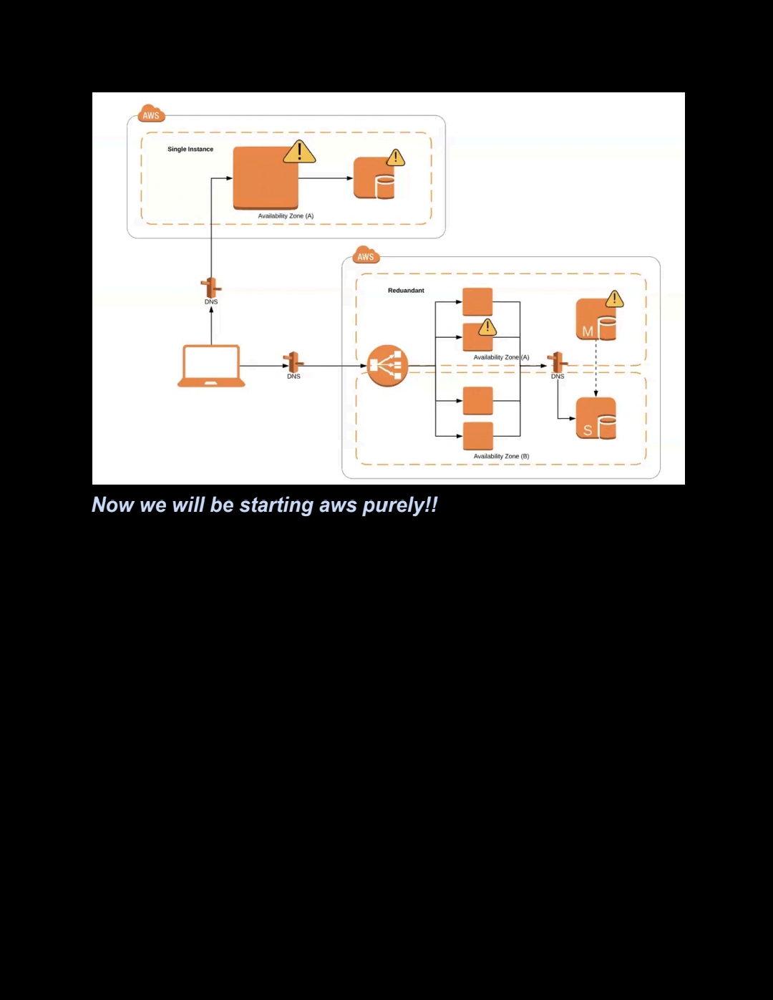