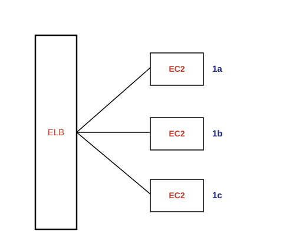
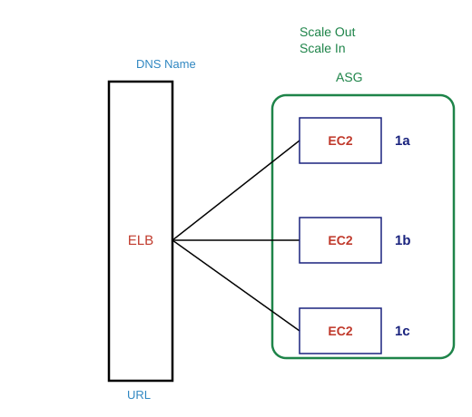
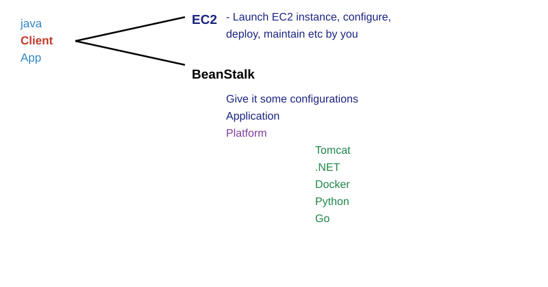

## Overview

If you want to set up infra in Aws ,it should be private so for that  we use VPC's.
Let's first talk about Ec2 (Elastic Compute cloud)!!
There is no concept of create Instance!! We just launch Instances!!
Never ever say create an instance!!

**Ec2 operations**
Launch
Stop
Start
Reboot
Terminate ---> Delete
           Destory
           Kill

Above are operations in Ec2!!
Ec2 is the biggest service in AWS!!
Every service in AWS is either regional or global!!

I launched Ec2 in Mumbai. Can I see that in Ireland !! no! So it's not global!!It's regional!95% of services is regional!!

Do you think on-premises(physical machines) it is easy to set high availability? Auto scaling??  Scalability??
There is high chance that load balancer goes down!!Load balancer is a software that you need to install on server!!eg engine x,apache!!

But with Aws, you no need to handle Load balancer!!
Load balancer never goes down!!

Load balancer is a service in AWS and a service never goes down in AWS!!This load balancer is called as ELB(Elastic load balancer) .

 Elastic we know that we can increase and decrease based on traffic!!

**AWS Services can be either Regional or Global**
EC2 = Elastic Compute Cloud     In EC2 service, we can launch EC2 instances
EC2 is Regional Service         Servers = Instances / EC2 instances (VM's)
                                 Load Balancer = Which distribute the traffic to multiple Servers
                                 Elastic Load Balancer (ELB) = ELB distribute the traffic to multiple EC2 instances across AZ's

ELB is managed by AWS!! ELB is a service!!
We can access ELB not login!!

Whenever you create load balancer AWS gives you DNS name or URL!!we access ELB by URL or DNS name!!

**AWS Services can be either Regional or Global**
EC2 = Elastic Compute Cloud     In EC2 service, we can launch EC2 instances
EC2 is Regional Service         Servers = Instances / EC2 instances (VM's)
                                 Load Balancer = Which distribute the traffic to multiple Servers
                                 Elastic Load Balancer (ELB) = ELB distribute the traffic to multiple EC2 instances across AZ's
                                 ELB is completely managed by AWS (HA, AS, Scalability, Performance etc)
                                 ELB is not a Server, ELB is a Service
                                 You cannot login to the ELB, you can access ELB with DNS Name
                                 ELB dosent have any AZ's , it is created at Regional Level

ASG→Auto scaling group!!

Deployment models we have learnt at start
PAAS(Platform as a service)→Elastic BeanStalk(easy and quick deployment of applications in AWS) we no need to worry about server only application and data!!

In BeanStalk ,beanstalk take the application and create server own and deploy application on servers!!
Backbone of beanStalk is EC2 so background it launch only EC2!!

In BeanStalk we have control over EC2 but  we do not need to have any control over servers!!it is not recommended to control EC2!!

If you are very lazy use benaStalk!!Ec2 we deploy manually !! in beanStalk ,it do everything by itself!

If no control needed go for beanstalk
If need control go to ec2

**Elastic BeanStalk** = Easy and Quick deployment of applications in AWS
In General, PAAS --> you dont have any control on the Servers
In AWS BeanStalk --> you have full control on EC2 instances launched by BeanStalk
BeanStalk handles EC2 instances behalf of us
Back Bone of BeanStalk is EC2 instance

 Call it beanstalk or elastic bean satlk but dont call EBS !! it has some other meaning!!

Tell platform according to tech stack!! Like java needs tomcat!!
Beanstalk automatically creates EC2 instances and put application their!

   
Configurations include whether load balancer needed ,auto scaling needed or not!!

People says we want something that we click and everything done!!we have lightsail service!! Doesnt support heavy machines!! Max ram 32 GB!!

Amazon Lightsail is the easiest way to get started with Amazon Web Services (AWS) for anyone who needs to build websites or web applications. It includes everything you need to launch your project quickly—instances (virtual private servers), container services, managed databases, content delivery network (CDN) distributions, load balancers, SSD-based block storage, static IP addresses, DNS management of registered domains, and resource snapshots (backups)—for a low, predictable monthly price.

There is no autoscaling here!!as very light!!all latest applications will be already present!!like github ,gitbucket etc!!

**LightSail** = If you want to setup and create a virtual LightSail instance which already has everything installed (wordpress, Gitlab, Joomla, Nodejs, drupal, Redmine, Nginx , Cpanel etc etc)

Here we call it as lightsail instance!!

We have a service called Lambda!! (Lambda mostly related to automation)

Lambda run application without server!!

Server based → when you login to server!
Server less →when you not need to login to server!! Eg gmail ,google drive
In backend we have server but no need to worry about that!!

Here we create function without application!!

 
Here we create lambda function!!

Whenever you do anything in AWS ,an event is generated in AWS!!
We want a person not launch EC2 !! so whenever launch event is generated we want to terminate EC2!!

All events of all services are stored in service called event bridge!!

So we create a rule in event bridge !! whenever launch of ec2 is done!!
We create a lambda function to terminate EC2!!

We can write lambda functions in any language like java ,python ,ruby etc!!
Python  goes very well with the AWS Lambda function!!!!

We write function in LAMBDA!!(used for automation to start some ec2 at some time ,to stop ec2 after some time))

We covered
EC2
Elastic BeanStalk
lightsail
Lambda
Event bridge

