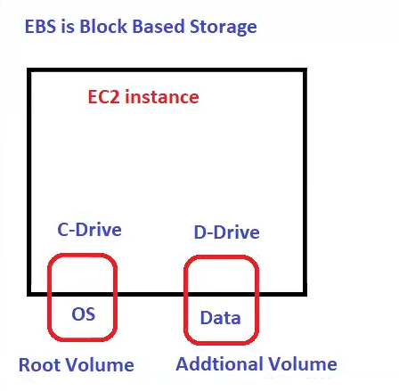
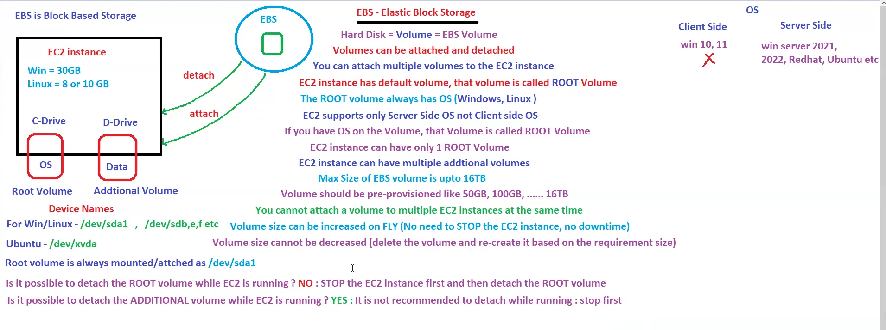

## Overview Of services

Already seen load balancers and 5 services in Previous lecture

1. EC2
2. Elastic BeanStalk
3. lightsail
4. Lambda (serverless)
5. Event bridge
***
we create functions in lambda!!

Event bridge stores all events !!
***
Floppy-->2MB 
CD's-->700MB 
DVD's-->4.7GB  
Pen Drives-->128GB  
HDD-->2 TB 

These are not secure!! We need more storage!! so AWS comes up with service called as S3 (**Simple** **Storage** **Service**)

In Aws mostly services starting with Simple ends with Service e.g. service to send notification is SNS (Simple Notification service)! service to send Email SES (Simple Email Service)!

Google also has drive called google drive and AWS has S3!!
it is just a storage!

S3 is unlimited storage!can store  any kind of files!!
we say any kind of files as FLAT files!!

__Cannot execute any type of file in S3__ 
__S3 is just storage__ 
__S3 is serverless so we no need to think about High availability,scalability__
***

 
***
 Laptop <--> S3 
 Windows <--> none  
 Folder <--> Bucket 
 Files <--> Objects 
 KFG <--> Keys 

 S3 is object based storage!! Name of file is KEY!! Bucket is container of object!!

 __S3 is global but buckets are regional__

> **Note :** 
In case of static website, you can host on S3!! no need to go to EC2 or elastic beanStalk!! it does not support dynamic website hosting!!
 
 ***
 Now we see about EBS(__Elastic Block Storage__)

 Don't call Elastic BEanStalk as EBS ,EBS  full form is Elastic Block Storage!!

 S3 is object based storage but EBS is Block based storage!!
  It is like HDD!! you can run anything here!!

  here HDD is called as Volume (EBS Volume)! now we call HDD as Volume!!__When launching EC2 we need to tell Volume!! Ec2 comes with default volume called as root volume which has OS!!__ Rest of volumes is called as Additional volumes!! Anytime we can attach volume or detach it!!
  ***

EBS is centralized storage !! to create a volume create volume Attach to ec2 and after use detach it!!

We can attach multiple volumes to ec2 instance. Default volume is root Volume which has OS!

here we have server side OS !! Ec2 doesn't support client side OS like Windows 10,11!!it support only server side OS like windows server 2021,2022,redhat,ubuntu!

Windows Ec2 instance default size EBS-->30GB 
Linux Ec2 instance default size EBS-->8 or 10GB 
These are pre-provisioned (Already decided by AWS) 
maximum volume size-->16TB 
We can attach one volume to multiple ec2? no can you attach your HDD to multiple laptops! no!!
***
__Volume size can be increased on fly!! no need to stop the Server (ec2 instance)==> no downtime,but volume size cant be decreased!!__

Root volume device name is /dev/sda1!! whenever you attach root volume it device name should be /dev/sda1!for os ec2 look into this volume name only!!

__for ubuntu sometimes we have root volume name /dev/xvda__

__Additional volume is /dev/sd_1 in _ you can put b,c,d-----__

> **Note :**
We cant stop root volume while ec2 instance is running!! but an detach additional volume!!But it is not recommended!! as some developer might be working on it! just stop ec2 and then detach!!

You can not delete the volume while it is attached!! first detach and then delete!! 

EC2 instance has AZ and volume also has AZ!! should both be same AZ(data centre)? both should be in same AZ (data centre)1a AZ cant be attached to 1b Ec2 instance!!   

We cant put a volume to multiple EC2 but now i need shared storage!!We want to share the storage!!

If you have 100Gb Storage and used 30 GB !! wil AWs charge for 100GB or 30GB? you go to restaurant you ordered full biryani you ate half you need to pay for full naa !! same here if you take 100 GB pay for 100 Gb whether you use or not full 100 GB!!
