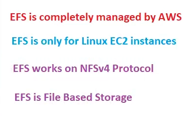
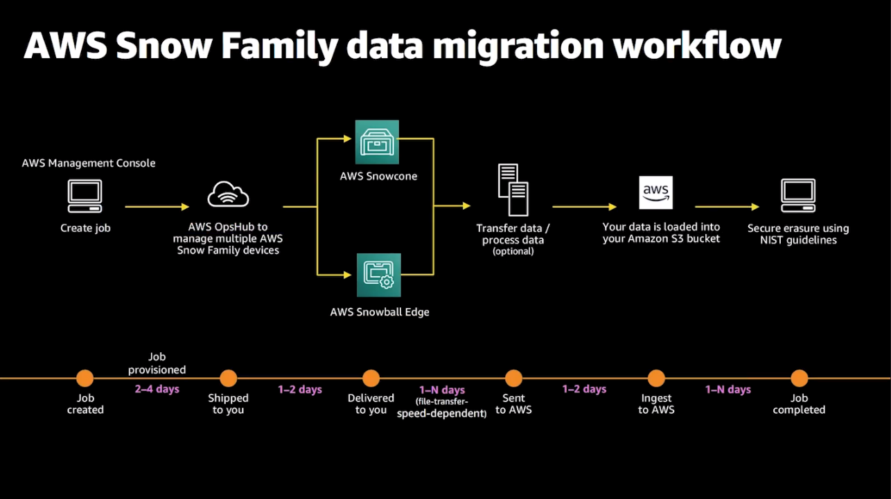

# Overview continued

## What is Lambda?
The evolution or timeline of Lambda looks something like this:

On-Prem DataCenter –> IAAS –> PaaS –> containerization/Docker –> Serverless

Lambda is a compute service where you can upload your code and create a Lambda function. AWS Lambda takes care of provisioning and managing the servers that you use to run the code. You do not have to worry about operating systems, patching, scaling etc.

It is essentially described as an event-driven compute service where AWS Lambda runs your code in response to events. These events could be changes to the data in an Amazon S3 bucket or an Amazon Dynamo DB table.

Lambda events can trigger other Lambda events or call other AWS services like SQS or SNS.

## Why use Lambda?
1. The Lambda runtime is fully managed by AWS. Once a function is uploaded and configured, Lambda is responsible for managing the resources required to run the code.
2. Developers are free from the traditional overhead of configuring and maintaining server instances.
3. Lambda will immediately scale to meet spikes in demand.
4. Lambda is cost-effective as you only pay for the computational resources used. This is, of course, true for other AWS compute services, but the cost model for Lambda is more granular than EC2 for example, with resources being charged per 100 milliseconds.
5. Lambdas event-driven model means you can integrate nicely with a range of AWS services, but still ensure loose coupling.
6. It’s very low cost. The first 1 million requests are free and you have to pay 0.20 per 1 million requests thereafter!!

## Simple Storage Service (S3) - Object-Based Storage
It provides developers and IT Teams with secure, durable, highly-scalable object storage. It is easy to use the simple web interface to store and retrieve any amount of data from anywhere on the web.

It is a place to store your files on AWS. and data is spread across multiple devices and facilities.

Think about S3 to store your photos or files.

1. Object based storage
2. Unlimited storage
3. Files are stored in Buckets/Folders
4. Names must be unique globally
5. Every time you have a successful upload you get a http 200 code back

S3 is primarily used for:
1. Store and Backup
2. Application File Hosting
3. Media Hosting
4. Software Delivery
5. Storing AMI’s and Snapshots

## What is Elastic Block Storage (EBS)?
EBS allows you to create persistent block-level storage volumes and attach them to EC2 instances. Once attached you can create a file system on top of these volumes, run a database.

EBS is placed in a specific Availability zone where they are automatically replicated to protect you from the failure of a single component. You can also set up snapshots of your EBS to be durably stored in S3.
## EBS vs. S3

As EBS is a persistent block storage solution where the data on EBS volume is replicated across multiple servers in different AZ’s to prevent the loss of data from the failure of any single component. This replication makes Amazon EBS volumes makes it more reliable.

## What is object storage?
Object storage (also referred to as object-based storage) is a general term that refers to the way in which we organize and work with units of storage, called objects. Every object contains three things.

1. __The data itself__ The data can be anything you want to store, from a family photo to a 400,000-page manual for assembling an aircraft.
2. __An expandable amount of metadata__ The metadata is defined by whoever creates the object storage; it contains contextual information about what the data is, what it should be used for, its confidentiality, or anything else that is relevant to the way in which the data is used.
3. __globally unique identifier__ The identifier is an address given to the object in order for the object to be found over a distributed system. This way, it’s possible to find the data without having to know the physical location of the data (which could exist within different parts of a data center or different parts of the world).

## Block vs. object storage

With block storage, files are split into evenly sized blocks of data, each with its own address but with no additional information (metadata) to provide more context for what that block of data is. You’re likely to encounter block storage in the majority of enterprise workloads; it has a wide variety of uses.

Object storage, by contrast, doesn’t split files up into raw blocks of data. Instead, entire clumps of data are stored in an object that contains the data, metadata, and the unique identifier. There is no limit on the type or amount of metadata, which makes object storage powerful and customizable. Metadata can include anything from the security classification of the file within the object to the importance of the application associated with the information. Anyone who’s stored a picture on Facebook or a song on Spotify has used object storage even if they don’t know it. In the enterprise data center, object storage is used for these same types of storage needs, where the data needs to be highly available and highly durable

__However, object storage generally does not provide you with the ability to incrementally edit one part of a file (as block storage does). Objects have to be manipulated as a whole unit, requiring the entire object to be accessed, updated, then re-written in their entirety. That can have performance implications.__

__Another key difference is that block storage can be directly accessed by the operating system as a mounted drive volume, while object storage cannot do so without significant degradation to performance. The tradeoff here is that, unlike object storage, the storage management overhead of block storage (such as remapping volumes) is relatively nonexistent.__

## What problems does object storage solve?
1. Object storage is ideal for solving the increasing problems of data growth. As more and more data is generated, storage systems have to grow at the same pace. What happens when you try to expand a block-based storage system beyond a hundred terabytes or beyond multiple petabytes? You may run into durability issues, hard limitations with the storage infrastructure that you currently have, or your management overhead may go through the roof.

2. Solving the provisioning management issues presented by the expansion of storage at this scale is where object storage shines. Items such as static Web content, data backup, and archives are fantastic use cases. Object-based storage architectures can be scaled out and managed simply by adding additional nodes. The flat namespace organization of the data, in combination with its expandable metadata functionality, facilitates this ease of use.

3. Another advantage to object storage is its responsiveness to the need for resiliency while mitigating costs. Objects remain protected by storing multiple copies of data over a distributed system; if one or more nodes fail, the data can still be made available, in most cases, without the application or the end-user ever being impacted. In most cases, at least three copies of every file are stored. This addresses common issues including drive failures, bit-rot, server and failures, and power outages. This distributed storage design for high availability allows less-expensive commodity hardware to be used because the data protection is built into the object architecture.

## Workloads for object versus block storage
Object storage works very well for unstructured data sets where data is generally read but not written to. Static Web content, data backups and archival images, and multimedia (videos, pictures, or music) files are best stored as objects. Databases in an object storage environment ideally have data sets that are unstructured, where the use cases suggest the data will not require a large number of writes or incremental updates.

Geographically distributed back-end storage is another great use case for object storage. The object storages applications present as network storage and support extendable metadata for efficient distribution and parallel access to objects. That makes it ideal for moving your back-end storage clusters across multiple data centers.

It is not recommended to use object storage for transactional data, especially because of the eventual consistency model outlined previously. In addition, it’s very important to recognize that object storage was not created as a replacement for NAS file access and sharing; it does not support the locking and sharing mechanisms needed to maintain a single accurately updated version of a file.

Because block-level storage devices are accessible as volumes and accessed directly by the operating system, they can perform well for a variety of use cases. Good examples for block storage use cases are structured database storage, random read/write loads, and virtual machine file system (VMFS) volumes. However, since block storage has essentially no additional storage-side metadata that can be associated with a given block other than the address of that block, performance degrades in geographically distributed systems. The further the block storage gets from the application, the more the performance suffers due to latency issues.

***

for Photos videos use S3 (Simple Storage Service),here we cant install, run ,execute files ,is serverless!!

S3 we create bucket which has objects!

HDD is called as Volume in AWS (EBS volume).Root volume has OS .We have 1 root volume per ece instance!! we can have multiple Additional volumes!! we can increase volume size on fly but cant decrease it for deletion need to stop ec2 and then delete!! cant detach ec2 while running!!

Ec2 and volume should be in same AZ
***
## Shared storage
we cant attach a single volume to multiple ec2 instance ?No!!
We need a shared storage which can share storage across multiple ec2 instance!
### What is Elastic File System (EFS)?
It is a file storage service for elastic compute cloud (EC2) instances. __The EFS strong capacity is elastic, growing and shrinking automatically__. EFS supports NFSv4 and you only pay what you use.

This enables a __shared, networked file system, which is replicated between multiple availability zones__. This makes EFS a good candidate for running MQ(Message queue) in a highly available way.

you need to mount EFS to multiple e instances!! below you can see EFS can be attached to multiple AZ!!

 

 whenever you mount it creates a drive!! and when you put data in that drive then you can have that data available across all EC2 instances having that EFS. EFS is completely managed by AWS!!EFS can on;ly be used with __Linux machines__!!

 EFS is accessed by various ec2 by network !! it uses NFS(network file system) version 4 protocol!! EFS is unlimited storage!! so it need not to be pre-provisioned(No need to tell how much you storage you want just use it will automatically increase or decrease)!! 

 

 For windows we have FSx(file system x represents multiple)!!

 Suppose uploading 1 TB data to s3 ,it will take days!!so for that AWS comes with service called SNOW FAMILy(used to physical data transfer)!!AWS send you 3 physical devices 

 1. SnowBallCone or snow ball support 8 TB
 2. SnowBall Edge support 100 TB
 3. Snow Mobile (is a truck) support PB's

## What is AWS Snowball?
It is used to move large amounts of data in and out of AWS using a portable storage device for transport. The idea here is if a customer has a large amount of data then you bypass the internet by plugging a snowball and then AWS will ship the encrypted snowball device for you to plug in and extract data at your data center.

This is a petabyte-scale data transport solution that uses secure appliances to transfer large amounts of data in and out of AWS.

__If you delete Ec2 ,root volume is deleted not additional storage!!__

Snow family we cant do practicals!!All this data will be pushed to S3!!
__Snow family is used to transfer data physically from on-premises to AWS or vice-versa__

If you are not using Some photos,videos ,we can archive it, for that we have a service called as glacier!!
