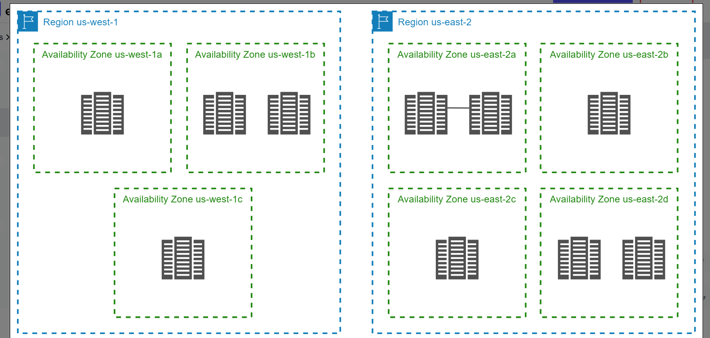
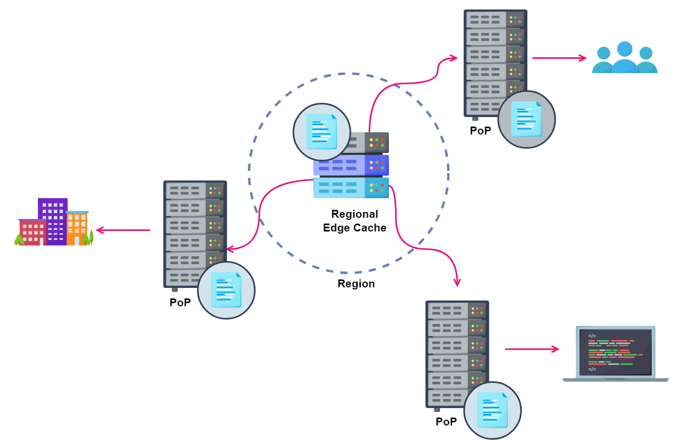
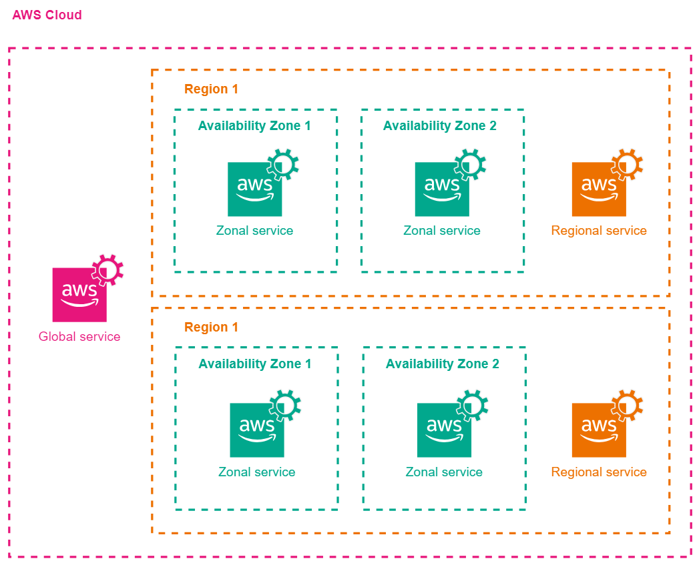
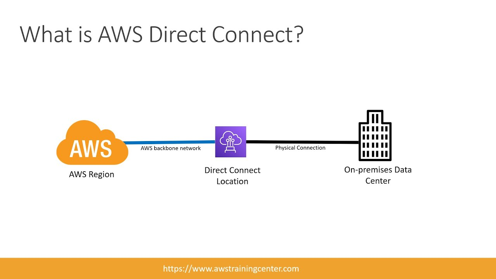

# Overview Of services continued

### Exam guide 
The exam consists of 65 questions, of which 50 are scored and 15 are unscored. The unscored questions only collect information about the performance of these questions for future scored questions, but as a candidate, you cannot identify between scored and unscored questions.

Below are a few points regarding the exam:

1. The exam asks about two types of Multiple Choice Questions (MCQs):

    1. MCQs with only one correct option and the remaining options are distractors.

    2. MCQs with multiple correct options. 

2. If a question is left unanswered, it’ll be considered incorrect.

3. Incorrect answers are not negatively marked, so there is no harm in making guesses.

4. Unscored questions do not affect the exam grades.

5. The exam score is scaled from 100 to 1000, and the passing marks are 720.

6. The exam score is calculated for the whole exam irrespective of the performance in individual sections
***
### Revision
##### Regions
In an AWS cloud, AWS Regions are the largest unit. They are separate geographic locations. Each region consists of clusters of data centers called Availability Zones. Currently, AWS supports seven regions, including Asia, North America, South America, and more. 

#### Availability Zones

As discussed above, regions consist of availability zones. Availability Zones are essentially data centers to host AWS resources. Each region consists of at least three availability zones. These zones increase the fault tolerance of the region. All of the Availability Zones within a region are connected to each other via dedicated channels with high bandwidth. 

__Regions and Availability Zones shall be selected carefully while deploying and scaling up the resources.__

#### Points of Presence and regional edge caches
Points of Presence (PoP), also known as edge locations, are located in major cities worldwide. AWS uses these edge locations to cache content, reducing latency and improving performance for end-users. PoPs are connected to the AWS regions through the AWS network backbone and are isolated from one another.

If the data is not accessed frequently enough to be stored on a PoP, it is stored on a regional edge cache. The regional edge cache has more capacity than the individual PoP. It lies in the middle of the origin server and a PoP and stores content that has become less popular over a period of time.

The global infrastructure has been designed to ensure high availability and resilient applications. It is recommended that while choosing the regions and availability zones, consider factors like proximity to users, data redundancy, cost optimization, and service availability.

#### AWS services and Fault Isolation Boundary
AWS maintains a fault isolation boundary for its services. A Fault Isolation Boundary defines the scope within which the fault is contained. The AWS services are divided into three main categories based on their fault isolation boundary:

- Zonal services: The resources of zonal services lie within a single availability zone. The resources in one availability zone exist and fail independently of the resources in the other zone. An example of zonal services would be EC2 instances.

- Regional services: The resources of regional services span across multiple availability zones and form a single access point for that region. An example of regional services would be the AWS DynamoDB table.

- Global services: The resources of global services are not region-specific. An example of a global service would be IAM.

Establishing fault isolation boundaries is a fundamental principle in designing resilient and reliable systems. It ensures that faults are localized and contained, reducing the risk of cascading failures that could lead to widespread outages or disruptions. This approach aligns with best practices in system architecture and operations for building highly available and fault-tolerant systems.

#### Snow family is Physical data transfer

#### glacier is used for archive purpose of photos and videos. not S3
***
## LoadBalancers

LoadBalancer is recognized by url!!it is a service in AWS!!

Url given by AWS is very bad to rad ,cant be given to customer so we need to convert the URL to some nice name ,so for that we have a service called __Route 53__ which is used to convert nasty bad URL to some nice URL.

Route53 (53 is port number of DNS) is first service hit by customer which converts back to that bad URL of load balancer!!
Route53 is map<Good url,bad url>.Route 53 has records of this mapping.

Web server is not needed if we have load balancer!! as the work of web server is done by LB!!
***
## VPC(Virtual Private Cloud)

Every infra we create should be inside VPC!! VPC is like private virtual datacenter!! it is regional ,max 5 (including default) we can have!! so first we create vpc before launching ec2 ,AWS provide default VPC in every region so that user no need to create VPC before creating ec2!!

Data centre handled by us is On-Premises!!We connect to AWS we use shared network (public network)!!now we need a private network virtually so company use VPN(virtual private network) to connect to various internet services!! VPN in backend uses shared internet!! so some company doesn't use this to connect to AWS!! they want a dedicated connection to AWS so for that we have a service by AWS called as __Direct connect__ which uses AWS network not internet!!

it is very costly !! $16000 per month !! NASA,ISRO,private projects use this !!It is lease line connection!!

