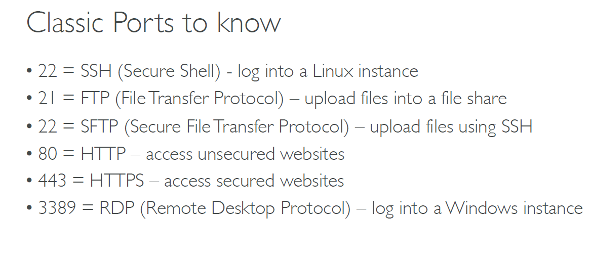
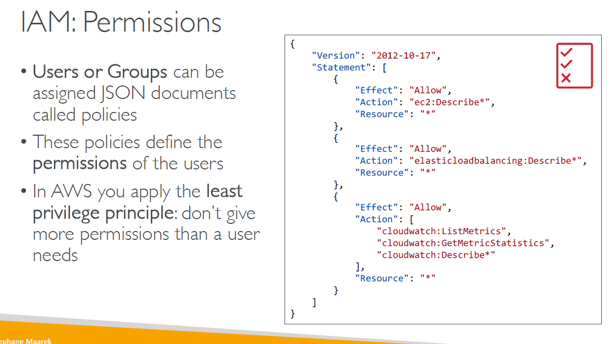
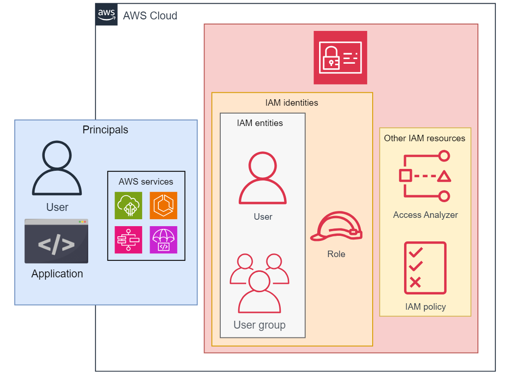
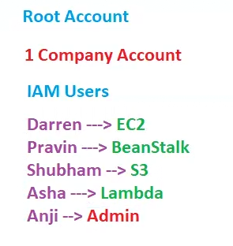
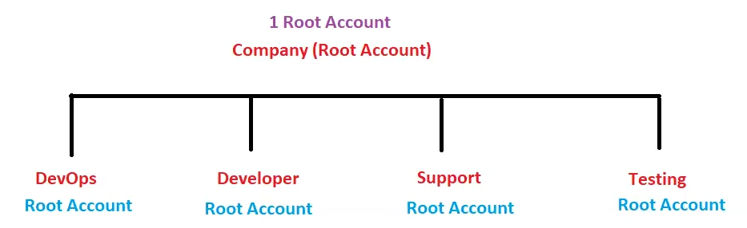
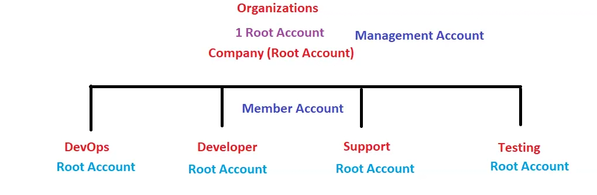
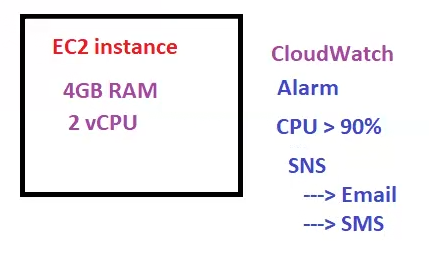

# Lecture 15

## Revision
Companies connect to AWS via VPN , if some company want private network then they use Direct Connect!!

In cloud front we create distributions!!

## IAM

Never share root account to any one!! Companies will have root account and then root account user create various users called IAM users!!

IAM (Identity and Access Management) is a security and management service of AWS. It is a global service that helps us provide external entities with secure access to AWS services or resources within our account. It takes care of both authentication (who is accessing the AWS account) and authorization (which services/resources is the authenticated entity accessing).

### Why do we need IAM?
When we create an AWS account, we are provided with the login credentials. Using those credentials, we can log in as the root user. A root user has unrestricted access to all the AWS services and resources within our account. When working with AWS, we may need to provide different users or applications access to AWS services or resources. Providing them with the root user credentials is risky as it may lead to security breaches. IAM helps us provide that required access. It helps us create resources representing the requesting entities in our account and define their scope of permissions. Along with this, it helps us monitor, manage, and modify this access as per our requirements.

### How IAM works
When an entity requests access to any of the AWS services or resources, that request is first analyzed by IAM. IAM checks the credentials provided by the requesting entity to authenticate it. After the requesting entity has been authenticated, it analyzes the permissions granted to the entity and checks if the current request falls into that pool of permissions. Upon verifying that the requesting entity is authorized to access the requested service/resource, IAM provides the requesting entity with the required access.

If the requesting entity fails any of these checks, its request is denied, and an appropriate denial reason is sent as the response to its request.

### Components of IAM
IAM uses the following components to perform its operation:

- IAM entities: These are the  IAM resources to authenticate the requesting entity. These include the following:

    - IAM users

    - IAM roles

- IAM identities: The IAM resources that IAM uses to check the permissions scope of the requesting entity. These include the following:

    - IAM users

    - IAM roles

    - IAM groups

- Principal: The user, service, or application that requests access to an IAM service or a resource. It can be both an external or an internal entity.

- Other IAM resources: These are the IAM resources that do not fall into any of the above categories. These are used for a wide range of operations that deal with identity and access management. These include the following:

    - IAM policies

    - Identity providers

    - Access Analyze

    

  Suppose company has root user and then there are various user needs only these resources.

  

  Shubham and Anji are people having permision to create S3 bucket!!
  Admin has all permissions!

  ### users
  - Root User-->Root user have full permission. login by email id and password
  - IAM User--> limited permissions .login by user name and password

  IAM service --> Access control on AWS resources to the User!!

Now suppose we give root account to all Departments so need to manage all these so for this to manage all root accounts we use a service called as __organization__!!

so top level root account is called as management account and other root account is called as member account!!

management account can give permission to member account which service it can access through a service called SCP(Service control Policies) .All the bills come to Management account!!

## SES (simple email service)
## SNS (simple notification service)
## SQS (Simple queue service)
 these are like message queues like rabbitMQ ,kafka which are server based but SQS is serverless!!

 SQS is first service by AWS!!
## Trusted Advisors
 service that give advice (first 5 advices free)

## AWS inspector
 Inspects AWS Environment!idf something wrong then it will tell!!
## Cloud Watch

watch means monitoring!!this cloud watch monitors anything in AWS!!

Amazon CloudWatch is a monitoring service for AWS cloud resources and
the applications you run on AWS. It is used to collect and track metrics,
collect and monitor log files, and set alarms.

CloudWatch watches performance

At 4am you want to wake up ,so 4am is threshold value, here watch is there but alarm duty to wake u up!!Similarly ,we have __CloudWatch Alarms__!!

For a person got heart attack we check BP,sugar etc these are matrices of a  person monitoring!! similarly when something wrong on AWS we check CPU,disk ,memory,network these are matrices for AWS!!

For EC2 we must create Alarm  in Cloudwatch and say send me notification by SNS in mail and SMS 
 

### types of monitoring
Data points meaning the graph we get for CPU utilization!

1. basic monitoring
    - free
    - get data points in every 5 min 
2. detailed monitoring
    - billable
    - get data point at 1 min

## cloud trail

Another monitoring service .
Any user do anything will get recorded here!

Anything wring happen we first check cloud trail!!

ON On-premises we have event viewer which records whatever you do on that on-premises system !!

## config 
monitors changes

1. laptop performance - cloud watch
2. what you do in laptop - cloud trail
3. changes like increase ram -config 

## AWS support
SLA(service level agreement) tells which support needs to be communicated in how much time!!

 Types of support
 1. basic support- free
 2. developer support
3. business support
4. enterprise support- $15000/month due to SLA(service level agreement) , AWS communicate within 15 min

## Services covered
- Organizations
- SCP(Service control policy)
- SES
- SQS
- SNS
- Trusted Advisors
- AWS inspector
- cloud watch (monitoring performance)
- cloud trail
- config (monitoring changes)

No need to know about all services!!
With every upgrade new services wil came!!

new services just need to explore!!you know all basics! 

lecture 15 over!!