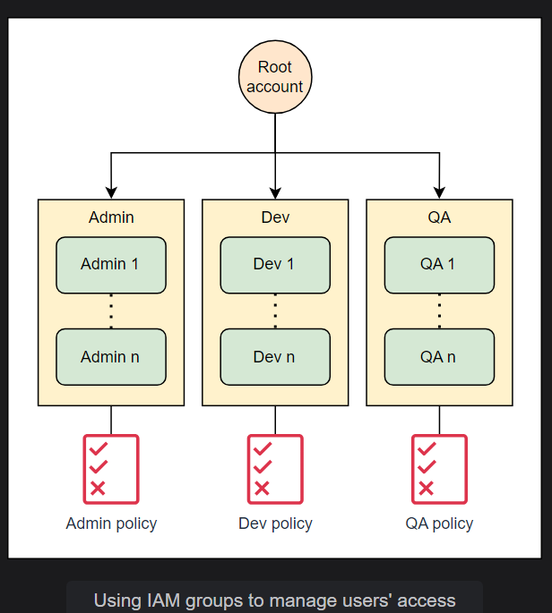

# Lecture 16 IAM deepdive


IAM (idendiety and access management).with IAM you can control entire AWS resources centrally.

IAM is used for security purpose. It is security service
2 types of user
- root user(having all permissions/policies)
- IAM user(limited permissions/policies)

IAM is completely free an global!!

With IAM user ,with login to AWS console but not login to EC2 instance!!you create resources have separate credentials!!


Suppose we created following users


We can have multiple policies to single user ,attach and detach anytime!!

### Difference in Admin and root user
__Root user can see billing admin cant__

Never share root user and password to anyone always share the IAm user account!! to share your account create IAm user!!

For daily activity ,always use IAm user not root user!! as root user has full permissions!!

For security use google authenticator for Multi-factor authentication (MFA), MFA can be for both root user and IAM user!! As AWS admin ,its your responsibility to put MFA for every user (both root and IAM user)!!  for this use app called Google authenticator!!

### IAM Policies

IAM takes care of authentication and authorization. An IAM policy is a JSON document attached to the AWS resource that is used by the logged-in entity to authenticate itself or to the AWS resource to which secure access is required. This policy defines the scope of permission that the principal entity will have.

#### Types of identity-based policies


These policies can be categorized into two types:

- Managed policies: These are discrete identity-based policies that exist independently of any other IAM resource. Managed policies can be attached to multiple IAM resources at the same time. Managed policies are further categorized into two types:

    - AWS-managed policies: These are pre-built policies that are created and managed by AWS. These policies are ready to use but are less flexible as they cannot be modified.

    - Customer-managed policies: These are the identity-based policies that we create and manage in our AWS account. As they are custom-built policies, we can draft and modify them according to our own specific requirements.

- Inline policies: These are custom policies drafted during the creation of an IAM resource. Inline policies are attached with the IAM resource they are created with and get deleted when that resource is deleted.

 An identity-based policy would look as follows:
```json
{
    "Version": "2012-10-17",
    "Statement": [
        {
            "Effect": "Allow",
            "Action": [
                "s3:CreateBucket"
            ],
            "Resource": [
                "arn:aws:s3:::demo-bucket"
            ]
        }
    ]
}
````
There is tool called Visual Editor/Policy generator to generate policy JSON!!

__to tell someone identity we don't tell name we tell ARN(Amazon resource Name) (remember its name not number ). In Policy we identify people by ARN__

Remember Everyone can easily give name not number so must remember ARN is name which can be seen by member!!

__To login to AWS we can also login via code ,CLI !! Fow windows you can use AWS console but then in AWs console you need to install AWS CLI!!__

In cli there is only one command to launch EC2 but in console we have 7 steps!!

In java,python ,c++ or any language to know aws,we use SDK's ,after installing AWS SDk we can use AWS commands!!
In programming we use Keys instead of username and password

Acess key<-->UserName

Secreat Key <--> Password


Both Programmatically and Console Access have same permissions !! if cant access Ec2 in console will not be able to access by CLI or any programming language!!

In Programmatic access we don't have MFA. 

Combination of access Key and secret key is called a set!! You can have maximum of 2 set for a IAM user!! that window which show a set will be shown only one time!! There is no use of access key without secret key!! Once it is lost you need to regenerate!!


Keys are user specific!! don't create key uif not needed!

__Access key and secret key are not for console !! for console use username/email and password!!__


__You can create keys for root account but it is not recommended__
### IAM users
An IAM user is an identity we can use to provide account access to an individual entity. It is used when we want to provide long-term credentials to an entity. Using the IAM user credentials, the principal entity can authenticate itself with AWS and log in to the account. However, by default, the IAM users cannot perform any function besides logging into the account. To authorize the user to perform the required actions, we attach the IAM policy with the IAM user. The policy defines the scope of permissions of the user. So, the IAM user identity handles user authentication, while the attached policy is responsible for authorization.

#### When to use IAM users
Here are a couple of scenarios where we can use IAM users:

- Secure the root account
    - The main account that we create on AWS is a root account. It has all the privileges and can perform all sorts of operations. Using this account for day-to-day operations is not recommended, as it can be used to change the account settings. So, to start off, we should create an IAM user with administrative access and use that account instead of the root account. Here are some of the sensitive operations that can only be performed using the root account:

        - Change our account configurations

        - Modify our billing settings

        - Close our AWS account
- Provide access to principal entities#
    - An organization usually consists of different operational units. For example, there can be admins, developers, QA, and many other departments. We can provide each of them with an IAM account with permission to perform only their respective tasks. By doing so, not only are we providing them with the required access but also making sure that they do not have permission to do anything out of their scope of work.   

#### IAM user workflow
When creating an IAM user, we provide a username and a password for the user. The specific entity can then use these credentials to log in to the AWS account. Along with these basic credentials, we can use some other credentials for authentication. The choice of authentication credentials depends upon the type of access required. Aside from the username and password that we use to log in to the AWS console, the other credentials are as follows:

- Access keys: These credentials are useful when we make programmatic calls to AWS. They consist of AWS ACCESS ID and AWS SECRET KEY.

- SSH keys for use with CodeCommit: This is a public SSH key that can be used to authenticate with CodeCommit.

- Server certificates: These are SSL/TLS certificates that we can use to authenticate with some AWS services.

When a request is made with any of these credentials, the request is examined by IAM. It first authenticates the principal entity and then evaluates the request contents against the policy associated with the IAM user. If the user is permitted to execute the action, IAM grants authorization to proceed with the request. Otherwise, the request is rejected, and an appropriate error statement is returned as the response.    

### IAM Groups

An IAM group is a collection of IAM users. These groups are used when multiple users require the same type of authorization. In such a case, instead of attaching a policy with each of these users, we attach the required policy with a group and add the users to that group. By doing so, we provide the users with the required permissions in one go. This makes managing the policy much easier.

Consider an organization with multiple departments having more than one user in each department. Attaching policies with the IAM users for these roles will not only be time-consuming but also might lead to inconsistencies in policies for the same kind of roles. To cope up with this issue, we can create an IAM group for each of these departments, and then instead of adding policies with the users, we can add the users in their respective groups.



> Note: IAM groups cannot be used for authentication.


the people were having some permissions ,after adding in group , group permission is added to the users!!

> Note: It is not possible to create subgroup of give keys to group!! keys is at individual level ! 1 person can be in multiple group!!

>Note: At max 10 policy can be attached to user or group

