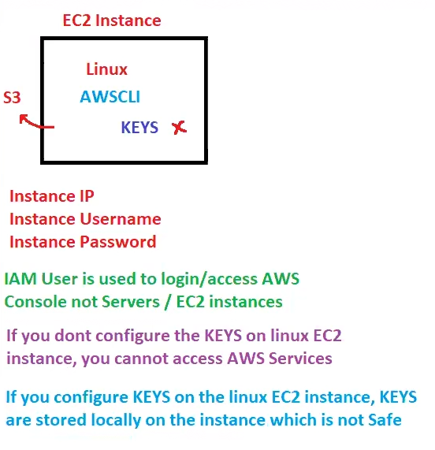

# Lecture 17

## IAM Roles

Without credentials we cant access AWS services!! on EC2 we want to connect to AWS CLI so for that we need to put keys!!but it is not recommended to put keys on the EC2!! then how to access S3 in  EC2??

### Solution -IAM Role
IAM role is temporary access without credentials!!

An IAM role is an AWS identity similar to IAM users with an identity-based policy specifying its access. However, unlike the IAM users, IAM roles can be used to provide access to any entity within or outside the AWS account. A role is not attached to a specific entity and can be used by multiple entities at the same time to get the required access.

IAM roles provide this access for a limited amount of time in the form of sessions. The maximum time for this session can be 12 hours. By default, the value for this session is one hour. Temporary security credentials are associated with each of these sessions, which expire when the session ends.

Suppose we created role AnkitRole and he wanted to access S3 so we give S3 policy to AnkitRole and this role is attached to Ec2 instance from where you will access S3!!

If you use roles we no need to configure KEYS on EC2 machine!!
Roles can be attached to any service like EC2 ,s3 or any service!!

1 EC2 instance has only 1 role attached at same time!

1 Role can be attached to multiple EC2 instance at same time!! 
---
### Idendity Provoder/Federation/Center

All this is related to SSO(Single Sign on). You have sign on single time!!

SSO is when you sign in to google!! and when you try to access any other website ! you sign in with google!! this is SSO!! you just use single sign in google ID!! thats the concept!

With your company account Sign in to IAM!! no need to created IAM user!! thats the SSO!!
no need of AWS credentials!! Your company need to be federated from AWS then only you can do SSO with your company credentials!!

This user is not IAM or root user !! this is Federated user!!
