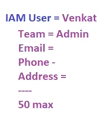

# Lecture 17

## IAM Roles

Without credentials we cant access AWS services!! on EC2 we want to connect to AWS CLI so for that we need to put keys!!but it is not recommended to put keys on the EC2!! then how to access S3 in  EC2??

### Solution -IAM Role
IAM role is temporary access without credentials!!

An IAM role is an AWS identity similar to IAM users with an identity-based policy specifying its access. However, unlike the IAM users, IAM roles can be used to provide access to any entity within or outside the AWS account. A role is not attached to a specific entity and can be used by multiple entities at the same time to get the required access.

IAM roles provide this access for a limited amount of time in the form of sessions. The maximum time for this session can be 12 hours. By default, the value for this session is one hour. Temporary security credentials are associated with each of these sessions, which expire when the session ends.

Suppose we created role AnkitRole and he wanted to access S3 so we give S3 policy to AnkitRole and this role is attached to Ec2 instance from where you will access S3!!

If you use roles we no need to configure KEYS on EC2 machine!!
Roles can be attached to any service like EC2 ,s3 or any service!!

1 EC2 instance has only 1 role attached at same time!

1 Role can be attached to multiple EC2 instance at same time!! 

---
### Idendity Provoder/Federation/Center

All this is related to SSO(Single Sign on). You have sign on single time!!

SSO is when you sign in to google!! and when you try to access any other website ! you sign in with google!! this is SSO!! you just use single sign in google ID!! thats the concept!

With your company account Sign in to IAM!! no need to created IAM user!! thats the SSO!!
no need of AWS credentials!! Your company need to be federated from AWS then only you can do SSO with your company credentials!!

This user is not IAM or root user !! this is Federated user!!

## Active Directory

In company we store email On Active Directory in Domain Controller And all Desktop connected to that active directory !!With help of Active Directory ,we no need to create user for each desktop , we just need to create in central directory called as active directory!

All this uses protocol called __LDAP (Lightweight directory active protocol)__

This active directory in AWS we call as __Directory Services .__

Active directory installed on server that server is called as __Domain Controller!!__

We have 100 users 500 ec2 machines!! user can login anywhere on any machine!! so all users should be registered on directory services!!Now user@boom.com needs to be login to AWS do that boom company needs to be federated with AWS!!

We use Okta and OAuth in real time!!There also we create user like we created in Active Directory and login by that !!

## AWS Organizations

As companies scale and expand, the need for efficient management and control over their digital infrastructure becomes increasingly important. This creates a need for isolation between different departments or business units within the organization. For that, companies create multiple AWS accounts, providing departments with dedicated environments to manage their resources independently. This solves the problem of isolated environments but poses the challenge of managing multiple AWS accounts. To make this management easier, AWS provides us with a management service called AWS Organizations.

We can manage multiple root accounts with this!!

__AWS Organizations__ is an account management service that we can use to manage multiple accounts under one roof. It allows us to group multiple accounts and Organizational Units (OUs) under one root account and then centrally manage all of them using the root account.

This helps manage accounts more easily by consolidating billing and allowing us to use a savings plan across all accounts. We can also share common resources within these OUs.

we need to login to All 3 organization via one AWS account! so here we need to login via SSO!! so we use a service called Identity center where we create user! and from their we get URL through which we can access all organizations which she have access!!

here suchi is identity center user/federated user!! no concept of IAM user here!!
## Identity Center
IAM Identity Center, formerly known as Single Sign-On (SSO), is a cloud service offered by Amazon Web Services (AWS) that simplifies the management of access to AWS accounts and applications. It enables users to sign in once with their existing corporate credentials and access multiple AWS accounts and applications without the need for multiple sets of credentials.

### How IAM Identity Center works
IAM Identity Center uses IAM roles to give the requesting entities permissions to AWS services/resources. We start with assigning a permission set. For each permission set IAM Identity Center creates an IAM role with the corresponding policies in each account.

For the authentication part, we need to add an identity source in the IAM Identity Center. This source can be any one of the following:

- Identity Center directory: This is the default identity source where we can create users by specifying their usernames and passwords and then use these credentials for authentication.

- Active Directory: In case we're already using a directory to manage our users, we can set that as the identity source. The users in that directory will then be able to use their existing credentials to access the AWS account.

- External identity provider: Incase we're using an external identity provider to manage our users, we can configure our Identity Center to use that as the identity source.

When a principal makes a request, IAM Identity Center first authenticates the principal's credentials, ensuring that only authorized users can access the AWS environment. Upon successful authentication, the IAM Identity Center evaluates the request against the policies attached to the IAM entities, including users, groups, and roles. These policies define the permissions granted to each entity, specifying which actions they are allowed or denied on specific AWS resources.

IAM Identity Center carefully examines the request context, considering factors such as the actions requested, the resources involved, and any environmental data provided. Based on this evaluation, IAM Identity Center determines whether the request should be allowed or denied. This robust authentication and authorization process ensures that access to AWS resources is tightly controlled and aligned with organizational security policies. Additionally, IAM Identity Center provides detailed logging and auditing capabilities, allowing organizations to monitor access activity and enforce compliance with regulatory requirements. Overall, IAM Identity Center plays a crucial role in maintaining a secure and well-governed AWS environment by centralizing identity management and access control.

## IAM Tags
Tags of jeans have price ,brand ,size etc ,so tag has information!! so EC2 machines also have tag!!

Suppose we created user named Ankit!! We have multiple Ankit !! better give a tag to them !! Tags are key value pair like
(price,10k)

For a resource we can have 50 tags!!Tags is for entire AWS!!

500 IAM User ,now need to delete all DB admins ,so to know that we use tag ,so one by one we see tag and delete one by one all DB Admins!! Thats hardwork!

Now smartwork is write a script in python to delete all DB Admins!!

To write script we use AWS Lambda!! we identify machines by Tags!

## Credentials Report
 to generate report of all User like whether they have password ,user and various other credentials!! it will download excel!

 ## IAM Access Advisor
 to know when a user last accessed the service!! just for auditing purpose!! 

this is complete IAM service

Every AWS account has Account ID (12 Digit ID)!

For account ID we give a alias to it!!Instead of remembering 12 digit ID you can just remember Alias!!

some extra user wants to access so we give temporary access by IAM Role and then user can access by URL!! by default user can access URl for 1 hour and access only The service which we have given permission!!

We give inline policy for him so that he can have limited access!!

when user is login in his account he has option on top right corner of switch role!! then he just need to give AccountName and RoleNAme then he will be switched to Our Account!!