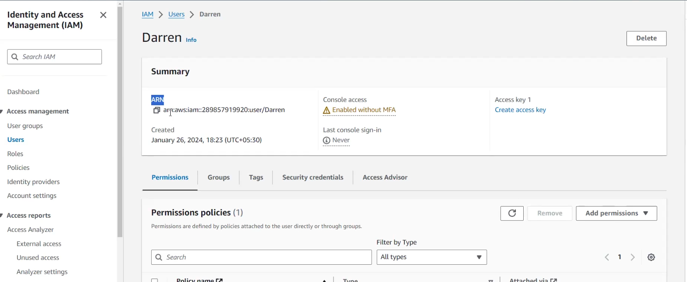

# Practical on IAM

Must have AWS account!! if not have AWS account then ask friend to create IAM user!!

## Sign in with IAM user

for accountID we have Alias of it!!

MFA code for all!!

AWS console!!

Search for IAM and you get it!

see here click on red mark icon!!CLI to run AWS commands directy!!

Click on that red mark

AWS CloudShell is a browser-based, pre-authenticated shell that you can launch directly from the AWS Management Console. You can navigate to CloudShell from the AWS Management Console a few different ways. 

you click on? it will lead to AWs support 

Basic support is free !!
we need to create case for any support we need!!

Technical support not available in basic plan!!

Here you can see its IAM user not user!! on that you can see AccountID!! see below image!!

max Ec2 instance you can create is 20 in fresh account!! all that info yu can see in Service Quotas!!

lets see IAm service!!

Every service has its own dashboard

see security recommendations we need to rotate the keys after a year!! so that old one is not used again!!

see here you need to create alias !! this should be unique!!

>Note:
see the selected one is IAM user sign in link!! All The IAm user of that root user will use same sign in link!! as all member of home use same link to go into a home!!

>alias will not take name give something like mohitCloud!! don't just give name!

On clicking on left side Users you will be able to see all users!!

  
## Steps to create IAM user
Step 1: Sign in to the AWS Management Console
Go to the AWS Management Console and sign in to your AWS account.

Step 2: Navigate to IAM

You can see the Dashboard we have seen before:

Step 3: Access the Users Page
In the IAM dashboard, click on “Users” in the left navigation pane.

Step 4: Add User
Click “Add user” to begin creating a new user.

Step 5: Enter User Details
Provide a username for the new user.

In this process, if you wish to create a user with access to the AWS Management Console, you must enable the checkbox that provides access to the console. However, if you do not need access to the console and only require a programmatic user, you can leave the checkbox disabled and proceed with the other steps.

We first generate autogenerated password and then user will be forced to put his own password when he first login!! 

Step 6: Set Permissions
In the permissions step, you can either add the user to an existing group, attach policies directly, or skip this step to add permissions later.

Here, I’ll attach a policy directly as follows. When you choose to attach a policy directly, you’ll see a list of predefined policies. You can select one or more policies based on your specific requirements. In this example, I will attach the “Access to S3” policy, which grants the user access to AWS S3 features.

These orange color cube tells aws managed policy and rest are customer managed policy!!

If you’re not satisfied with the predefined policies or they don’t match your specific requirements, you have the option to create a custom policy by clicking the “Create policy” button. This way, you can define a policy that aligns with your exact needs.

Step 7: Review and Create
Review your configuration, and click “Create user” to complete the process.

Step 8: See the User Details

------------------

While creating user adding policies you see filter

AWS managed and customer managed we know

based on job you have we have policies called AWS managed-job function like gor DBA what kind of policy we need and so on for other type of jobs!!

see above according to different roles different policies are selected!! If selected administrative access, then the account already have all permissions!!  Also we have boundary permissions which tells how many permission max you can have on a user!!

> Password will be visible only one time !! copy it somewhere or download excel!!

### User created

ARN --> Amazon resource name

You can see everything you have put !!We have only used managed policy !! not inline one which is written in AWS!! 

> You can attach at max 10 policy to user

## Creating an IAM Group👥
Creating an IAM group consolidates permissions for multiple users:

Step 1: Navigate to Groups
In the IAM dashboard, choose “Groups” from the left navigation pane.

Step 2: Create Group
Click “Create group” to initiate the group creation process.

Step 3: Add Users
Select users to add to the group. Group permissions will apply to all members.

Step 4: Attach Policies
Associate policies that define group permissions.

Step 5: Review and Create
Review the group details and click “Create group.” Then you can see your group is created Successfully.

On Users > select a user > Groups --> here you can change group properties or directly going to group from left side!!