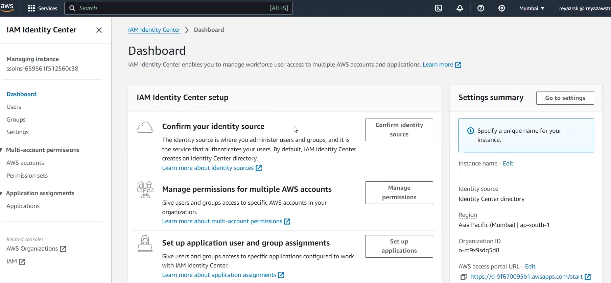

# Lecture 19

Yesterday seen user and user groups 
Now we see IAM roles!! Roles are temporary access without credentials!!

In IAM we can create a role!! Roles is used when we do not want to keep keys in ec2 machine but want to access some AWS services through it!

The entity to which role is attached is called as __Trusted Entity__ ,in our case ec2 is trusted entity!!

Suppose we want to lambda to stop ec2 !! but lambda do not have permission to use ec2 !!

> Two services can not communicate with each other 

> To give any service access to another service we use IAM role!!

### Usecase of IAM role
- For services giving access Use IAM role!!
- For users to access AWS services temporily without credentials!!

IAM User is just login and permission with credentials!!

## Creation of role
 when create a role clicking on create role 

This is next page you get and so select what you want to attach role!! AWS service or account (we can give temporary permission to any user so he can login without crednetials)!!

we generating role for ec2 so AWS service and then on use-case select ec2!!

then click on next we need to give permission which service ec2 want to access so we give access to S3!!

then next give name and then finish!!

> to whom role is attached is trusted Entity!!

If giving IAM role to user you go to role and see URL as below

this url you give to user so he can login!!

or with Nitish account he login then on to right where account info is shown click that then switch role!! then add details!

Suppose Nitish is deleteing all data so now you can also revoke his all sessions too!!

## Policies associated with an IAM role
There are mutiple policies associated with an IAM role that dictate the scope of permissions of the role and the entities that are allowed to use the role. These policies are as follows:

- Trust policy: This is a resource-based policy that specifies the entities allowed to assume an IAM role.

- Permissions policy: This is an identity-based policy that specifies the permissions of the role.

>Note:An IAM role can have multiple permission policies attached to it, but there can only be one trust policy attached to it. Also, we can create an IAM role without a permission policy, but specifying a trust policy is required during the creation of an IAM role.

## Principal entities for an IAM role
Only the entities that are specified as the principal entities in the trust policy of an IAM role can assume that role. These principal entities are of multiple types. The types of principal entities for an IAM role are as follows:

- AWS services: An AWS service cannot use another service without proper authorization. That authorization is provided using the IAM roles. The Principal element of the trust policy is set to the service principal of the service in this case.

- IAM identities: Both IAM users and IAM roles can assume an IAM role to get the permissions provided to that role. The Principal element of the trust policy is set to the ARN of the IAM identity in this case.

- AWS accounts: Both the current and external accounts can use an IAM role to get the associated permissions. In this scenario, the Principal element of the trust policy is set to the ID of the account.

- Web identities: Users authenticated by specific external web identity providers can also be the principal entity for an IAM role. In this case, the Principal element of the trust policy is set to the DNS of the identity provider.

- External users: External users authenticated by an external identity provider (IdP) service that is compatible with SAML 2.0 OpenID Connect or a custom-built identity broker can also be specified as the principal entity in the trust policy of an IAM role.

## How IAM roles work

Following is the sequence of steps illustrating how a principal entity utilizes the IAM role:

- Assuming a role: An entity can assume an IAM role by making an AssumeRole API request or by assuming the role using temporary security credentials provided by another trusted entity.

- Temporary credentials: When an entity successfully assumes an IAM role, it receives temporary security credentials consisting of an access key ID, a secret access key, and a session token. These credentials are valid for a limited duration specified by the role's configuration.

IAM roles are powerful tools for managing access to AWS resources securely. By understanding their purpose and components, we can effectively leverage IAM roles to grant temporary, fine-grained permissions to entities within and outside our AWS account, ensuring secure and efficient resource access.

## IAM Policies

These policies can be categorized into two types:

- Managed policies: These are discrete identity-based policies that exist independently of any other IAM resource. Managed policies can be attached to multiple IAM resources at the same time. Managed policies are further categorized into two types:

    - AWS-managed policies: These are pre-built policies that are created and managed by AWS. These policies are ready to use but are less flexible as they cannot be modified.

    - Customer-managed policies: These are the identity-based policies that we create and manage in our AWS account. As they are custom-built policies, we can draft and modify them according to our own specific requirements.

- Inline policies: These are custom policies drafted during the creation of an IAM resource. Inline policies are attached with the IAM resource they are created with and get deleted when that resource is deleted.

### Policy Structure

The JSON document of an identity-based policy can have the following elements:

- Version (optional): Indicates the IAM policy language version being used.Always include

- Id (identifier of policy)

- Statement (required): Contains the core elements of the policy. It is an array that contains the groups of these core elements in the form of array elements. It can contain the following elements:

    - Sid (optional): Used to write the description of an individual statement array element. Its value should be a string. It must be unique within the policy.

    - Action (required): Contains the list of actions to be allowed or denied. This list can contain any of the AWS-defined actions that specify a specific action related to an IAM service.

    - NotAction (optional): Contains the list of actions not to be allowed or denied. It is the inverse of the allowed action. A single statement element can contain either Action or NotAction and requires at least one of them to be present.

    - Effect (required): Specifies if the Actions/NotActions are allowed or denied. Its value can either be Allow or Deny.

    - Resource (required): Contains the list of AWS resources’ ARNs to which the statement is providing or preventing access. if put * then all resource!

    - NotResource (optional): Contains the list of AWS resources’ ARNs to which the statement is not providing or preventing access. A single statement can contain either Resource or NotResource and requires at least one of them to be present.

    - Condition (optional): Contains conditions that must be met for the statement to take effect.like user can do action of this policy by specific IP

On below roles we have Policy let's create Policy!

we want to create user who can create and update user and create and update group!so we need to create policy for them!!

Then need to specify permissions!! no need to write JSON!! just select!! first we select which service we want to use policy!! so here we use IAM !!

> Remember you can read only after list so to create user and create group so use ListUser and ListGroup

In Read select GetUser GetGroup!

In Write CreateUser ,UpdateUser, UpdateGroup and CreateGroup Permission is used!!

Then Permission nothing

Then tagging no
 
Then Resources on which update action can be performed so choose specific!!You can add group and users!! on which action is performed!!

Then you can add conditions like user using this policy must be using MFA and of particular IP!!

Then on top if you click on JSON ,automatically you see JSON!!

then click on next give name and create policy!! Then to user attach policy!!

### Exanple Policy
ex:

Rad IAM

ex:

add and remove users from group (devlopers and operator only)

ex:

ec2 full access in region given

## Access Analyzer

Analyze permission for all IAm users, IAM roles!

## Credntial report 

Report of credntials for all IAM users

## Idendity providers

related to SSO!!

### Idendity Centre

to use this we must have two root accounts atleast!!

Suppose we have one management account and 3 mmeber account!All 3 member account are in Organization!

In idendity centre we give user Access to which member account he can login!

First go to organization!! it is not enabled by defualt!! just a button to enable it!
your main account is management account !! other account you need to add in organization as member account!!

now we go to IAM idendity center !! so arun joined company so we want to give access to member account!!

here users you see on left are not IAM users they are federated users or IAM idendity center user!! so there we create user Arun!!

then from left panel go to AWS accounts!! their you can assign account to the user Arun!!

with one user we can access mutiple member account!!

You can reset password or disable user!!