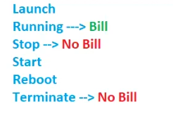
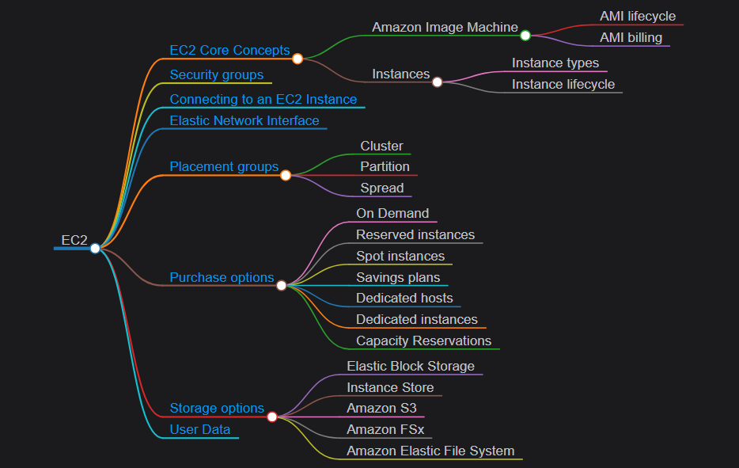
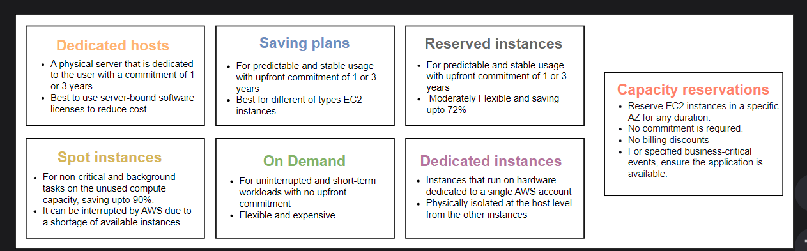
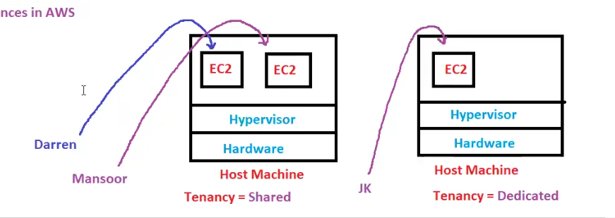
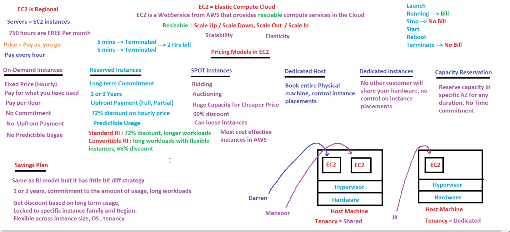
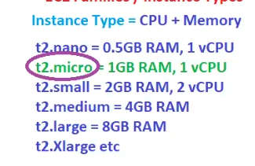
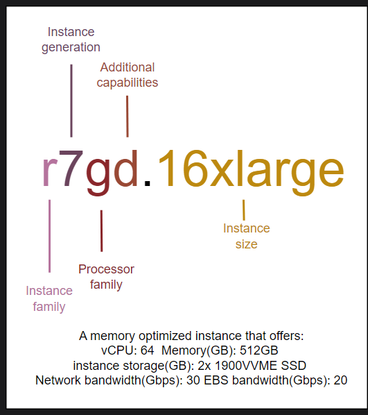
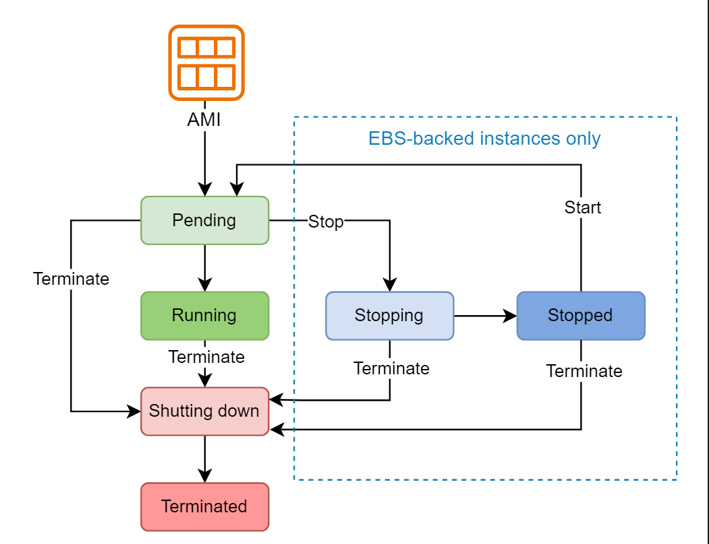

# EC2(Elastic compute cloud)

Amazon Elastic Compute Cloud (EC2) offers resizable compute capacity(thats definition of elasticity and scalability) in the cloud. It allows users to run virtual servers, known as instances, for various computing tasks. EC2 offers a broad set of servers with the latest processors, storage, networking, operating systems, and different purchase models, including pay-as-you-go. EC2 is a secure, flexible, and scalable solution, enabling businesses to easily deploy, manage, and scale applications without investing in physical hardware.
## Billing 
> IAM is free Ec2 is free for 750 hrs per month!In month there is 720 hrs!!750 hrs is for all Ec2 instances not for single Ec2! Ec2 is billable for every hour!EC2 is pay as you go model!!

Ec2 is only charge for Running state!!

Suppose you launch ec2 for 5 min and terminate and one more instance you launched for 5 min and termminate,what will you pay?

suppose you go to internet cafe and use for 5 min ans he charge 20rs for 1 hour so will he charge for 5 min? no !! he will charge for 1 hour only so likewise here also AWS will charge for 1 hour!! whether you use it or not!

you started one machine started for 5 min so 1 hr usage and then 5 min then also 1 hr usage!! so total 2 hr !!

Suppose you created 5 Ec2 instances then you use each for 1 hour so now you will be charged for 5 hrs!!

## Pricing models
EC2 is a commonly used AWS service. If not used wisely, it could affect deployment and the wallet. The different purchase options are provided to give customers flexibility, help match options to different workload types, and provide mechanisms for customers to reduce their EC2 costs. In this lesson, we will explore different purchase options offered by EC2, such as On-Demand, Reserved, Savings, and many more.

7 types of purchase options :
 - On-demand instances
 - Capacity Reservation
 - Reserved instances
 - Spot instances
 - Saving plans
- Dedicated hosts
- Dedicated instances

### On-demand instances
A commonly used purchase option that works on the pay-per-second model. An instance is launched as per the requirements with no future commitments. It gives complete control over the lifecycle of the instance from start to terminate. On-demand instances are used for uninterrupted and short-term workloads. However, it is not recommended to use on-demand instances for a highly available long-term application.

- No upfront payment(advance)
- fixed price
- no predictable usage as i can use 4Gb or 8Gb or anything
- Pay for what you have used

### Reserved instances (RI)
Reserved instance reduces the cost of EC2 by making a long-term commitment to consistent usage of a specified instance, including instance type and region. It’s the same as launching an EC2 instance on Demand or Reserved; however, the rates applied for reserved instances are lower. Reserved instances are essential for a business that has overly predictable and stable usage. For example, if an organization requires an M5 and G3 instances for stable usage for a year in us-east-1 for its developers, they should consider purchasing the required reserved instances for 1 year. Keep in mind that on-demand instances can be used to suffice the additional resource requirements.

- An important benefit of reserved instances over on-demand is that reserved instances have priority over on-demand instances. In case the instance capacity ever reaches its limit in an availability zone, Reserved instance users have high priority for launching instances. Amazon terminates the Spot instances to adjust the requested reserved instances.

- Long term commitment 

- here we have commitment we do upfront (advance) payment for 1 or 3 years!

- can do full payment or partial payment!!

- AWS can give up to 72 percent discount per hour!!

- Predictable usage

We have two types of RI
1. Standard RI
    - 72 percent discount ,for longer workloads 
2. Convertible RI
    - Converting from 4Gb to 8 GB machine then we use this!! offers 66 percent discount here!! 
 ### Spot instances

Spot instances are unused EC2 compute capacity that can significantly reduce the cost. Amazon provides spot instances for users to bid on the unused compute capacity available for less than on Demand price. Users can bid the maximum price for a particular instance type; a Spot instance will be available when it’s under the bidding price. The running cost of the spot instance is variable under the user bidding price, known as the Spot price. bid means auctioning!!

it's like  spot round of colleges!!

AWS has a lot of customer!! not all customer using every bit of capacity!! so that capacity is put to auction!!

AWS set a base price!! now all people will bid for higher price!!Huge machine we get for cheaper price !! we get 90 percent machine!! 

> You can loose machine at anytime!So should not put standard application here! suppose you bid a price 5 rs you think machine is yours now someone else came and put bid for 10rs so now that machine is theirs you will get a notification that your machine will be gone!!

Spot instances are terminated when the variable price goes above the maximum price or EC2 requires the instance to serve as an on-demand or reserved instance. The Spot price of each instance type in each availability zone is set by Amazon EC2 and is adjusted based on the supply and demand for Spot instances.

There are two types of spot requests: an on-time spot request or a persistent request.

- An on-time spot request is a type of request, once fulfilled, is removed.

- A persistent request stays for a specified amount of time, even if the request is fulfilled. It is important to cancel the spot request before terminating the instances for persistent requests. Otherwise, once the instance is terminated, the spot request will see that we need a specific number of EC2 instances that are not available. The initial spot request may create the EC2 instances again.

This option is useful for running non-critical applications that can be terminated and launched again. For example, batch processing, background processing, and optional tasks.

- Most cost effective model

### Dedicated hosts

on left we have shared where different users ec2 instances are on same host machine!! but some user says i want whole host machine!! thats dedicated machine!!

A independent flat is dedicated (private for you)!! more money!!

A PG or Hostel is shared! and very cheap!!

----

A dedicated host is a physical server that is dedicated to the user. It allows the user to have extensive control over the server, including sockets, VM software licenses, Windows Server, SQL Server, Red Hat Enterprise Linux, or other software licenses that are bound to VMs, sockets, or physical cores, subject to your license terms. Dedicated hosts offer Bring Your Own License (BYOL) support to resources.

It allows the user to run instances of different sizes up to the hardware limitations of the server. Users may share the additional resources with AWS.

- can control on EC2 instance placement !! like we have multiple host machine can tell which instance to run on which machine!!

### Dedicated instances

here we have dedicated instance!! You have dedicated instance but no control over host machine !! where to put which ec2 instance is not in our control!!No other customer will share your hardware!!

Dedicated instances are the instances that run on hardware dedicated to a single AWS account. Dedicated instances are physically isolated at the host level from the other instances that may belong to another AWS account. It does not offer hardware control or provide visibility or control over the instance placement.

> If an instance is stopped and started again, it’s possible that it’s launched on a different host. Dedicated instances provide limited BYOL.

For more visibility and control over the instance placement, it’s advised to use Dedicated hosts. Dedicated instances and hosts can be used to launch the instances; there are no performance, security, or physical differences between the two. However, Dedicated hosts offer more control and visibility of sockets, core, and host.

### Capacity Reservation
when  a script runs we want 100 8Gb machines !! you might get Out of capacity error by AWS!! as in a second you are asking for 800 Gb!!

Solution you can reserve the capacity !! no need to pay for reservation!!

You need to pay as usual when you use!!You can reserve capacity in AZ!!

An EC2 Capacity Reservation reserves EC2 instances in a specific availability zone. It allows to reserve instances without any commitment; thus it does not offer any discounts on the bill. However, it ensures the availability of the reserved instance in a certain AZ. There are two main types:

- On-Demand Capacity Reservations: These are good for critical workloads that cannot be interrupted. We pay for the reserved capacity regardless of the use, but it guarantees access to that computing power. These are normally used for business-critical events requiring more computing power than normal days. 

- Capacity blocks for ML: This is specifically for Machine Learning workloads that need GPUs and cannot be interrupted.

### Saving plans

very similar to reserve instances model!!same 1 or 3 years commitment!!

Saving plans provide low prices for EC2 instances in exchange for a long-term commitment. It can offer up to 72 percent off On-Demand in exchange for a commitment to a specific instance family in a chosen AWS region. For example R7 in Virginia, instance size and configuration between the family can be adjusted in a region.

> The key difference between Saving and reserved instances is that Saving plans don’t restrict a specified Availability Zone or a specific instance type, like reserved instances. Saving plans allow for change of instance size within the instance family or operating system or Availability Zone in a region. So good flexibility in saving plans!

## Cost Optimization
better than On demand use reserved in companies as gives discount and project of 1-3 years!!

## Exam Tip
- Question: A company needs guaranteed Amazon EC2 capacity in three specific Availability Zones in a specific AWS Region for an upcoming event that will last 3 weeks.

- Answer: Create an On-Demand Capacity Reservation that specifies the Region and three Availability Zones needed.

- Explanation: It’s important to note the pattern and design of the questions asked from the EC2 purchase options; there are three important factors: timespan, availability, and availability zones. Always look for these before making a conclusion. The time span of 1 or 3 years refers to Savings or Reserved if more flexibility is required within a Region and Instance family type than Saving plans else Reserved.

> Ec2 is regional service

> We launch Ec2 never create Ec2 instance
## Amazon Machine Image (AMI)
An Amazon Machine Image is a pre-configured image provided by AWS that contains the necessary information required to launch an instance. AMI serves as a template for the root volume that includes information regarding the operating system, application server, and applications.

## Instance type

Instances are categorized based on their computing power, memory, and networking capabilities. We select any instance type based on our requirements. When launching an instance, the instance type specifies the hardware of the server. Each type offers different computing power, amount of memory, and networking capabilities. Let’s look at the different types of instances below:

- General purpose: These instances offer a balance of compute, memory, and networking capabilities that can be used for a wide range of workloads.

- Compute optimized: These instances offer high compute power, making them ideal for intense applications that require intense processing.

- Memory optimized: These instances offer fast memory performance, specially designed for workloads that require large datasets in memory.

- Storage optimized: These instances are designed to offer high sequential read and write capabilities on local storage.

- Accelerated computing: These instances use hardware accelerators to offer complex calculations in a more efficient manner. They offer more parallelism for intensive workloads.

- High-performance computing: These instances are built to offer the best price-performance for high-performing compute instances. They are normally used to solve complex computational problems.

- Mac instances: These instances are used to build, develop, and test Apple applications.

Instance type = CPU + memory so type is combination of CPU and memory!!
t2 is a family!!

vCpu-->virtual CPU
after xlarge we have2Xlarge,3Xlarge and so on!!
in free tier we use t2.micro!!

>we want to scale up !! then we change the instance type!to t2.micro to t2.small!!

>While scaling up or down Data is never lost!as data is stored in volumes!!we only increase or decrease in CPU and memory!!

>to scale up and scale down you need to stop Ec2 so their will be downtime!!

It is important to identify different types of instances from each other. Instances types are named after family, generation, processor family, additional capabilities, and size. Let’s understand the nomenclature of instance types with an example. Consider an instance r7gd.16xlarge:
 
- The first position in the instance type name is used to refer to the instance family.

- The second position is used to represent the instance generation.

- The third position is used to represent the processor family in the instance.

- The last position before the period (.) i.e., the fourth position is used to highlight additional capabilities of the instance. After the period (.), the instance size is represented such as small, xlarge and etc.

## Burstable Performance Instances

Suppose we have t2.small which have 2vCPu so need more CPU's.
So we need to give More Cpu!!We cant give at runtime !! we need to have downtime!! so to avoid this downtime we need to enable Burstable Performance Instances!! which give you more CPU on runtime!! it is for limited time!! it use CPu credits given by AWS!!

- Billable

## Security Groups
 Security groups are like firewalls to the associated resources; they control the inbound and outbound traffic for an associated resource.

Security groups are used to secure EC2 instances from unwanted requests. We need to specify a security group to secure our EC2 instance whenever we launch an instance. If no security group is selected, EC2 uses the default security group of the VPC. The default security group has no inbound rules and allows all outbound traffic. 

### Security group rules
Security group rules control inbound and outbound traffic to the resource. These rules allow traffic filtering based on protocols, port numbers and IP addresses. Security group rules are always permissive, which means no port or protocol can be explicitly denied. The following rules control the incoming and outgoing traffic:

#### Inbound rules
Inbound rules are used to define incoming traffic to the associated resources.

- By default, all inbound traffic is denied.

- When multiple inbound rules apply to a traffic type, the rule with the most matching IP range, port, and protocol takes precedence.

- For example, common port numbers SSH (22) for secure remote access, HTTP (80) for web browsing, and FTP (20, 21) for file transfer allow traffic from anywhere IPv4 address (0.0.0.0/0).

#### Outbound rules 
Outbound rules define the outgoing traffic from the associated resource to the internet.

- All outgoing traffic from the associated resource is allowed by default.

- When different outbound rules apply to a specific traffic type, the rule with the most matching IP range, port, and protocol takes precedence.

When launching an EC2 instance, we can attach an existing security group or create a new one. We can also modify the existing security group and add new rules or remove some rules. We can also attach multiple security groups to an EC2 instance, where all the rules for each group are logically aggregated to create one set of rules. It helps to evaluate the traffic efficiently and properly.

---
#### Security group best practices#
- Least privilege principle: Adhere to the principle of least privilege, only allowing necessary traffic to and from instances.

- No deny rule: There is no explicit “deny” rule. If a rule is not explicitly allowed, it is denied by default.

- Separation of duties: Use different Security Groups for different purposes (e.g., web servers, database servers) to enhance security and management.
## Instance lifecycle
The lifecycle of EC2 transits through different states from creation to termination. It’s important to understand the behavior of instances to fully understand how EC2 works. An instance is a server in the cloud; naturally, it can be launched and terminated like a local server. However, EC2 instances can also be stopped, hibernated, rebooted, and retired. Let’s take a deeper look into the different states of EC2 instances.

- Launch: When an instance is launched from a selected instance type, its state is updated from pending to running. When the instance state is changed to “Running,” the instance has started booting. There might be a slight delay before we can do anything with our instance.

- Stop: Once the instance is running, we can stop and start the instance again anytime. It is important to note when an instance is stopped, the data stored in the RAM is lost and the instance may not have the same public IP but the private IP stays the same. The instance store volumes are also lost; AWS offers an alternative to preserve the data stored in the RAM using Hibernation.

    - Hibernation saves the content of RAM to the EBS root volume. It also preserves the other EBS volumes attached. During reboot, the contents of RAM saved earlier are again loaded into the memory.

- Termination: Once the work is done and we no longer require the instance, we can terminate the instance. Terminating an instance changes the state of the instance from “Running” to “Shutting down.” The instance can not be started again after it has been terminated.

## Revision
1. Can a IAm user create another IAM user? yes if the user have IAM permission!!