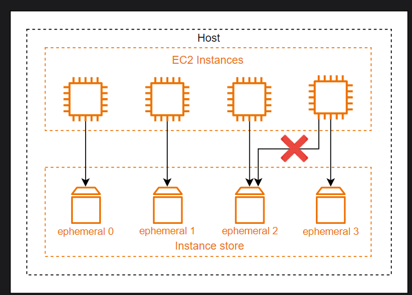
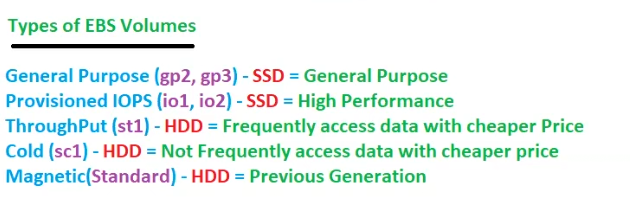

# EC2 continued

## Revision
Ec2 is regional as we know!!

In pricing model,in capacity estimation model ,we reserve capacity in a AZ.

In runtime ,Aws provide cpu credits automatically so you can use burstable instances!

Burstable instances are billable!!
## Storage Options

AWS offers flexible and easy-to-use data storage options for EC2 instances to meet all the requirements. Each option has its performance perks and cost. Some storage options offer persistent storage, while others provide fast temporary storage for the instance

### Elastic Block Store
Elastic Block Store (EBS) is a highly reliable, durable block-level storage volume that can be attached to the EC2 instances. Multiple EBS blocks can be attached to an instance. EBS storage attached to an instance after the launch can exist independently; however, the EBS volume attached by default while launching an instance is terminated with the instance. Default EBS volume can also be configured to exist independently. EBS offers different types of volumes based on different characteristics, such as gp2, gp3, io2 Block Express3, and io1. 

EBS offers backup through making point in times copies, also known as EBS snapshots. A snapshot in EBS is incremental, which means only the updated block is saved in the recent snapshot. The size of snapshots depends upon the size of the data backed up, and similarly, the cost of the snapshot is also based on the snapshot size rather than the volume size.

>EBS is a zonal service and can be attached to any instance in the same Availability zone. It is recommended for applications that require quick retrieval rates and continuous reads and writes.

### Instance store
An instance store is a temporary block storage for an instance physically attached to the host. Instance storage is also known as ephemeral storage. It is the fastest storage block available for EC2 since it is physically attached to the host, but not all the EC2 instance families support instance stores; for example C6 , and R6 EC2 families don’t support instance stores, while M5 EC2 instance family supports instance stores. Moreover, the instance store’s size depends upon the instance type. For example, m6id.large supports an instance of volume 1× 118 GB, and m1.small supports 1×160 GB.

An instance store can not be attached or detached once the instance is launched and only exists during the lifetime of the instance. It is important to note that no two instances can be attached to a single ephemeral storage. The instance store is ideal for temporary memory and cache, offering high read-and-write IOPS  and high-performance hardware.

### Amazon S3
An AWS S3 bucket is a scalable and durable object storage service that allows users to store and retrieve data from the internet. It provides a large storage and is designed for high availability and fault tolerance. S3 buckets can store various data types and specify access privileges according to the requirements.

### File storage 
EC2 instances are virtual servers in the cloud that can run applications and store data. File storage on EC2 instances involves creating, managing, and accessing files and directories within the storage attached to the instances. EC2 offers multiple file storage options to cater to different use cases and performance requirements, allowing one to choose the most suitable solution based on the application’s needs. Let’s take a look at the different file storage options available with EC2.
- Amazon FSx
    - Amazon FSx, a file storage service managed by AWS, simplifies the deployment and management of file systems. It provides two primary variations: Amazon FSx for Windows Server and Amazon FSx for Lustre. Amazon FSx for Windows File Server is a fully managed Windows file system with features such as high availability, data deduplication, and compatibility with AD. It streamlines file storage for Windows-based applications, including those hosted on Amazon EC2 instances, enhancing data reliability and accessibility.
- Amazon Elastic File System
    - The Amazon Elastic File System (EFS) is a user-friendly and scalable file storage solution that offers a dynamic adaptation of storage limits without impacting applications. This makes EFS an ideal choice for managing files without concerns related to server maintenance or storage capacity constraints. EFS allows simultaneous access by various EC2 instances across different AZs within the same region, facilitating a shared data source for applications operating on multiple servers.    

Volumes are Hard disk these volumes are basically EBS!!
Lets see EBS(Elastic Block Store)
# Volumes

EBS is persistent (permanent) storage!! if you stop and start instance data is not lost!! EBS is billable!! max size 16TB!!
 windows default size 30 GB and linux 8 GB default is free on top of that whatever you use is billable!
## EBS

2 types:
- root volume (we get by default when launching ec2 have OS )
- additional volume

Volumes anytime can be attached or detached !! max volume 16TB! can increase size of volume on fly but cant decrease!!

when you terminate an instance then only data is lost in ec2!!

- AWS offers several types of EBS volumes, including 
1. General Purpose SSD (GP2,GP3)
2. Provisioned IOPS SSD (io1,io2)
3. Throughput Optimized HDD (st1)
4.  Cold HDD (sc1).
5. Magnetic(standard)

 we know SSD is faster than HDD and we have  SSD 1st two!!these two have good performance!!

 default root volume type of Ec2 is GP2!! 

 for Db we use 2 .provisioned IOPS as need high performance!!

- Throughput refers to the amount of data that can be transferred in a given period of time. In the context of EBS volumes, throughput is important for workloads that involve large amounts of data, such as big data processing and log processing. The Throughput Optimized HDD (st1) volume type is specifically designed to provide high throughput for these types of workloads.

- IOPS (input/output operations per second) is a measure of how many read or write operations can be performed in a given period of time. In the context of EBS volumes, IOPS is important for workloads that require low latency, such as databases and other transactional workloads. The Provisioned IOPS SSD (io1) volume type is specifically designed to provide high IOPS for these types of workloads.

- Latency refers to the amount of time it takes for a data transfer or operation to complete. In the context of EBS volumes, latency is important for workloads that require low response times, such as databases and other transactional workloads. The Provisioned IOPS SSD (io1) volume type is specifically designed to provide low latency for these types of workloads.