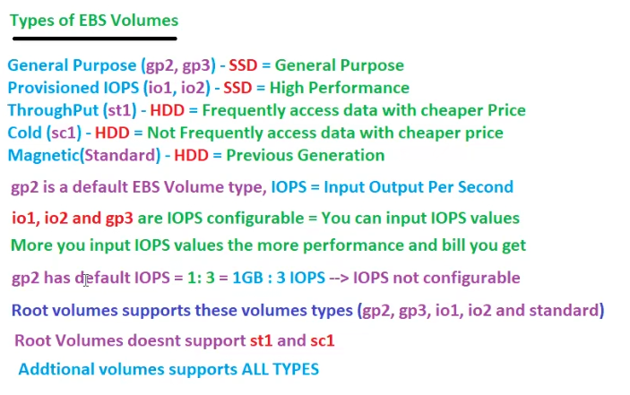
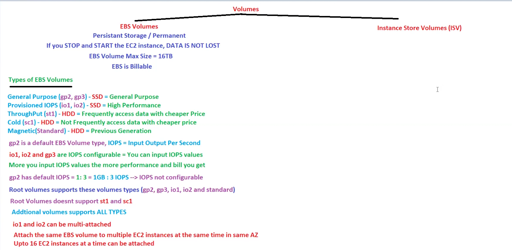
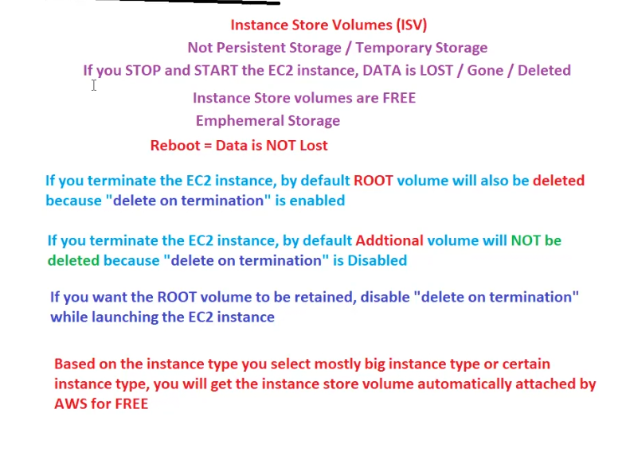
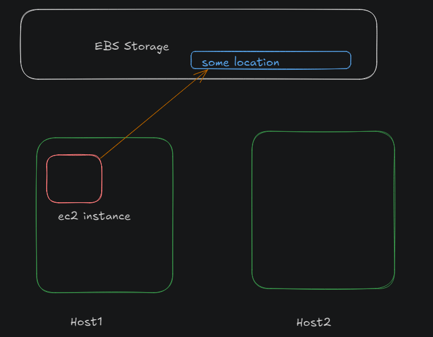
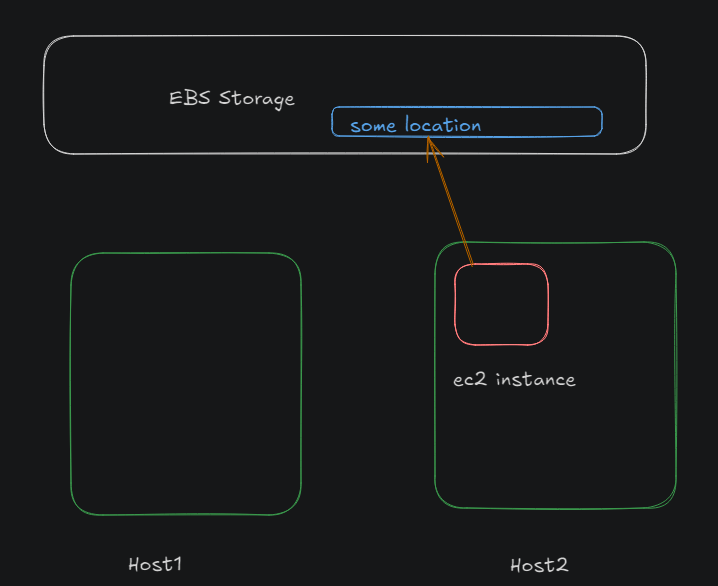
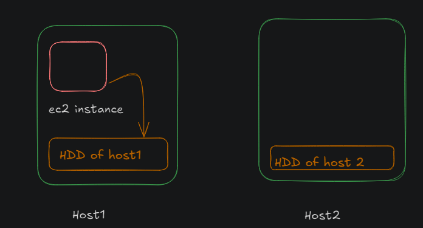
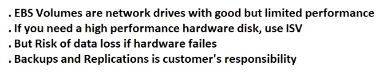
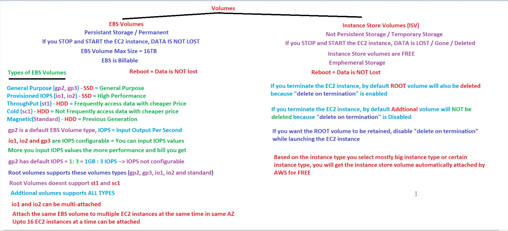
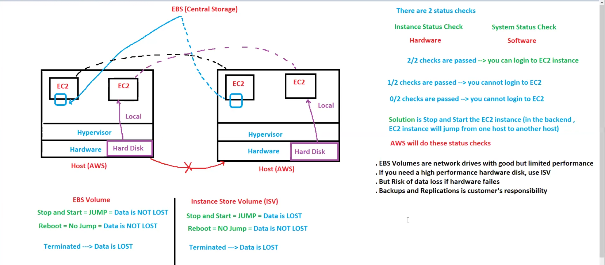

# EC2 continued

## Revision
Ec2 is regional as we know!!

In pricing model,in capacity estimation model ,we reserve capacity in a AZ.

In runtime ,Aws provide cpu credits automatically so you can use burstable instances!

Burstable instances are billable!!
## Storage Options

AWS offers flexible and easy-to-use data storage options for EC2 instances to meet all the requirements. Each option has its performance perks and cost. Some storage options offer persistent storage, while others provide fast temporary storage for the instance

### Elastic Block Store
Elastic Block Store (EBS) is a highly reliable, durable block-level storage volume that can be attached to the EC2 instances. Multiple EBS blocks can be attached to an instance. EBS storage attached to an instance after the launch can exist independently; however, the EBS volume attached by default while launching an instance is terminated with the instance. Default EBS volume can also be configured to exist independently. EBS offers different types of volumes based on different characteristics, such as gp2, gp3, io2 Block Express3, and io1. 

EBS offers backup through making point in times copies, also known as EBS snapshots. A snapshot in EBS is incremental, which means only the updated block is saved in the recent snapshot. The size of snapshots depends upon the size of the data backed up, and similarly, the cost of the snapshot is also based on the snapshot size rather than the volume size.

>EBS is a zonal service and can be attached to any instance in the same Availability zone. It is recommended for applications that require quick retrieval rates and continuous reads and writes.

### Instance store
An instance store is a temporary block storage for an instance physically attached to the host. Instance storage is also known as ephemeral storage. It is the fastest storage block available for EC2 since it is physically attached to the host, but not all the EC2 instance families support instance stores; for example C6 , and R6 EC2 families don’t support instance stores, while M5 EC2 instance family supports instance stores. Moreover, the instance store’s size depends upon the instance type. For example, m6id.large supports an instance of volume 1× 118 GB, and m1.small supports 1×160 GB.

An instance store can not be attached or detached once the instance is launched and only exists during the lifetime of the instance. It is important to note that no two instances can be attached to a single ephemeral storage. The instance store is ideal for temporary memory and cache, offering high read-and-write IOPS  and high-performance hardware.

### Amazon S3
An AWS S3 bucket is a scalable and durable object storage service that allows users to store and retrieve data from the internet. It provides a large storage and is designed for high availability and fault tolerance. S3 buckets can store various data types and specify access privileges according to the requirements.

### File storage 
EC2 instances are virtual servers in the cloud that can run applications and store data. File storage on EC2 instances involves creating, managing, and accessing files and directories within the storage attached to the instances. EC2 offers multiple file storage options to cater to different use cases and performance requirements, allowing one to choose the most suitable solution based on the application’s needs. Let’s take a look at the different file storage options available with EC2.
- Amazon FSx
    - Amazon FSx, a file storage service managed by AWS, simplifies the deployment and management of file systems. It provides two primary variations: Amazon FSx for Windows Server and Amazon FSx for Lustre. Amazon FSx for Windows File Server is a fully managed Windows file system with features such as high availability, data deduplication, and compatibility with AD. It streamlines file storage for Windows-based applications, including those hosted on Amazon EC2 instances, enhancing data reliability and accessibility.
- Amazon Elastic File System
    - The Amazon Elastic File System (EFS) is a user-friendly and scalable file storage solution that offers a dynamic adaptation of storage limits without impacting applications. This makes EFS an ideal choice for managing files without concerns related to server maintenance or storage capacity constraints. EFS allows simultaneous access by various EC2 instances across different AZs within the same region, facilitating a shared data source for applications operating on multiple servers.    

Volumes are Hard disk these volumes are basically EBS!!
Lets see EBS(Elastic Block Store)
# Volumes

Elastic Block Store (EBS) is a block storage service offered by AWS, designed to be used with EC2 instances for storing persistent data. Being a zonal service, EBS volumes are physically located in an Availability Zone (AZ), which is a distinct location within a geographic region. This design choice ensures that EBS volumes have low latency and high throughput when accessed from EC2 instances in the same AZ.

EBS volumes are engineered to be resilient, meaning they can automatically handle failures within the volume itself through redundancy and replication mechanisms. This resilience ensures data durability and availability under normal circumstances.

However, EBS’s dependency on a single AZ introduces a risk: if the entire AZ faces issues such as power outages, network disruptions, or natural disasters, the EBS volumes within that AZ can become inaccessible or suffer data loss. This highlights the importance of implementing disaster recovery strategies, such as backing up data across multiple AZs or regions, to mitigate the risk of AZ-level failures.

EBS is persistent (permanent) storage!! if you stop and start instance data is not lost!! EBS is billable!! max size 16TB!!
 windows default size 30 GB and linux 8 GB default is free on top of that whatever you use is billable!

 EBS volumes are like hard drives that can be mounted to the EC2 instances for additional storage. We can mount multiple volumes to a single instance. By default, a root volume is attached to the EC2 instance, which is not persistent. This means we lose the data in the default volume as soon as we terminate the instance. Any additional EBS volume mounted to the EC2 instance retains the data independent of the EC2 instances’ state. Therefore, we can always access the data in an EBS volume by mounting it to another EC2 instance if the volume is not formatted.
## EBS

2 types:
- root volume (we get by default when launching ec2 have OS )
- additional volume

Volumes anytime can be attached or detached !! max volume 16TB! can increase size of volume on fly but cant decrease!!

when you terminate an instance then only data is lost in ec2!!

- AWS offers several types of EBS volumes, including 
1. General Purpose SSD (GP2,GP3)
2. Provisioned IOPS SSD (io1,io2)
3. Throughput Optimized HDD (st1)
4.  Cold HDD (sc1).
5. Magnetic(standard)

 we know SSD is faster than HDD and we have  SSD 1st two!!these two have good performance!!

 default root volume type of Ec2 is GP2!! 

 for Db(extreme read write) we use 2 .provisioned IOPS as need high performance!!

- Throughput refers to the amount of data that can be transferred in a given period of time. In the context of EBS volumes, throughput is important for workloads that involve large amounts of data, such as big data processing and log processing. The Throughput Optimized HDD (st1) volume type is specifically designed to provide high throughput for these types of workloads.
 
    when using frequently accessible data we use Throughput Optimized HDD

- IOPS (input/output operations per second) is a measure of how many read or write operations can be performed in a given period of time. In the context of EBS volumes, IOPS is important for workloads that require low latency, such as databases and other transactional workloads. The Provisioned IOPS SSD (io1) volume type is specifically designed to provide high IOPS for these types of workloads.

    Here just need to tell how many IOPS we need in number,IOPS is configurable!!

- Latency refers to the amount of time it takes for a data transfer or operation to complete. In the context of EBS volumes, latency is important for workloads that require low response times, such as databases and other transactional workloads. The Provisioned IOPS SSD (io1) volume type is specifically designed to provide low latency for these types of workloads.

### General purpose SSD volumes
The general purpose is based on Solid State Drives (SDD). SDD volumes are optimized for IOPS, best for workloads involving frequent read and write operations. They are particularly helpful when the I/O payload size is small.

General-purpose volumes are typically used for testing and development. They can also store log files or small-scale applications where average latency is acceptable and data is not accessed frequently.

We have two types of general-purpose volumes: gp2 and gp3. The gp2 volumes implement a credit mechanism to determine the amount of IOPS it can perform. Let’s understand the mechanism. 

### Provisioned IOPS volumes
As the name suggests, provisioned IOPS volumes are optimized for provisioning IOPS. These volumes are ideal for use cases requiring more than baseline performance where we want to perform frequent read-write operations. Thus, they are commonly stored in large relational or non-relational databases such as MySQL and more.

Provisioned IOPS volumes allow us to adjust the IOPS independent of the size. However, they are limited by the per-instance performance, which is the maximum performance provided by the EC2 instance to which the volume is mounted.

There are two types of provisioned IOPS systems, io1 and io2 block express. The io2 express is a step ahead of io1 in performance. Provisioned IOPS volumes are helpful when we need sub-millisecond latency and high performance for smaller volumes.

> io1,io2 and gp3 are iops value configurable!! you need to tell how many IOPS you need!more iops means more bill!!

### Throughput-optimized HDD volumes
Hard disk drives (HDD) are optimized for throughput. Thus, they are commonly used in scenarios where we have a large size of synchronized I/O.

Throughput-optimized HDD volumes, or st1, offer a maximum of 500 IOPS; however, the payload size is up to 500 MB, which means it can transfer a maximum of 500 MBs of data in one second. They are suitable for scenarios where data is read or written in large, sequential chunks, and the emphasis is on sustained data throughput rather than low-latency random access. For example, we might use them for big data, log processing, or data warehousing.

### Cold HDD volumes
Cold HDDs are optimized for costs. Cold storage in the context of data storage typically refers to a type of storage that is optimized for long-term retention of data at a lower cost compared to more frequently accessed or hot storage solutions.

Cold HDD volumes, or sc1, are designed for infrequent or cold workloads where lower-cost storage is prioritized over high-performance, frequent access. Cold HDD volumes are suitable for specific use cases where the data access pattern is infrequent and the workload can tolerate higher latencies.

It is commonly used as a backup storage, data snapshots, and archival. For example, consider a company with regulatory requirements for data retention. They can conveniently use Cold HDD volumes as they are more economical.

>Note:
 root volume supports gp2,gp3,io1,io2,standard!!Additional volume support all !!

 

 >Important:
 1 volume can be attached to multiple ec2 instances at same time ? No,generally!! but io1,io2 can be attached to multiple ec2 as it recently came!! 1 volume(only io1 or io2(majorly provisioned)) can be attached to 16 ec2 instances!!

## Instance Store Volume(ISV)
non-persistent/temporary unlike EBS!!If you stop and start ec2 instance data is lost or gone as these are temporary storage!! these are free(__no bills__)!!

Also called as Emphemeral (spelled as Afimiral) Storage!!

when you terminate ec2 automatically root volume is deleted as the option is enabled by default!! but additional volume will not be deleted!!!for additional volume ,__delete on termination__ option is enabled!!

if you don't want root volume delete then just disable  delete on termination option!!

>EBS max size 16TB!! Since ISv are free we cannot create it !!it will be created by AWS automatically!! no control by us on it!! it is for bigger machines then AWS give it!! not small machines like t2.micro you will not get!!

in EBS if you reboot data is not lost!!  in ISV too data is not lost!! lets see the difference between two!!

There logic in AWS if you stop and start ec2 instance ,ec2 instance will jump from one host to other!!EBS is central storage just like a pointer pointing to central storage location!!

Initially

After stop and start and jump

EC2 instance on host 2 but EBS is central storage !! its pointing to same location as of before!! so data is not lost!!

Now if you reboot the ec2 instance not jump ,its on same host machine!! so in both cases in EBS data is not lost!!

> In EBS no data lost if you reboot or stop and then start!

Now lets see ISV!
ISV is not central a part of hard disk of host is put as a ISV!

Now if reboot!no jump so no data loss

but if stop and start then jump and so new Host so previous data lost!!

terminate --> data is lost for both 

when we launch AWS ec2 instance !! AWS do 2 status check!!
1. Instance Status check --> checks hardware
2. System status check --> checks software whether ip assigned properly or not!!

these 2 checks need to be passed!!sometime you get 1/2 or 0/2 checks !! you should get 2/2 if you want to login!!

> to solve see sometimes host machine condition is not good!!so stop and start so that it will jump from one host to other!

Another solution is you click on recover for EC2 instance!!

performance ISV or EBS?

EBS is attached via internet to ec2 but ISV is in the system so ISV gives better performance!!as physical drive on host!!

## Summary

