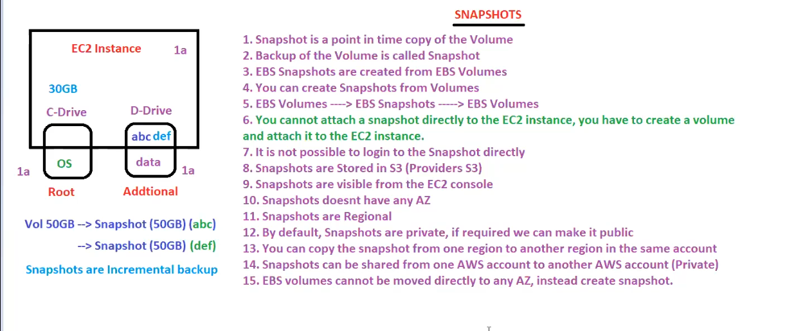
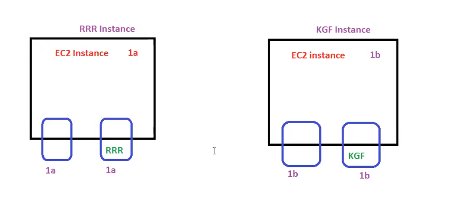

# EC2 continued
## Snapshots

### EBS snapshots
EBS snapshots are the backups of the EBS volumes(whether root volume or additional volume) at a particular instant. 

Snapshots are typically stored in an S3 bucket, only accessible through the S3 API or AWS CLI. They contain the entire information required to restore the data in an EBS volume.

EBS snapshots are incremental. This means we only take snapshots of the data added after the most recent snapshot to save time and storage space. Therefore, the first snapshot is a full snapshot of all the blocks in the volume. The next snapshot would be an incremental snapshot of only the blocks added or modified after the last snapshot. 

Root volume in windows is C drive and D drive is additional volume!!

we have data "abc" on D drive. we want to take backup so we take snapshot of it and suppose volume size is 50Gb then snapshot size will be too 50 GB.

Now see someone added "def" to D drive !! so now it wont be reflected in snapshot for modification !! you need to take another snapshot!! now again this snapshot will be 50 GB? no this snapshot will only have changes like we have on git!!
so storing only changes after 1st backup (1st snapshot takes full backup) is incremental backup!!

from snapshot when we restore we get a volume again!!from snapshot we create volume!!

we get all the data at the time when we create snapshot!!so snapshot are called as point in time backup!!

EBS snapshots provide multiple features to lock a snapshot and protect it from malicious activities and deletion, monitor the snapshot locks, and copy a snapshot. In short, EBS ensures that our data is recoverable and safe.

EBS snapshots are regionally resilient. The duplicates of snapshots are stored across multiple AZs in a region, so if one AZ fails, another takes over. We can use snapshots to restore the data in other AZs and to migrate the data.

Snapshot are not in any Availability zone!! but the volume you create from snapshot are in that particular AZ from where snapshot is taken from!!

If ec2 is regional then whatever we discuss in ec2 is regional so volume ,snapshot are regional!!

By default snapshot are private ! if required , you can make it public!!The snapshots can be copied from one region to other!!so now the volume will be created from copied snapshot will be in that particular region of coped snapshot!! 

Also you can share snapshot across AWS accounts!! even you have shared still the snapshot will be private!

 

ISV(instance store volume ) are created from a template stored in S3!!

to create a snapshot we no need to create EC2 instance so no downtime required!!

suppose we have 100 volumes but need only 60 volumes snapshot ,how will you do that?? to identify 60 volumes we use tags!! to take backup of 60 volume ,we use lambda(write code)!! but now AWS came up with service called __data lifecycle manager__ where you just tell this tag at this time ,please take snapshot!! __data lifecycle manager__ is used to create snapshot automatically!!

there is a time after which backup is deleted called as retention period !!After retention period ,snapshot be deleted!!

> initial backup is of same size as of EBS rest all have changes as this is incremental backup 

suppose we install jenkins and jenkins installed in root volume as C drive!! so now jenkins not used from 7-8 months
so thats our new concept

### EBS snapshot standard and  archive tier
That snapshot which not used in some time are moved to archive tier as it is 75 % cheaper!!

the regular tier we were using is standard tier!

to get back from archive tier to standard tier we need to restore the snapshot from archive!! it takes 24 to 72 hours to restore!!

### Recycle Bin
delete a snapshot it goes to recycle bin!! recycle bin we can set the retention period after which snapshot will be deleted from recycle bin!!

retention period can be here from 1 day to 1 year!!
### Fast Snapshot Restore (FSR)

from 100Gb snapshot we need to create volume,after getting volume it will further take some time to initialize,but using FSR it will be faster ,it will be billable as faster!!

EBS volumes lazily restore volumes from an S3 bucket. If we try to access any block of data that has not been loaded yet, EBS fetches it from S3 urgently. However, this is not as quick as reading directly from the EBS volumes.

EBS snapshots offer Fast Snapshot Restore (FSR) to resolve this issue. It instantly restores a fully initiated EBS volume from the snapshot, eliminating the I/O latency when it is first accessed.

> To leverage FSR, we must explicitly enable FSR for the snapshot and specify an availability zone. Upon restoration from that snapshot, a fully initiated EBS volume is restored in the specified availability zone.

By default snapshot are not encrypted!! but we need some security for snapshot!!

decryption is completely handled by AWS!!

non encrypted gives non encrypted generally!!
but if we want to get encryption on non encrypted something (like encrypted snapshot from non encrypted volume) so for this we have a copy option!!

>All keys in AWS is managed by KMS(key management service).Access and secret keys which we have used to access CLI are not present here ,here only encryption keys are present!!

Default encryption key  for s3 is aws/s3 ,for rds is aws/rds
### EBS encryption
Amazon Elastic Block Store encryption is a feature that allows us to encrypt our EBS volumes and snapshots using industry-standard AES-256 data encryption. It uses AWS Key Management Service (KMS), a service that allows us to create and control encryption keys. Encryption occurs on the host EC2 servers, which protect data at rest and in transit. The following data is encrypted in EBS encryption:

- Data at rest inside the volume

- Data in transit between the volume and the instance

- Snapshots created from the volume

- Volumes created using encrypted snapshot

You cannot share encrypted snapshot as for that to decrypt that snapshot you need to share the keys!!

## Summary till now

Lets now talk about images

## Images

Suppose you have to install OS on 10 machines ,now after installing on a machine ,we take copy of that OS that i s called as image and in AWS we call it as AMI(Amazon machine image)!!

we can say template of OS is AMI !!
To launch ec2 we need 7 steps !! in that we have pre defined AMI's which has OS!!

### Amazon Machine Image (AMI)
An Amazon Machine Image is a pre-configured image provided by AWS that contains the necessary information required to launch an instance. AMI serves as a template for the root volume that includes information regarding the operating system, application server, and applications.

An AMI must be specified to launch an instance; multiple instances can be launched from a single AMI. We can also create our AMIs, and we can copy an AMI from one region to another and deregister an AMI when no longer needed.

There are multiple types of AMIs based on the

- Operating system: For example, Amazon Linux 2 AMI and Microsoft Windows Server 2019 Base AMI are two different AMIs based on different operating systems.

- Regions: AWS offers different AMIs based on the region; AMIs can be transferred from one region to another. It is important to note that transfer between distant regions would take more time. Hence, it would take a long time to launch the EC2 instance.

- Architecture (32-bit or 64-bit): AWS offers various AMIs for different types of architecture, such as Ubuntu 20.40 LTS for 64-bit architecture and Amazon Linux for 32-bit architecture. It is important to note that AWS also offers Amazon Linux AMI for 64-bit architecture as well.

- Launch permissions: Each AMI has predefined launch permissions set by its owner. It is used to determine the availability of that AMI. There are three types of launch permissions

     - Public: Available to all the AWS accounts.

    - Explicit: Available to specific AWS accounts, organizations, or organization units.     

    - Implicit: Available only to the owner.

- Storage for the root device: AMIs are also categorized based on the root storage for the instance. Each instance either has an Amazon EBS or an Amazon instance store as a root device. The root device, for instance, is Amazon EBS, when the volume created is from an Amazon EBS snapshot. Similarly, the instance launched from an AMI has an instance store volume created from a template stored in Amazon S3.

we can have plain OS and OS installed with some software like jenkins,sql server 

Backup of volume is called snapshot!!
AMI is backup of entire EC2 include volume, OS and everything else

we launched ec2 amd then we installed tomcat on it now we created AMi of it now from this AMi we can create ec2 again now this ec2 will have tomcat on it !! its custom AMi!!

AMI like Snapshots are stored in S3!! 

>S3 is global
#### AMI lifecycle
We can create, manage, or delete our own AMIs. We can create different types of AMI, as we discussed above, such as Amazon EBS or instance store-backed. We can also modify the AWS marketplace AMI to our needs and register it to launch multiple instances from it. There are six stages of the AMI lifecycle, from creation to depreciation, lets take a look at them in the illustration below.

After creation, an AMI’s description and sharing properties can be modified, but core content like volume and binary data cannot be modified.

AMi's doesn't have any AZ as it is just a backup!!

>By default AMI's are private , although we can make it public

An AMI can be marked as deprecated to warn users and prevent launching new instances. Existing instances based on deprecated AMIs are unaffected and can run normally. Finally, AMIs can be deregistered to remove them completely, but running instances will continue to be charged.

##### Just read it!!

we want some software which is not easily configurable!! so these companies create AMI with there software installed and configured !! all these customized AMI by companies are present in MarketPlace!!

>custom AMI's which are created automatically by Ec2 image builder are called as Golden AMI's

> Os is stored in Root volume which can be EBS as well as ISV!!

Images are backed by either EBS volume or Instance store volume!!

when you created image from ec2 ,there will be parallel snapshot taken of volume! eg if 2 volume than 2 snapshots will be made in parallel!

>No need to take image only after stopping ec2 but it is recommended to stop and then take snapshot!!
#### AMI billing 
AWS offers multiple AMIs to launch different instances; these AMIs support various operating systems architectures and offer different features. It is important to understand their effect on the AWS bill. AMI cost depends upon the OS and different features offered by the respective AMI. It is important to understand the cost of AMIs before launching instances.

## Question

RRR movie instance in 1a AZ and KGF instance in 1b instance !!
now need to share KGf to 1a and RRR to 1b!! how ill we do that?

we can't detach and attach to other as different AZ!! solution is we take snapshot and from that snapshot we create volume in 1b for RRR movie and KGF in 1a  ,now can attach!!

so this is way to move volume to one AZ to another AZ through snapshot!! this is called as cross TASK!!