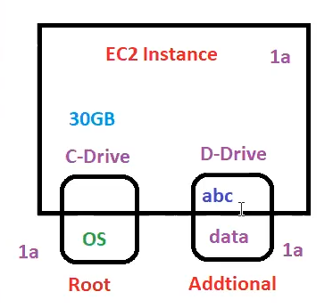
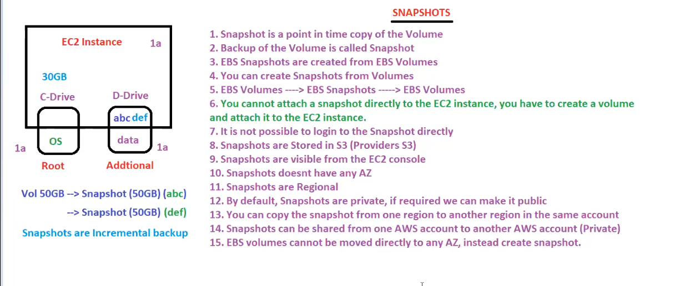

# EC2 continued
## Snapshots

### EBS snapshots
EBS snapshots are the backups of the EBS volumes(whether root volume or additional volume) at a particular instant. 

Snapshots are typically stored in an S3 bucket, only accessible through the S3 API or AWS CLI. They contain the entire information required to restore the data in an EBS volume.

EBS snapshots are incremental. This means we only take snapshots of the data added after the most recent snapshot to save time and storage space. Therefore, the first snapshot is a full snapshot of all the blocks in the volume. The next snapshot would be an incremental snapshot of only the blocks added or modified after the last snapshot. 

Root volume in windows is C drive and D drive is additional volume!!

we have data "abc" on D drive. we want to take backup so we take snapshot of it and suppose volume size is 50Gb then snapshot size will be too 50 GB.

Now see someone added "def" to D drive !! so now it wont be reflected in snapshot for modification !! you need to take another snapshot!! now again this snapshot will be 50 GB? no this snapshot will only have changes like we have on git!!
so storing only changes after 1st backup (1st snapshot takes full backup) is incremental backup!!

from snapshot when we restore we get a volume again!!from snapshot we create volume!!

we get all the data at the time when we create snapshot!!so snapshot are called as point in time backup!!

EBS snapshots provide multiple features to lock a snapshot and protect it from malicious activities and deletion, monitor the snapshot locks, and copy a snapshot. In short, EBS ensures that our data is recoverable and safe.

EBS snapshots are regionally resilient. The duplicates of snapshots are stored across multiple AZs in a region, so if one AZ fails, another takes over. We can use snapshots to restore the data in other AZs and to migrate the data.

Snapshot are not in any Availability zone!! but the volume you create from snapshot are in that particular AZ from where snapshot is taken from!!

If ec2 is regional then whatever we discuss in ec2 is regional so volume ,snapshot are regional!!

By default snapshot are private ! if required , you can make it public!!The snapshots can be copied from one region to other!!so now the volume will be created from copied snapshot will be in that particular region of coped snapshot!! 

Also you can share snapshot across AWS accounts!! even you have shared still the snapshot will be private!

 

ISV(instance store volume ) are created from a template stored in S3!!

to create a snapshot we no need to create EC2 instance so no downtime required!!

suppose we have 100 volumes but need only 60 volumes snapshot ,how will you do that?? to identify 60 volumes we use tags!! to take backup of 60 volume ,we use lambda(write code)!! but now AWS came up with service called __data lifecycle manager__ where you just tell this tag at this time ,please take snapshot!! __data lifecycle manager__ is used to create snapshot automatically!!

there is a time after which backup is deleted called as retention period !!After retention period ,snapshot be deleted!!

### Fast Snapshot Restore (FSR)
EBS volumes lazily restore volumes from an S3 bucket. If we try to access any block of data that has not been loaded yet, EBS fetches it from S3 urgently. However, this is not as quick as reading directly from the EBS volumes.

EBS snapshots offer Fast Snapshot Restore (FSR) to resolve this issue. It instantly restores a fully initiated EBS volume from the snapshot, eliminating the I/O latency when it is first accessed.

To leverage FSR, we must explicitly enable FSR for the snapshot and specify an availability zone. Upon restoration from that snapshot, a fully initiated EBS volume is restored in the specified availability zone.

### EBS encryption
Amazon Elastic Block Store encryption is a feature that allows us to encrypt our EBS volumes and snapshots using industry-standard AES-256 data encryption. It uses AWS Key Management Service (KMS), a service that allows us to create and control encryption keys. Encryption occurs on the host EC2 servers, which protect data at rest and in transit. The following data is encrypted in EBS encryption:

- Data at rest inside the volume

- Data in transit between the volume and the instance

- Snapshots created from the volume

- Volumes created using encrypted snapshot