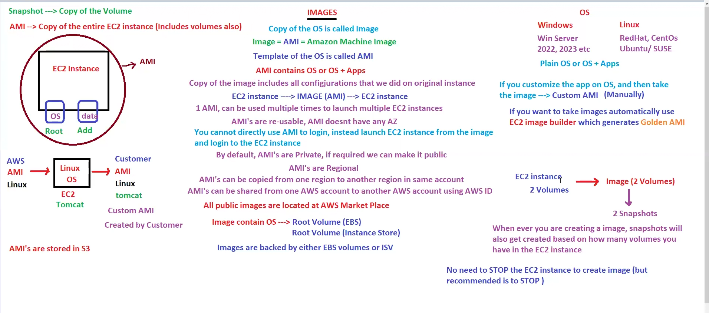
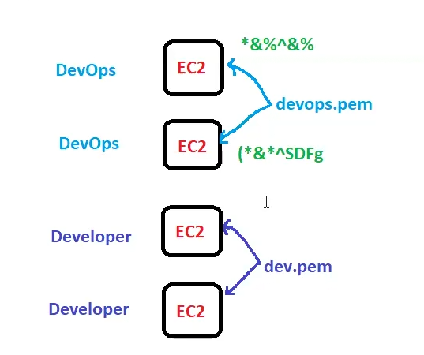
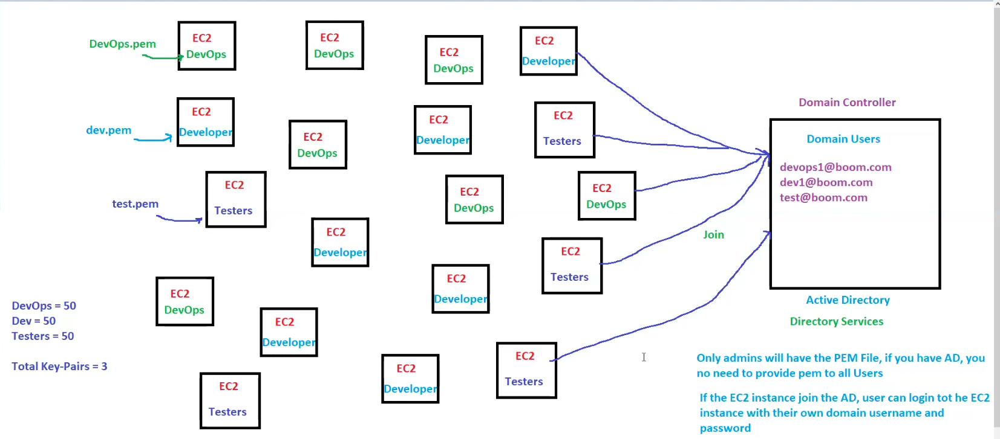

# EC2 continued lec-23

To encrypt snapshot we have KMS (key management service)!!

Data lifecycle manager(DLM) automates the process of taking snapshot!! you need to tell at which time to take snapshot !!Just to tell the rules of snapshot!

## Images
seen in previous lecture!!

whenever linux server use redhat as mostly used!!
when on windows use windows server!!

Company put there AMI with their software configured in Amazon marketplace !! you pay them and use their AMI's.

Image contains ,os can be in EBS or ISV! images also backed by either EBS or ISV!!

through DLM ,lambda's we can create AMI automatically!!

base AMIs we get ,we put software and create image of it!! if we get these AMIs automatically then these AMIs are called as Golden AMIs these are developed by EC2 image builder automatically!!

Just revise

## Key Pair

key value pair is tags!! here we have Key pairs !!both are different!

when launching ec2 ,ip is provided by AWS!!
Username for windows is __administrator__!!
username for linux is __ec2-user__!!

Password we get from key pair!! key pair is to retrieve password for ec2 instance!!

there is no default key pair by aws!! we need to create it!!

when we launch ec2 in one of step we need to attach key pair (one of the key is in .pem file)!!

key pair is combination of private key and public key!! .pem file is private key !! public key is with aws!!

when you want password  go to actions!! there we have option to get password!!there we need to attach key pair and then we can have password!!

1 ec2 has 1 key pair !! 1 key pair can be attached to multiple ec2 instance!! once .pem attached you cant change it as password generated inside!!

if key pair is lost then you cant get it back!! so save .pem file very safely!!

if team of developers and devops we create 2 pem file one for developers and one for devops!!

for each ec2 instance, you will have different password even with same .pem file!! 

see even when devops.pem is same password for different machine is different!!

for connecting to linux we use SSH protocol and for windows we use RDP(remote desktop protocol)!!

we use putty ,mobaxterm to connect to linux!!

Putty doesn't support .pem file ,it support .ppk file we need to convert .pem to .ppk one time so we use a software called puttengen!!protocol-->SSH at port 22!

for windows we use remote desktop client!! every laptop has this !! this uses RDP protocol port-3389!!

## question 

you have 3 teams approx 150 people ,they need to login will you give .pem file to them!! or give password to each one of them personally!!

we created 3 .pem files !!

devops.pem 

dev.pem

test.pem

in real time!! each and every machine has different password!!
you remember domain controller or active directory!!
there we create domain users!!
now we join all ec2 instances of devops to devops domain!! domain controller is place where you put al domain name and password!!domain controller is where you put password!!

domain controller,active directory is not free ,aws charge 450 $ per month for it!!

dont share pem to users!!