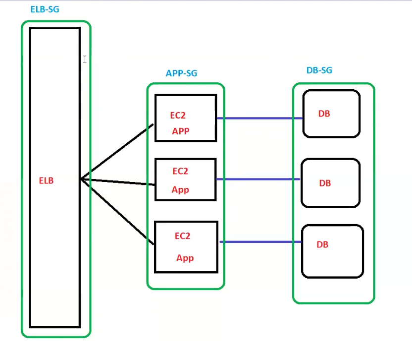

# Lecture 24

## Connecting to ec2
### Secure shell for Linux instances
Secure shell (SSH) is a cryptographic network protocol used for secure communication. It is commonly used to provide a secure and encrypted connection between a client and a server, allowing users to access and manage remote systems securely. SSH is widely used in various applications, including remote command-line access, file transfer, and tunneling.


#### Setup and connection steps
SSH requires a key pair to create a connection with the EC2 instance. A key pair consists of a public and a private key, a set of credentials to prove identity when connecting to an EC2 instance. We can divide the SSH connection into three major parts as follows.

- Key pair creation: When launching an EC2 instance, we can specify a key pair during the instance creation process. This key pair consists of a public key added to the EC2 instance and a private key securely downloaded to the local machine.

- Permission setting for private key: Ensure that the downloaded private key file has the correct permissions to be executed. For example, use chmod 400 to restrict access to the owner only.

- Connect using SSH:

    - Open a terminal on your local machine.

    - Use the ssh command to connect to the EC2 instance using the private key

 ``` bash
 ssh -i </path/to/private-key.pem> ec2-user@<instance-ip-address>

 ```   
Replace /path/to/private-key.pem with the path to your private key file, ec2-user with the appropriate user for the Linux distribution, and instance-ip-address with the public IP or DNS of your EC2 instance.

### Remote desktop for Windows instances
Remote Desktop Protocol (RDP), a network protocol offered by Microsoft, provides a graphical interface to connect to a Windows-based computer over a secure network connection. RDP allows users to interact with a remote desktop as if they were sitting in front of it, accessing its desktop environment, applications, and resources. It facilitates secure communication between remotely connected machines over an encrypted channel.

RDP is normally used in a client-server architecture; it operates on TCP and uses port 3389 by default. RDP offers secure remote access to Windows-based EC2 Instances.

### AWS Systems Manager Session Manager (Instance Connect)
AWS Session Manager allows to securely connect to the EC2 instances without managing SSH keys or opening inbound ports. It creates a temporary, secure session directly from the AWS console or CLI. It simplifies administration and improves security by eliminating the need for complex bastion hosts.

#### Setup and connection steps
- IAM Role configuration: Ensure that your EC2 instance has an AWS Identity and Access Management (IAM) role with the necessary permissions for Systems Manager.

- Session Manager installation: AWS Systems Manager Agent (SSM Agent) must be installed and running on the EC2 instance. Most Amazon Machine Images (AMIs) come with SSM Agent pre-installed.

- Systems Manager Console connection: In the AWS Management Console, navigate to Systems Manager, go to “Session Manager,” and select “Start Session” for the desired EC2 instance.

- Browser-based SSH or Remote Desktop access: Use the browser-based AWS Management Console to securely access your EC2 instance without the need for external SSH keys or Remote Desktop client software.

#### Best practices for secured connection
- Security groups: Ensure that the security group associated with your EC2 instances only allows incoming traffic on the relevant ports, 22 for SSH and TCP 3389 for Remote Desktop.

- Key pair management: Keep your private key files secure and rotate them periodically for enhanced security.

## Cluster networking Instances

cluster --> group of ec2 instances!! here in ec2 we call it as placement group!!

remember college days in a fight a single person weak but a group will be strong so to get good performance we use group!!

When several EC2 instances are launched, EC2 offers that instances are distributed physically such that it can reduce the number of system crashes, thus offering high availability. However, this can be troublesome when instances require low-latency communication. Imagine a group of instances that require constant low-latency and high throughput communication to offer services to the users, and each instance is deployed on a different physical structure in an AZ. To cater to such issues, Amazon EC2 also offers placement groups.

A __placement group__ allows control of the deployment of interdependent instances in a certain way across the underlying infrastructure. Placement groups are purposely designed to meet our workload requirements.

### Types of placement groups

- cluster placement group ( are in same AZ if entire AZ down then all down)

    
    - very high performance as all in same AZ
    - The cluster placement group is a logical grouping of interrelated instances to achieve the best throughput and low latency rate possible within an Availability Zone. Instances in the cluster placement group may belong to a single VPC or between peered VPCs in the same region. 

    - The cluster placement group is recommended for applications that require high-speed throughput of up to 25 Gbps for intercommunication of instances and 5 Gbps of network speed to internet or AWS Direct Connect. Complex computational problems, live streaming, cosmology models, and network-bound applications that require HPC instance types are optimal for this arrangement.

    - It is important to note that not all the instance types thrive in such placement; for example, instance families like t2, Mac1, and M7i-flex are not compatible with cluster placement arrangements. Similarly, the maximum throughput between two instances is limited by the slower instances of the two. We can launch different types of instances in the cluster placement group. However, it is recommended to use network-enhanced instances as they offer up to 10 Gbps of single stream traffic flow.
- spread placement group (spreads over AZ)

    
    - high AZ but not high as cluster
    - here max 7 ec2 in one AZ
    -  Spread placement group is the placement of instances such that each instance has its rack. The Spread placement group allows each instance on a different rack, therefore suitable for different instance types or launching times. 
    - The maximum number of running instances in a spread placement group per Availability Zone can not exceed seven; however, multiple AZs can be used in a region to launch instances. Similar to the partition placement group, Capacity Reservations do not reserve capacity in the case of the spread placement group. Unlike the partition placement group, the spread placement group does not support dedicated instances.
- Partition placement group

    
    - divided into partitions
    - max 7 partitions but each partition has 100's ec2 machines
    - The cluster placement group is designed to launch interconnected instances in close physical proximity to each other on the same infrastructure. The interconnected instances may fail due to correlated hardware failure, thus resulting in application failure.
    -  Partition placement group helps us further logically divide the placement group into partitions, and each partition has its own rack. Each rack has its network and power source, so no two partitions suffer from correlated hardware issues. Partition placement group allows to place partitions in different Availability Zones under the same region. 
    - Partition placement groups are used for large distributed computing, such as Big data stores that require distributed and repeated workloads. The partition placement group allows us to see the instances in each partition, enabling Hadoop or Cassandra topology to configure properly.
    - Partition placement group allows us to use up to seven partitions per AZ. EC2 tries to evenly distribute the instances across all the partitions; however, it does not guarantee an even distribution. A partition placement with dedicated instances can have up to 2 partitions maximum. Similarly, Capacity Reservations do not reserve capacity in the case of partition placement groups.

    -  Partition Placement Groups: This concept is part of AWS EC2 and is designed to enhance the deployment of distributed, high-volume computing workloads across multiple instances. By organizing instances into partitions, AWS ensures that the instances are physically separated within an AZ. This separation is crucial for applications that need high levels of fault tolerance and low latency.


    - Up to Seven Partitions per AZ: AWS allows users to create up to seven partitions within a single Availability Zone (AZ) for their EC2 instances. This setup is beneficial for distributed systems like Hadoop or Cassandra, where partitioning can help in optimizing performance and fault tolerance.

    - Even Distribution Not Guaranteed: While AWS strives to distribute instances evenly across the available partitions, it does not guarantee perfect balance. This means that some partitions might end up with more instances than others, depending on the overall demand and capacity.

    - Dedicated Instances Limitation: For environments using dedicated instances, which are instances running on hardware exclusively allocated for a single customer, the limit is reduced to two partitions. This is likely due to the physical constraints and exclusivity of dedicated hardware.

    - Capacity Reservations and Partition Placement Groups: Normally, AWS allows users to reserve capacity for EC2 instances in a specific AZ, ensuring that resources are available when needed. However, this reservation mechanism does not apply to instances within partition placement groups. This implies that users cannot reserve capacity specifically for a partition within a placement group, potentially affecting planning for high-availability applications.

    - In summary, partition placement groups are a powerful tool for managing distributed applications in AWS, offering physical separation for fault tolerance. However, there are limitations and considerations, such as the uneven distribution of instances and restrictions on capacity reservations and dedicated instances.


Db server then we need to group them !!as needed high performance! 

Placement group recommends same/homogenous instances!!

## Security Groups

### what we know
Security groups are like firewalls to the associated resources; they control the inbound and outbound traffic for an associated resource.

Security groups are used to secure EC2 instances from unwanted requests. We need to specify a security group to secure our EC2 instance whenever we launch an instance. If no security group is selected, EC2 uses the default security group of the VPC. The default security group has no inbound rules and allows all outbound traffic. 

#### Security group rules
Security group rules control inbound and outbound traffic to the resource. These rules allow traffic filtering based on protocols, port numbers and IP addresses. Security group rules are always permissive, which means no port or protocol can be explicitly denied. The following rules control the incoming and outgoing traffic:

##### Inbound rules
- Inbound rules are used to define incoming traffic to the associated resources.

- By default, all inbound traffic is denied.

- When multiple inbound rules apply to a traffic type, the rule with the most matching IP range, port, and protocol takes precedence.

- For example, common port numbers SSH (22) for secure remote access, HTTP (80) for web browsing, and FTP (20, 21) for file transfer allow traffic from anywhere IPv4 address (0.0.0.0/0).

##### Outbound rules 
- Outbound rules define the outgoing traffic from the associated resource to the internet.

- All outgoing traffic from the associated resource is allowed by default.

- When different outbound rules apply to a specific traffic type, the rule with the most matching IP range, port, and protocol takes precedence.

When launching an EC2 instance, we can attach an existing security group or create a new one. We can also modify the existing security group and add new rules or remove some rules. We can also attach multiple security groups to an EC2 instance, where all the rules for each group are logically aggregated to create one set of rules. It helps to evaluate the traffic efficiently and properly.

> It is important to note that security groups are stateful—if a request is initiated through an instance, the response traffic of that request is allowed regardless of the inbound rules.

##### Security group best practices
- Least privilege principle: Adhere to the principle of least privilege, only allowing necessary traffic to and from instances.

- No deny rule: There is no explicit “deny” rule. If a rule is not explicitly allowed, it is denied by default.

- Separation of duties: Use different Security Groups for different purposes (e.g., web servers, database servers) to enhance security and management.

### Lets start now!!
to secure ec2 instance!!stops unauthorized access to ec2 instances!!


to access ec2 instance you need to go in order of diagram below!!


SG--> security group
NACL--> network access control list

NACL hit first then SG then ec2!!

inside SG,here 2 rules 
inbound --> traffic coming toward ec2!!
outbound-->traffic coming outside ec2!!


by default inbound rules denied!!no protocol allowed!! 

by default outbound rules is allowed !!

to connect to ec2 we need to allow SSh on port 22 in inbound rule!!


every ec2 must have 1 security group attached!!

Just revise port no
- RDP port 3389
- Https on 443 port

>Note:
we don't talk about outbound rules!! we only talk about inbound rules

by default we have a default security group in AWS!!

3 teams devops ,dev ,testers for all 3 we will have 3 different security groups.

we use default security group for all instances!!



ELB-->elastic load balancer

see above for 3 type of instances we have 3 type of security group!!

see RDP/SSH is not accessible on load balancer. it only listens to http or https protocol so only allow that!!

what is source from where ELB get http or https request?
1. Custom ( from selected group of people)
2. Anywhere ( from everyone)
3. MyIP ( you created ELB and you want to access ELB)

app-SG source is load balancer so inbound for this is ELB
then DB-SG source is EC2-app!! so customer only access load balancer!!

now you want to connect to ec2 !!you  have aws and company!!you can connect via VPN!!as we have VPN we can connect to ec2!!!

a brand ne security group all inbound rule deny and outbound rules allowed!! 

you need to allow for inbound rules and no need of outbound rules--> this is called as stateful!!so security group are stateful!!


if you allow inbound rules and then you need to allow that for outbound rules that concept is called as Stateless!! NACL is stateless!! NACL (sodium chloride) is stateless(like powder no proper form just to remember)!!

## NACL (Network access control list)

in NACL we can deny too!!

by default in default NACL ,inbound rules and outbound rules are allowed!! so thats why no one talk about it!!
but if you create a new NACL both inbound and outbound is denied!!    


which ip is assigned to an ec instance is defined by VPC (Virtual private cloud) as entire infra is in VPC!!

suppose VPC range is 192.168.0.0/16 !!
own isolated network is subnet!! each subnet is in one AZ!!

one subnet must be in one AZ!! one subnet can't expand to multiple AZ!! one AZ can have multiple subnet!!

we launch ec2 instances in subnets!! in 1 subnet we can have multiple security groups!!

> now suppose a hacker comes and attach ec2 instances now what we do is we remove security group ssh inbound rule !! but we need to do for each security group !! it will take time in meanwhile hacker can attack !

 - solution is deny in NACL!!
  - there is 1 NACL in each subnet!
  - 1 subnet cant be in multiple NACL!!1 NACL can have multiple NACL!!
  - NACL overrule security group!!
  - NACL is at subnet level while security group at ec2 instance level!!


NACL is optional !! if required tight it else leave it!!


what will happen in below case?ssh allowed or denied?


As ssh denied by NACL ,so it will be denied!!


