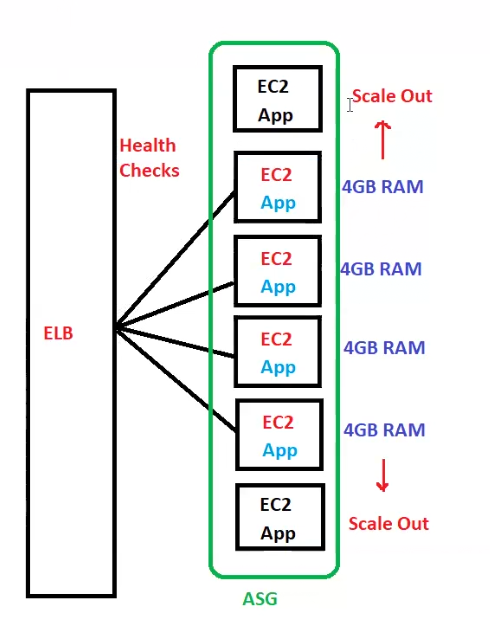
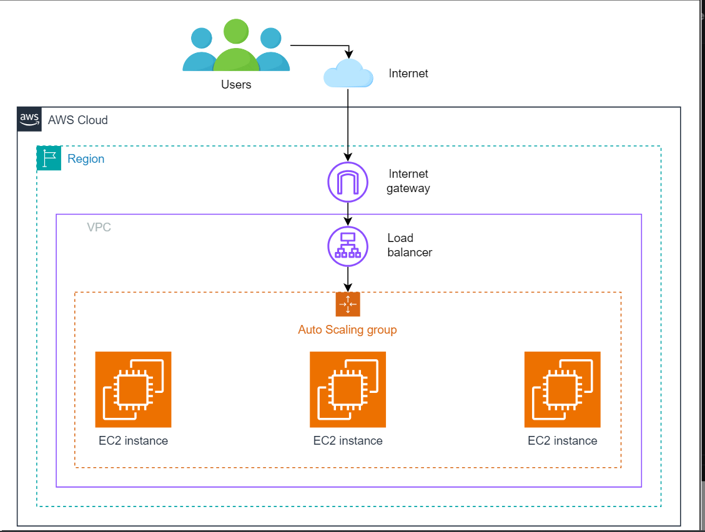

### Revision
- 1 ec2 can have multiple Security group? yes
- NACL-->network access control list
- 1 subnet associated to 1 NACL
- 1 subnet to multiple NACL or AZ? no
- 1 NACL or AZ can have multiple subnet? yes

## Todays topic --> Autoscaling

Autoscaling scale out or in ec2 based on load!!

Horizontal scalability, sometimes called scaling out or in, adds more instances or nodes to a pool to handle increased load or remove from it. T

In AWS, services such as Amazon EC2 Auto Scaling and Elastic Load Balancing (ELB) practically take care of the horizontal scaling for users.

- Amazon EC2 Auto Scaling: This automatically adjusts the count of EC2 instances based on the application conditions so that performance levels are maintained. This service will help us make sure we have the right number of EC2s that are handling the load for the application, optimizing both cost and performance.

- Elastic Load Balancing (ELB): Automatically distributes incoming application or network traffic across multiple targets, such as Amazon EC2 instances, containers, and IP addresses, in multiple Availability Zones. ELB automatically scales the load balancer according to the traffic to the application that varies periodically, hence ensuring the traffic is even among all instances. This distribution optimizes resource use and maximizes application responsiveness.
### Auto Scaling Groups
> ASG is a service from AWS that helps the applications automatically adjust how many instances they use based on how much they need. Consider ASGs a smart system that watches over our application’s traffic, ensuring that it runs well. If more people start using our application and it gets really busy, ASGs will add more instances to handle everything smoothly. But when fewer people use it, ASGs take away some instances to reduce our operational cost.

Here are some important points regarding ASGs:

- ASGs automatically manage the collection of EC2 instances, adjusting the quantity in response to the demand to ensure that the application maintains optimal performance and cost-efficiency.

- ASGs can define the minimum, maximum and desired capacity that can be run to handle the workload, maintaining the desired capacity within this range.

- ASGs primarily focus on infrastructure management, ensuring instances are available to handle the application load.

### Benefits of using ASGs
Here are some benefits of ASGs:

- Cost efficiency: ASG does not have any cost, but we pay only for the resources we use, potentially saving substantial costs, especially for applications with variable loads.

- Increased availability: ASGs enhance our application’s availability and reduce failure risks by auto-scaling across multiple Availability Zones.

- Better resource management: ASGs eliminate the guesswork in capacity planning. We set the scaling policies, and ASGs handle the rest, ensuring our application receives the necessary resources without manual intervention.

- Flexibility: We gain precise control over instance configurations with launch templates, allowing for tailored scaling strategies.

### Discussion
when we increase servers such as on black friday sale or flipkart big billion days we need to increase number of servers!! this is call scale out scale in!!

load balancer do monitoring of application with health checks!! to do monitoring of ec2 we use cloud watch!!

min 2 ec2 we need for high availability!!

initially whenever we set up application the amount of min ec2 instances we need is called as desired capability!!

we have to put some maximum number of ec2 we need depending upon traffic we are expecting!! we need min at least 2 and max can be anything!! these are boundaries ,between these we will have ec2 instances!! beyond max ASG will not increase ec2 instances!!

see above desired capacity is 4 so initially we have 4 ec2 instances and then when load increase it get max to 6 and min to 2 (even below of Desired capacity)

### Types of scaling
The scaling policies are the rules or guidelines that automatically scale the resources. These act as smart helpers that constantly look after the application and enable resource adjustment using the conditions.

Whether our application requires more power because of a surge in users or less because it is a quiet day, the scaling policies ensure that our application gets only what it requires for optimal running.

- Dynamic scaling - we tell avg cpu utilization to some percent like we say 70 ,if we get cpu utilization less than 70 percent then we scale in if >70 % we scale out!!
here can use various matrices to increase or decrease load!!
Matrices we will see in cloud watch!
    - just a bit more info just read it

    - Target tracking: This type of scaling policy targets the value of a metric, and it can be targeted to a constant value or a variable level of performance.

    - Step scaling: This allows users to scale in finer granularity the number of resources concerning the size of the metric breach. It is applicable for applications that exhibit variable load patterns.

    - Simple scaling: It responds to CloudWatch alarms by adjusting the number of instances linearly, based on the rules defined. It waits for a cooldown period after each scaling activity, which can delay further scaling actions, making it suitable for environments with steady and predictable workload changes.

    - Scaling based on SQS: It scales based on the messages in the SQS queue to manage workload.

- Manual scaling - we increase desired capacity manually!!

- Schedule scaling - we schedule scaling like on some days we tell these days we will have more traffic! so these days we change min ,max nd desired capacity!!

    Predicting times when our application will either have high or low traffic, maybe because of a sale or weekend hours, can now be possible with the help of scheduled scaling. Scheduled Scaling will help determine the amount of resources to change based on the alert.

>among 3 scaling , dynamic scaling is best one!!
- Predictive scaling: Utilizes machine learning to analyze historical data and predict future demands, automatically adjusting resources to efficiently meet predicted loads and optimizing performance and cost.
### How scaling policies work#
Scaling Policies are connected to monitoring tools, like AWS CloudWatch, which will monitor different metrics about how well our application performs. From this, we can take actions to scale up or down our resources according to our Scaling Policies. Below is the brief process of scaling:

- Set the criteria: First, clear conditions under which our resources are supposed to scale will be defined. This could be CPU usage, response times, or even the number of requests per second.

- Select the action: Next comes what action should be taken when the conditions are met. Add more instances if the load is increasing or scale down for cost-saving.

- Continuous monitoring: With our policies in place, AWS is always looking at our application, ready to scale resources up or down, as needed.
### Metrics used in scaling policies
Scaling decisions are often based on key performance indicators such as CPU utilization, network I/O, and response times. These metrics are monitored through tools like AWS CloudWatch, which provides the data necessary to trigger scaling actions.
### how ASG put application in new ec2 instance when scale out??
it use image concept to configure the application!! we use launch template to tell ASG how to configure!!

Launch templates provide a straightforward way to set up and start Amazon EC2 instances. They offer more options than setup, letting us use extra features like T2 unlimited instances, Elastic GPUs, and dedicated hosts. This means we can easily get our instances running how we need them, with more control over the setup and the ability to automate the process more effectively.

Here are some important points regarding launch templates:

- Launch templates enhance update and rollback processes through version control, ensuring a smoother transition when changes are made.

- Launch templates allow for adjustments directly in the template, offering a more dynamic approach to instance configuration and scaling.

- We can specify details for EC2 instances, like type, AMI, and security settings, to the application’s needs.

- Version control facilitates the management of infrastructure changes, allowing for safe experimentation and progression.

- Launch templates are designed to work with Auto Scaling groups, which automates the adjustment of instance numbers according to operational demands, schedules, and policy triggers.

#### Example: E-commerce traffic management
The magic behind ASGs lies in their ability to dynamically adjust resources based on specific criteria, such as CPU utilization or incoming request volume. Let’s take the example of an e-commerce website traffic that can grow unpredictably at any point in time during the sales or holiday season. Here’s how ASGs work for our scenario:

- Defining policies: For an e-commerce site, policies might be set to scale up when CPU utilization surpasses 70%, ensuring that server resources can handle the increase in client activity.

- Launch templates: These templates are essential, specifying the configuration of new instances that may be launched during a traffic spike and ensuring that each server is equipped to handle the e-commerce platform’s demands.

- Monitoring and scaling: ASGs, in real-time, monitor metrics like CPU usage and network traffic. If a flash sale drives a spike in traffic, the ASG automatically scales up, deploying additional instances as defined in the launch templates to handle the load.

- Health checks and ELB integration: When we use ASG and ELB together, ASG checks if each instance works well. If any instance stops working right, especially when there’s a lot of traffic, ASG will replace it. This keeps the website running smoothly without any problems for the users.

