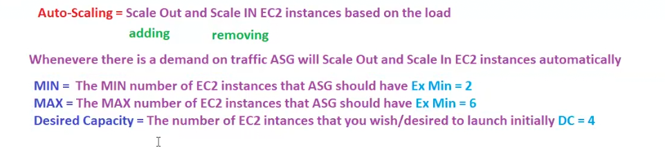
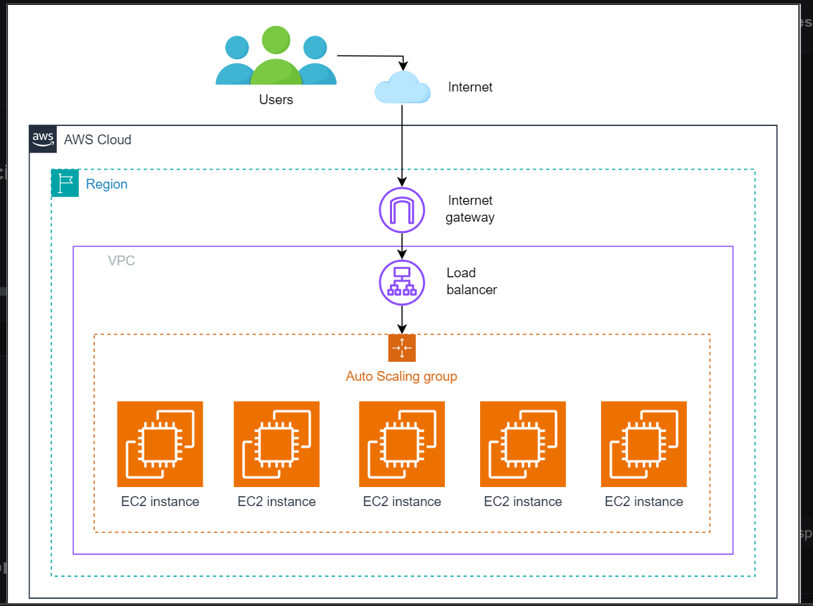
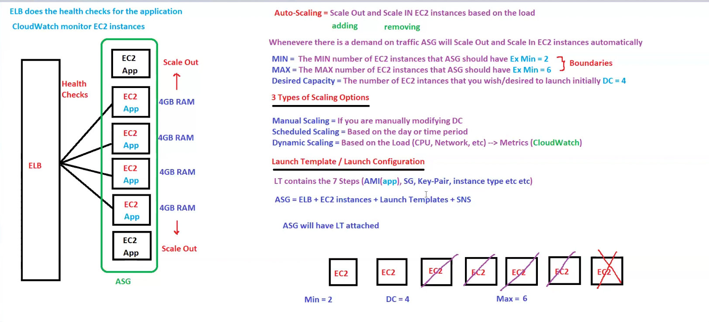
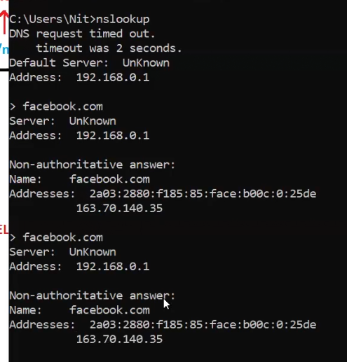
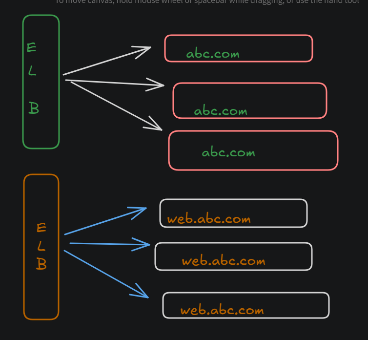
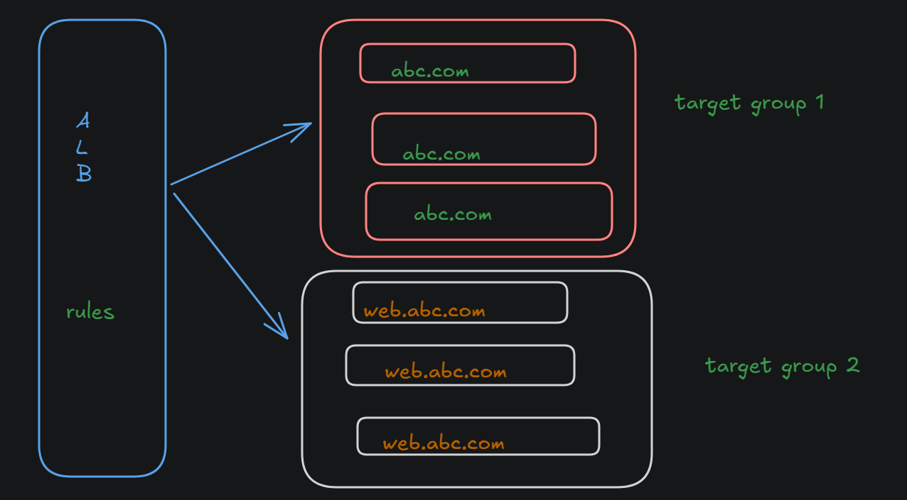
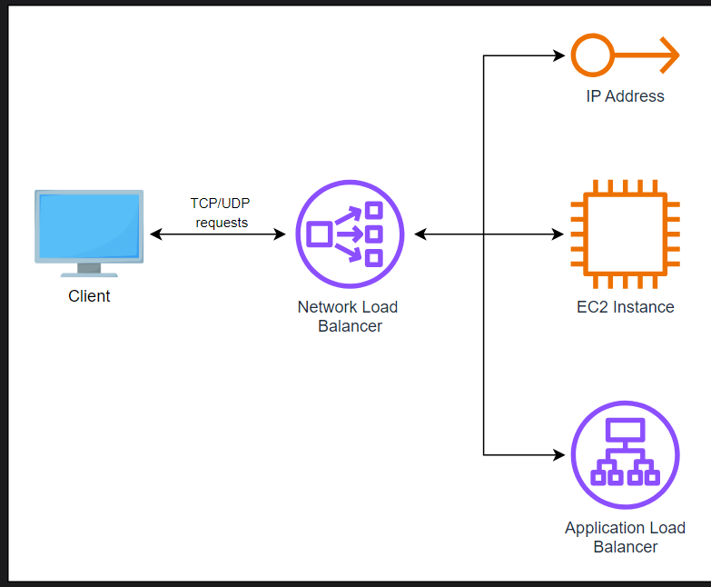
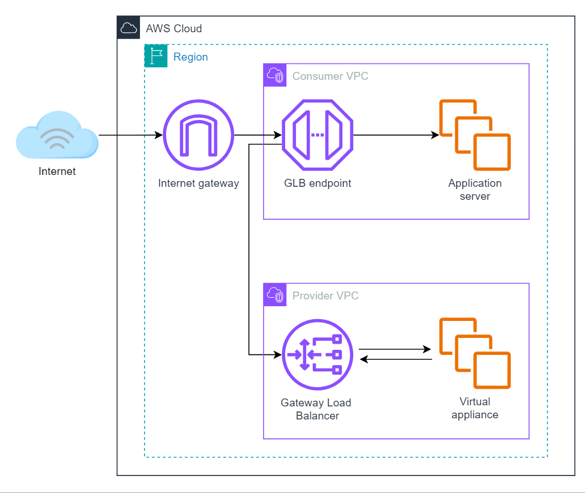

### Revision
- 1 ec2 can have multiple Security group? yes
- NACL-->network access control list
- 1 subnet associated to 1 NACL
- 1 subnet to multiple NACL or AZ? no
- 1 NACL or AZ can have multiple subnet? yes

## Todays topic --> Autoscaling

Autoscaling scale out or in ec2 based on load!!

#### Horizontal scalability
 sometimes called scaling out or in, adds more instances or nodes to a pool to handle increased load or remove from it. T

In AWS, services such as Amazon EC2 Auto Scaling and Elastic Load Balancing (ELB) practically take care of the horizontal scaling for users.

- Amazon EC2 Auto Scaling: This automatically adjusts the count of EC2 instances based on the application conditions so that performance levels are maintained. This service will help us make sure we have the right number of EC2s that are handling the load for the application, optimizing both cost and performance.

- Elastic Load Balancing (ELB): Automatically distributes incoming application or network traffic across multiple targets, such as Amazon EC2 instances, containers, and IP addresses, in multiple Availability Zones. ELB automatically scales the load balancer according to the traffic to the application that varies periodically, hence ensuring the traffic is even among all instances. This distribution optimizes resource use and maximizes application responsiveness.

#### Vertical scalability 
Vertical scalability, the process of scaling up or down, is the aspect of growing the power (CPU, RAM, Storage) of an existing instance or node instead of adding further instances. In other words, it's like upgrading to a more powerful engine which will roll faster and smooth. This approach suits applications with consistent workloads where the demand gradually increases over time.

That is usually realizable in AWS through vertical scaling—changing the server’s EC2 instance type to be more powerful or modifying other service resources.

- Changing the instance type of EC2: EC2 allows scaling up the capability of a single instance in order to serve the increasing demand for the scaling of resources significantly. It allows for a quick boost in performance without the complexity of managing additional instances.

- RDS, Elasticache, and others: Similarly to EC2, a great number of AWS services allow the modification of settings for some other services with increased efficiency, so that they could take on larger loads without adding more service instances. This flexibility in resource management is crucial for maintaining optimal performance as application demands evolve.

#### Choosing between horizontal and vertical scaling
The choice between horizontal and vertical scaling often depends on several factors, including:

- Application architecture: Stateless applications are often easier to scale horizontally, while stateful applications can sometimes need some refactoring to be rightfully and appropriately horizontally scalable. Understanding the nature of the application can guide the choice of scaling strategy.

- Cost efficiency: Horizontal scaling can save money when used on a large scale but needs more complex management and monitoring. Although it’s easy to set up and widely available, the benefits decrease as the maximum capacity of each resource becomes less effective.

- Availability and fault tolerance: Horizontal scaling inherently supports improved availability and fault tolerance since the load is spread over several instances or nodes. It minimizes the effect of a single point of failure, enhancing the liveliness of the application infrastructure.

#### Scaling options and triggers
Scaling strategies in AWS Auto Scaling are complemented by various options that define how and when instances are adjusted:

- Maintain scaling: This will maintain the number of instances constant in time, i.e., the number of instances existing at any time would meet the baseline instance count or minimum instance.

- Manual scaling: Gives the user the freedom to change the instance both below and above the limits given, respectively, thus allowing the user full control of resource allocation.

- Scheduled scaling: It enables users to schedule various occurrences within a predefined time. This is perfect for controlling predictable fluctuations in demand.

- Dynamic scaling: It automatically scales with metrics found within AWS CloudWatch to change the number of instances, hence ensuring the efficiency of resources and rapid scaling of instance numbers based on actual application usage.
### Auto Scaling Groups
> ASG is a service from AWS that helps the applications automatically adjust how many instances they use based on how much they need. Consider ASGs a smart system that watches over our application’s traffic, ensuring that it runs well. If more people start using our application and it gets really busy, ASGs will add more instances to handle everything smoothly. But when fewer people use it, ASGs take away some instances to reduce our operational cost.

Here are some important points regarding ASGs:

- ASGs automatically manage the collection of EC2 instances, adjusting the quantity in response to the demand to ensure that the application maintains optimal performance and cost-efficiency.

- ASGs can define the minimum, maximum and desired capacity that can be run to handle the workload, maintaining the desired capacity within this range.

- ASGs primarily focus on infrastructure management, ensuring instances are available to handle the application load.

### Benefits of using ASGs
Here are some benefits of ASGs:

- Cost efficiency: ASG does not have any cost, but we pay only for the resources we use, potentially saving substantial costs, especially for applications with variable loads.

- Increased availability: ASGs enhance our application’s availability and reduce failure risks by auto-scaling across multiple Availability Zones.

- Better resource management: ASGs eliminate the guesswork in capacity planning. We set the scaling policies, and ASGs handle the rest, ensuring our application receives the necessary resources without manual intervention.

- Flexibility: We gain precise control over instance configurations with launch templates, allowing for tailored scaling strategies.

### Discussion
when we increase servers such as on black friday sale or flipkart big billion days we need to increase number of servers!! this is call scale out scale in!!

load balancer do monitoring of application with health checks!! to do monitoring of ec2 we use cloud watch!!

min 2 ec2 we need for high availability!!

initially whenever we set up application the amount of min ec2 instances we need is called as desired capability!!

we have to put some maximum number of ec2 we need depending upon traffic we are expecting!! we need min at least 2 and max can be anything!! these are boundaries ,between these we will have ec2 instances!! beyond max ASG will not increase ec2 instances!!

see above desired capacity is 4 so initially we have 4 ec2 instances and then when load increase it get max to 6 and min to 2 (even below of Desired capacity)

### Types of scaling
The scaling policies are the rules or guidelines that automatically scale the resources. These act as smart helpers that constantly look after the application and enable resource adjustment using the conditions.

Whether our application requires more power because of a surge in users or less because it is a quiet day, the scaling policies ensure that our application gets only what it requires for optimal running.

- Dynamic scaling - we tell avg cpu utilization to some percent like we say 70 ,if we get cpu utilization less than 70 percent then we scale in if >70 % we scale out!!
here can use various matrices to increase or decrease load!!
Matrices we will see in cloud watch!
    - just a bit more info just read it

    - Target tracking: This type of scaling policy targets the value of a metric, and it can be targeted to a constant value or a variable level of performance.

    - Step scaling: This allows users to scale in finer granularity the number of resources concerning the size of the metric breach. It is applicable for applications that exhibit variable load patterns.

    - Simple scaling: It responds to CloudWatch alarms by adjusting the number of instances linearly, based on the rules defined. It waits for a cooldown period after each scaling activity, which can delay further scaling actions, making it suitable for environments with steady and predictable workload changes.

    - Scaling based on SQS: It scales based on the messages in the SQS queue to manage workload.

- Manual scaling - we increase desired capacity manually!!

- Schedule scaling - we schedule scaling like on some days we tell these days we will have more traffic! so these days we change min ,max nd desired capacity!!

    Predicting times when our application will either have high or low traffic, maybe because of a sale or weekend hours, can now be possible with the help of scheduled scaling. Scheduled Scaling will help determine the amount of resources to change based on the alert.

>among 3 scaling , dynamic scaling is best one!!
- Predictive scaling: Utilizes machine learning to analyze historical data and predict future demands, automatically adjusting resources to efficiently meet predicted loads and optimizing performance and cost.
### How scaling policies work#
Scaling Policies are connected to monitoring tools, like AWS CloudWatch, which will monitor different metrics about how well our application performs. From this, we can take actions to scale up or down our resources according to our Scaling Policies. Below is the brief process of scaling:

- Set the criteria: First, clear conditions under which our resources are supposed to scale will be defined. This could be CPU usage, response times, or even the number of requests per second.

- Select the action: Next comes what action should be taken when the conditions are met. Add more instances if the load is increasing or scale down for cost-saving.

- Continuous monitoring: With our policies in place, AWS is always looking at our application, ready to scale resources up or down, as needed.
### Metrics used in scaling policies
Scaling decisions are often based on key performance indicators such as CPU utilization, network I/O, and response times. These metrics are monitored through tools like AWS CloudWatch, which provides the data necessary to trigger scaling actions.
### how ASG put application in new ec2 instance when scale out??
it use image concept to configure the application!! we use launch template to tell ASG how to configure!!

Launch templates provide a straightforward way to set up and start Amazon EC2 instances. They offer more options than setup, letting us use extra features like T2 unlimited instances, Elastic GPUs, and dedicated hosts. This means we can easily get our instances running how we need them, with more control over the setup and the ability to automate the process more effectively.

there are 7 steps to launch in ec2 instances!!this launch template has 7 steps!!we tell everything like AMI,Security group ,key-pair,instance type etc to launch template!!

Autoscaling group= ELB +ec2 +launch template + SNS (to get notification)

Here are some important points regarding launch templates:

- Launch templates enhance update and rollback processes through version control, ensuring a smoother transition when changes are made.

- Launch templates allow for adjustments directly in the template, offering a more dynamic approach to instance configuration and scaling.

- We can specify details for EC2 instances, like type, AMI, and security settings, to the application’s needs.

- Version control facilitates the management of infrastructure changes, allowing for safe experimentation and progression.

- Launch templates are designed to work with Auto Scaling groups, which automates the adjustment of instance numbers according to operational demands, schedules, and policy triggers.

#### Example: E-commerce traffic management
The magic behind ASGs lies in their ability to dynamically adjust resources based on specific criteria, such as CPU utilization or incoming request volume. Let’s take the example of an e-commerce website traffic that can grow unpredictably at any point in time during the sales or holiday season. Here’s how ASGs work for our scenario:

- Defining policies: For an e-commerce site, policies might be set to scale up when CPU utilization surpasses 70%, ensuring that server resources can handle the increase in client activity.

- Launch templates: These templates are essential, specifying the configuration of new instances that may be launched during a traffic spike and ensuring that each server is equipped to handle the e-commerce platform’s demands.

- Monitoring and scaling: ASGs, in real-time, monitor metrics like CPU usage and network traffic. If a flash sale drives a spike in traffic, the ASG automatically scales up, deploying additional instances as defined in the launch templates to handle the load.

- Health checks and ELB integration: When we use ASG and ELB together, ASG checks if each instance works well. If any instance stops working right, especially when there’s a lot of traffic, ASG will replace it. This keeps the website running smoothly without any problems for the users.

## next topic Elastic load balancer(ELB)

distributes traffic across multiple ec2 across AZ!!ELB is a service not a server! we can access it by dns name!!

we get a very bad url (not easy to recognize) from load balancer to convert it to some custom url we can use Route53 !!

we access load balancer by dns name !!so here load balancer is not having IP!!! but in backend load balancer is server so it has a ip in backend!! but for ip that is managed by AWS!!

still some customer said we need ip of application!! we  application run on ec2 which has private ip!! so we give url of load balancer but customer need ip!! but there is no ip of load balancer!!

you do nslookup you can find ip of load balancer

nslookup is for dns lookup 
- convert ip to url and vice versa
- you put ip you get url of load balancer!!

but on different day you do nslookup you see different ip!!as load balancer will scale up and down load balancers!! load balancer server in backend might increase or decrease so ip is dynamic of load balancer!

when we ask AWS it told you need to compromise with performance as it will limit number of servers and will make it static!!

### types of load balancer!!

initially
- classic load balancer (works on http ,https and tcp)

but when demands change it became prev gen load balancer

- so mostly used LB is application load balancer(used with http ,https)(default one)

#### Application load balancer (ALB)
 An Application Load Balancer operates on the application layer (the seventh layer of the OSI model) and handles HTTP/HTTPS/Web Socket requests. default one ,best for microservices!!
 
##### Target groups in ALB
Target groups are used to define where an Application Load Balancer routes the incoming requests from a client. While creating a target group, we define the type of targets, the protocols, and the ports. ALBs support __EC2 instances, IP addresses, and Lambda functions__ as its target types, HTTP and HTTPS as its protocols, and ports 1-65535. When we create an ALB, we provide listener rules, where we define the conditions that must be met in order for the ALB to send client requests to a specific target group. Once a target group is created, AWS performs various health checks on the targets registered in a target group to ensure they are available to receive and process requests from a client.

##### Routing algorithms in ALB
Application Load Balancers support various routing algorithms to distribute incoming requests across multiple target groups. We can select only one routing algorithm for a routing group at a time, however, we do have the option of updating these algorithms according to our applications’ requirements. Let’s look at the algorithms supported by ALBs:

- Round robin: This is the default algorithm used by ALBs and distributes incoming requests evenly across multiple targets in a sequential order.

- Least outstanding requests: Here, incoming requests are sent to the target with the least number of requests whose status is in progress.

- Weighted random: In this algorithm, weights are assigned randomly to requests that evenly distribute requests across targets in a random order.

#### Listeners in ALB

- __for https we need to have to buy certificate we can get from Go daddy but in AWS we have service for certificate called Amazon certificate manager (ACM)__

- __to generate access and secret key use IAM__

- __encryption keys KMS__

Application Load Balancers use listeners, that check connection requests received from the client. We define rules in listeners that determine how our load balancer routes the requests it receives. A single listener can have multiple rules and are evaluated according to the priority we set up. Following are the conditions we can define in rules for our listeners:

- HTTP header conditions: These rules are created to handle client requests based on their HTTP headers.

- HTTP request method conditions: These rules are created to handle client requests based on their HTTP request methods.

- Host conditions: Rules can be created to route requests based on the name of the host.

- Path conditions: Path conditions in the URL of the request can be used to create rules to route requests to different targets.

- Query string conditions: Key/value pairs in the query string of the incoming request can be used to create rules to route requests.

- Source IP address conditions: Rules can be created that route incoming requests based on the source IP address. This IP address must be specified in the CIDR format.

these rules we cant create in classic load balancer for each different rule we were having different load balancer in classic!!

for cb.com we have different LB and web.abc.com a different LB!!
in ALB we group the various instances and call them target groups

we can have multiple target groups based on various conditions like above discussed path ,query parameters!!
so only 1 LB need in ALB!!

#### Things to keep in mind
Following are some of the things we must keep in mind while using Application Load Balancers:

- IP address: ALBs support IPv4 addresses and dual-stack (using both IPv4 and IPv6 addresses) to receive connection requests from the client.

- Availability zone: We must specify at least two Availability Zones while creating an ALB and should launch at least one target in both zones.

- Security groups: The security groups associated with our ALB must allow traffic flow in both directions on the listener and the health check port. Also, the security groups associated with our target groups must have inbound rules with the ALB’s security group as the source to allow the ASG to access our targets.

- WebSockets: ALB supports WebSockets. This means we can create a bidirectional communication channel between a client and a server over a TCP connection to exchange messages in real time.

- Sticky sessions: We can create sticky sessions in ALB. Through this mechanism, we can ensure that any further requests from a client are sent to the same target.

- Health checks: ALB performs regular health checks on the registered targets in a target group to ensure they are fit to receive requests from a client.

### Network Load Balancer(NLB)
neeeded when extreme high speed!! works on TCP and UDP!

Network Load Balancer (NLB) operates on the transport layer, the fourth layer of the OSI model, and is used to distribute incoming TCP and UDP traffic across multiple targets. NLB uses a single static IP address and is optimized to handle sudden and volatile traffic patterns.

Once a Network Load Balancer receives a request from a client, it tries to open a connection with a target from the target group on the port specified in the targets’ listener rule. The protocols Network Load Balancers support are TCP, TLS, UDP, and TCP_UDP.

NLB (Network Load Balancer) supporting zonal isolation means it can operate within a single Availability Zone (AZ) in a cloud environment. This capability allows for the design of architectures that are confined to a specific geographic location within a cloud provider’s infrastructure for reasons such as compliance, data locality, or high availability within that zone.

While Network Load Balancers are capable of working within a single AZ, thereby providing zonal isolation, they are also designed to work across multiple zones. This multi-zone capability is recommended to enhance the availability of applications by distributing the load not just within a single AZ but across several, thus ensuring better resilience and uptime for the applications they support.__However, using multiple zones is recommended as it increases the availability of our applications.__

#### Target groups in NLB
Targets of a Network Load Balancer are registered in a target group, which is then used to route requests. When a listener is created, we define a target group in this listener to specify the target group we want to send our traffic to. A target group performs regular health checks on the registered targets to ensure they are fit to receive incoming requests. Requests are only sent to a target if its status is “Healthy.”

Network Load Balancers support EC2 instances, private IP addresses, and Application Load Balancers as their targets. 

>We can use on-premises servers as targets if the selected target type is IP by connecting them to the AWS cloud using AWS Direct Connect or AWS Site-to-Site VPN.

>Meaning
Generally, it means that physical servers located in a company’s data center (on-premises) can be designated as targets for a Network Load Balancer (NLB) in AWS, provided these servers are accessible via an IP address. This integration is achieved through AWS Direct Connect, a dedicated network connection, or AWS Site-to-Site VPN, a secure, encrypted connection over the internet.

>In the context of the lesson, it highlights the flexibility of AWS’s Network Load Balancer to not only route traffic to AWS resources like EC2 instances but also to on-premises servers. This is particularly useful for hybrid cloud architectures, where some resources are kept on-premises while others are migrated to the cloud. By using AWS Direct Connect or Site-to-Site VPN, businesses can ensure a secure, reliable connection between their on-premises servers and AWS’s cloud infrastructure, allowing the NLB to distribute incoming requests to both cloud and on-premises resources seamlessly.

#### Using ALB as a target#
Network Load Balancers can forward the requests it receives to an Application Load Balancer. Following are some use cases where ALBs are added as targets for NLBs:

1. Multimedia services: A combination of NLB and ALB can be used in multimedia services where a single endpoint is required for multiple protocols, such as HTTP for signaling and RTP to stream content.

2. AWS PrivateLink: An NLB can be used to create a route between clients and an ALB over AWS PrivateLink.

#### Security groups for NLBs 
Security groups are virtual firewalls that control the incoming and outgoing traffic for AWS resources. In a Network Load Balancer, it is optional to add a security group. However, it is recommended to add a security group to your load balancer and specify the ports and IP addresses that can access our load balancers. If we don’t associate a security group with our NLB, all client traffic can reach the load balancer listeners, and all traffic can leave the load balancer.

#### Main features of NLB#
Following are some of the main features of an NLB that distinguish it from an ALB:

1. Client IP preservation: By default, the IP address of a client is replaced with the IP address of the load balancer before the request is forwarded to a target. However, Network Load Balancers have a client IP preservation feature. This means the IP address of the client who made the connection request is preserved and can be forwarded to the target. This feature is useful in applications where we need to process the IP address of the client. For example, the IP address of the client can be used to monitor and analyze the pattern of the requests received.
> remeber ip of client(jha se reqest aa rhi uska ip load balancer ke ip se change nhi hoga when reaching to target) is preserved not

2. Health checks: We can only use TCP, HTTP, or HTTPS protocols to create health checks for the target groups associated with our NLBs.

3. Low latency: NLBs can be used in applications that require low latency.

4. this provide 1 static IP per AZ!

### gateway load balancer (GLB)
latest one! it's for security purpose !!not for applications!!

- deploy and manage ,scale a fleet of 3rd party network virtua appliances in AWS!!

- used in Firewall, prevention systems ,deep packet inspection etc

- works on protocol GENEVE on 6081

Gateway Load Balancers (GLB) operate on the network layer, the third layer of the OSI model, and allow us to maintain, scale, and deploy third-party virtual appliances such as intrusion detection systems. A virtual appliance is a software package that includes an operating system, application software, and virtual hardware configuration required to run a virtual machine platform.

These load balancers act as a gateway (a single point of entry and exit) and distribute incoming traffic across multiple appliances, scaling them up or down according to our applications’ requirements, decreasing the risk of potential failure.

#### Listeners and target groups#
Gateway Load Balancers check for incoming requests through processes known as listeners. Unlike the listeners in ALB and NLB, we can not specify the port and protocol while creating a listener for Gateway Load Balancers. GLB listeners check for IP packets across all ports.  Rules in a listener specify the target group for a specific request.

Virtual appliances are registered as targets in target groups for Gateway Load Balancers. Target groups can have multiple registered targets, and regular health checks are performed on these targets. GLBs ensure that traffic is routed only to healthy targets. Following are some of the things we must keep in mind while creating target groups for a Gateway Load Balancer:

- Protocol and port: Target groups for GLB support only the GENEVE protocol and port 6081.

- Target type: Only EC2 instance IDs and IP addresses are supported as the target type for GLB target groups. Publicly accessible IP addresses are not supported by GLB.

- Deregistering targets: GLB stops sending new requests to targets that are deregistered and in case of existing requests, it closes the connection if it has been idle for more than 120 seconds

#### Gateway Load Balancer endpoint
A Gateway Load Balancer is deployed in the same VPC as the target group. GLB endpoint is a VPC endpoint that allows us to create a private connection link between the virtual appliances in our provider VPC and application servers in our consumer VPC. The application server and GLB endpoints are deployed in different subnets. The following diagram shows how GLB endpoints are used.

In the diagram above, traffic coming from the internet uses the internet gateway to get to the GLB endpoint located in the consumer VPC. This endpoint routes this traffic to the Gateway Load Balancer, which distributes this traffic to the virtual appliance (the target of the GLB). Once the virtual appliance analyzes the traffic, it is sent back to the Gateway Load Balancer, which sends it to the application servers located in the consumer VPC.