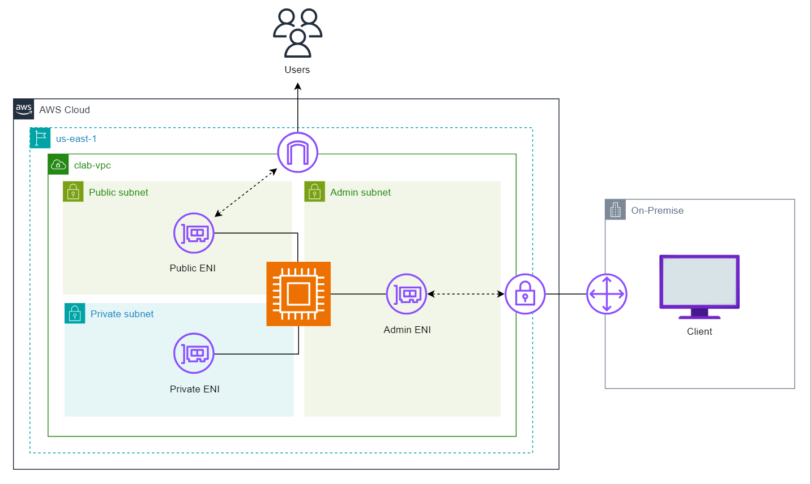
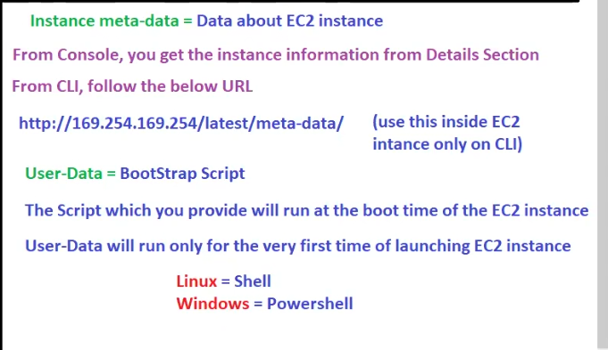
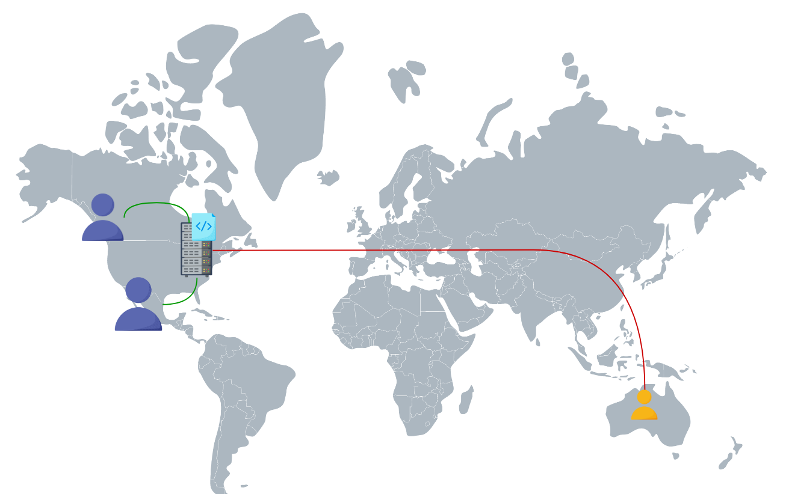
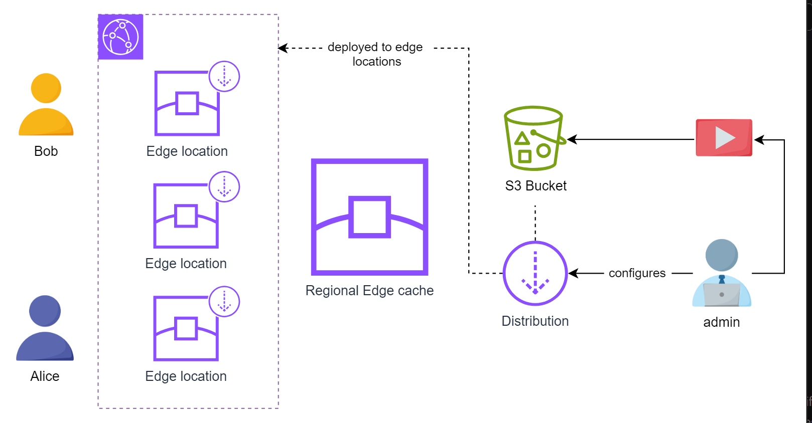
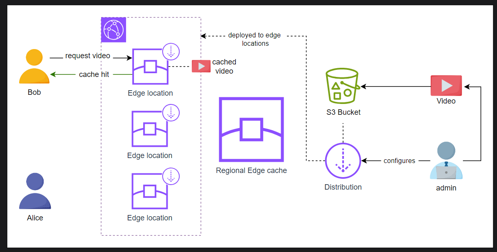
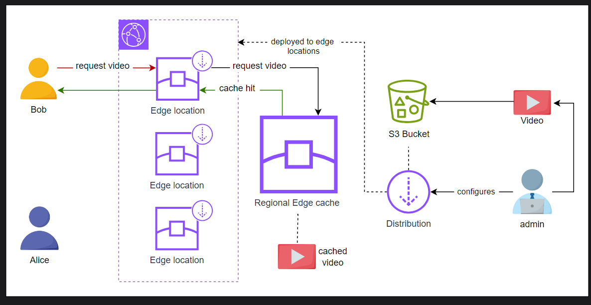
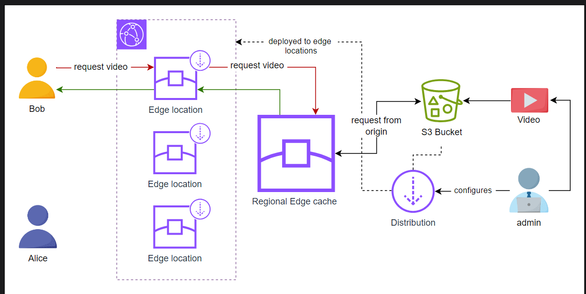
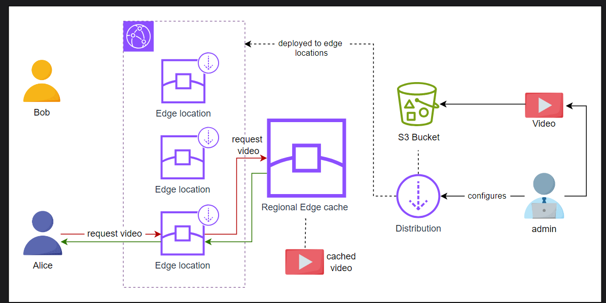
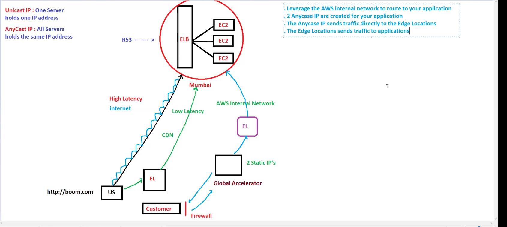

## Revision

Autoscaling (scale in scale out based on load)

>Dynamic scaling(scaling based on load) is recommended one

based on launch template (has steps to launch ec2 ),ASG will launch EC2! the application will be in AMI!!

based on requirement you can integrate SNS(Simple Notification Service)!!

then we learnt about load balancer!! 

network load balancer support static ip (1 static ip per AZ).

> we can't increase capacity on runtime !! we need to stop and then increase capacity by changing instance type!! in runtime only solution is ASG!! we increase capacity as when we have single Database server so if slow DB then we use scale up by changing instance type!!

# EC2 continued

### Types of Ip

1. public ip
2. private ip
3. elastic ip(EIP)

when we launch ec2 ,private ip ia assigned to ec2 !! based on range of subnet ip is assigned to ec2!!

now with private ip you canty connect to ec2!! we need public ip to get connected to ec2!!
we know this we put public ip to connect to ec2!!

> but we also know each time we stop the instance and restart public ip is changed so for that purpose we use elastic ip !! elastic ip are public ip that is not changed!!

>private ip is static (it never changes)

private ip is mandatory (ec2 will have)!!

public ip and elastic ip is optional(ec2 may or may not have)!!these are used to connect to internet only!! don't expose ec2 to public in real time!!

>within same  VPC two ec2 instance can communicate by IP!!

>From company we use VPN to connect to ec2!! so vpn convert your ip to that ip in VPC !! and now you can communicate with that ec2 using that instance private IP!! we rarely use public ip or elastic ip in real time!!

> you can have public ip or elastic ip!!not both!

### What is ENI? 
An Elastic Network Interface (ENI), also known as a Network Interface, is a virtual network card that can be attached to the EC2 instances. ENI is a logical networking component that can be used to provide multiple IP addresses or attach an instance to different subnets. An Elastic Network Interface (ENI) in AWS is associated with an Availability Zone (AZ) in a region. This means that we can attach and detach the ENI to different instances within the same Availability Zone.

Every instance launched has a default network interface, known as the primary network interface; by default, it offers a private IP address to the instance. However, it can be configured to offer the public as well as the elastic IP address. A primary network interface can not be detached from an instance. However, we can attach more network interfaces to an instance. The number of network interfaces that can be attached to an instance depends upon the instance type and size. For example, m1.xlarge can have up to 4 network interfaces; similarly, t2.micro can have 2 network interfaces maximum.

>AWS allows us to control whether an instance in the network receives a Public IP address or not. Sometimes, we do not want our instance to communicate with the internet directly to make it more secure. The public IP address of instances is not static by default; it is associated with the instance until it’s stopped or terminated. When we require a persistent IP address, especially when hosting a web application, we use an Elastic IP address. An Elastic IP address offers a static public IP that can be attached directly to an EC2 instance or a network interface. The elastic IP address remains associated until removed and attached to a different instance or a network interface.



Let’s look at a real-world scenario that explains the importance of different types of IPs. Consider an e-commerce website that uses Three ENIs for a secure and reliable network architecture to handle customer orders, manage product inventory, and process payments.

- Public ENI: Connects to a public subnet. This ENI hosts the website frontend, allowing customers to browse products and place orders.

- Private ENI: Connects to a private subnet. This ENI hosts the website backend, including the product database, order processing system, and payment gateway integration. It communicates securely with the public ENI for order details.

- Admin ENI: Connects to an isolated admin subnet. This ENI allows system administrators secure access to manage the website’s backend servers and databases.

>ENIs and subnets allow the e-commerce store to create a secure and reliable network infrastructure for its e-commerce website. It isolates customer data, implements granular security policies, and enables service migration for increased reliability and customer satisfaction.

> No one give static ip as it is very costly!! even you see home internet !! ip is changing!! 

AWS gives 5 EIP's free!! Elastic ip is created and you are not attached to any ec2 (means wastage) then AWS says it will be billable!!


## Instance Metadata

Data about Instance is called as instance metadata!!

from console you go to details section !! you can get all metadata!!

>from CLI you need to use URL below!!(must in certificate ques)
http://169.254.169.254/latest/meta-data/


To access metadata of an Amazon EC2 instance through the AWS CLI, you typically use curl to interact with the instance metadata service available at the IP address 169.254.169.254. Here’s how you can access the metadata:

Steps to access EC2 metadata through CLI:
- SSH into the EC2 instance (make sure you have SSH access to the instance).
- Run curl commands to retrieve metadata from the instance.
Example commands:

Get all instance metadata:

```bash
curl http://169.254.169.254/latest/meta-data/
```
Get the instance ID:
```bash
curl http://169.254.169.254/latest/meta-data/instance-id
```
Get the public IP:

```bash
curl http://169.254.169.254/latest/meta-data/public-ipv4
```
Get the instance type:

```bash
curl http://169.254.169.254/latest/meta-data/instance-type
```
Get the security groups:

```bash
curl http://169.254.169.254/latest/meta-data/security-groups
```

This method directly queries the metadata service for various pieces of information about the EC2 instance from inside the instance itself

## User data

user data is a text box where we put the script! that script will be executed while ec2 instance boots up so User data is also called as bootstrap script!!

User data is added through the additional details on the instance launch page. Once all the procedures to launch the instance are complete and the instance is launched. The instance may take some additional time to execute the user data script. The user data script is executed automatically after the instance is launched and the operating system boots up.


User data allows to run commands/scripts when launching an EC2 instance. User data can be used to automate configuration tasks and even run scripts after the instance starts. It can be a script or cloud-init directives; scripts can be a shell script or any other scripting language supported by the chosen operating system. Ex:

```bash
#!/bin/bash
sudo yum -y update &&\
sudo yum -y install git &&\
curl -fsSL https://rpm.nodesource.com/setup_21.x | sudo bash -
sudo yum install -y nodejs && sudo dnf install nodejs -y &&\
git clone https://github.com/Educative-Content/aws-compute-services-zero-to-hero-cl-frontend-app.git &&\
cd aws-compute-services-zero-to-hero-cl-frontend-app &&\
npm install &&\
npm start
```

The user data script is OS-dependent, as the above script works with Amazon Linux. The above user data script updates the system packages, installs Git and Node.js, clones a Git repository containing a Node.js application, installs the application’s dependencies, and starts the application.


In contrast, cloud-init directives can launch multiple instances with the same user data. Normally, the user data is executed only once when the instance is launched. However, it can also be configured to execute on instance reboot. Let’s take a look at the cloud-config file example.

```bash
#cloud-config
packages:
  - git
  - npm
write_files:
  - path: /opt/start_react_app.sh
    content: |
      #!/bin/bash
      cd /opt/my-react-app
      npm install
      npm start
      echo "React app started!"
runcmd:
  - git clone https://github.com/Educative-Content/aws-compute-services-zero-to-hero-cl-frontend-app.git 
  - chmod +x /opt/my-reactapp.sh
  - /opt/start_react_app.sh
```

This cloud-config file is designed to be used with cloud-init, a tool used in cloud environments to perform initialization tasks on virtual machines or instances when they are first launched. It clones a repository from GitHub and runs the React application

### How user data works
The user data script is executed with root privileges on the instance, allowing it to perform system-level tasks such as installing software, configuring services, and downloading files. 

The script has access to instance metadata, which includes information such as instance ID, Region, Availability Zone, and more. This metadata can be used to customize the behavior of the user data script based on the instance’s environment.

>User data only run one time while launching ec2 instance!!



7 steps to configure ec2 instance!!
1. select AMI (Image is template of OS)!
2. select instance type (use t2.micro for free tier)
3. Instance configuration (how many instance you want to launch ,assign public ip or not ,put user data or not)
4. select storage (EBS volume) (default root volume we get linux 8 or 10 GB windows 30 GB)
default volume type =gp2
5. select security group (use default one)
6. add tags (like name=web server)
7. add pem file 
8. review and launch!

### CDN
we have customer at us accessing server in mumbai so it will have high latency so to solve this,we use edge location (service cloudfront ) for that!!

edge location uses CDN to deliver!!

Imagine a groundbreaking application deployed in the United States. Initially, the application garnered immense popularity among local users, providing seamless access to its content and services. 

However, as the application gains traction globally, users from distant regions, such as Australia, encounter frustratingly slow loading times and inconsistent performance. This scenario highlights a common challenge businesses operating in the digital realm face: ensuring efficient content delivery to users worldwide.



In response to the growing demand for fast and reliable content delivery, Amazon Web Services (AWS) offers a suite of solutions designed to optimize content delivery and enhance user experience. AWS provides Content Delivery Networks (CDNs) such as Amazon CloudFront and Global Accelerator. The CDN services leverage AWS’s robust infrastructure and global network of data centers so businesses can overcome geographical barriers and deliver content swiftly to users across the globe. These services enable organizations to mitigate latency issues and deliver a seamless browsing experience regardless of geographical location by strategically positioning content closer to end-users.
## cloudFront

Amazon CloudFront, AWS’s Content Delivery Network (CDN) service, is crucial in improving content delivery from its source to end-users through smart caching mechanisms and a strong global network infrastructure. Exploring CloudFront’s architecture reveals an advanced system where content distribution, caching, and delivery are managed seamlessly globally. This understanding allows us to grasp how CloudFront efficiently delivers content, leading to better performance, reduced latency, and improved user experiences.
### Origins
Origins serve as the source locations for the content distributed through CloudFront. These can be:

- Amazon S3 Buckets: Commonly used to store static website content, media files, and software downloads.

- Custom Origins: External HTTP/HTTPS servers, Elastic Load Balancers (ELBs), or any other web server.

### Distributions
Distributions are the primary configuration entities in CloudFront, representing the deployment of content to the CloudFront network. Each distribution specifies:

- Origins: One or more origins from which CloudFront retrieves content.

- Settings: Cache behaviors, origin request settings, SSL configurations, and more.

- Domain name: A unique domain name assigned to the distribution (e.g., d1234.cloudfront.net ).
### Edge locations
Edge locations are the points of presence (PoPs) in CloudFront’s global network infrastructure, strategically located around the world. These locations serve as caching endpoints where content is cached and delivered to end-users.

### Regional edge caches

Regional edge caches are larger than edge locations and are fewer in number. They store less frequently accessed content and help reduce latency for users accessing content from specific geographic regions.

### CloudFront behaviors
Behaviors are configurations within a distribution that operate on the principle of pattern matching. They allow users to define:

- Access controls: Specify who can access content and from where.

- Caching policies: Determine how content is cached, including TTL (Time-To-Live) settings.

- Origin request settings: Configure headers, cookies, and query strings to be forwarded to the origin server.

- Security measures: Enable AWS Web Application Firewall (WAF) protection and require HTTPS for content access.

- Geographic restrictions: Restrict access based on user locations.

- Logging configurations: Determine the type of logs generated and stored for monitoring and analysis.

### Integration and limitations
- AWS Certificate Manager (ACM) integration: CloudFront integrates seamlessly with ACM for SSL certificate management, ensuring secure communication between distributions and end-users.

- Upload operations: CloudFront primarily supports download-style operations; any uploads are directed to the origin for processing without write caching capabilities.

### Working

Consider a scenario where Bob and Alice, two users in different regions, aim to access a popular video hosted in an Amazon S3 bucket. Bob resides near an edge location in Italy, while Alice is closer to an edge location in Spain, but they have the same regional cache. Despite their geographical distance, both users benefit from CloudFront’s architecture for efficient content delivery.



Video available at edge location: When Bob initiates a request to view the video, CloudFront checks if the content is cached in the edge location nearest to him. If the video is cached locally, Bob experiences a cache hit, resulting in immediate access to the content with minimal latency.



Video available at regional edge location: On the other hand, if the video is not cached in Bob’s nearby edge location, CloudFront triggers a cache miss. In this case, CloudFront retrieves the video from the regional edge cache, a larger cache shared by multiple edge locations within the same geographic area. If the video is found in the regional edge cache, it is promptly delivered to Bob’s edge location, ensuring efficient content delivery despite the cache miss.



Video not cached at edge or regional edge location: However, if the video is not available in the regional edge cache, CloudFront performs an origin fetch, retrieving the video directly from the S3 bucket, the content’s origin. Once fetched, the video is stored in the regional edge cache for future requests, optimizing content delivery for subsequent users in the same geographic region.



Future fetch requests: When Alice initiates a request to fetch the same video, CloudFront can retrieve it from the regional edge cache.



## Global Accelerator
we know about 
unicast ip : one server having one ip
anycast ip : all server same ip!

Global accelerator gives 2 static ips!! one of these ip is assigned to group of servers!!

>billable 18 $ per month and attached to load balancers

> this ip you can give to user if he wants to raise firewall!! earlier we know we not able to give ip of load balancer but global accelerator attached can give ip!!

AWS Global Accelerator is a service designed to enhance the performance of applications for both local and global users. By creating accelerators, users can optimize the delivery of their internet applications by leveraging AWS’s global network infrastructure.

### Anycast IP addresses and edge locations
AWS Global Accelerator utilizes anycast IP addresses, a special IP address that can be used by multiple devices simultaneously. Unlike traditional unicast IP addresses, anycast IP addresses can simultaneously be assigned to multiple devices or network interfaces. 

This unique feature allows multiple devices to share the same IP address across different locations. Each Global Accelerator edge location has this pair of anycast IP addresses. When traffic is destined for any of these anycast IP addresses, it can be serviced by any Global Accelerator edge locations.

When a user sends a request to an anycast IP address, the internet routing infrastructure automatically directs the request to the nearest available anycast node or edge location. This routing decision is typically based on factors such as network topology, latency, and routing protocols.

By leveraging anycast IP addresses, AWS Global Accelerator ensures that users are automatically routed to the nearest edge location, optimizing data delivery and reducing latency for improved performance.

### Optimizing network connectivity 

AWS Global Accelerator effectively moves the AWS network closer to the customers by employing anycast IP addresses and strategically distributing them across edge locations. This approach minimizes the distance data needs to travel, reducing latency and improving performance. Although this part of the connection still encounters variability inherent in the public internet, it is limited to the segment between the customer and the Global Accelerator edge location.

### Transit over AWS global network
Once the data reaches any Global Accelerator edge locations, it is transited over the AWS global network to reach its destination. AWS’s dedicated global network offers reliable, high-performance connectivity, unlike the public internet, which is subject to external factors and varying performance. With fiber links connecting all AWS regions and complete control over network capacity and performance, AWS ensures optimal data transit between edge locations and destinations

### Comparison with CloudFront
The key difference between CloudFront and Global Accelerator is that Global Accelerator is a network product. It works on TCP or UDP applications, including web apps, whereas CloudFront caches HTTP and HTTPS content. Global Accelerator doesn’t cache anything and it doesn’t provide any HTTP or HTTPS capabilities, and it doesn’t understand the protocol for either of these. So we can conclude that:

- Both CloudFront and Global Accelerator aim to bring AWS’s network closer to users but serve different purposes.

- CloudFront caches HTTP/HTTPS content for faster delivery, while Global Accelerator optimizes network routes for TCP/UDP applications.

### Benefits of AWS Global Accelerator
- Enhanced reliability and performance: By leveraging anycast IP addresses and the AWS global network, Global Accelerator reduces latency and ensures efficient data transit.

- Improved user experience: Users are automatically routed to the nearest edge location, minimizing the distance data needs to travel.

- Network control: AWS maintains complete control over its global network, ensuring consistent performance and capacity management across regions.



these CDN helps from various attacks like DDos ,sql injection!! both services (cloudfront and global accelerator)
integrated with AWS shield(protects from various attacks)!!

>cloudfront caches all data whether static or dynamic