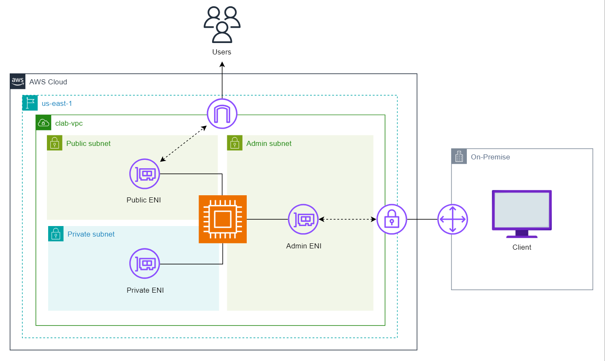
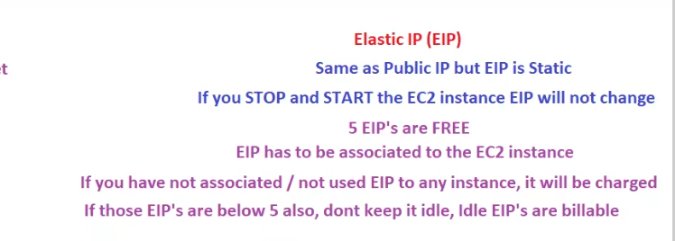
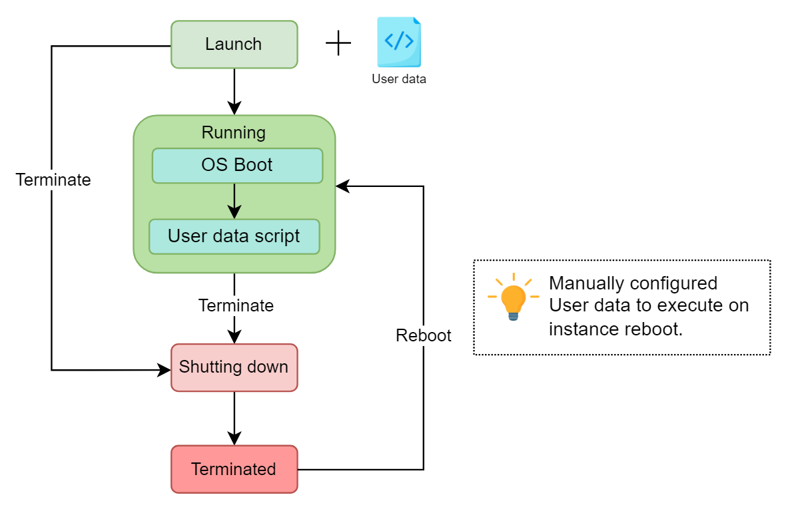
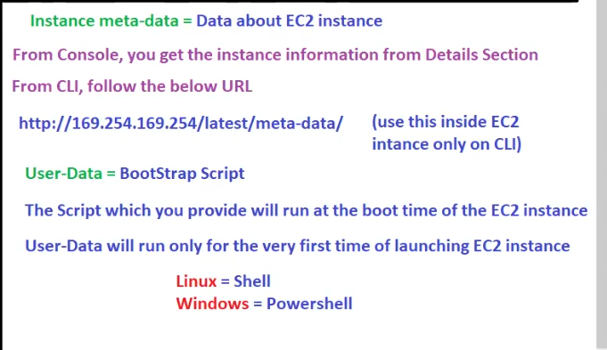

## Revision

Autoscaling (scale in scale out based on load)

>Dynamic scaling(scaling based on load) is recommended one

based on launch template (has steps to launch ec2 ),ASG will launch EC2! the application will be in AMI!!

based on requirement you can integrate SNS(Simple Notification Service)!!

then we learnt about load balancer!! 

network load balancer support static ip (1 static ip per AZ).

> we can't increase capacity on runtime !! we need to stop and then increase capacity by changing instance type!! in runtime only solution is ASG!! we increase capacity as when we have single Database server so if slow DB then we use scale up by changing instance type!!

# EC2 continued

### Types of Ip

1. public ip
2. private ip
3. elastic ip(EIP)

when we launch ec2 ,private ip ia assigned to ec2 !! based on range of subnet ip is assigned to ec2!!

now with private ip you canty connect to ec2!! we need public ip to get connected to ec2!!
we know this we put public ip to connect to ec2!!

> but we also know each time we stop the instance and restart public ip is changed so for that purpose we use elastic ip !! elastic ip are public ip that is not changed!!

>private ip is static (it never changes)

private ip is mandatory (ec2 will have)!!

public ip and elastic ip is optional(ec2 may or may not have)!!these are used to connect to internet only!! don't expose ec2 to public in real time!!

>within same  VPC two ec2 instance can communicate by IP!!

>From company we use VPN to connect to ec2!! so vpn convert your ip to that ip in VPC !! and now you can communicate with that ec2 using that instance private IP!! we rarely use public ip or elastic ip in real time!!

> you can have public ip or elastic ip!!not both!

### What is ENI? 
An Elastic Network Interface (ENI), also known as a Network Interface, is a virtual network card that can be attached to the EC2 instances. ENI is a logical networking component that can be used to provide multiple IP addresses or attach an instance to different subnets. An Elastic Network Interface (ENI) in AWS is associated with an Availability Zone (AZ) in a region. This means that we can attach and detach the ENI to different instances within the same Availability Zone.

Every instance launched has a default network interface, known as the primary network interface; by default, it offers a private IP address to the instance. However, it can be configured to offer the public as well as the elastic IP address. A primary network interface can not be detached from an instance. However, we can attach more network interfaces to an instance. The number of network interfaces that can be attached to an instance depends upon the instance type and size. For example, m1.xlarge can have up to 4 network interfaces; similarly, t2.micro can have 2 network interfaces maximum.

>AWS allows us to control whether an instance in the network receives a Public IP address or not. Sometimes, we do not want our instance to communicate with the internet directly to make it more secure. The public IP address of instances is not static by default; it is associated with the instance until it’s stopped or terminated. When we require a persistent IP address, especially when hosting a web application, we use an Elastic IP address. An Elastic IP address offers a static public IP that can be attached directly to an EC2 instance or a network interface. The elastic IP address remains associated until removed and attached to a different instance or a network interface.



Let’s look at a real-world scenario that explains the importance of different types of IPs. Consider an e-commerce website that uses Three ENIs for a secure and reliable network architecture to handle customer orders, manage product inventory, and process payments.

- Public ENI: Connects to a public subnet. This ENI hosts the website frontend, allowing customers to browse products and place orders.

- Private ENI: Connects to a private subnet. This ENI hosts the website backend, including the product database, order processing system, and payment gateway integration. It communicates securely with the public ENI for order details.

- Admin ENI: Connects to an isolated admin subnet. This ENI allows system administrators secure access to manage the website’s backend servers and databases.

>ENIs and subnets allow the e-commerce store to create a secure and reliable network infrastructure for its e-commerce website. It isolates customer data, implements granular security policies, and enables service migration for increased reliability and customer satisfaction.

> No one give static ip as it is very costly!! even you see home internet !! ip is changing!! 

AWS gives 5 EIP's free!! Elastic ip is created and you are not attached to any ec2 (means wastage) then AWS says it will be billable!!



## Instance Metadata

Data about Instance is called as instance metadata!!

from console you go to details section !! you can get all metadata!!

>from CLI you need to use URL below!!(must in certificate ques)
http://169.254.169.254/latest/meta-data/


To access metadata of an Amazon EC2 instance through the AWS CLI, you typically use curl to interact with the instance metadata service available at the IP address 169.254.169.254. Here’s how you can access the metadata:

Steps to access EC2 metadata through CLI:
- SSH into the EC2 instance (make sure you have SSH access to the instance).
- Run curl commands to retrieve metadata from the instance.
Example commands:

Get all instance metadata:

```bash
curl http://169.254.169.254/latest/meta-data/
```
Get the instance ID:
```bash
curl http://169.254.169.254/latest/meta-data/instance-id
```
Get the public IP:

```bash
curl http://169.254.169.254/latest/meta-data/public-ipv4
```
Get the instance type:

```bash
curl http://169.254.169.254/latest/meta-data/instance-type
```
Get the security groups:

```bash
curl http://169.254.169.254/latest/meta-data/security-groups
```

This method directly queries the metadata service for various pieces of information about the EC2 instance from inside the instance itself

## User data

user data is a text box where we put the script! that script will be executed while ec2 instance boots up so User data is also called as bootstrap script!!

User data is added through the additional details on the instance launch page. Once all the procedures to launch the instance are complete and the instance is launched. The instance may take some additional time to execute the user data script. The user data script is executed automatically after the instance is launched and the operating system boots up.



User data allows to run commands/scripts when launching an EC2 instance. User data can be used to automate configuration tasks and even run scripts after the instance starts. It can be a script or cloud-init directives; scripts can be a shell script or any other scripting language supported by the chosen operating system. Ex:

```bash
#!/bin/bash
sudo yum -y update &&\
sudo yum -y install git &&\
curl -fsSL https://rpm.nodesource.com/setup_21.x | sudo bash -
sudo yum install -y nodejs && sudo dnf install nodejs -y &&\
git clone https://github.com/Educative-Content/aws-compute-services-zero-to-hero-cl-frontend-app.git &&\
cd aws-compute-services-zero-to-hero-cl-frontend-app &&\
npm install &&\
npm start
```

The user data script is OS-dependent, as the above script works with Amazon Linux. The above user data script updates the system packages, installs Git and Node.js, clones a Git repository containing a Node.js application, installs the application’s dependencies, and starts the application.


In contrast, cloud-init directives can launch multiple instances with the same user data. Normally, the user data is executed only once when the instance is launched. However, it can also be configured to execute on instance reboot. Let’s take a look at the cloud-config file example.

```bash
#cloud-config
packages:
  - git
  - npm
write_files:
  - path: /opt/start_react_app.sh
    content: |
      #!/bin/bash
      cd /opt/my-react-app
      npm install
      npm start
      echo "React app started!"
runcmd:
  - git clone https://github.com/Educative-Content/aws-compute-services-zero-to-hero-cl-frontend-app.git 
  - chmod +x /opt/my-reactapp.sh
  - /opt/start_react_app.sh
```

This cloud-config file is designed to be used with cloud-init, a tool used in cloud environments to perform initialization tasks on virtual machines or instances when they are first launched. It clones a repository from GitHub and runs the React application

### How user data works
The user data script is executed with root privileges on the instance, allowing it to perform system-level tasks such as installing software, configuring services, and downloading files. 

The script has access to instance metadata, which includes information such as instance ID, Region, Availability Zone, and more. This metadata can be used to customize the behavior of the user data script based on the instance’s environment.

>User data only run one time while launching ec2 instance!!



