### Lec 27 ec2 practicals

instance meta data we get from details in management console!!

user data is bootstrap script which execute only once when ec2 machine starts!!

for attacks like DDos,we use AWS shield!!

## Practicals

We know ec2 is regional!!make sure you are in mumbai region as you are in India!! any service in AWS you use must be in Mumbai as closest to us!!

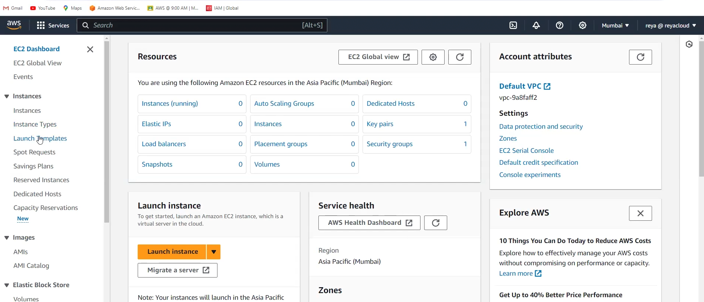

see all these concepts we already know in EC2 console!!

In AMI catalog you see the marketplace, there you can see all customized images!!

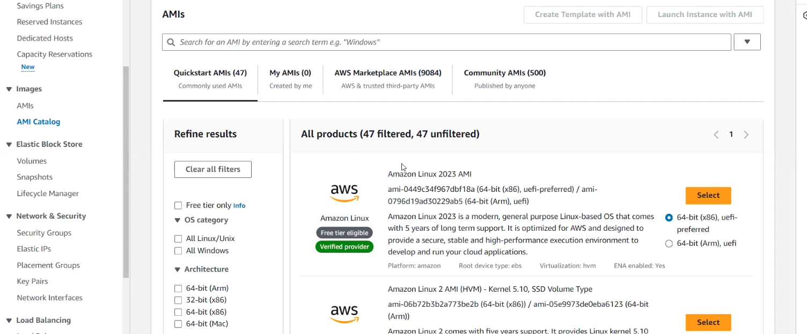

see QuickStart AMIs all are not free!! you need to select AWS free tier filter!!

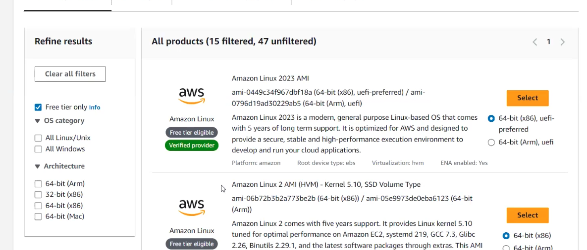

we use redhat OS for now!! also we use x86 and 64 bit architecture!!

In marketplace we have every application!!you can get any application server on marketplace!!like you need jenkins then can see jenkins server where  jenkins will be already available!! if you don't know how to configure!!

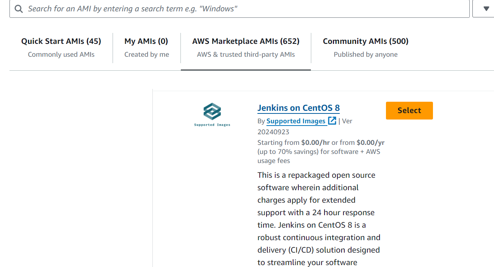

Community AMIS are AMIS made by anyone !! so it is not recommended to use it !! use only verified one!!

in default security group we check only inbound rules!! in inbound rules by default everything is denied!!

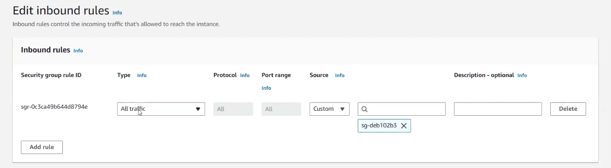

in default security group you have one rule by default that allow all traffic to security group!! this rule says security group has whole access to the all traffic!! as we want security on all traffic so all traffic needed to be accessed by security group!! on src you see custom on right of that we have security group id!!

>never delete default rule!

id deleted default rule by mistake you can add it easily!!

sources custom ,anywhere ,myIP!! we use myIP!! once you select myIp aws automatically takes your ip!!

anywhere means anyone from world can access it !! if you select MyIP only you will be able to access it!!

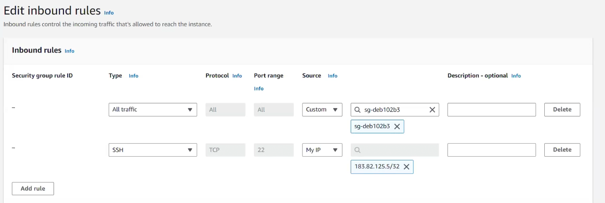

To connect to windows machine we use RDP protocol!!

lets see placement group!!

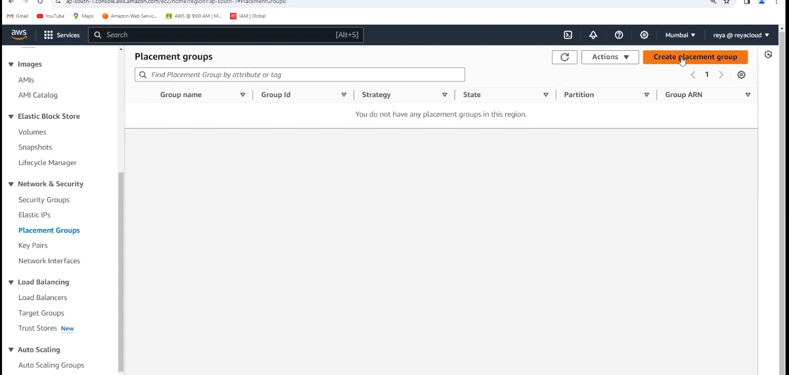

lets create one

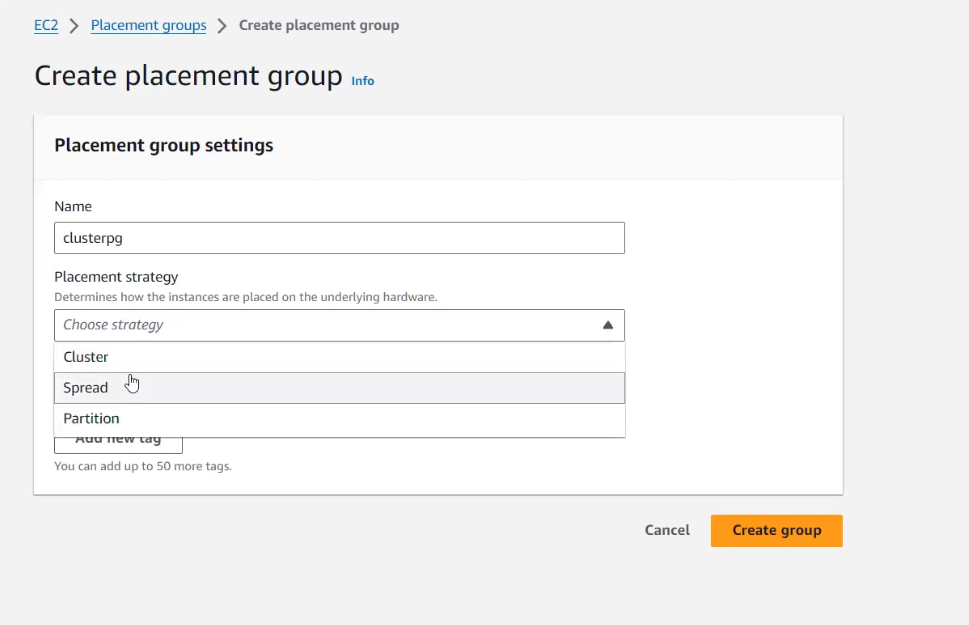

you can use it to group ec2 instance!!

cluster ,partition ,spread placement group we know!!
used to group ec2 instances!!

Network Interfaces on left on ec2 console!! it is NIC(network interface card)(the ip is assign dto NIC card)(if ip assigned then machine will have NIC card)(Aws will manage it) card!!

we know load balancers!!
you can see that too!!

we know target groups!!

we have Ec2 global view!!
it gets to see all ec2 regions in all regions!! used to see all machines in one place!!

you can see various resources running at various regions!! every region will have default vpc!! in vpc we have subnets!! and 1 default security group!!! all instances must be zero if no running!!

## Events on left side of ec2 dashboard!!

aws send notification here in form of events ki this host machine is in maiantainence!!

if something like maintenance is going on host machine and your ec2 goes down so it will be notified in events!!

>if you want to investigate you must go to cloudtrail!! it is service where everything is recorded!!

Look to events regularly!!here aws will send notifications!!

>Global Accelerator in backend has servers has same ip!!which send request to nearest edge location!!edge location don't have same ip!

tags are important when using any resource of ec2!! we are using redhat for reyaz classes!!

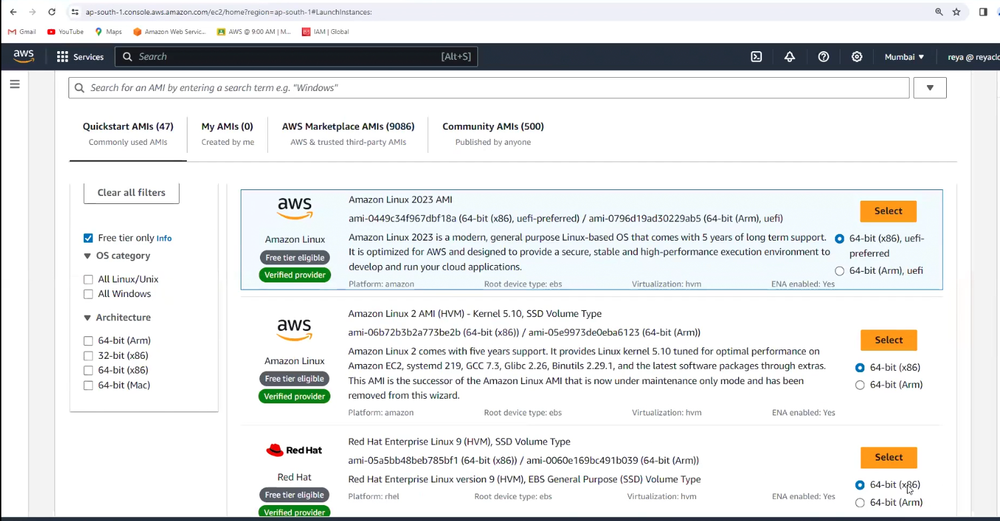

the third one you see here!!

In real time,you need to ask people to launch which instance they need!! don't blindly launch as they say !! you need to analyze the capacity!!

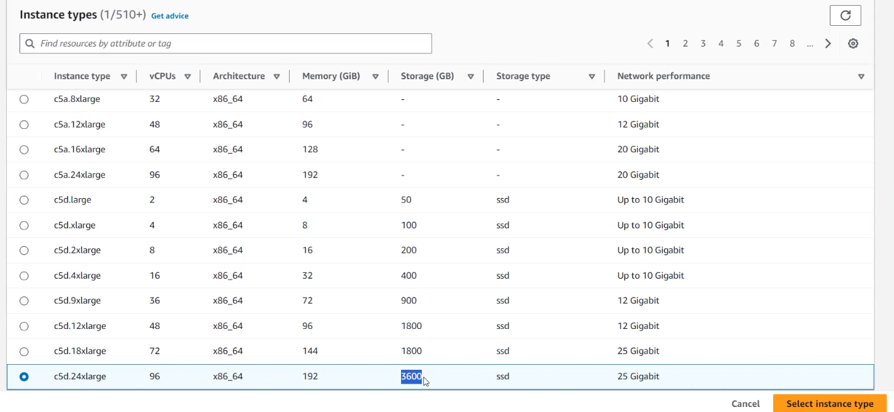

see the storage type you get above is ISV!! we have seen it !! it's only for machine for high configuration for free as we can see above!!

> while launching we can edit network setting and edit default VPC!

VPC always use 1-a or 1-b subnet!! as t2.micro nit support 1-c!!

also while launching auto-assign public ip enable it!! you can disable it if required !! but if you disable it you will not able to connect via SSH!!

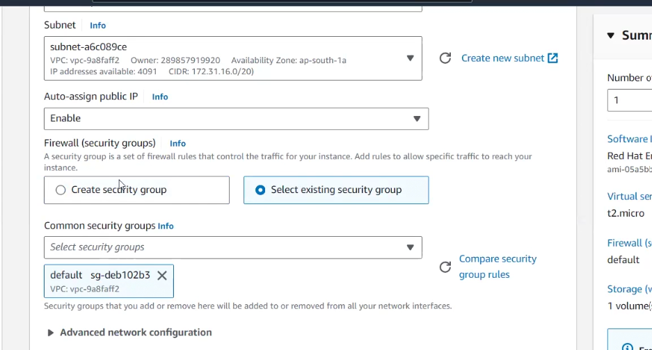

in advanced network settings !! we see 2 network interfaces max 2 we can have!!
by default we have 1 which is for private ip!! other one we get for public ip!!

if you do add network interface! you will be assigning network interface to private ip and not able to assign public ip to ec2 !! and aws will not allow you to do it and will give error!!

you see secondary ip in network interface 1!! secondary ip is for health checks and all so that primary ip is not get congested!! so we can have 2 private ip :

primary and secondary can see in advanced network setting in network interface 1!!

### EFA(elastic fabric adaptor)

if you have heavy application like machine learning application !! it increase your performance!! it is not for t2.micro!!

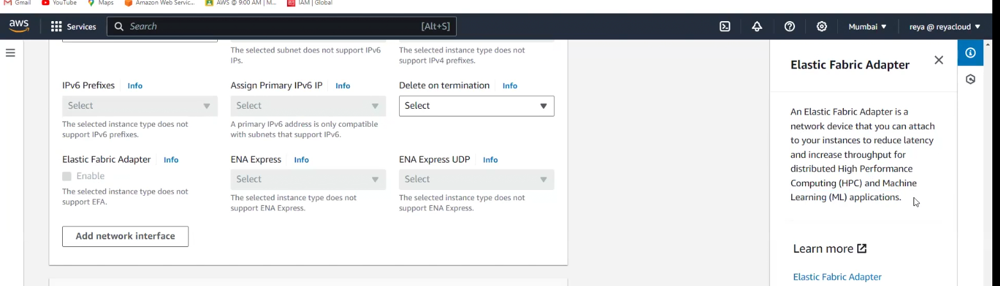

ENA express and ENA express UDP increase performance at network level!!

## storage

not encrypted volume!!
now they are changing to gp3 as default volume!!
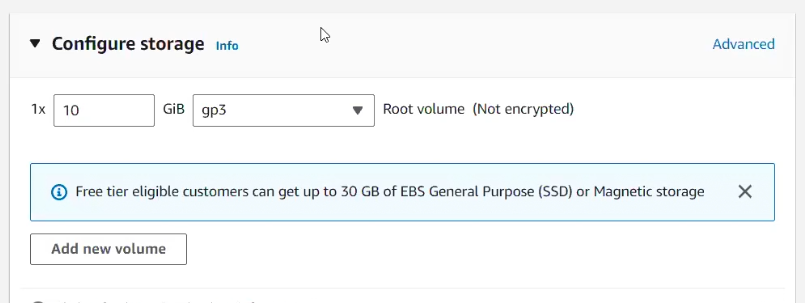

to encrypt we use KMS !! all encryption keys are in KMS!!
KMS has default keys we know!!

 do not increase size from 10GB for linux!! for windows its 30GB!!

 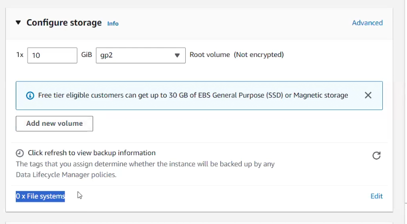

 0 * file systems tells about EFS!! here no EFS attached!!

 let's see advanced details!!
 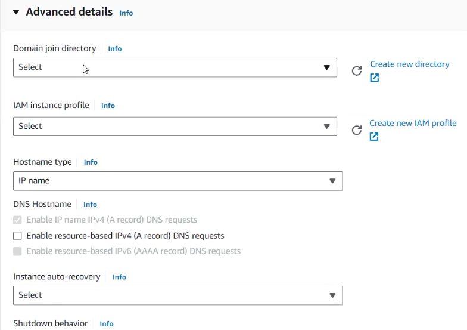

 Domain join directory is active directory where we attach ec2!!

 
