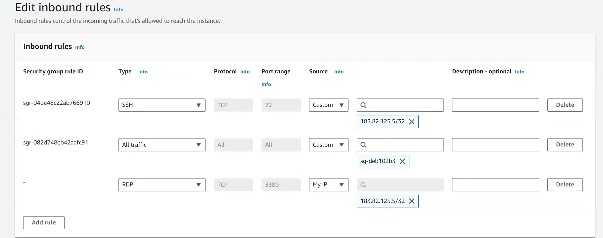
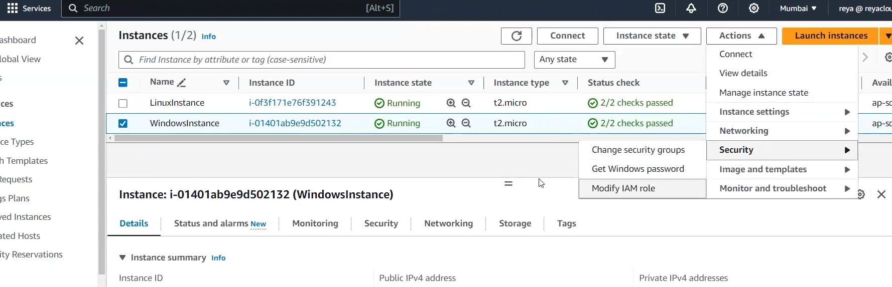
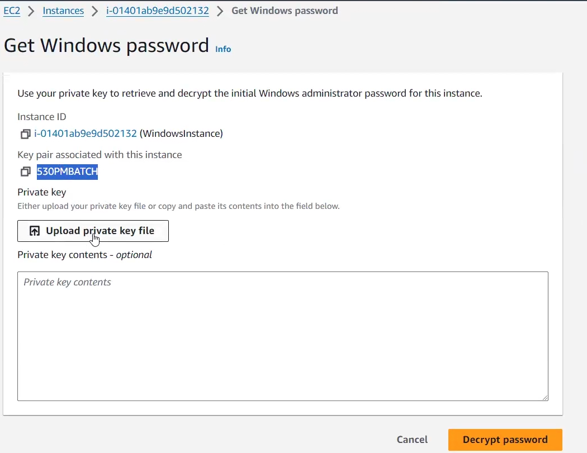
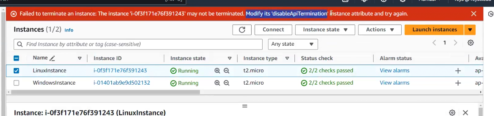
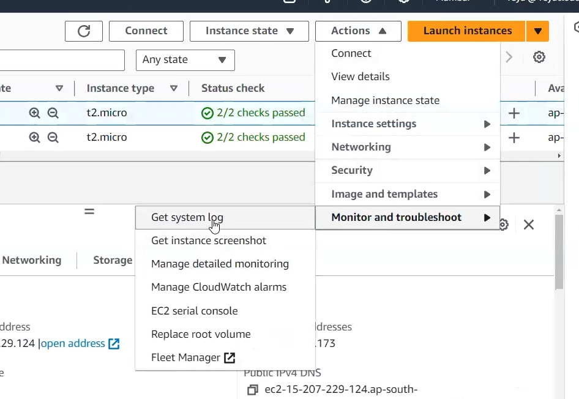
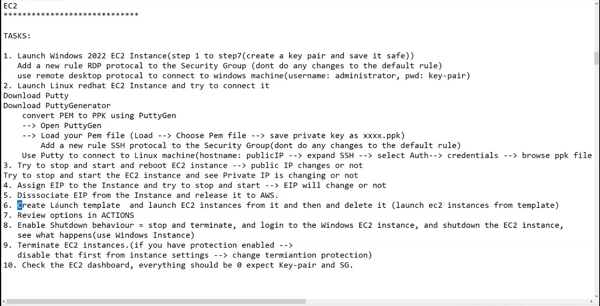

# Lecture 28 connect to ec2 instance

### Revision
in Advanced settings ,we have terminate protection if we enable it ,no one will be able to terminate our ec2 util the person disable the termination protection!!

## States of a instance
6 states in total
- when you launch its pending then it goes to running!!

- if you stop then two states stopping ,stopped

- if you terminate then shutting down then terminated!!

## status check

- system status check
- instance status check

both should be passed and managed by AWS!!

alarm concept is in cloudwatch!!

in Details you can see all instance metadata!!

- to get public ip we have to enable public ip while we are launching ec2 instance!! enable auto assign public ip!!

in Public IPV4 DNS you get host name !!here you see public ip in it!! now when you stop and start ec2 public ip changes so is public DNS!!

see when you stop ec2 you get to know for what you will be billed after stoping ec2 instance!! you will be charged for resources attached to ec2 instance!!

> note: if you stop ec2 we will be charged for root volume as EBS volume!!

To allocate Elastic IP go to left side and go to elastic IP!!!

 don't create global accelerator!! you need to assign it to ec else you will be charged!!

 - select ip go to actions > allocate Elastic IP
 - choose instance you want to assign elastic public ip!!

 Don't choose reassociation!!if ec2 has ip then a new one will be allocated to it!! which is elastic ip! if you choose elastic ip then public ip same as elastic ip!!

 elastic ip can be assigned to load balancer too!!

 remember types of load balancer!! NLB has 1 static ip per AZ so elastic IP can be assigned to that!!

 after launching ec2!!

 in monitoring we see CPU utilization you see for every 5 min if you decrease the time then it will be billable!!

 In security we see security groups!!

 Storage related to EBS volume!!

 we can have 50 tags at max per resource!!

 ## connect to ec2

 to connect to linux we use mobaxterm or putty!

 ### Converting .pem to .ppk using PuTTYgen

1. Open PuTTYgen:
- Launched PuTTYgen from my Windows start menu.

2. Load .pem File:
- Clicked "Load" and selected the .pem file I downloaded earlier. I had to set the file type to "All Files" to see the .pem file.

3. Save Private Key:
- Once the file was loaded, I clicked "Save private key". PuTTYgen prompted me to confirm that I wanted to save the key without a passphrase. I clicked "Yes" and saved the file as a .ppk file in a secure location.

### Connecting to My EC2 Instance Using PuTTY

1. Open PuTTY:
    - Launched PuTTY from my Windows start menu.

2. Configure PuTTY Session:
    - In the "Host Name (or IP address)" field, I entered `ec2-user@your_instance_public_ip`. I found the public IP address in the EC2 Management Console under the "Description" tab of my instance.
    - In the "Category" menu on the left, I expanded "SSH" and selected "Auth".
    - Clicked "Browse" and selected the .ppk file I saved earlier.

3. Initiate Connection:
    - I went back to the "Session" category.
    - (Optional) I saved the session settings by entering a name in the "Saved Sessions" field and clicking "Save". This allowed me to quickly load the settings in the future.
    - Clicked "Open" to initiate the connection.

4. Security Alert:
    - Since this was my first time connecting to the instance, PuTTY displayed a security alert about the server’s host key. I clicked "Yes" to proceed.

5. Connect to Instance:
    - A terminal window opened, and I saw a login prompt. If everything was configured correctly, I was logged into my EC2 instance as the `ec2-user`.

Conclusion

This setup is essential for deploying applications, managing servers, and leveraging the power of cloud computing. As I become more familiar with AWS and EC2, I can explore more advanced features and configurations to suit my needs.

can check it --> https://medium.com/@busekaylan/launching-your-aws-ec2-instance-a-hands-on-guide-with-putty-integration-f0ca333755aa

for windows we use remote desktop connection in your laptop!!thats simple i guess!

to connect to windows ec2 we use RDP protocol with 3389 port

default user name for windows--> administrator

to get password

click on get windows password above

actions >security > get windows password

upload the pem file here!! you will get the password!! to change username use active directory concept!! 

for every new windows server you will get a new password!!

Mac in backend is the linux only!!so can use terminal directly no need of putty!!

whenever you get error just read that error

on actions > instance settings > you can see various options to change various things in ec2!!

Change instance type you will see greyed out as you can't change ec2 instance type while it is running !! you need to stop ec2!!

Nitro enclaves are for trusted execution environment!!

for user data you need to stop ec2 instance and then only you will be able to edit user data!!

now see  actions>networking you see everything about elastic ip!! in manage ip addresses we can assign multiple secondary IPs!!

> Any changes in security group will show effect immediately no need to stop ec2!!

> can attach IAM role anytime while ec2 is running!!

backup of ec2 is image!!we can use image and template menu for creation of images and template!!

> launch template doesn't have data,it have only configuration!! to have data too we use image (image has volume too)!!

>image contains data(EBS volume). launch template only has configurations not data!!

then we have launch more like this in image and template!! it immediately launch ec2 without making the template!!

then we have Monitoring and troubleshoot!

>we first have system logs we need not have to see more about it!!

after disassociation of elastic ip ,release the elastic ip!!

tasks

once done with practical just clean everything up!!

in ec2 dashboard everything should be 0 except security group and key pair!!