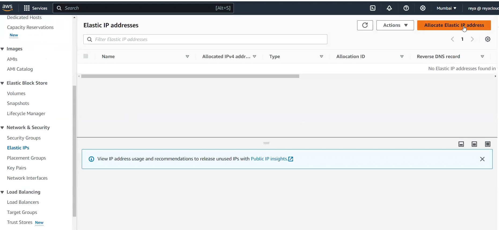

# Lecture 28 connect to ec2 instance

### Revision
in Advanced settings ,we have terminate protection if we enable it ,no one will be able to terminate our ec2 util the person disable the termination protection!!

## States of a instance
6 states in total
- when you launch its pending then it goes to running!!

- if you stop then two states stopping ,stopped

- if you terminate then shutting down then terminated!!

## status check

- system status check
- instance status check

both should be passed and managed by AWS!!

alarm concept is in cloudwatch!!

in Details you can see all instance metadata!!

- to get public ip we have to enable public ip while we are launching ec2 instance!! enable auto assign public ip!!

in Public IPV4 DNS you get host name !!here you see public ip in it!! now when you stop and start ec2 public ip changes so is public DNS!!

see when you stop ec2 you get to know for what you will be billed after stoping ec2 instance!! you will be charged for resources attached to ec2 instance!!

To allocate Elastic IP go to left side and go to elastic IP!!!

 don't create global accelerator!! you need to assign it to ec else you will be charged!!

 - select ip go to actions > allocate Elastic IP
 - choose instance you want to assign elastic public ip!!

 Don't choose reassociation!!if ec2 has ip then a new one will be allocated to it!! which is elastic ip! if you choose elastic ip then public ip same as elastic ip!!

 elastic ip can be assigned to load balancer too!!