## Notes lecture 29

>if you reboot the ec2 instance it will be in running state only!!instance status will not change!!will be in running state only!

let's talk about images topic today!!

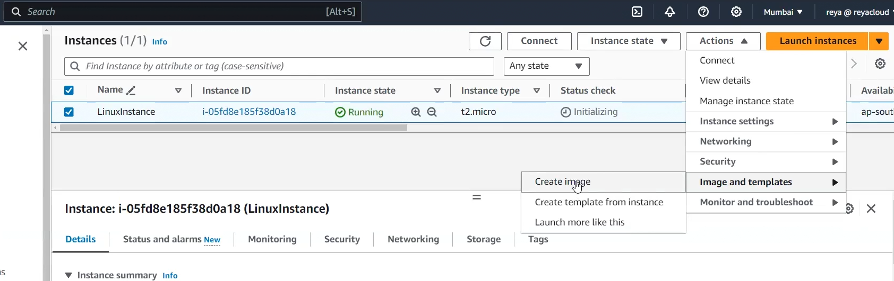

Images is backup of whole ec2 instance!! images includes volumes too!!

backup of volume exclusively is called as snapshot!!

either take snapshot and launch ec2 instance and attach that snapshot volume to that ec2 or take image both are doing same thing!!

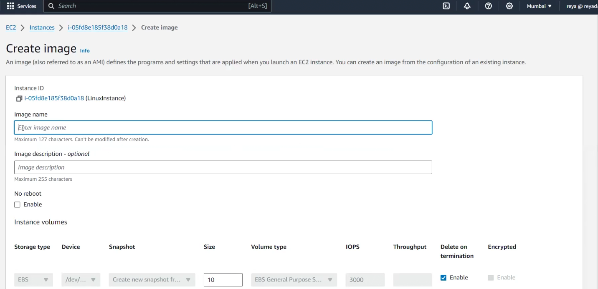

No reboot option if you select if will not reboot but if you not select it will reboot!!

while creating image you can change size (only increase ) of storage(volume)!!

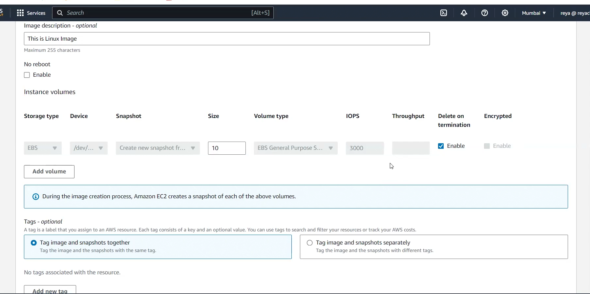

we can encrypt the volume too!! here disabled!!

we can't encrypt ec2 instance!! we can only encrypt the volume!! encrypting ec2 means encrypting the volume inside it!!

> while creating image you can add additional volume too!!you can add EBS or Instance store volume!!

 we can add 24 ISV(from 0 to 23) of each 80 GB(cannot be changed) but EBS can be changed!!!

> V.V. Imp-->ISV cannot be encrypted but EBS can be!!

we know that whenever we create image ,snapshots of volume will be created too!

Tags are optional to add!!

by default images are private!! by default in AWS everything is private!!

from image you can launch ec2 instance as seen below:-
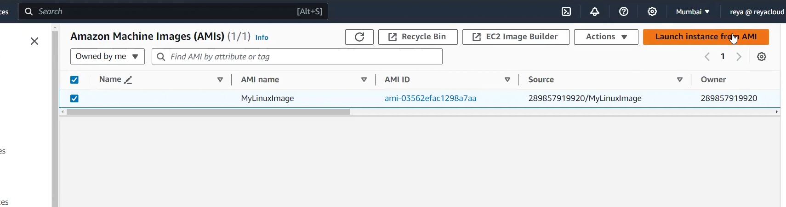

we can share image from one AZ to other also from one account to other!!

> not recommended to use public images!!

we cant launch ec2 instance from disabled images!!
## Actions
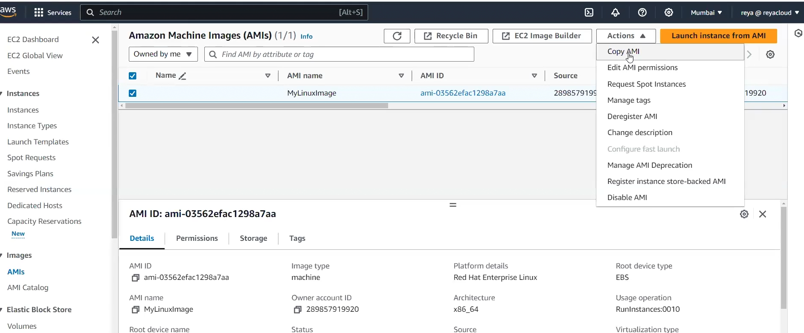

copy image will give you option to encrypt the unencrypted image and also option copy image from one region to other!

to encrypt select encrypt option and copy image in same region!!

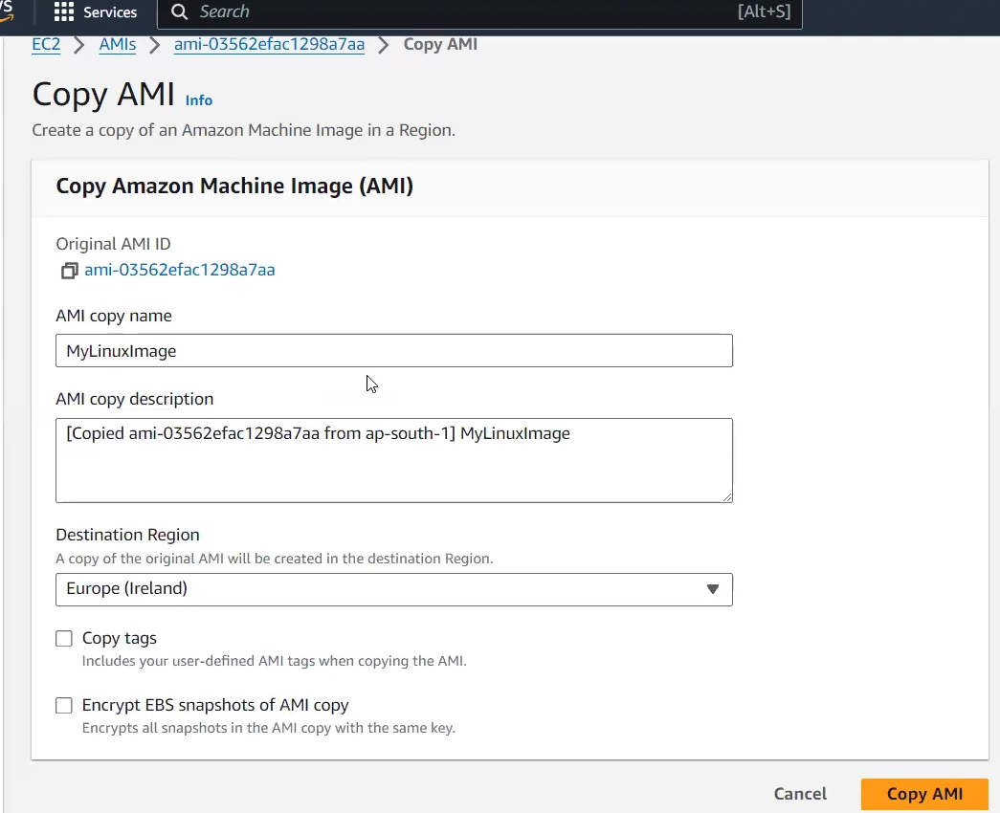

>when you copy from one region to other AWS will charge for transfer of data!!

to not get bill immediately go to region where you have copied go to AMIs and deregister the copied one!!

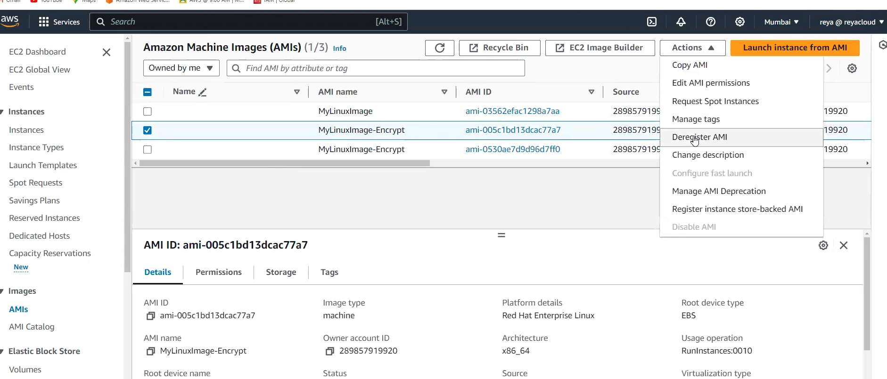

to delete an AMI we just deregister it!!

### in actions>Edit AMI permissions!!

click on edit we share AMI by Adding account ID!!

we can even share to an organization !!

we have another action manage AMI deprecation!! where we can set when the image will be deprecated!!

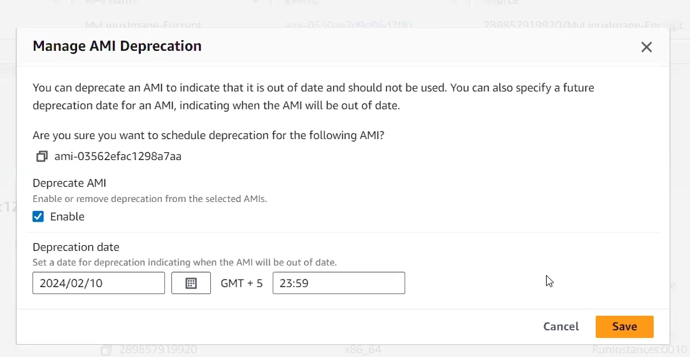

then we have disable AMI option where if we disable AMI then it will not be able to launch instance!!

then we have instance store backed AMI!! but we are using EBS store backed AMI's!! from s3 we can create Instance store backed AMI's!!!

---

while launching instance in advanced settings we have purchasing options where we can spot instance!!

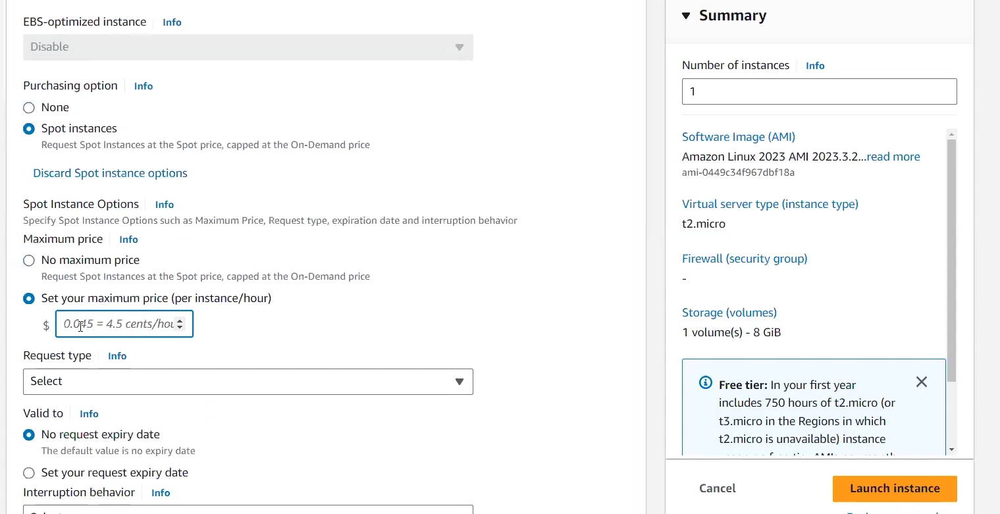

in that request type we have one time which means instance will not stay with you and another one is persist which means it will persists!!

---

Snapshot created by AWS while creating images cant be deleted as they are attached to those images!! first delete AMI's and then snapshots!!

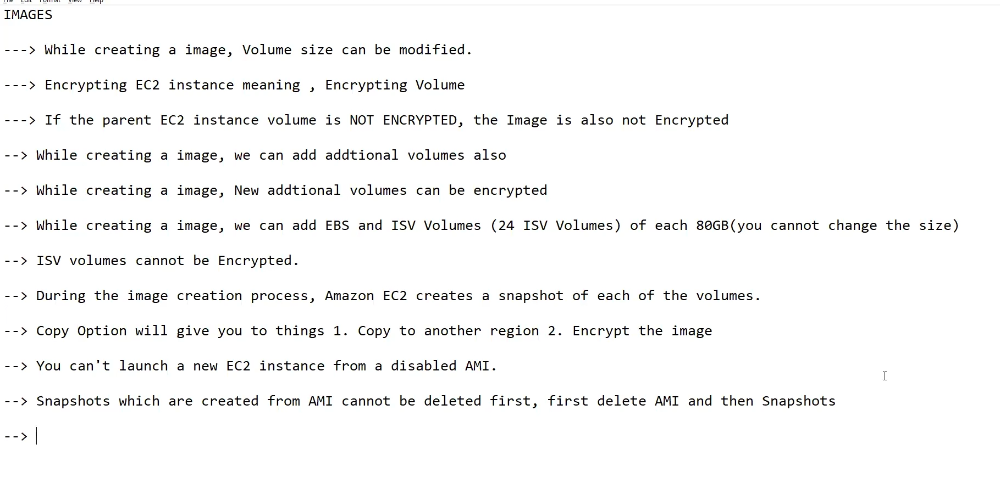

images and snapshot does not have AZ !! but when we create volume out of snapshot than it has AZ!!

>create volume as in same AZ as you want to attach in EC2!!

>V.V.Imp from snapshot of root volume which has OS Images can be created too!!

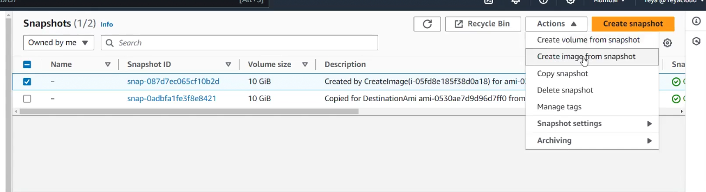

see above image from snapshot can be created if snapshot has OS!!

snapshot has 2 tiers
- standard tiers
- archive tiers --> if not used then put here, to restore from here it takes 24 to 72 hours!! from archive tier you cannot create volume

on modify permissions we can share the snapshot!!and even make it public!!

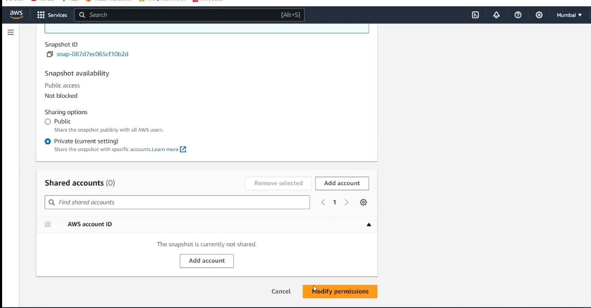

we can even lock the snapshot see below and read about it two modes

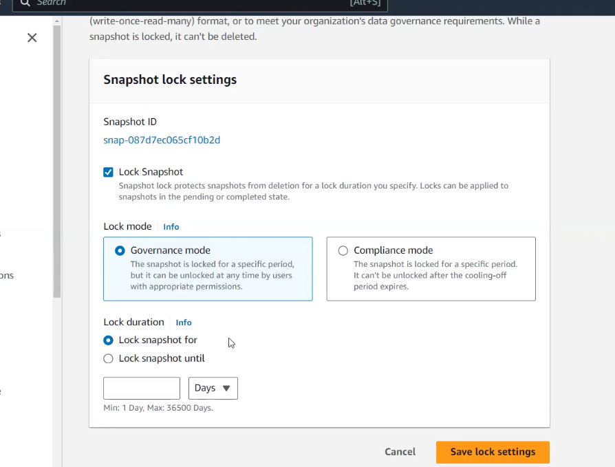

>just read above images for two modes

in snapshot, AMIs we have recycle bin , if you delete snapshot snapshots and images come here if you have retention rule!! you need to create retention rule!! we need to tell which tags images needs to be moved to recycle bin!! all the images you want to put to recycle bin put them in same tag!!

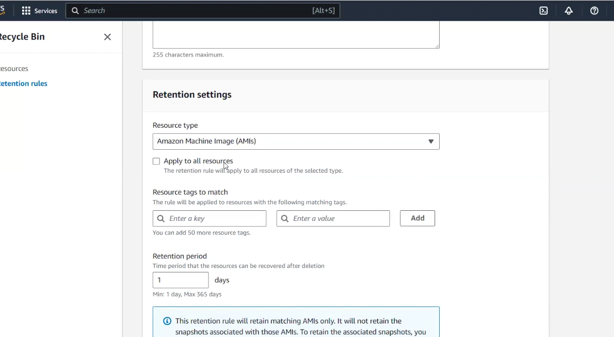

you need to tell which tags to match!! if you check apply to all all amis will be moved to recycle bin!!

in a retention rule also we can have max 50 !!

in retention period we put time period (max 365 days) after which the images will be permanently deleted!!

you deregister images it will move to recycle bin if same tags and after 365 days(if you select that) images will be deleted!!

ec2 instance delete then AMis deleted than snapshots deleted!!
even delete retention rule!!

everything should be zero except key pair and security group!

