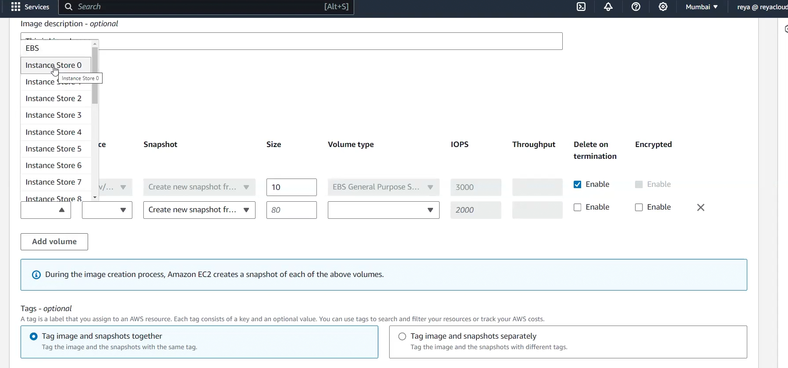

## Notes lecture 29

>if you reboot the ec2 instance it will be in running state only!!instance status will not change!!will be in running state only!

let's talk about images topic today!!

Images is backup of whole ec2 instance!! images includes volumes too!!

backup of volume exclusively is called as snapshot!!

either take snapshot and launch ec2 instance and attach that snapshot volume to that ec2 or take image both are doing same thing!!

No reboot option if you select if will not reboot but if you not select it will reboot!!

while creating image you can change size (only increase ) of storage(volume)!!

we can encrypt the volume too!! here disabled!!

we can't encrypt ec2 instance!! we can only encrypt the volume!! encrypting ec2 means encrypting the volume inside it!!

> while creating image you can add additional volume too!!you can add EBS or Instance store volume!!

 we can add 24 ISV(from 0 to 23) of each 80 GB(cannot be changed) but EBS can be changed!!!

> V.V. Imp-->ISV cannot be encrypted but EBS can be!!

we know that whenever we create image ,snapshots of volume will be created too!

Tags are optional to add!!

by default images are private!! by default in AWS everything is private!!

from image you can launch ec2 instance as seen below:-

we can share image from one AZ to other also from one account to other!!

> not recommended to use public images!!

we cant launch ec2 instance from disabled images!!
## Actions

copy image will give you option to encrypt the unencrypted image and also option copy image from one region to other!

to encrypt select encrypt option and copy image in same region!!

>when you copy from one region to other AWS will charge for transfer of data!!

to not get bill immediately go to region where you have copied go to AMIs and deregister the copied one!!

