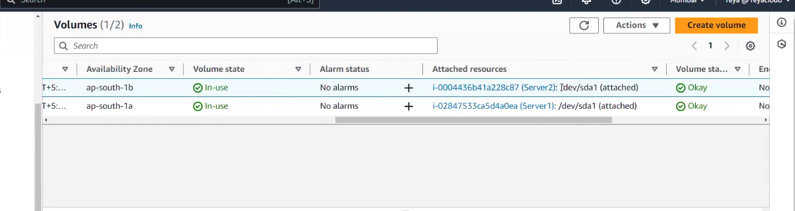
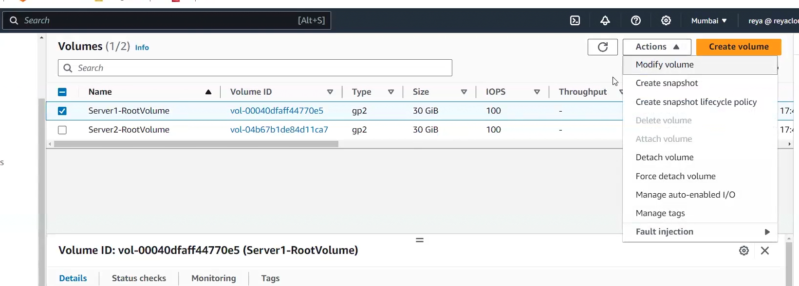
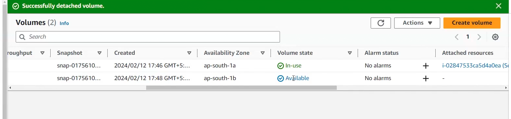
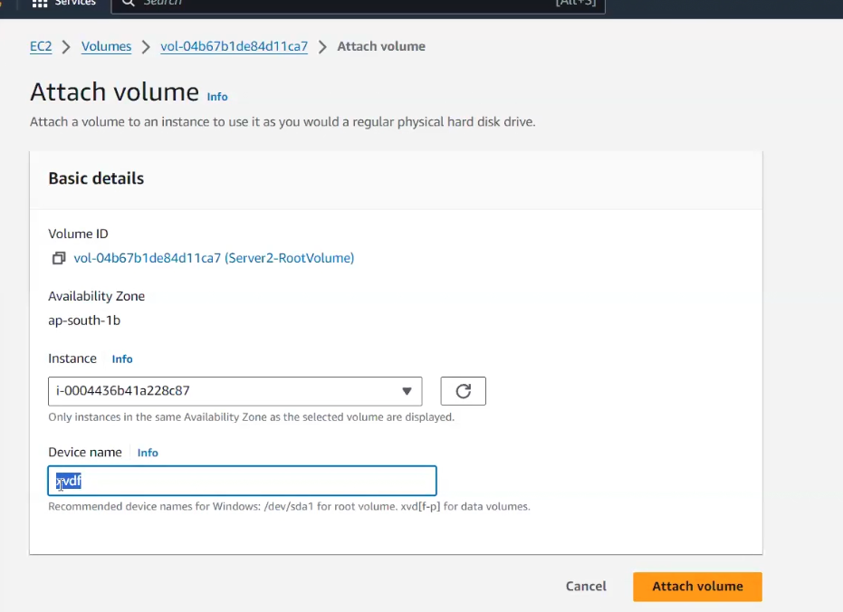
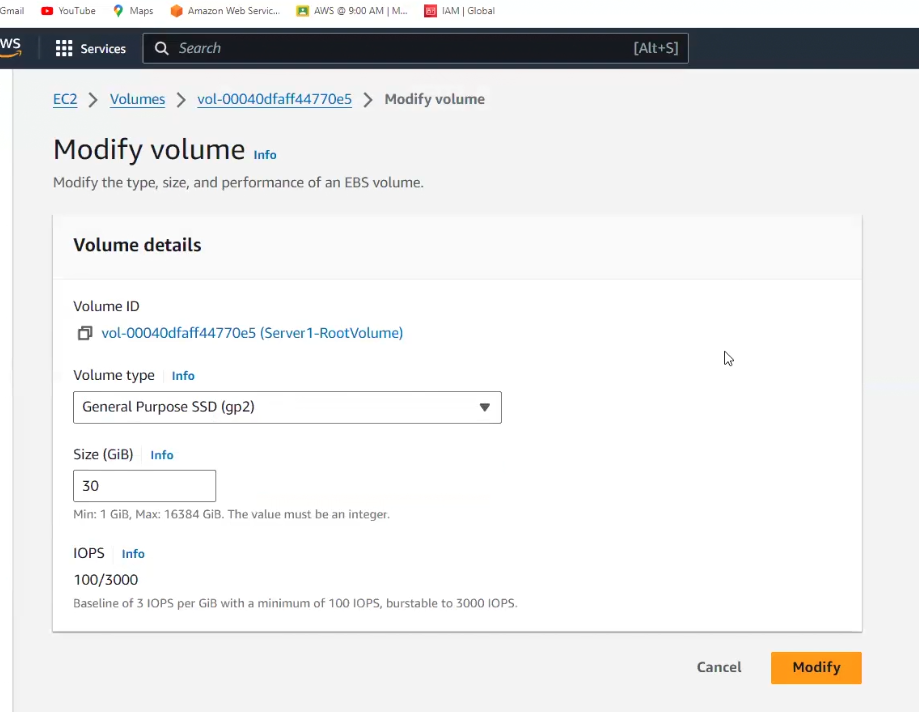
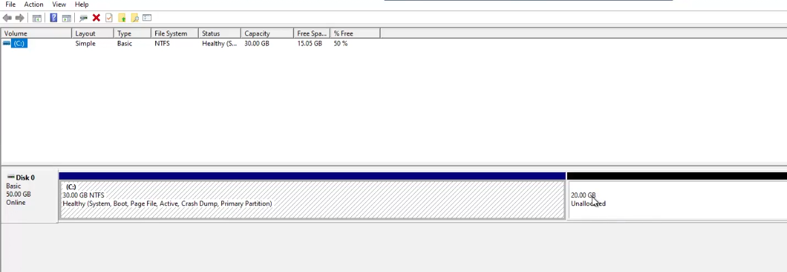

## Notes lecture 30

today we see volume and lifecycle manager!!first launch ec2 instance!!

to get more instance like running instance click on actions after selecting running instance then images an templates>launch more like this.

for 2 ec2 instance there will be 2 volumes!! 

to get which volume attached to which ec2 instance just go to volumes and select that volume and go to column attached resources!! and then change name of volume and put any name!!

/dev/sda1 is root volume .if you see in attached resources then you will be able to see it!!

to get password for windows server using pem file select windows server

got to actions > security > get windows password >upload key> decrypt password and then you get password

## volumes > actions

1. Modify volume (see later)
2. create snapshot backup of volume is snapshot just simply create it. to take snapshot 
automatically we use lifecycle manager by creating policies!!
3. Create lifecycle snapshot policy related to lifecycle policy
4. delete volume (greyed out) as attached to ec2
5. attach volume ( greyed out) as already attached
6. detach volume ( to detach volume )( to detach root volume stop ec2 and then detach)
  in volumes you see detached volumes in available state and attached volume in in-use state

    
    now as root volume is detach you can't start ec2 instance!!

    you need to attach to ec2 to make sure ec2 runs!! go to volumes 
    actions>attach volume

    1-b AZ can be attached to 1-b ec2 instance so limited AZ!! so will not able to see
    ec2 of other AZ!!
    

    can see device name recommendation!!
    we can attach 1 volume to 1 ec2 but io1 ,io2 can be attached to max 16 ec2 instance

    these (io1,io2 ) only can be attached to multiple ec2 instance!!

    for additional volume you can detach while ec2 is running

7. force detach volume (only works for additional volume) as sometimes when ec2 is running and 
we try to detach volume it will say you can not detach so in that case you need to forcefully detach!!

8. Mange auto-enabled I/O ( I/O enabled don't disable it!!)

9. Manage tags

10. fault injection (not required as new)

## Modify volumes

lets say we have volume of 30GB windows now customer says 30 Gb full!! now we want to
increase to 50 GB!!

we can change volume type and even increase size!!  
also the volume size can only be increase not decreased!!

root volume only supports SDD not HDD!!

now on windows server go to disk management!! we increase from 30 GB to 50 GB !!
so on disk management 20 GB is unallocated! AWS have no access to disk management

on 30 Gb click on extend volume and click on next next till finish!! so we increased volume 
size on fly!!

