# Lecture 31 notes

previous lecture we have seen the script

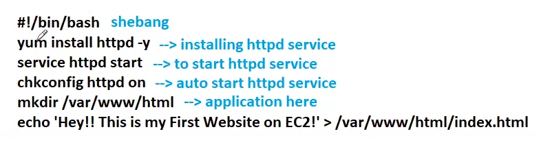

httpd is a web server!!

/var/ww/html is apache application place!!apache search for application in that place only!!

multiple ec2 instance create image and create ec2 from that!!

## Load balancer

1. in user data we put this script and launch 2 ec2 instances!!

2. to access application we use http or https 
protocol 

    Encryption certificate for https protocol is done in amazon certificate manager (ACM) this is billable so we ue http only!!

    allow http protocol in security group!!

3. make sure application working on ec2 take ip and
 check protocol and if not working check security group or syntax of code

4. first we create target group and then we create application load balancer

5. we also nee to configure health check of application!!and we expect 200 status code

6. load balancer listens on http on port 80 for https 443. the load balancer 
should be internet facing!! if it is internal facing then private load balancer !!
if you want that load balancer should work in vpc we use internal facing!!

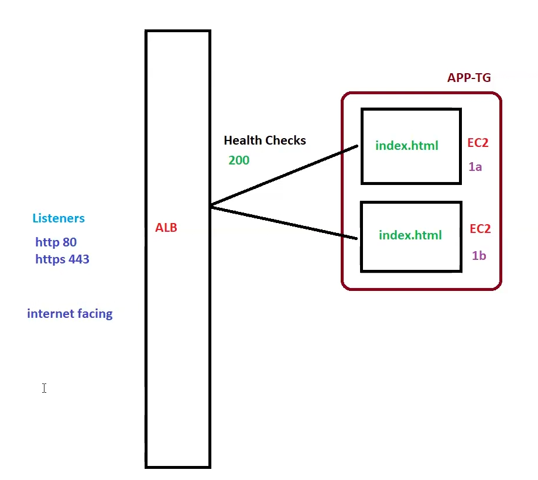
---

> In user data do not forget to put script!!

we put application in 2 ec2 instance!!use free tier red hat then only above script will work!!

let's try creating target group!!

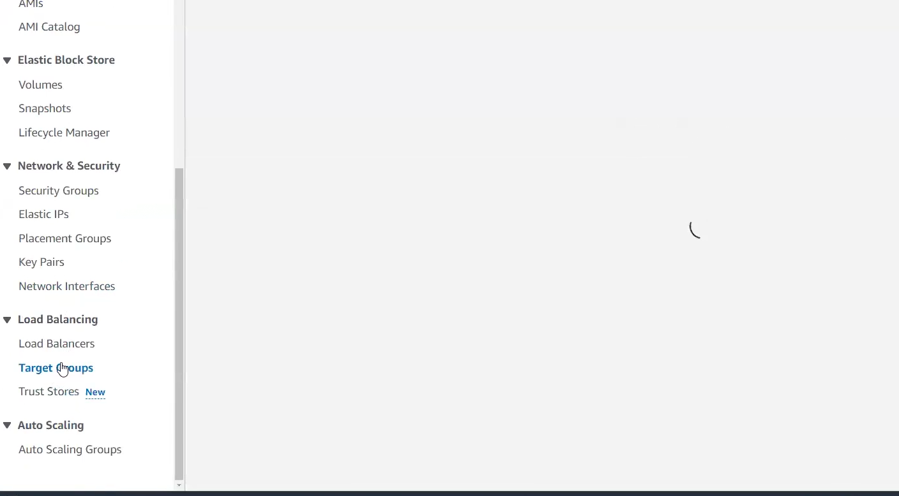

on left side we have target group!!  click on create target group!!

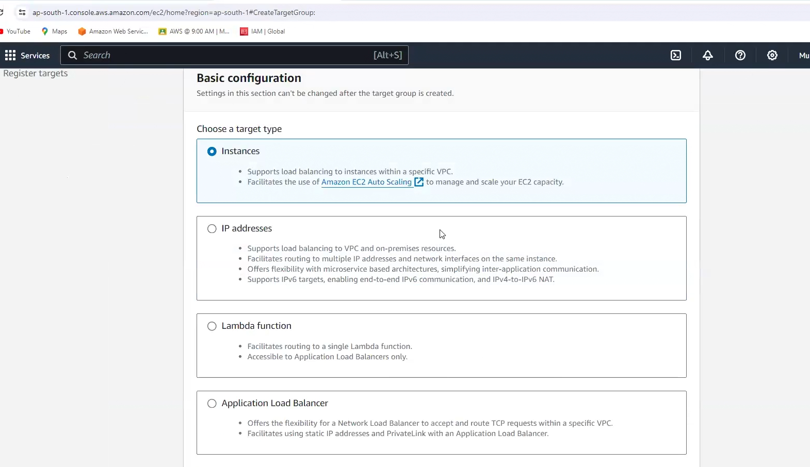

we have target as instances then we have group name 

then tell about the protocol you are using!!

then ip either ipv4 or ipv6!!then vpc !!then choose protocol version!!

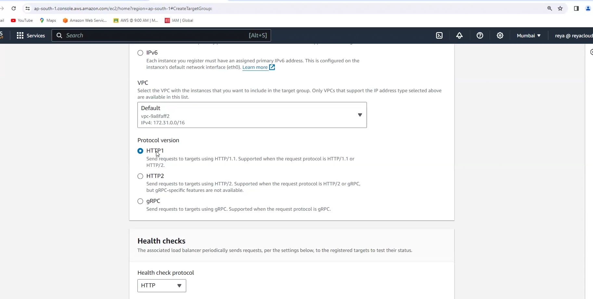

then health check url !!put application url!!put /index.html(do not forget to put /)!!

 let's see advanced!!

 healthy threshold  consecutive checks to get to know the application is healthy!!
 
 unhealthy threshold consecutive checks to get to know if application is unhealthy!

Timeout time it wait to get response!!

interval time difference between two health checks!!

this health checks will happen for each nad every ec2 instance in which application is there!!

then click on next

then we need to register ec2 instance!!
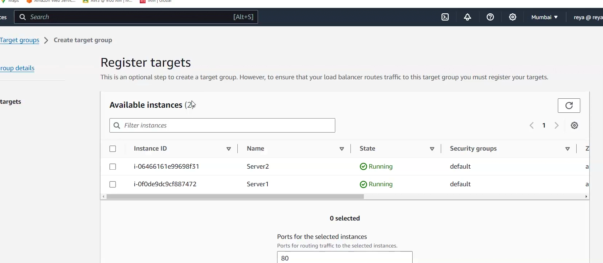

select and click on include as pending below!!

and then click on create target group!!

now on target group you see the target group! and then see 
targets in target group!!

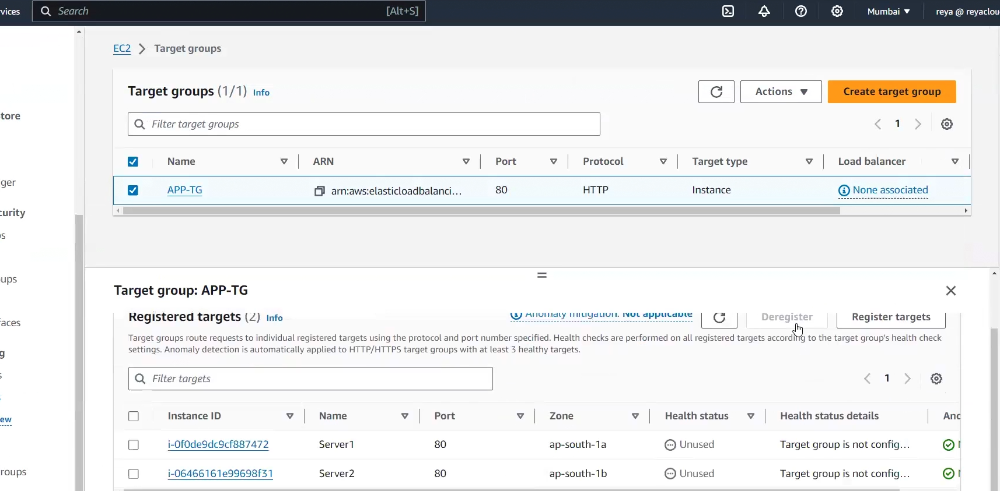

to get same type  server use option actions>images and security > launch more like this!!

     
## create load balancer
- go to load balancer then create  select application load balancer
- give name and then internet facing then ipv4 dual stack means both ipv4 and ipv6
- select AZ and security group
- then on listeners select target group!!
- for security we have AWS web application firewall (WAF) billable similarly
global accelerator
- just click on create load balancer

we use dns name to access load balancer!!

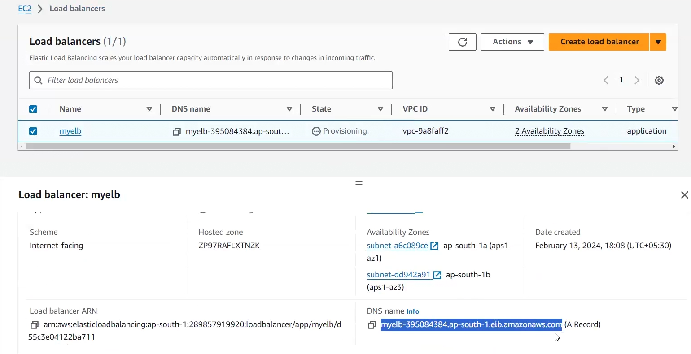

our load balancer is provisioning !! wait till it get active!!
to get a good url we can use route53!!

we use dns name to get to our website!!

see on server 1 first

then on server 2!!

this is load balancing!!

 # Actions of target group
 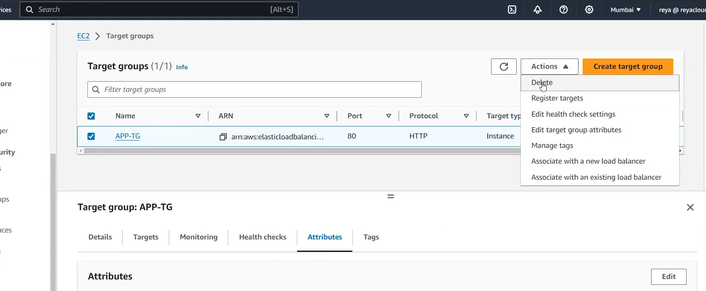

not discussed are just simple ones

## edit target group attributes!!
 to remove a ec2 from target group we deregister it!! 

 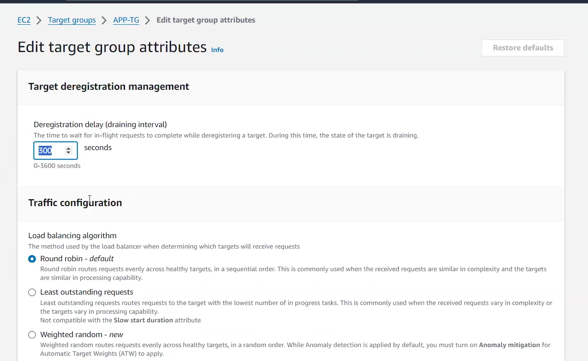

 - target de-registration management if we deregister a ec2 instance how much time it will take to
 delete that ec2 from target group as there might be traffic on that ec2 instance so those 
 request will be completed first!!

 - then traffic configuration - algo which to use for load balancing!!
 default is round robin!!

 - stickiness - session (our entire request goes to one server if we change server
 then session over) so this helps to stick to one server only!!

in monitoring you see access logs and connection logs to see all logs 
sometimes customer wants to see that!!

 ## load balancers

 cannot set primary and secondary all servers are same for load balancer!!

 # TASKS
 launch server 3 and 4 put admin.html page in that with some other line 

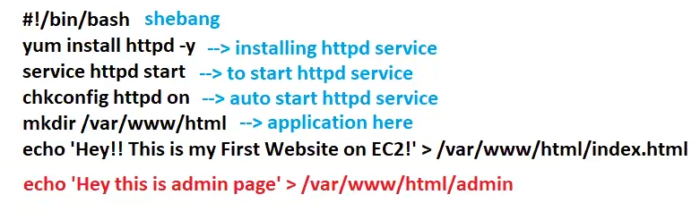

just change lat line as shown!!

in load balancer set rule if someone put to ELBURL/admin ten it goes to 
server 3 and 4!!
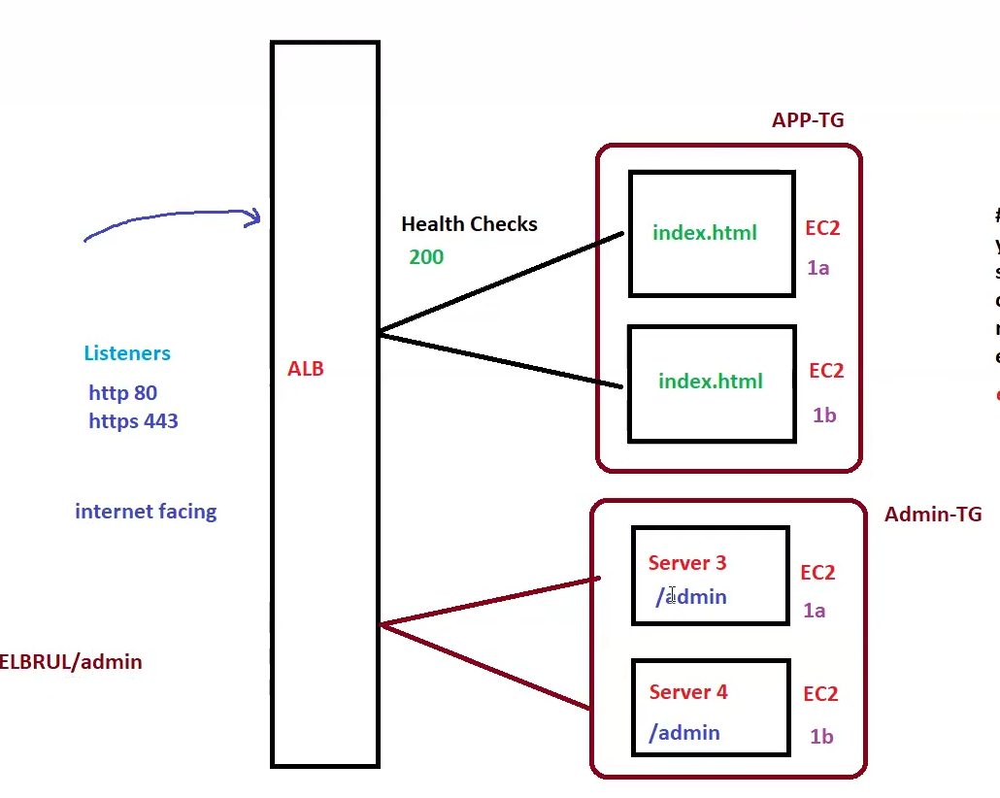

we put server 3 and 4 in separate target group!!

we need target group ,load balancer and instances here!!

to set up rule 
- go to load balancer and then listeners and rules click on one rule 
you already have for previous target group
- then click on add rules
    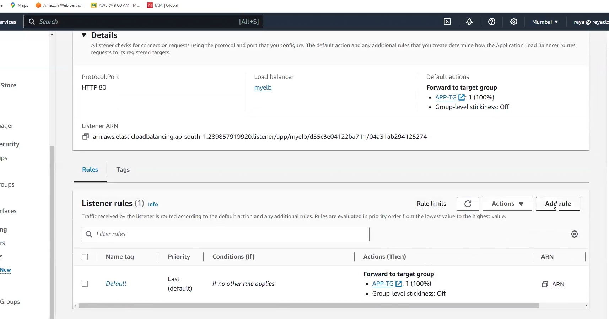
-   give name of rule  
- add condition of path give path /admin and click on next
- tell which target group to forward!!

if you don't have server 3 and 4 then it displays following page

## how to generate certificate ACM
 - go to ACM
 - click on request certificate
 - for certificate we need to put domain!! to purchase domain route53 can be used!!
 - put domain name
 - then click on request!!
 - click on certificate id 
 - click on create record in route53
 - then you have valid certificate
 - then in load balancer put in listeners
    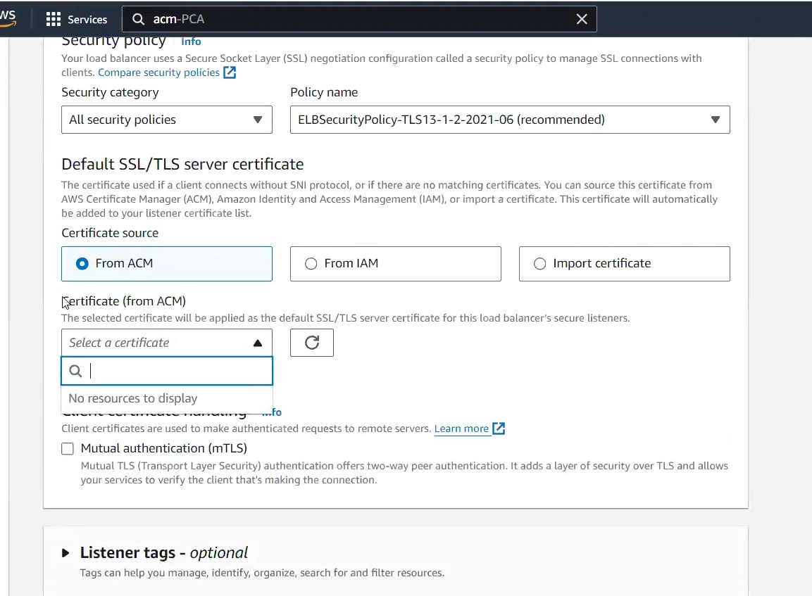

    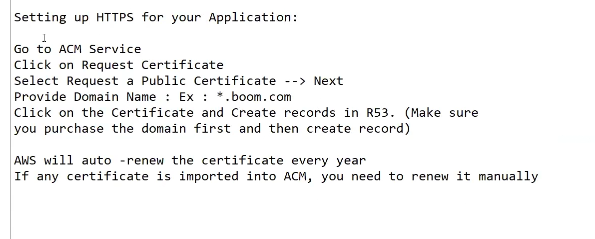

at end terminate all!!everything should be zero except key pair and security group!!

for ip of load balancer use global accelerator then you get 2 static ip!!