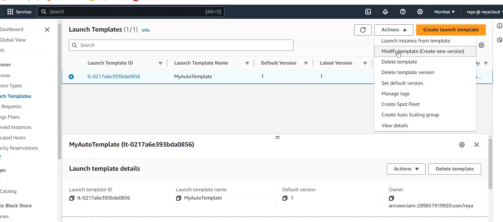
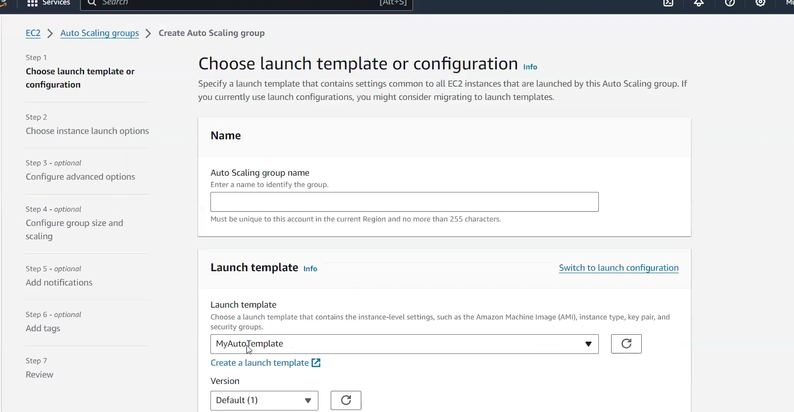
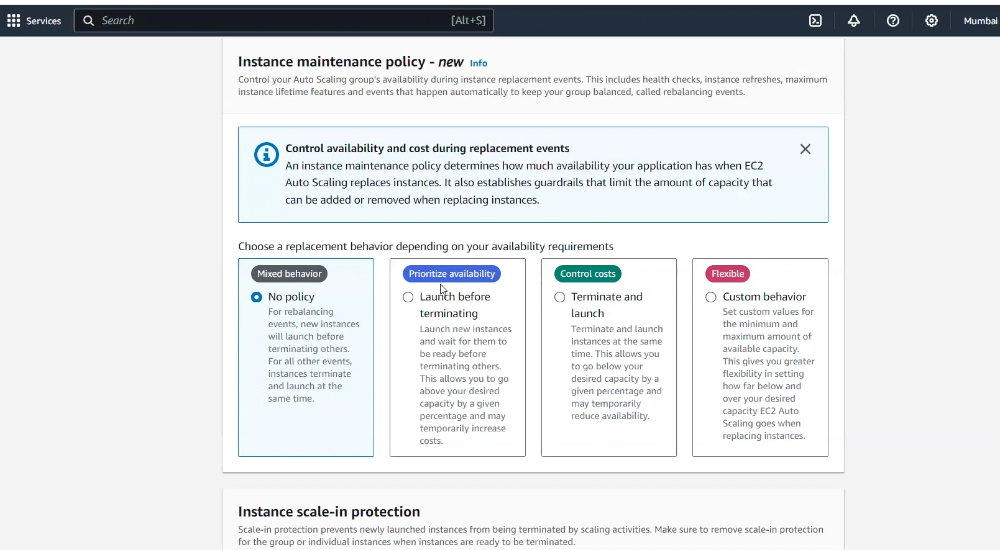
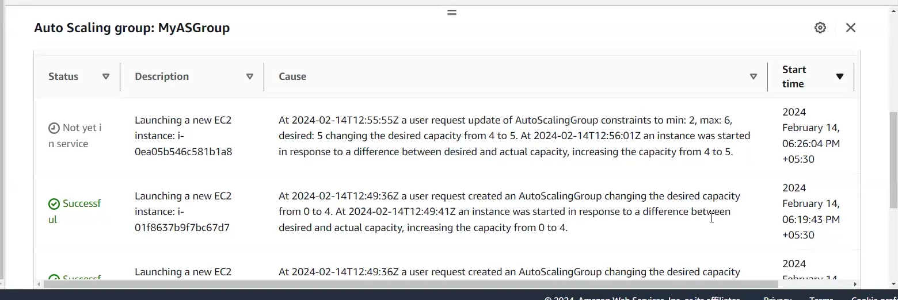
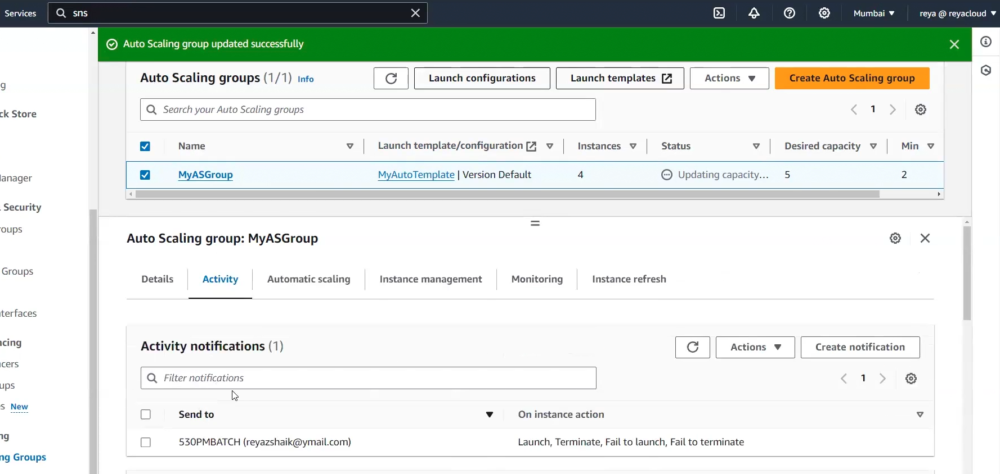
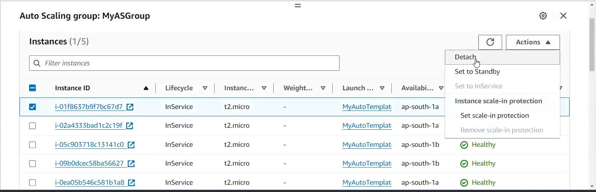

# Lecture 32 notes

previously we launched two ec2 instances manually!! what happens if two ec2 instances goes down!! so we need to do auto scaling!!

see in extras 002 we have seen ASG(auto scaling group) .must see that!!

we use launch template of AMI which have application inside it!!

### let now see what we are going to do!!

we create load balancer and create empty target group!! ASG will do registration of ec2 instances of whatever it create!!

we tell ASG avg CPU utilization to 70 percent!!

we put desired capacity=4 so ASG launches 4 ec2 instances initially!! min=2 and max=6 we set up!!

ASG scale out scale in but we want notification whenever a machine goes down or up !! so we use SNS!!

in SNS we have two things 
1. topic
2. subscription

like youtube channel we have topic whenever someone put video in topic (channel) you will get notified if you have subscribed to his channel(topic)

you can subscribe via email or phone number (SMS)

-------------------------

example create a topic in 530PMbatch and all students who subscribe to topic will get notification !!

>SNS is push based system(sending notification)

------
first we create empty target group!! just don't register any ec2 instances!!

then create load balancer!!

now we create launch template!! so we need our own AMI!! as discussed in extras>002!!

another option is choose AMI simple and in user Data put script !! this is done for small application!! that AMI approach for large application!!

> It is not possible to edit the launch template you need to create a new version of it!!

click on modify template it will not edit old one !! it will create a new one!!

to create ASG you can select and click on actions and then you can create ASG!!

 

here you need to select the your launch template!!
below launch template you see version of launch template whichever version you can select!!

--
## Step 2
on step 2 select existing load balancer!! then choose target group of load balancer!

then turn on health check by load balancer!!

health check grace period  after ec2 starts it goes to initializing state in that time we cannot do health check!!so for that time period we  need to wait that is told by grace period so min we should wait for 5 seconds so that instance is up and fully working!!

do't check monitoring we ee it later in cloudwatch!!

enable default instance warmup!! do not enable it it is same as health check grace period but it is for cloudwatch to monitor the application!!

now got to  step3 do not click on skip 

---

## Step 3

put desired capacity ,min and max!!

desired capacity > min and <max

now we want scaling policies so select on target tracking scaling policy!!now select avg cpu utilization!! we keep it 70 for now!!

do not click on disable scale in if you check it scale in will not happen!!

now instance maiantainence policy we put as no policy!!suppose you create app abc first and put on production and 5 ec2 instance running that now your application changed to def now  you put that on one ec2 instance!! what will you do with rest 4 !!

either you launch new 4 ec2 before terminating them !!this helps in availability!!

another approach is terminate 4 and then launch 4!!this helps in cost optimization!! as only 5 ec2 instance running!! but in that availability approach 9 instance running so more cost!! this behavior is told here!!

then instance scale-in protection!! new ec2 instance is protected from termination by scaling activities!!

now next we move to step 5

---
## step 5

to add notification!! create topic!! and put email you want to send notification!!

we can have more than 1 crore subscriber for a single topic!!

then tags are optional and then review!!

to add more subscriber go to SNS select topic and create subscription!!

---
in ASG in activity tab you see all activity done by ASG !!

here you get all reason why scale out scale in happens!!

then we have another tab Automatic scaling

here we can so scheduled actions!! like on big billion days flipkart increase number of instances!!

also we have predictive scaling policies !! we can ignore this!!as it uses prediction and based on prediction AWS will automatically create instances!!

now we have instance management!!

  

we have 5 machines see if we want to remove any machine from ASG then you can do detach

if you do set to standby the machine will be in rest ,it will not receive traffic

if you set up scale-in protection then the scale in for that machine will not happen 
means machine will not be terminated while scaling-in!!

remove scale-in protection to remove scale-in protection!!

