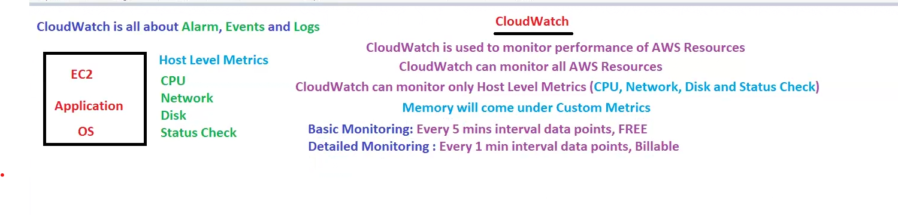

# Lecture 33 Cloudwatch

ec2 was biggest topic and it is done!!

Cloudwatch is a monitoring service!!

Cloudwatch is all about 3 things:-

1. Alarms
2. events
3. Logs

it watch all aws resources like s3 not only ec2!!
two types of monitoring
1. basic monitoring (every 5 min monitor)
2. detailed monitoring (every 1 min monitor)

cloud watch monitor some metrics called as host level matrices!!
which is CPU,network ,disk ,status check!!

Host level metrics does not have memory to monitor!! so cloudwatch 
do not monitor memory by default!!

so memory we need to configure !! so this is custom metrics!!

we tell cloudwatch if cpu utilization >90 percent then we can get alarm!!

you need to give threshold value here 90 percent is threshold value!!

if cpu utilization < 1 percent 

