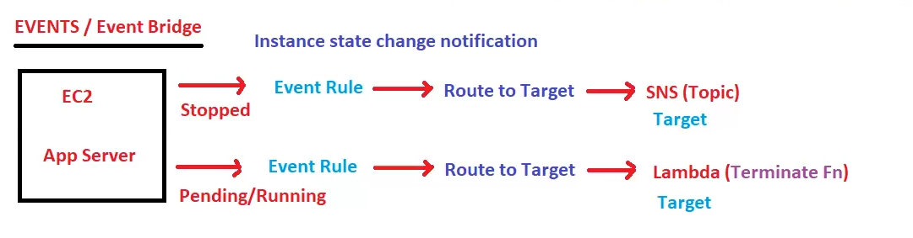
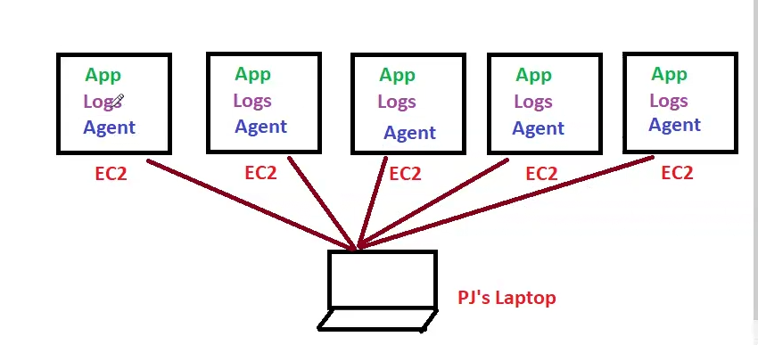

# Lecture 33 Cloudwatch

ec2 was biggest topic and it is done!!

Cloudwatch is a monitoring service!!

Cloudwatch is all about 3 things:-

1. Alarms
2. events
3. Logs

> it watch all aws resources like s3 not only ec2!!

two types of monitoring
1. basic monitoring (every 5 min monitor)(free)
2. detailed monitoring (every 1 min monitor)(paid)

## Cloudwatch and ec2

we are seeing ec2 as completed ec2 but it can also monitor other services!!

cloud watch monitor some metrics called as host level matrices(which are only 4)!!
which is CPU,network ,disk ,status check!!

>Host level metrics does not have memory to monitor!! so cloudwatch 
do not monitor memory by default!!

so memory we need to configure !! so this is __Custom metrics__!!

---

### Alarms 

we tell cloudwatch to watch any metrics we want to monitor!!

we tell cloudwatch if cpu utilization >90 percent then we can get alarm!! we can even get notification
by SNS!!

you need to give threshold value here 90 percent is threshold value!!

mostly people use CPU metrics only!!

 you can also use other metrics accordingly!!

 
>If cpu utilization < 1 percent , then ec2 not in use!! then we can stop the ec2 instance!!
Alarms can do actions on ec2 instance like  stop ,reboot ,recover ,terminate!! recover means if 1/2 status check
or 0/2 alarm can recover !! but alarm can not start the machine again!!

Alarm has 3 states
1. ok (if cpu utilization is <90 percent)
2. In alarm (if cpu utilization > 90 percent)
3. Insufficient (if ec2 instance not sending any response to alarm)

Cloudwatch alarms are on single metrics ,we want to monitor multiple metrics to be sure!!

---

### Composite Alarm

 combination of alarms 

 when network utilization(high network traffic) is very high , then cpu utilization will be high!! 
 so we use two alarms here !! this is using 2 metrics so this is called as Composite alarm!!

Condition like OR and AND can be used !!

---

### Events /event Bridge

We know all events are stored in Event bridge!!

we want if someone stopped ec2 we should get notification!! now who  will tell ec2 is stopped!!
that is done by event bridge!! it notices that ec2 is stopped!!

whenever ec2 is stopped stopped event is generated!!

>For every service there is a event in event bridge!!

In event bridge we generate a event rule!! we select event which we are interested in!! whenever 
that event occurs We route to target in SNS ! and we get notification from that!! 

we can call any service as target when an event occurs!! can call lambda when ec2 terminated!!

Bucket --> container of object
Namespace --> container of metrics!

 ec2 is Namespace where all metrics of ec2 will be there!!
 
 s3 is Namespace where all metrics of s3 will be there!!
 
 ---

### Logs

Logs means information!! first need to check logs if something wrong anywhere!! logs is first investigation thing!!

suppose 20 ec2 instance!! there is person PJ need to check logs for each ec2 !! to do that we need to do login in each machine and then check the logs!
we feel why can not we get all the logs in one machine!!we do not want to login each and every machine!

so we use cloudwatch logs which give all the logs in one place!!

if you want some group inside info what u do !? you put a agent/informer in them!!

like that here too we use an agent!Agent give logs to cloudwatch logs!!

we need to put agent in all 20 ec2 machine!!

Agent do not have permission to send logs to Cloudwatch Logs!! so to get permission we use IAM role!!

we attach role to the Agent then all the logs be pushed to Cloudwatch logs!! if we want we can group all ec2 machine!!

for each instance instance id be created!! and in that file name that instance logs be created!! these logs are called as logstreams!!

AWS is slowly enhancing it's own monitoring tools!! Cloudwatch cannot monitor endpoints !! but aws came up with
feature called __Canary__ which monitor endpoints!! it give request every 5 min to endpoints if not working then give mail to all
users! you can also check monitoring with customized information like you check site working but you want to know if we able
to login then we put login credentials to canary and tell if he can login or not!! if not able to login then
it send you notification!!

Application monitoring ,website monitoring can be done by canary!!

Cloudwatch can monitor lambda , containers , k8 ,microservices (which are 3rd party)!!

