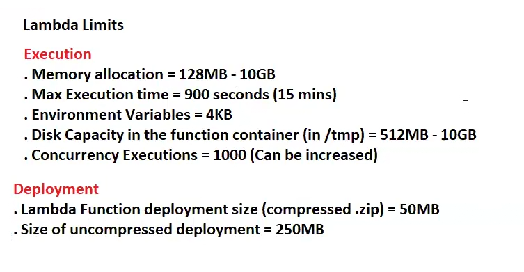
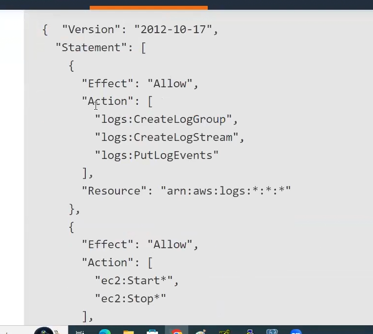
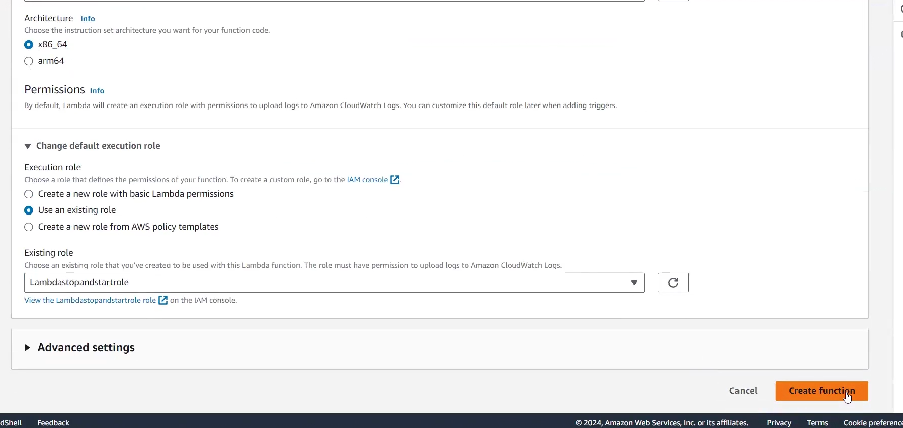
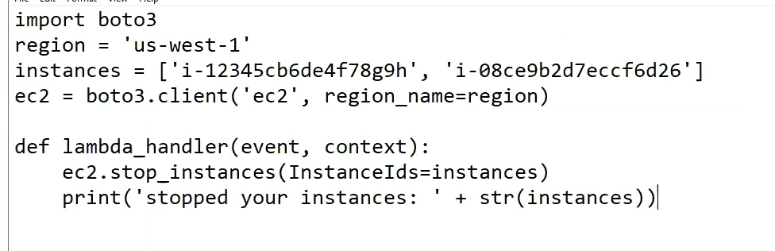
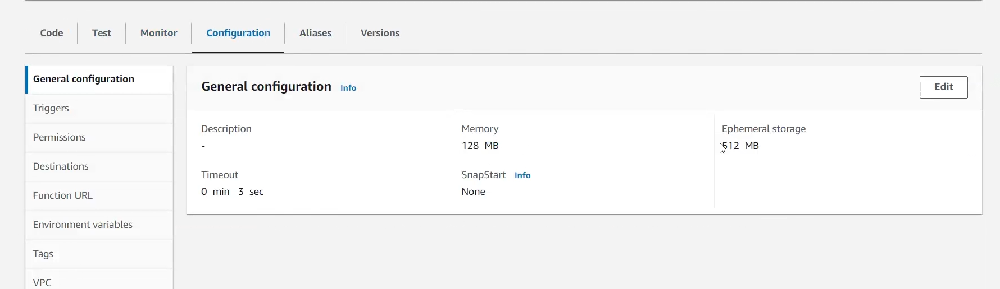
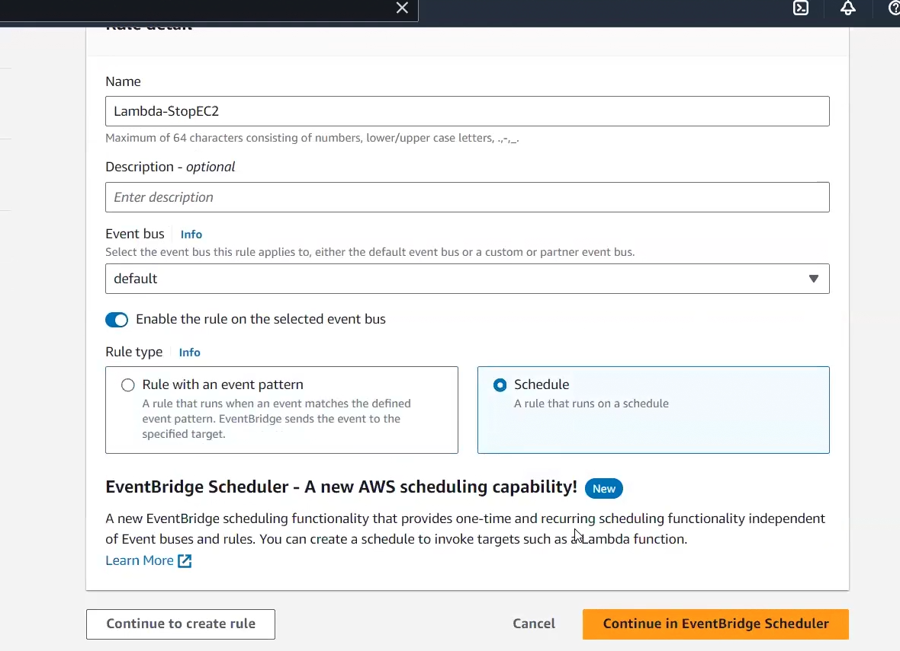
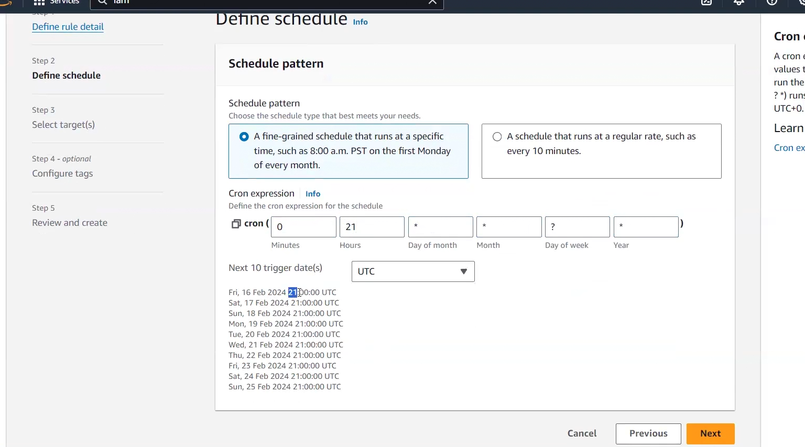
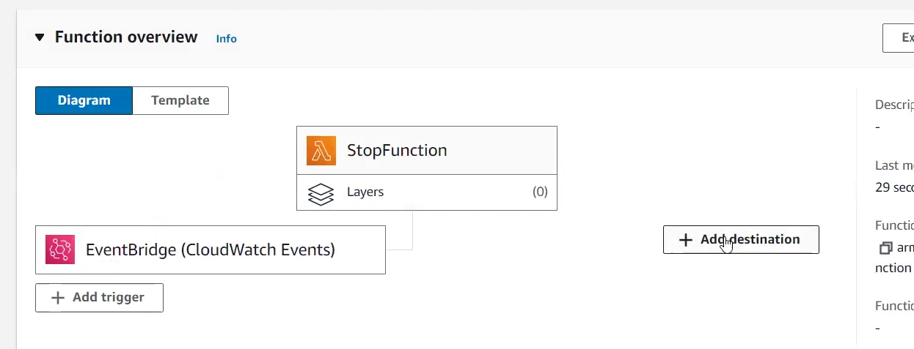
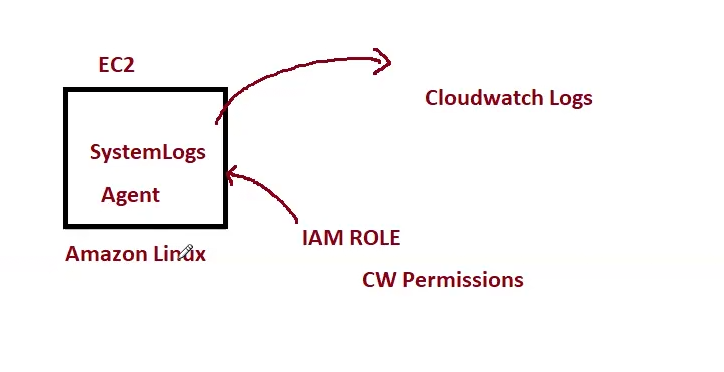

# Practical Cloudwatch lec-34

Alarms can be created from ec2 console as well as cloudwatch console!! first launch ec2!!

you can create alarm here!!

or on selecting a ec2 server you see on row View Alarms!

on cpu utilization you see 5 min gap that is basic monitoring and you reduce the gap then it will be chargeable!!

On monitoring you see only metrics that is host level metrics! 95 percent we see CPU Utilization!!

if cpu utilization >90 then scale up else if cpu utilization< 10 scale down

to create an alarm click on + symbol on ec2 row when selected!! and then crete a alarm !!

Alarm notification put a topic of SNS!! select action!!

we put in 5 min if we get one time min cpu utilization<10 percent we get notification!!

### Lets see how to create alarm from cloudwatch!!

Click on all alarms and then click on Create Alarm!

>Note : To see a service is regional or global see that is you able to see regions from top right!! you able to select any region!!if yes then regional else global!!

first select Metric then select ec2 namespace (namespace :collection of metrics ) and then select Per-instance metrics as one ec2 instance!!

then search using instance ID!!
then you can select according to requirement what you want to do!!

> Note : we can put any number of alarm to any service!!

then we want to terminate ec2 so we go to ec2 actions!!

Other service will have different metrics but the process of creating alarm be same!!

To create composite alarm ,select ana alarm and then you can select multiple alarms!!

No ec2 actions for composite alarms!! you can write a script in lambda!!

>Note : Once ec2 stopped then alarm can not start it!

### Events

here we create rules , click on events it goes to event bridge!!

events like someone creates or terminate ec2 instance we get notification!

here we have event bus which has events !! we can share bus to other accounts too!! we using default one!!

we use event pattern !!

In AWS, EventBridge (formerly known as "CloudWatch Events") is essentially the AWS implementation of an event bus. It enables applications to respond to events from a variety of sources in a highly scalable, serverless manner. Here’s a quick breakdown of the concept:

1. Event-Driven Architecture
    - An event bus enables event-driven architecture by allowing different services or components to communicate through events. Events represent changes in state or updates, such as "order created" or "file uploaded."
    - AWS EventBridge allows AWS services, third-party SaaS applications, and custom applications to send and receive events, making it easy to build decoupled, event-driven systems.
2. How EventBridge Works
    - Event Sources: Events can come from AWS services, like S3 or EC2, or third-party SaaS services like Zendesk, Shopify, or custom applications.
    - Event Bus: EventBridge organizes these events on a bus, which can be thought of as a pipeline or stream of events.
    - Event Rules: Rules can be set up to match specific patterns or conditions in the events. These rules can route the events to various targets like AWS - Lambda functions, Step Functions, SQS queues, SNS topics, and more.
    - Targets: EventBridge can send these events to different targets for processing, enabling actions to be triggered based on specific events. For instance, an order creation event might trigger a Lambda function that processes the order.
3. Benefits of Using EventBridge as an Event Bus
    - Decoupling of Services: With an event bus, services can remain decoupled and unaware of each other’s implementations, allowing for greater flexibility and maintainability.
    - Scalability and Serverless: EventBridge is fully managed and serverless, allowing for automatic scaling and low-maintenance operation.
    - Integrated AWS Service Support: EventBridge can integrate with many AWS services, making it straightforward to create automated, event-driven workflows across AWS.
4. Use Cases for AWS EventBridge (Event Bus)
    - Real-Time Data Processing: Triggering data processing tasks as soon as new data is uploaded to S3.
    -  Application Integration: Integrating multiple applications (e.g., CRM, ERP) through events.
    - Automated Responses to Security Events: Responding automatically to security incidents detected by AWS services, such as unauthorized access attempts.
    - EventBridge essentially acts as AWS’s answer to an enterprise event bus, allowing easy coordination of event-driven applications across the cloud.

Then we use event source i.e. ec2 for us!! then we need to choose event type!!base on requirement choose event type!! choose state for which you want to get notified!!

can see steps on various site how to add events for a service!!

> Task : Create rule for get notification for launch of ec2

we click on events it will take us to eveent bridge!!

we have to create Rule!! i should recieve notification if someone stopped/started/terminated ec2 instance!!These type of things are done by event bridge!!

>You see EventBus it has events. we can share this bus to other accounts so that other account can also access this account events!!

1. Define rule detail

choose rule with event pattern as we define pattern

2. then next page we have to choose source so we choose ec2 so we choose firstly AWS events!!
On event pattern we choose Ec2!!

    Then we need to choose categories,based on requirement you need to choose categories!!we use __Ec2 instance state change notification__!! then select which state you want to get notification!!

3. then we have target we need notification so we choose target as SNS!! then all next and finish!!

now we want at 9pm ec2 should stop and 9 am it should start!! we use lambda in it!!

>Lambda has no permission to stop ec2 so here we use IAM role !! we should give ec2 inline policy permission not full permission to lambda so that lambda can only have access to stop and start of ec2!!

steps 

At 9pm and 9 am scheduler will trigger lambda function here!!

1. create ec2
2. create policy
3. create IAm rule for lambda
4. create lambda 
5. create rule for event schedule!!

>Volume if you leave it is billable in non-free tier, so if your free tier is over even volume will generate the bill!!

In free tier EBS volume is free !! After one year when free tier is over EBS volume is charged!!
For that you need to terminate the machine!!

There are some limits to lambda functions see:

No need to setup any server for creating lambda! We choose python to create lambda!!

Lambda function is lazy!! Lambda when executed is billable!!

1. Lambda max execution time is 15 min!!

2. Serverless so we need to give some RAM to it!! so min we use 128MB and max 10 GB RAM!!

3. environment varibale max size 4KB

4. temporaray storage in funtion container 512 MB min 10 GB max

5. In parallel 1000 times we can execute lamba

6. zip code can be of 50 MB max where we have code!! And uncompressed file size can be max 250 MB.

>all lambda logs can be pushed to cloudwatch logs

#### let us create policy!!

Go to IAM and then policies. 

LogStream is instance ID of which log belong to which ec2 machine!!
Action see start and stop!

In policy editor in JSON ,put policy directly as we can get this policy from internet!!

### then we create role

- Trusted entity lambda

- in permission choose your permission you created just before

>permission and policy are same!!

### then we create lambda

Lets go to lmabda and create function!! it is regional!! just go and click on create a function!!

Choose the role you just created and archictecture then create function!!

then you need to put code!!

you can get from internet !! 

you should chnage according to your instances!! in instances variable we put instance id!!

After pasting function click on deploy!!

>You can code ,test ,monitor ,put aliases and versions in lambda!!

 you can test function by test bar in function!!

>now we need event bridge to call lambda!! for event bridge to access lambda we need another role
so that event bridge can access lambda

 

 Now we will choose the schedule then click on continue to create rule!!

 then their is cron job way you need to put!! we know we want to stop 9pm ec2!! 

 

 Next on target we choose lambda fucntion we created !!

 

 see function overview ,lambda is trigger for the function!! you can also choose destination!!

In cloud watch in Log group you can see logs!!

## Logs

now we use Amazon linux 2 machine which has system logs now we want to push that logs to cloudwatch, for
that we need to create IAM role! for that we need to put agent in ec2 machine!

Create a role for trusted entity ec2! permission we want is cloudwatch fullaccess!! and then 
create role!!

then on actions > Security > modift IAM role , add the role!!

now we want to install agent on ec2!!

### commands

- sudo -s --> to go to root user
- yum install -y awslogs --> to install aws cloudwatch agent

After agent is installed ,it will create 2 files!!

- cd /etc/awslogs/ --> go to this location
- ls --> to list file

2 files are
1. awslogs.conf
2. awscli.conf

- cat awscli.conf --> to see file now you see different region so chnage region to yours
- vi awscli.conf --> to edit file chnage region

now you changed region so logs will be saved in the region you put in .conf file!!

- cat awslogs.conf --> in file you see path /var/log/messages ,whichever logs you want to push 
put that path here!! for now it is ok as we need system logs!! if there is some application logs you
want to push to cloudwatch then put that path!!

- systemctl start awslogsd --> to start the service!!

now check cloudwatch log groups!!
Now we can put agent on 10 machines and we get logs of all that on cloudwatch!!
