# Lecture 35 Elastic Bean Stalk

AWS Elastic Beanstalk solves this problem for us by 
deploying our applications in the AWS cloud without having to 
worry about the underlying architecture. We simply need to upload 
our application on Elastic Beanstalk, and it takes care of provisioning 
and managing the resources, such as EC2 instances and S3 buckets, 
required to deploy our application in the cloud. Elastic Beanstalk 
can deploy applications developed in Go, Java, .NET, Node.js, PHP, Python,
 and Ruby.

To deploy an application using Elastic Beanstalk,
 first, we need to create an application and upload its 
 source code on Elastic Beanstalk, which automatically launches
  an environment for us and configures the resources required
   to deploy our application. Once the environment is launched, 
   we can manage it and deploy new versions of our application. 
   

- It is used for quick and easy deployment in AWS

- It can be seen PAAS (Platform as a service). we are responsible for application and data.
No need to worry about servers

- Backbone of beanstalk is ec2!!

- Completely free ,but whatever resources it uses it would be billable!!
e.g. load balancers , ec2 machines e.t.c. !There are no additional 
charges for using AWS Elastic Beanstalk. We are only billed on the
 resources created by Elastic Beanstalk to deploy our application, 
which includes EC2 instances, S3 buckets, DynamoDB tables, etc.

>One thing to keep in mind is that the main cost is typically
 generated by EC2 instances and load balancers.

-> in Cloudwatch there is exploring topic i.e. memory metric

we have two ways to deploy application
1. on ec2
2. on beanstalk

On beanstalk we need to provide configuration!! Beanstalk is purely about configuration!!

We have deployment modes or Presets :-
1. Single Instance Preset --> only one ec2 is launched ,user application need to 
be uploaded to beanstalk, that application will be deployed on ec2 and beanstalk will give
url to access it called as domain url!! this Instance can be on demand or spot also!!

    Not used for prd environment

2. High availability preset --> HA means with Load balancer!! so a load balancer is created for us!!

    used in prod environment!

3. Custom preset --> if you want to have our own security group ,our own configuration!!

## ElasticBeanStalk Architecture

Application (just name not application you created) has environment's 
(one application can have multiple environments)
which has 
ec2 instance ,then ec2 has application you created!!
- Single instance preset

    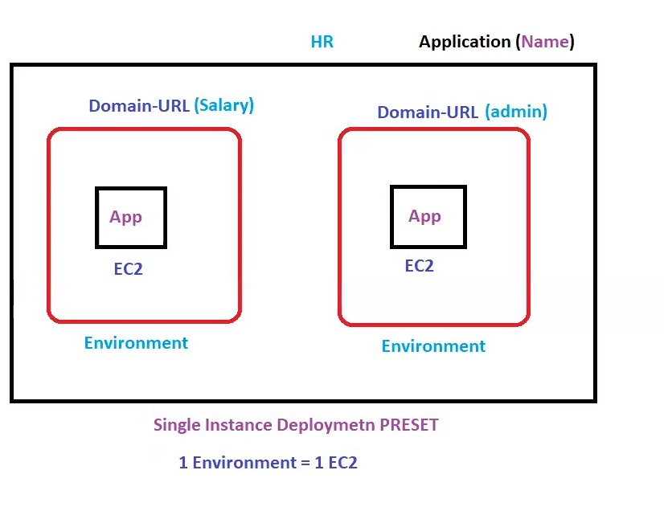

    Inside application we can have differnt application like one environment have
    Salary code other has Admin code and both have domain Url!!

- HA preset

    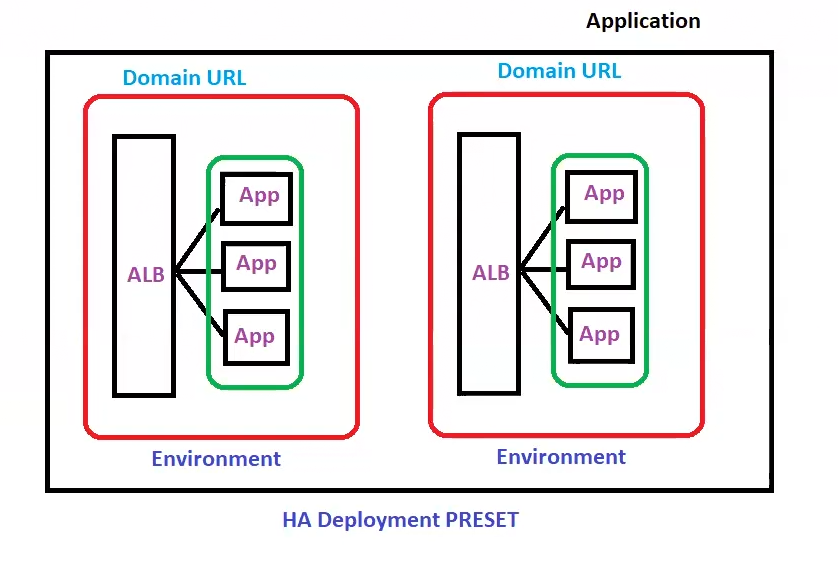

Now suppose a version-2 comes of application , so
 now benastalk will deploy the new version!! for that we have deployment methods
 discussed below

## Deployment Methods in Elastic Beanstalk
AWS Elastic Beanstalk provides us with 
various deployment methods we can choose from depending 
on our application’s requirements. We must
 select the deployment method after careful consideration, 
 as each method comes with its own set of tradeoffs. 
 Following are the deployment methods Elastic Beanstalk supports:

- All at once: This is the quickest deployment method. 
In this method, Elastic Beanstalk deploys a 
new version of our application in all instance at once. 
This, however, can result in restarting our application server. There might be 
downtime as beanstalk deploy on machine directly!!

- Rolling: In this method, 
the deployment time is increased to avoid downtime and 
increase availability. Here one by one on instances we deploy application!!
First deploy on instance1 then on instance2 and so on!

- Rolling with additional batch: This method takes an even 
longer time to deploy our application as compared to the rolling
 method and is used in case you want to avoid any reduced availability.
 In this method, our application is
 deployed in batches.

- Immutable: In this method, Elastic Beanstalk
 makes sure our application v2 is always launched on a new instance, 
 making it a relatively slow method. then version-1 is deleted after version-2 is
 deployed.
 One advantage of this method is that it provides a
  quick rollback in case our deployment fails due to any reason.

- Traffic splitting: This is a testing 
deployment method used in case we want to test the
 health of the new version of our application by directing a
  part of the incoming traffic to a new version and directing
   rest of the traffic to the old version of our application.

- Blue/Green: In this method, a new version of our
 application is deployed in a new environment. We can then 
 swap the canonical names of the two environments to ensure our 
 application doesn't become unavailable to the user.

Suppose your application working on tomcat but now you are migrating to python!!

Initially

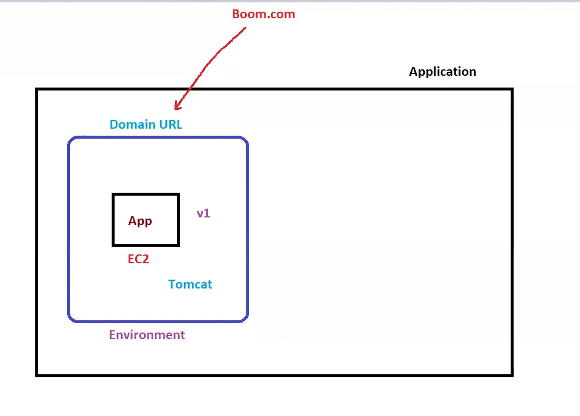

now we want to move to python!! previous deployment methods used to touch existing environment!!
here we create a new environment totally!!

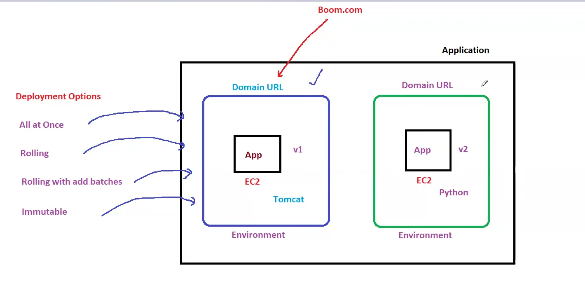

In beanstalk we have option called swap URL which 
swap both blue environment url and
green environment url!!

blue - actual environment

green - new environment

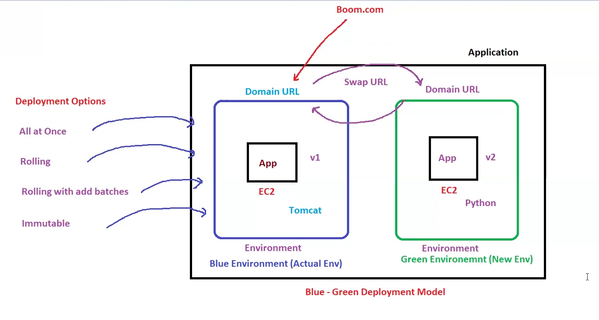

This blue green deployment is manual not automatic !!

> Url should not chnage but application should be chnaged

## Blue green deployment

Beanstalk is regional!!

first let us create application by aws !!

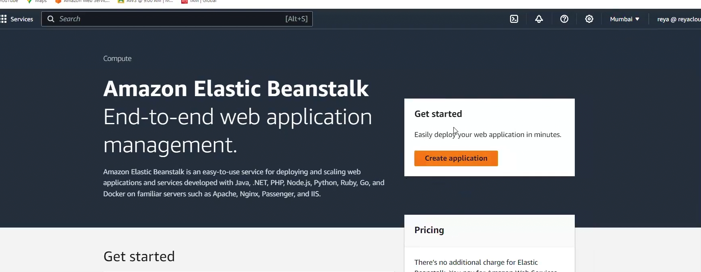

Clixk on create application!  

## Environments in Elastic Beanstalk
In AWS Elastic Beanstalk, an environment is a collection of 
resources used to deploy a specific version of our application.
 A single application can have multiple environments, 
 where each environment is used to host a specific version of 
 an application. While launching an environment in Elastic Beanstalk,
  we first need to select one of the two environment tiers
  : a web server tier or a worker tier.e.g. environment is tomcat for java application!!

- Web server tier: In the web server tier, we usually deploy web 
applications that receive HTTP requests from the clients, 
such as APIs and other interactive applications. Load balancers 
are launched in this tier to control and distribute incoming traffic.

- Worker tier: The worker tier doesn’t include a load balancer 
and is typically used when we need to execute lengthy 
computational tasks, process data, or perform other backend 
operations that don’t require direct contact with the client. 
Applications deployed in a worker tier usually use SQS queues 
to fetch data and other requests. e.g. perform task on schedules

so we choose web server, then put application Information!

also we need to put domain!!

 then choose platforma Tomcat!!

 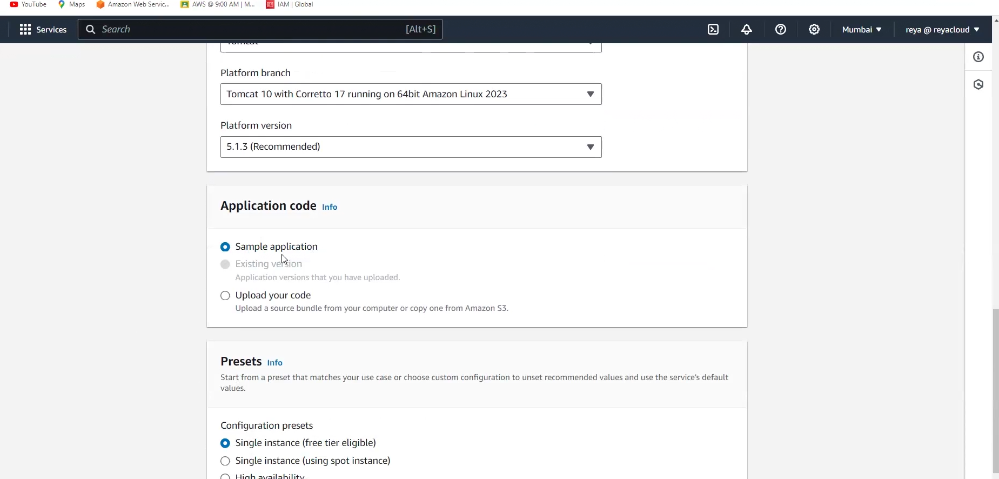

 see above image we choose sample application as we need application from aws,
 we not devloping application!! or else you have code use that!!

 then select preset  we use single instance as free tier!!

 then step -2 configure service access, need to select role!

 step-3 networking ,you can select your own  VPC!! but if you select it will 
 be in custom preset so we not using that!!

 we not selecting anything!!

 now database , we not enable it for now!!

now step-4 configure instance traffic

we get default configurations!! we using single instance!! 

>t2.micro and t3.micro both are free

step-5 is configuring the monitoring services!!

Chnage health reporting to basic!!

 Here application deployment you need to select as 
single instance so all at once will be there!!

>Amazon X-ray is a service that collect data about request and reponse so developers
use this to get data about request and response, it is used to find out what are
potential issues and improve optimization!!It is billable!

To store any logs we can store at S3 !!

Also disable Manged platform updates and then submit!!

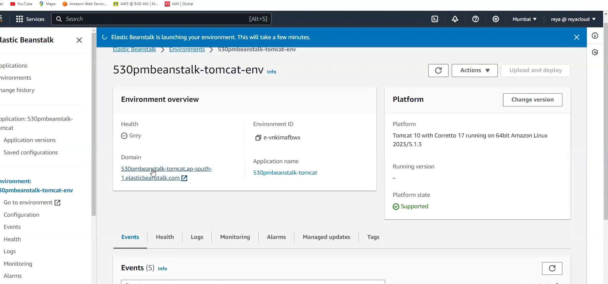

once helath goes healthy we will be able to access website!!

Once application deployed you will be able to see the Website!!

Now we want to chnage to python platform!!
so for that we need to select another platform!!

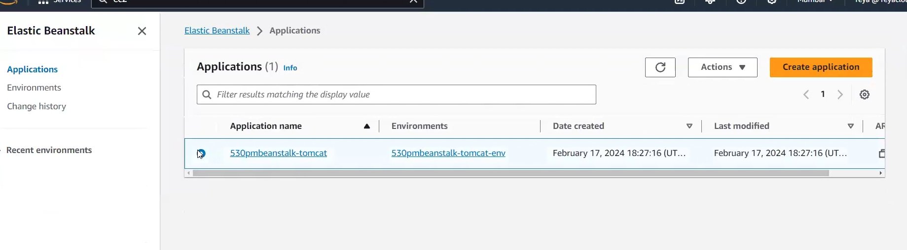

now from left navigation ,go to applications!! select application and in that 
create new environment!! use python this time!!

>If role is not selected 
you need to create a role while creating environment!! You no need to create role from IAM just select create role
and role will be created by Beanstalk!!

Now we want to swap tomcat with python!!

so go to tomcat environment!!

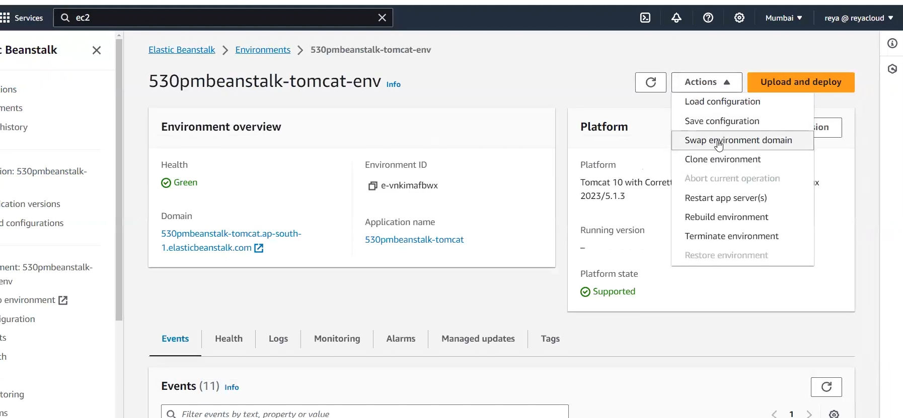

then select python environment!! now it will be swapped completely!!

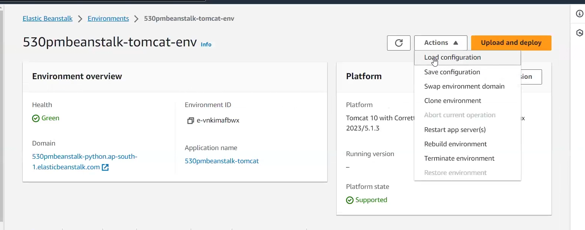

On environment we have above options as can be seen from the image!!

it is hard to know who change configuration so always save configuration!!

On load configuration you see old saved configuration and then click on load!!

Clone environment to copy environment with same configuration!!

Restart app server ec2 instances that benastalk has created restart that , do not 
do it yourself!!

Rebuild environment delete existing environment and build entirely new environment!!

## tasks

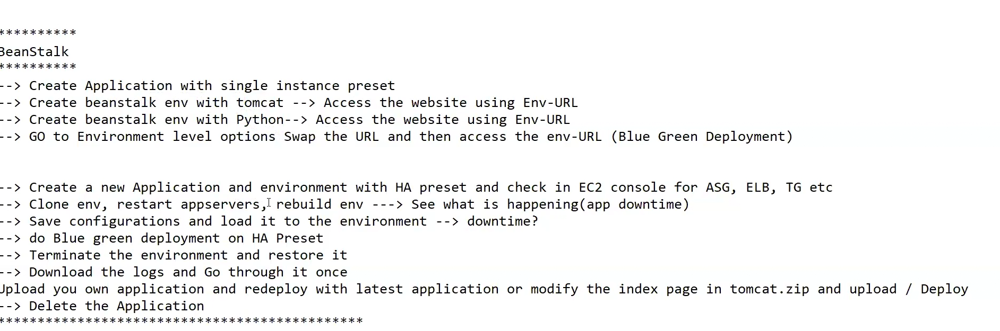

At last delete application ,once you delete application , you cannot restore it!!
environment can be restored!!

Beanstalk is used for easy deployment but you will not be able to manage everything!!
everything will be managed by benastalk!