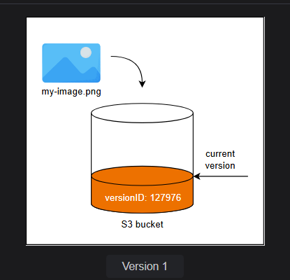
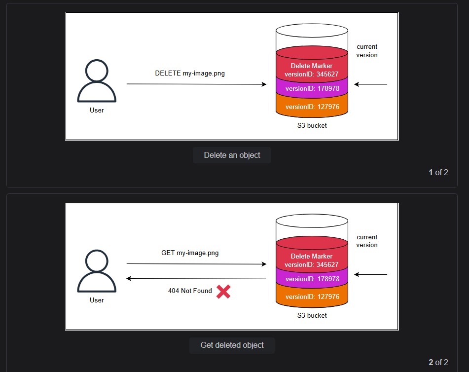
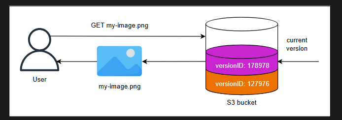
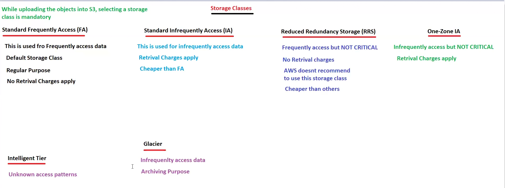
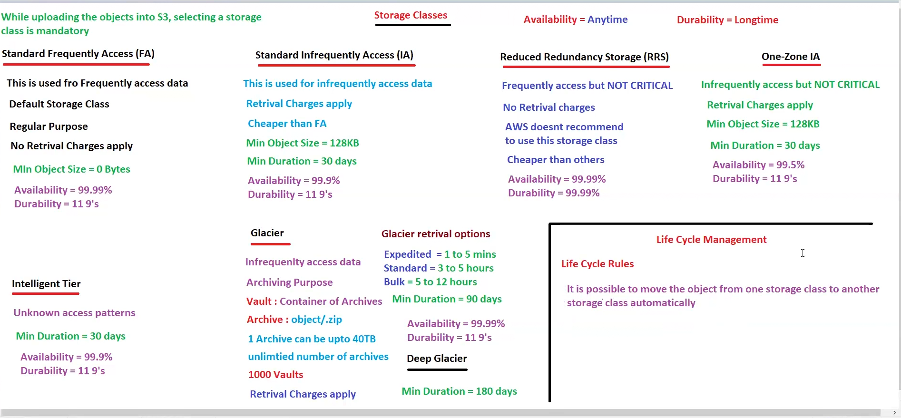

# S3 Lecture 36

Amazon Simple Storage Service (S3) is a versatile and highly scalable object storage service offered by Amazon Web Services (AWS). It provides developers and businesses with a secure, durable, and cost-effective solution for storing and retrieving data ranging from a few gigabytes to petabytes or more.

S3 is important for the Solutions Architect (SAA - C03) exam, so get ready to dive into the details. Let's get started!99 percent for storage service s3 is used!!

> S3 is global and object based storage ,cannot execute any files here , serverless!! Buckets in s3 are regional!! S3 is unlimited storage!!

> S3 supports static website hosting and cheaper than ec2!!
> 
1. Bucket== container of object
2. Object == file
3. Key == Name of file

> s3 is global so one console !! create bucket in differnet region but all buckets of different region can be seen in single console as s3 is global!!
> 

> Bucket name are unique and universal , if someone is some other account has create bucket with name abc you can not use that!! bucket name universal and unique across whole world!!
> 

we cannot create subfolder inside a bucket ,although we can have subfolders inside a bucket. so we cannot have bucket under bucket!!

> Max no of buckets we can create in a account is 100 , this is soft limit , you can create a ticket in aws and increase the limit
> 

> by default bucket is private , by default anything you create in aws is private only!! If required we can make it public by ACL (Access Control List).
> 

In s3 every object has it’s own URL 

S3 is very much important for certification as too much questions on this!!

see this is how the url is defined , here in s3 the subfolder is called as Prefix!!

S3 is worm model where we write once and read many as there are multiple reads in s3!!

---

## *S3 Versioning*

**Versioning** is a practice in software development and data management that involves assigning unique identifiers or labels to different versions of a piece of software, a file, or a dataset. This enables tracking changes over time, maintaining a history of modifications, and facilitating collaboration among multiple contributors.

In Amazon S3, versioning enables the storage of multiple versions of an object in a bucket. This helps protect against accidental deletions or overwrites, and it can restore previous versions.

## **Enabling versioning on buckets**

By default, versioning is disabled in S3 buckets. We can enable the versioning while creating a bucket. Also, we can enable or disable the versioning of an existing bucket. Therefore, a bucket can be in one of the three states:

- **Unversioned:** We disable the versioning of the bucket while creating it.
- **Versioning-enabled:** We enable the versioning of a bucket while creating it or modify it later on.
- **Versioning-suspended:** We disable the versioning of a versioning-enabled bucket.

Since space is consumed by all the versions of an object in the bucket, S3 charges for every version of the object in the bucket. So when we suspend the versioning in a bucket, S3 charges us for the previously stored versions of the objects. The way to minimize the costs in such a scenario is to create another S3 bucket and upload all the current versions or delete the previous versions manually.

> Once enabled versioning , you can suspend it , not use disable it as there might be question with both
option disable and suspend, then you will be in confusion!!

### **Versioning configuration**

The version configuration is stored in a versioning subresource attached to the S3 bucket. For an unversioned bucket, an empty versioning subresource stores an empty configuration.

Another important setting that is enabled in the bucket versioning configuration is **MFA Delete**. When enabled, MFA delete requires MFA to change the state of the bucket versioning. Also, it requires MFA when deleting versions of objects. It works by requiring MFA serial numbers and the code generated by it for any API calls to change the bucket state or delete an object version.

When we enable versioning on a bucket, it changes the status in the version configuartion and automatically starts generating version IDs for the objects. S3 buckets itself assigns immutable version IDs. For example, if we add an image named `my-image.png` in a version-enabled S3 bucket, the bucket will assign a version ID such as shown in the figure below:

If we enable versioning of a nonempty bucket, the S3 bucket assigns an ID of null to all the existing objects. It then assigns numeric version IDs to any new objects. Similarly, if we decide to suspend the versioning of a bucket, it does not change the version ID of existing objects and only handles the newly added objects differently.

>Versioning enabled/disabled on bucket level but applied on object level

for latest version a marker is applied called as delete marker!!

## Add an object to a version-enabled bucket #
When we PUT an object in a bucket, it checks if an object with a similar key exists. 
If not, it assigns a version ID and stores it in the bucket. If it already exists,
 the S3 bucket assigns it a version ID and stores it in the bucket. For example, 
 if we want to store an image named my-image.png in the S3 bucket, and an image with a 
 similar name already exists, it will store the new image with a different version ID.
  The latest image becomes the current version. 
This way, the previous version of the image, or the noncurrent version, is easily recovered.

>Note: An S3 bucket only creates a new version when we PUT an object.

## Delete an object from a version-enabled bucket 
When we DELETE the __latest version__ of an object from a version-enabled bucket, 
the bucket inserts a delete marker for the object. The delete marker is just the newer version of the object, which becomes the current version. This means when we send GET request to the bucket for the object, it will return a 404 Not Found error.

The delete marker does not take up much space, and 
its size is only equal to the size of the key name.

>To restore the latest version just delete the delete marker

> Delete marker is for latest version only!!

>To restore previous version ,there is no way you need to upload that files again!!

>However, we can permanently delete an object by specifying the version ID. 
When we delete a version object by specifying the Version ID,
 S3 deletes the object version and makes the most recent version the current version.
  The S3 bucket does not store a delete marker in this case.

> we cannot download delete marker!! it can only be deleted!!

If we accidentally delete an object, we can restore it by either sending a GetObject request for a specific version ID or removing the delete marker, which effectively restores the previous version of the object.

## Get an object from a version-enabled bucket 

When we send a GET request to an S3 bucket API for an object with a specific key value; it returns the latest version. For example, when we fetch the my-image.png from the S3 bucket, it will return the current version.

However, we can fetch the noncurrent version of an object from an S3 bucket by specifying the version ID of the object in the GET request.

> Versioning files can be downloaded!!

## Suspension of versioning

In AWS S3, suspending versioning changes the way object versions are managed in your bucket.
 Here’s what happens in this scenario:

- When you suspend versioning:

    - New objects uploaded to the bucket will not have unique version IDs. They will be treated as the "latest" version with a default version ID of null.
    - Existing versions of objects (created when versioning was enabled) will remain intact and accessible unless explicitly deleted.

- If you delete the latest version of a file after suspending versioning:

    - If you delete an object when versioning is suspended, a delete marker is not added. Instead, the object is permanently deleted.
    - You cannot restore the deleted file, as there will be no earlier versions or delete markers to work with in the suspended state.

> In case of versioning suspended ,existing version will still be same

- Behavior of subsequent uploads:

- Any new files uploaded with the same key will overwrite the existing "latest version" of the object.
- You lose version tracking since every new upload replaces the current object without retaining the older version.

### Key Considerations:

- If you need the ability to restore deleted objects, you must keep versioning enabled.
- Suspending versioning essentially removes the safety net provided by versioning.
- To ensure recoverability of objects, consider enabling versioning again or using S3 Object Lock with retention policies.

## S3 constraints

min Object size --> 0 Bytes

max Object size --> 5 TB

> you cannot put 6 TB to object

we can have any number of object in bucket so bucket size is unlimited!!

In single put you can put max 5GB

> Now if you want to upload 20 GB file so we use multi-part upload (just for us say MPU , do not say in interview) so the file can be broken into small chunks and that small chunks
uploaded to s3 as single file!!This MPU can be done by CLI only !! Aws Recommends if file size > 100 MB use MPU!!

## Storage Classes
S3 is a highly economical object storage service used for a wide variety of purposes, from website hosting, and backups to data lakes and analytics. These use cases vary in the access frequency and required latency. Using the same bucket for all use cases is not only expensive but unfeasible.

Amazon S3 storage classes offer a range of options to optimize costs, performance, and durability based on the specific needs of different data types and access patterns. These storage classes can be broadly categorized among general purposes, unknown and changing access, high performance, infrequent access, and archival purposes.

---

### Amazon S3 Standard

default storage class

S3 standard is a general-purpose storage class suitable for frequently
 accessed data that requires low latency and high throughput. It offers high durability, availability,
  and performance, making it ideal for a wide range of use cases,
   including website content, mobile applications, and data analytics.

Here for data safety , s3 put data across 3 AZ!!   

### Amazon S3 Express One Zone
S3 Express One Zone is a high-performance storage class built to deliver consistent single-digit millisecond first-byte latency. It is ideal for frequently accessed and latency-sensitive applications. It is 10 times speedier and 50% more cost-effective as compared to the Standard S3.

While creating an S3 bucket, 
we can select the region that stores data in a minimum of three availability zones.
 However, with S3 Express One Zone, we specify an availability zone 
 to create the bucket in which the bucket is highly available. Also,
  it stores data in a different kind of S3 bucket called an Amazon S3 directory bucket.
  The Amazon S3 Directory Bucket allows hundreds of thousands of requests 
  per second which lends the high performance ability to S3 Express One Zone.

> as no data is stored over 3 AZ only 
one zone it is stored so called as one zone!! this is also called as reduced redundancy storage!!

S3 Express One Zone offers high data durability, integrity, and security. However, one downside is that if we lose the availability zone containing the S3 One Zone Express bucket, we lose the data in it. Thus it is necessary to take precautionary measures against it.

This type of storage class can easily be integrated with other AWS services such as Amazon Sagemaker, Athena, and more. We can further enhance the performance of the S3 Express One Zone by creating the compute and storage resources in the same availability zone as the bucket.

> Both above are for frequently access

---

### Infrequent Access

S3 provides two storage classes for infrequent access, S3 Standard IA and S3 One Zone IA.

>Now there is a customer using infrequent access bucket and using it frequently , so for such customer Aws
has put charges on put and retrieving of data on these , but on frequently access buckets no charges for put and 
retrieving data!!

#### Amazon S3 Standard-IA 
The S3 Standard-Infrequent Access storage class is intended for data that is accessed less frequently but requires rapid access when needed. It offers high throughput and availability of the S3 Standard but at a lower cost. It's suitable for backups, disaster recovery, and long-term storage of infrequently accessed data.

IA means infrequently access

#### Amazon S3 One Zone-IA
Amazon S3 One Zone Infrequent Access, as the name suggests, provides the features of both S3 Standard IA and S3 Express One Zone. It is suitable for the infrequent and rapid access data stored in a single availability zone. However, it has a lower per GB storage and retrieval cost as compared to the S3 standard. Thus, it is ideal for use cases where we require resilience storage for infrequently accessed data, such as secondary backup copies.

---
### Amazon S3 Intelligent-Tiering
when not known whether frequently or infrequently!! so Intelligent tier !!

S3 Intelligent-Tiering is designed to optimize storage costs by automatically moving objects between the three tiers: Frequently Accessed, Infrequent Access, and Archive Instant Access. These tiers have the same low latency and high-throughput performance as S3 Standard.

The S3 Intelligent-Tiering monitors access patterns and moves objects that haven't been accessed for up to 30 consecutive days to the Infrequent Access tier after 90 days to the Archive Instant Access tier. We can additionally set up the S3 intelligent tiering to move objects not accessed for more than 180 days to the Deep Archive Access.

In addition to this, we can optionally migrate data to S3 Glacier Flexible Retrieval and S3 Glacier Deep Archive. We can configure the S3 Intelligent Tiering to move data automatically to S3 Glacier Flexible Retrieval after 90–700+ days. Similarly, we can automate data migration to S3 Glacier Deep Archive after 180–700+ days.

The S3 Intelligent Tiering ensures data is migrated from one storage class to another without impacting performance, incurring additional retrieval charges, and causing operational overhead. Also, it automatically moves the objects to the Frequent Access tier if their access frequency increases. S3 intelligent tiering charges a small amount monthly for monitoring and automation.
---

#### Archival
S3 offers Glacier storage class to provide high performance 
and minimal cost storage for archival purposes. It offers the 
lowest storage costs but incurs additional retrieval times and fees for accessing data. 

The Glacier storage is further divided among three storage classes to cater to various storage durations and access patterns.
In Glacier we have vault!! not buckets unlike s3!!

here we have archive inside vault like object inside bucket!! 1 archive upto 40 TB, we can  have any number of archives

1000 vault we can have , retrieval charges apply here!!

#### Amazon S3 Glacier Instant Retrieval
The S3 Glacier is purposely built for data rarely accessed and requires retrieval in 
milliseconds. It helps us to save costs. Glacier provides the same availability and
 throughput as the Standard IA storage class but at a considerably lower cost if the data 
 is accessed once a quarter, for example, user-generated archives. It can store data for 
 a minimum of 90 days.

#### Amazon S3 Glacier Flexible Retrieval
S3 Glacier Flexible Retrieval provides storage at a 10% lower cost as compared to Instant Retrieval if the data is accessed once or twice a year. It is typically used to transfer large amounts of data at no cost and does not require rapid access, such as disaster recovery data. It offers three retrieval classes
: expedited (1–5 minutes), standard (3–5 hours), and bulk (5–12 hours). 
In simple terms, this storage class offers a fine balance between costs and access time. It can store data for a minimum of 90 days.

for short data use expedited else go for other two!!

#### Amazon S3 Glacier Deep Archive
Deep Archive is the lowest cost storage that allows long retention of data. It is typically used by organizations and enterprises that require long-term retention of data for regulatory compliance. It has a retrieval time of a maximum of 12 hours in standard or 48 hours in bulk. It can store data for a minimum of 180 days.

One important thing to note is that objects in the S3 Glacier Flexible Retrieval and Amazon S3 Glacier Deep Archive are not available in real-time. To access them, we must restore their temporary copy, which is only available for the time period we specify in the restore request.

> we can move from one object class to other by lifecycle management!! can move to frequently access to non frequently access buckets!!

min object size is important see below!!

min duration is atleast needed to change storage class!!

>just read above image
