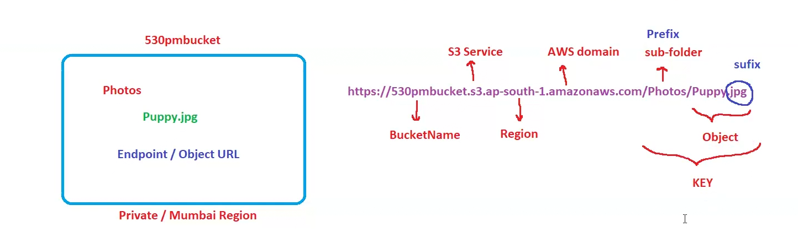

# S3 Lecture 36

Amazon Simple Storage Service (S3) is a versatile and highly scalable object storage service offered by Amazon Web Services (AWS). It provides developers and businesses with a secure, durable, and cost-effective solution for storing and retrieving data ranging from a few gigabytes to petabytes or more.

S3 is important for the Solutions Architect (SAA - C03) exam, so get ready to dive into the details. Let's get started!99 percent for storage service s3 is used!!

> S3 is global and object based storage ,cannot execute any files here , serverless!! Buckets in s3 are regional!! S3 is unlimited storage!!
> 

> S3 supports static website hosting and cheaper than ec2!!
> 
1. Bucket== container of object
2. Object == file
3. Key == Name of file

> s3 is global so one console !! create bucket in differnet region but all buckets of different region can be seen in single console as s3 is global!!
> 

> Bucket name are unique and universal , if someone is some other account has create bucket with name abc you can not use that!! bucket name universal and unique across whole world!!
> 

we cannot create subfolder inside a bucket ,although we can have subfolders inside a bucket. so we cannot have bucket under bucket!!

> Max no of buckets we can create in a account is 100 , this is soft limit , you can create a ticket in aws and increase the limit
> 

> by default bucket is private , by default anything you create in aws is private only!! If required we can make it public by ACL (Access Control List).
> 

In s3 every object has it’s own URL 

S3 is very much important for certification as too much questions on this!!

see this is how the url is defined , here in s3 the subfolder is called as Prefix!!

S3 is worm model where we write once and read many as there are multiple reads in s3!!

---

## *S3 Versioning*

**Versioning** is a practice in software development and data management that involves assigning unique identifiers or labels to different versions of a piece of software, a file, or a dataset. This enables tracking changes over time, maintaining a history of modifications, and facilitating collaboration among multiple contributors.

In Amazon S3, versioning enables the storage of multiple versions of an object in a bucket. This helps protect against accidental deletions or overwrites, and it can restore previous versions.

## **Enabling versioning on buckets**

By default, versioning is disabled in S3 buckets. We can enable the versioning while creating a bucket. Also, we can enable or disable the versioning of an existing bucket. Therefore, a bucket can be in one of the three states:

- **Unversioned:** We disable the versioning of the bucket while creating it.
- **Versioning-enabled:** We enable the versioning of a bucket while creating it or modify it later on.
- **Versioning-suspended:** We disable the versioning of a versioning-enabled bucket.

Since space is consumed by all the versions of an object in the bucket, S3 charges for every version of the object in the bucket. So when we suspend the versioning in a bucket, S3 charges us for the previously stored versions of the objects. The way to minimize the costs in such a scenario is to create another S3 bucket and upload all the current versions or delete the previous versions manually.

### **Versioning configuration**

The version configuration is stored in a versioning subresource attached to the S3 bucket. For an unversioned bucket, an empty versioning subresource stores an empty configuration.

Another important setting that is enabled in the bucket versioning configuration is **MFA Delete**. When enabled, MFA delete requires MFA to change the state of the bucket versioning. Also, it requires MFA when deleting versions of objects. It works by requiring MFA serial numbers and the code generated by it for any API calls to change the bucket state or delete an object version.

When we enable versioning on a bucket, it changes the status in the version configuartion and automatically starts generating version IDs for the objects. S3 buckets itself assigns immutable version IDs. For example, if we add an image named `my-image.png` in a version-enabled S3 bucket, the bucket will assign a version ID such as shown in the figure below:

If we enable versioning of a nonempty bucket, the S3 bucket assigns an ID of null to all the existing objects. It then assigns numeric version IDs to any new objects. Similarly, if we decide to suspend the versioning of a bucket, it does not change the version ID of existing objects and only handles the newly added objects differently.

>Versioning enabled/disabled on bucket level but applied on object level