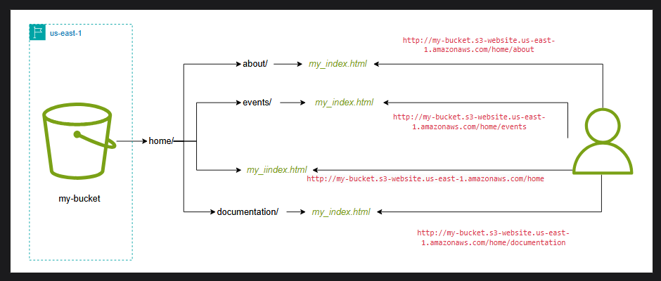
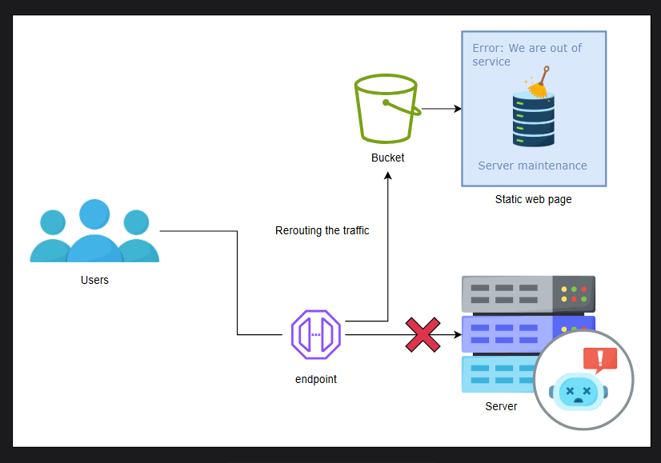
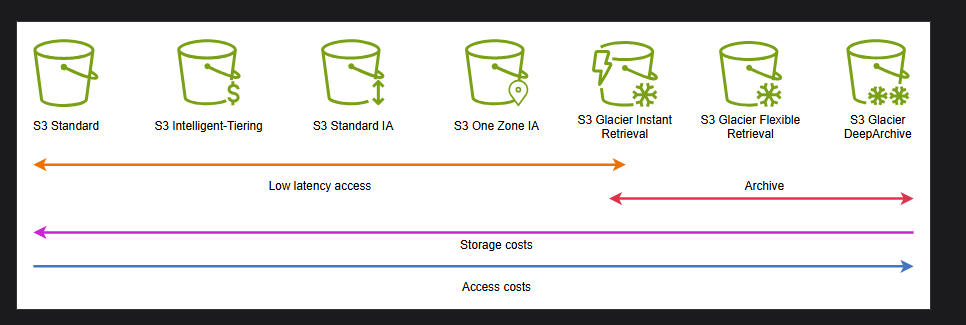
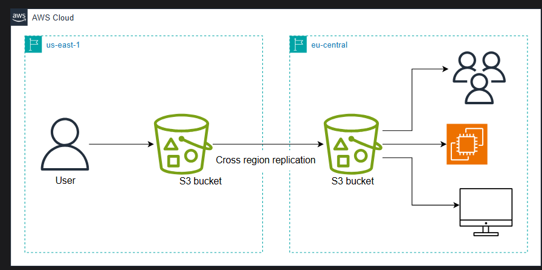
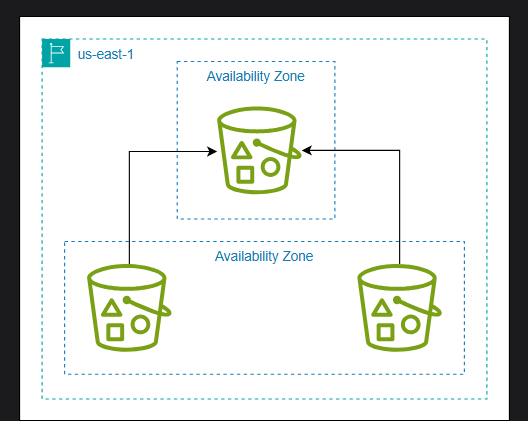

# Lecture 37
## S3 Static Website Hosting
Static websites are web applications that consist of fixed, unchanging content; unlike dynamic websites, where the content is generated on the server dynamically in response to user requests, static websites present pre-built, unaltered HTML, CSS, and JavaScript files directly to the user's web browser.

### Static website hosting in S3#
S3 buckets allow us to upload static HTML web pages and serve them on region-specific website endpoints. The general format of an S3 endpoint is of two types, depending upon the region.

- s3-website dash (-) Region: http://bucket-name.s3-website-Region.amazonaws.com

- s3-website dot (.) Region: http://bucket-name.s3-website.Region.amazonaws.com

S3 website hosting supports custom domain configurations, allowing us to associate branded URLs with their hosted content. If we have registered domains, we can use our custom domain names by recording DNS CNAME. Another method is to use custom domain names with Route 53 and serve the website content.

### Enabling static website hosting#
Static website hosting feature requires an index documnet and IAM permissions to access bucket content publically. We can enable static website hosting using the Amazon Management Console, REST API, AWS SDKs, AWS CLI, and AWS CloudFormation.

The index document is an HTML file rendered by the S3 website endpoint. S3 requires the name of the index document. If we have other web pages in the directories, the name of the index document must be consistent across them.

For example, if we want to name our index document as my_index.html and host multiple pages in different directories, each folder should have a my_index.html. Suppose we have a bucket in us-east-1 the region named my-bucket with a folder, /events. Then, it should contain an index document that will be returned when we access the website endpoint.

### Bucket permissions
To host a static website using S3 buckets, we must permit public access to the bucket. Disabling Block Public Access and adding a bucket policy to restrict actions is the most commonly used method to manage public access. If we don't want to disable Block Public Access settings for the bucket but still want our website to be public, we can create an Amazon CloudFront distribution to serve our static website. Another way could be to use ACLs, but only if necessary. Especially if the owner of the bucket does not necessarily own the objects in the bucket, then one can use ACL to give full access to the owner.

### Use case: Out-of-service on the website front page
Static website hosting is commonly used for personal portfolios, temporary promotional websites, data offloading, and more at far less cost than typical website hosting.

Let’s consider one use case to understand its usability further. Suppose there is an e-services website that has undergone some server maintenance and will not be able to provide its services for some time. As a good practice we want to display an out-of-service message on the website front page. However, since the main server is down, we could not render the customized page. Renting out another server, say EC2 instance, to display a customized out-of-service page will be considerably expensive.

Fortunately, we can leverage the static website hosting feature of S3 buckets in such scenarios. Simply upload the customized out-of-service HTML page to the bucket and configure it as the index document. Then, redirect the traffic to the website’s endpoint to the S3 bucket website endpoint.

## Lifecycle Management 
Amazon S3 (Simple Storage Service) is an economical object storage solution. However, since it is mostly used for backups, logs, and archives, data can quickly pile up and incur a large cost. We have already discussed that S3 offers a suite of storage options tailored to meet the required latency at a minimal cost. Using the right storage solution for the use case, enterprises and developers can considerably save their storage costs.

But what if our data access requirements vary? For example, consider a software application that stores logs on an S3 bucket and requires them frequently for a week. After that, we can delete them. Similarly, some documents might require frequent access in the initial few weeks or months and would be rarely accessed as time passes by. In such a situation, it can be a hassle to manually transmit objects between multiple storage classes to optimize cost.

To automate the transitioning between the storage classes or deletion of objects based on the configurations, S3 provides S3 Lifecycles. An S3 Lifecycle Configuration is a set of rules that defines when to transmit an object or delete it. There are two types of S3 Configuration rules:

- Transition: These rules define the transition of objects between different storage classes.
e.g . after 90 days move to Clacier

- Expiration: These rules define the deletion of objects from a storage class. e.g. delete after 90 days!

> These rules can be for both current version and also for non current version!! 

> Features in s3 is created at bucket level but applied at object level!!

> we have lifecycle rules!! we can have rules for entire bucket as well as prefix or subfolder!!

We can configure S3 Lifecycles by determining the access frequency of the objects in the bucket. To facilitate developers determine the access patterns of objects in a bucket, S3 provides two options:

- S3 Storage lens: Storage lens works at the AWS organization level, the highest level in the hierarchy, all the way down to the account level, bucket level, and even prefix (subfolder) level. We can use it to get a snapshot of the number of buckets in an organization, the storage space they are taking up, and the cost. Also, it created a bubble chart based on the retrieval rate of each bucket, helping in decoding the information and choosing the right configurations for the S3 Lifecycle.

- S3 Storage class analysis: Storage class analysis provides access and usage patterns information at the bucket level.

>Who is accessing the buckets you can see logs in server access logs , we can put the logs in separate buckets . Server access logs are on bucket level!!

> Object level logs we put in cloudtrail!!

Logs are generally put with no spaces ,so no one can read it ,so we use another service called as Athena!!
## AWS Athena
Amazon Athena is an interactive query service provided by Amazon Web Services (AWS) that allows us to analyze data stored in Amazon Simple Storage Service (Amazon S3) using standard SQL queries. It enables us to quickly and easily query large-scale datasets without having to set up or manage any infrastructure.

### Service integrations
Amazon Athena can be conveniently integrated with several Amazon services. However, the trademark use case is with S3 buckets.

Since Athena is serverless and compatible with multiple formats, it is ideal for performing ad-hoc SQL queries on data stored in S3. It is commonly used for quick data exploration, troubleshooting (e.g., analyzing web logs), or any scenario where we need to analyze S3 data using interactive SQL queries without managing servers.

It  can also integrate with other AWS resources:

- Amazon QuickSight: Generate data visualizations from Athena query results for easy data exploration.

- Business intelligence tools & SQL clients: Integrate Athena with existing BI tools or SQL clients using JDBC/ODBC drivers for broader data analysis capabilities.

- AWS Glue Data Catalog: Leverage Glue’s metadata store for data in the S3 bucket to define tables and manage data in Athena. This metadata is accessible across the AWS account and integrates with AWS Glue’s ETL (Extract, Transform, Load) and data discovery features.

### Performance optimization with Athena
While executing queries on an S3 bucket, we can face latency or failures due to multiple queries executing simultaneously. We can use S3 throttling at the service level to limit the rate of queries executing simultaneously. Below are some ways we can store our data in S3 to optimize the performance of Athena.

- Columnar data: It decreases the read time of the query. Apache Parquet and Apache ORC are the most commonly used columnar data stores. We can use AWS Glue to convert to these formats.

- Compressed data: Compressing data stored in Amazon S3 reduces the data transferred over the network when querying with Athena.

- Partition datasets: By partitioning data, we limit the amount of data accessed at any given time to improve the speed of the query and avoid S3 throttling.

### Benefits of AWS Athena#
Amazon Athena provides the following benefits to the users:

- Simplified data analysis: Athena streamlines data analysis by removing server management complexities. We can focus on writing queries and extracting insights from the data.

- Faster time to insights: With its serverless architecture and ease of use, Athena allows us to get started with data analysis quickly. No need for a lengthy infrastructure setup or data manipulation before querying.

- Cost optimization: The pay-per-query model ensures we only pay for the queries we run, making Athena a cost-effective solution for exploratory analysis or occasional queries.

- Familiar interface: Using standard SQL makes Athena accessible to a wider range of users, including data analysts and scientists already comfortable with SQL.

## Secure Objects in an S3 Bucket
S3 offers multiple ways to secure objects in the bucket by either restricting objects in the bucket or applying a standardized security pattern on all of the objects. Let’s dive to learn multiple ways we can protect objects stored in our bucket.

### S3 Object Locks
S3 Object Locks prevent overwriting or deletion of an object. It is based on the WORM (write-one-read-many) model. Object Locks only work on versioning-enabled S3 buckets. We can lock a specific object version, which associates the lock information with the metadata of the version.

Object Lock provides two ways to manage the retention: retention period and legal holds.

> we can even lock the object by ObjectLock , after locking no one can modify or delete object!! we can lock permanently or for specific period of time!!

### Retention period
We lock the object for a specified amount of time. We can set up a unique or default object retention period on a bucket. Furthermore, we can set up maximum and minimum allowed retention periods using the s3:object-lock-remaining-retention-days condition key in the bucket policy. This ensures that users can only specify retention periods that fall within a predefined range, enforcing data retention policies and preventing users from setting overly restrictive or insufficient retention periods.

This mode offers two ways to lock an object:

- Compliance: When an object is locked in compliance mode, it can not be overwritten or deleted even the root user. Also, we can not shorten the retention period or modify the retention mode.

- Governance: When an object is locked in governance mode, it can only be overwritten or modified by users with special permissions.

>Tip: Testing out Object Locks in governance mode is a good practice before locking objects in compliance mode.

### Legal hold

We lock the object for an indefinite amount of time. It remains in action until we explicitly remove it. Legal holds are independent of retention periods.

 For example, consider an object with a retention period and legal hold. If the retention period expires before removing the legal hold, the object will remain protected. Similarly, if the legal hold is removed before the retention period expires, the object can not be overwritten or deleted.

> Important: A locked version of an object can not be deleted by S3 life cycle policies. It maintains the object lock irrespective of the storage class.

## S3 Glacier Vault Lock
A vault is defined as a container for archiving objects. S3 Glacier supports vault operations specific to an AWS region. A vault can only be deleted if there are no objects in it.

S3 Vaults allow us to apply S3 Vault Locks to control vault access. Vault Locks are defined in the IAM policy document to enforce compliance controls.

 However, they are different from the vault access policy. Vault Lock policies can be locked to prevent any changes in the future. They are commonly used for compliance purposes and are not subjected to frequent changes. On the other hand, vault access policies are subjected to frequent modifications to grant temporary access to certain users.

 ## S3 objects encryption

Data stored in S3 buckets needs to be protected at rest while stored in disks and in transit. To protect data when it is being transmitted to and from S3 buckets, we can use Secure Socket Layer/Transport Layer Security (SSL/TLS) or client-side encryption. In the context of Amazon S3, it’s important to note that SSL/TLS is primarily utilized for securing data in transit rather than for securing data stored within Amazon S3 buckets.

S3 offers the following two main options to protect data:

### Server-side encryption

By default, S3 encrypts data before storing them on disks using S3 managed keys (SSE-S3). These objects are automatically encrypted at no additional cost and performance latency.

We can also specify a different type of encryption using:
- Server-si- de encryption with AWS Key Management Service (AWS KMS) keys (SSE-KMS)

- Dual-layer server-side encryption with AWS KMS keys (DSSE-KMS)

- Server-side encryption with customer-provided keys (SSE-C)

We can specify the type of encryption with the PUT request.

### Client-side encryption
We can use client-side encryption to ensure that the data is secure at rest on the client side and when transmitted from the client to the S3 bucket. In this type of encryption, the S3 bucket receives the encrypted data and can not decrypt it. Also, it can not detect if the data is encrypted and treats it as regular objects.

S3 offers a client-side encryption library called Amazon S3 Encryption Client. It’s designed to seamlessly integrate with AWS services, enabling developers to easily encrypt data on the client side before uploading it to the S3 bucket.

## CORS (Cross origin resouce sharing)

Multiple origins (buckets) resouces(objects) sharing,

we have a bucket we have index.html and puppy.jpg index.html use puppy.jpg by url of puppy.jpg!! 

but suppose both are in different bucket then index.html will not get puppy.jpg as different origin!!Cross origin resources are not shared !! so for this you need to enable cors in bucket where puppy.jpg is there!! and in that you give permission to bucket where index.html is present!!

## Replication
Amazon S3 buckets allow us to asynchronously replicate objects from the source to the target bucket. S3 allows us to replicate objects between buckets in similar or different accounts and regions. Also, we can set up multiple destination buckets for replication.

A commonly asked question is why we use S3 replication when we can conveniently upload objects manually to replicate them. Well, S3 replication is helpful in a bunch of cases:

- Replicate objects with metadata: S3 replication copies objects along with the original metadata, such as creation made, modification date, and more.

- Time-bound replication: To meet the compliance requirements, we might need to replicate objects in a limited time. S3 replication offers Replication Time Control (RTC) which ensures replication of 99% of the object within 15 minutes.

- Replicate to multiple storage classes: We can replicate data quickly to a different storage class to optimize costs.

- Data redundancy: Replicate data across regions to improve network latency and failure tolerance.

### Cross-Region Replication
Cross-Region Replication (CRR) is a live replication technique where we can replicate objects across regions as they are written into the bucket. It is commonly used to achieve data redundancy.

For example, consider a multinational company that relies heavily on cloud storage for its critical data and applications. The company wants to ensure that its data is resilient to regional outages, natural disasters, or any unforeseen events that could impact the availability of its primary data center.

To address this, the company employs Cross-Region Replication in Amazon S3. They set up replication rules to automatically copy objects from their primary S3 bucket in one AWS region to a secondary S3 bucket in a geographically distant region. This secondary region can act as a backup and minimize latency for the compute services in the region.

Another common use case of CRR is to achieve data redundancy or decrease data access latency by bringing the data close to the users accessing the bucket from various regions.

### Same-Region Replication
Same-Region Replication (SRR), as the name suggests, allows us to replicate objects in the same region. This type of replication is asynchronous, meaning that changes made to the source bucket are not immediately reflected in the destination bucket. SRR achieves eventual consistency but is not ideal for synchronous real-time replication scenarios.

Same-region replication is typically used to ensure high availability and protect against the potential loss of data. Also, we can use it to aggregate objects, such as logs, from multiple source buckets across a region into one destination bucket.

