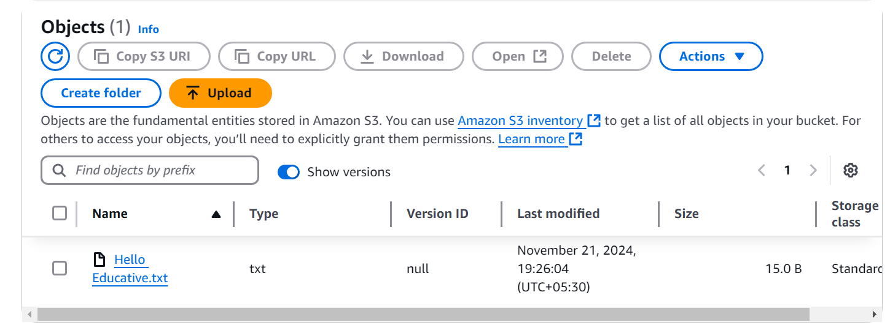
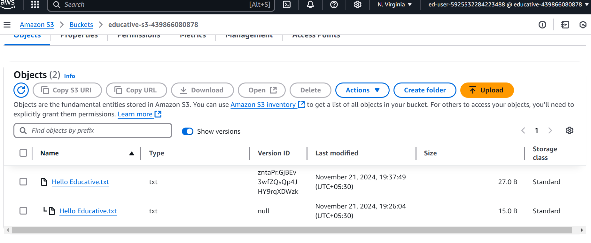
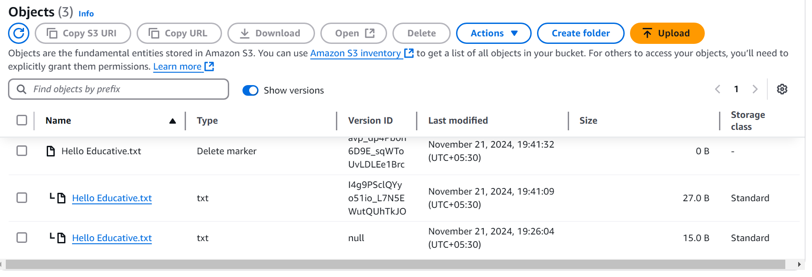
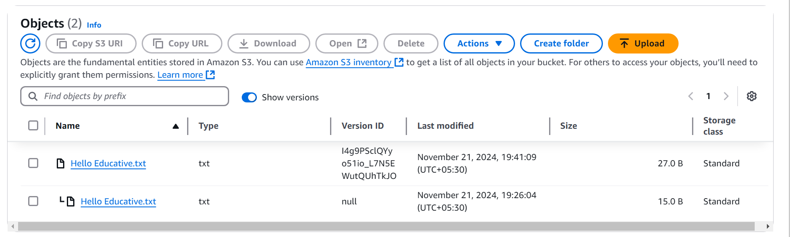
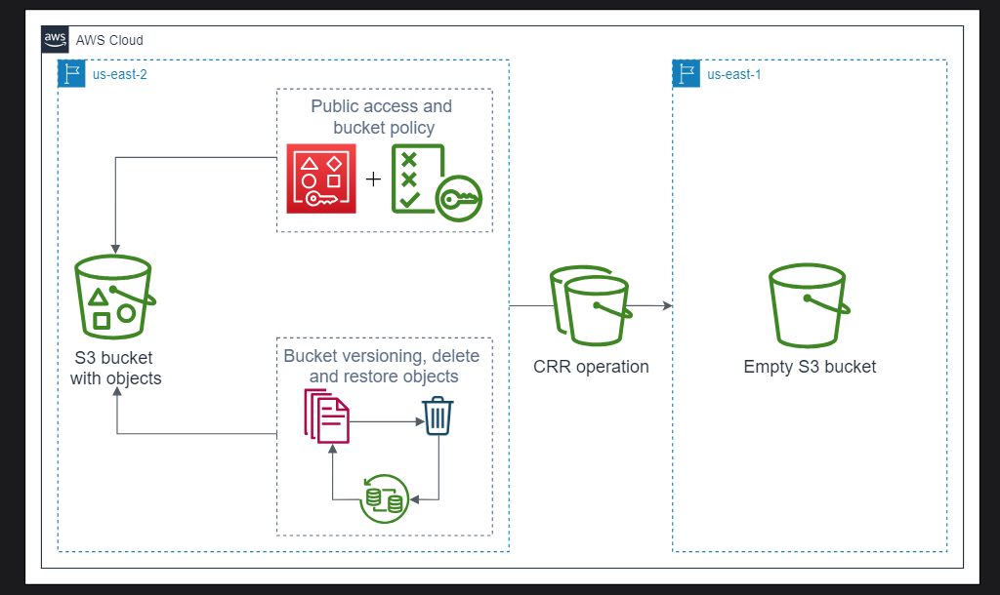

# Working with AWS S3 Cross-Region Replication

## Create an S3 Bucket

- Go to the Amazon Management Console, search for “S3” in the search bar, and press “Enter” to open the S3 services page.

- Click the “Create bucket” button. It opens a new page where you’ll have to provide information to create a bucket.

## General configuration
- Bucket name: The bucket name should be globally unique and not have spaces and uppercase letters. We recommend associating your account ID with your bucket name to achieve this. Account ID can be accessed by clicking your username at the top right corner of the AWS console. The suggested name for the bucket can be educative-s3-<account_ID>.

- AWS Region: Regions are widely separated geographic locations where AWS data centers are installed. Keeping your data in the region nearest to your physical location is helpful. For this task, select the us-east-2 region.

- If you want to copy bucket settings from an existing bucket, click the “Choose bucket” button and select the desired bucket. It is an optional step; we don’t need it for this lab.

## Object ownership
This is where we define the ownership of the objects in this bucket. By default, all objects are under the ownership of the bucket owner. It is controlled using access control lists (ACLs). ACLs are disabled by default, and it is recommended to give access to the bucket and object using the resource policy. We don’t need to change this setting.

### Block public access settings for this bucket
This section ensures that public access to this bucket and its content is blocked by default, and it is recommended to keep it as is unless required. We don’t need to change this setting for this task.

### Bucket versioning
This section allows us to enable the versioning feature on the bucket. If enabled, every object uploaded to the bucket will have a version ID associated with it, and we can upload multiple instances of the same file to this bucket. We’ll keep this setting disabled for now.

Keep the remaining settings and click the “Create bucket” button. Our bucket has been created.

## Add Objects to the Bucket

In this task, we’ll add objects to the bucket. An object is an actual data/file stored in the buckets. We can place unlimited objects in a bucket (remember the pricing), but one object can be up to a maximum of 5 TB

We have successfully created our first bucket, and now it’s time to upload objects. Follow the steps below to add/upload an object to our bucket:

- Go to the “Buckets” dashboard and click the bucket we created in the previous task.

- Currently, the bucket is empty. Click the “Upload” button, and it will take you to the “Upload” page. Since we’re using an AWS console, the maximum size of a file or a folder that can be uploaded is 160 GB.

- Create a text file on your system, add the statement “Hello Educative,” and save it.

- Under the “Files and folders” section, click the “Add files” button and select the text file from your system. Any type of file can be uploaded to the bucket, but we’re working with text files for this lab.

- Click the “Upload” button at the end of the page. It shows the “Upload: status” page. Once the file is uploaded, click the “Close” button to return to the bucket.

- Open the object and try to access the URL under “Object URL” in the browser. You’ll get an access denied error because public access to the bucket is not allowed.

## Public Access and Bucket Policy

In the previous tasks, we learned that public access is blocked by default. In this task, we enable public access and define the resource policy, so we have full control over public access to the bucket.

Follow the steps below to enable public access and define the bucket policy:

- Open the bucket and click the “Permissions” tab. Under this tab, we’ll see the “Block public access (bucket settings)” and “Bucket policy” sections.

- Click the “Edit” button under “Block public access (bucket settings),” and uncheck “Block all public access.” Click the “Save changes” button to open a dialog box. Type “confirm” in the text field and click the “Confirm” button.

- Click the “Edit” button under the “Bucket policy” section, and it takes us to the “Edit bucket policy” page.

- We have a policy editor to define bucket policy. Copy the code snippet given below and paste it into the editor

```json
{
	"Version": "2012-10-17",
	"Statement": [
		{
			"Sid": "ObjectReadOnlyAccess",
			"Principal": "*",
			"Effect": "Allow",
			"Action": [
				"s3:GetObject"
			],
			"Resource": ["your-bucket-arn/*"]
		}
	]
}
```

>Note: Bucket policies should not exceed 20 KB in size.

This bucket policy allows read-only access to any resource available in your bucket. Your bucket ARN (Amazon Resource Name) is displayed above the policy editor. Copy and paste it in place of your-bucket-arn in the policy above.

- Click the “Save changes” button, and the bucket policy will be updated.

- Go to your bucket’s “Objects” tab and click the object.

- Copy the object’s URL from the “Object overview” section and open it in the browser’s tab. The content of the file is visible now.

## Bucket Versioning

Bucket versioning allows us to track the different versions of the same file/object. It is useful when the state of our object changes frequently, and there are chances that we might need any previous state.

### Enable bucket versioning
Let’s enable bucket versioning on our bucket by following the steps given below:

- Click the name of your bucket and go to the “Properties” tab. Click the “Edit” button under the “Bucket Versioning” section.

- Select the “Enable” radio button and click the “Save changes” button. Bucket versioning has been enabled, and every object that’ll be uploaded after this will have a version ID. The previously uploaded object will have a null value for the version ID. We can view object versions by toggling “Show versions” from the “Objects” tab.



- Now, make changes to the same text file (uploaded in task 3) stored on your system and upload it again. Once the file is uploaded, and “Show versions” is enabled, you’ll see its ID under the “Version ID” column.



- Notice how the new file, with the version ID, is above in the hierarchy. S3 automatically makes the latest version available and archives the previous version. If the “Show versions” button is disabled, only the latest file will be visible in the list.

### Delete an object
 Deleting an object from the version-enabled bucket is a bit tricky. Let’s see some steps to delete objects from the version-enabled bucket:

- Currently, we have two versions of a single text file. Only the latest version is visible to us if “Show versions” is not enabled. Click the checkbox against this object and click the “Delete” button.



- It opens up the “Delete objects” page. Type “delete” in the text field of the “Delete objects?” section and click the “Delete objects” button.

- Go to the “Objects” tab of the bucket, and we’ll see that the object has been deleted. Now, toggle the “Show versions,” and both versions of the text file will appear, and a new file of type “Delete marker” is above them. This means that our file is not permanently deleted but has been marked as deleted and is not visible.

>Note : we deleted by not enabling the show version , if you delete by show version and then delete it will permanently delete that version!!

### Restore an object
Restoring a deleted object is very simple. Let’s restore our text file by following the steps below:

- Go to the “Objects” tab and enable “Show versions.” Select the delete marker object and click the “Delete” button.

- Type “permanently delete” in the text field of the “Permanently delete objects?” section and click the “Delete objects” button.

- Now, return to your bucket, and the object will be restored.



## Create IAM Role for CRR

To create an IAM role that grants access to perform replication on S3 bucket follow the steps below:

- Selecting a trusted entity:

    - Search for “IAM” and click the “IAM” service.

    - Click “Roles” under “Access management” from the sidebar.

    - Click the “Create role” button.

    - Select the “AWS service” option.

   -  Under “Use case,” select “S3” from the drop-down.

    - Click the “Next” button to proceed.

- Adding permissions:

    - Search for and select the customer managed "CRRRolePolicy” policy and click the “Next” button to proceed.

- Naming and creating the role:

    - Enter s3crr_role_for_educative-s3 as the role name.

    - After reviewing the settings, click the “Create role” button to start the creation process.

 ## Configure Cross-Region Replication (CRR)

S3 allows replicating your data in another region, and this feature is called cross-region replication. In this task, we’ll create a new bucket in a region other than us-east-2 and configure CRR to our existing bucket so that all the new objects get replicated to the new bucket automatically.

   

Before configuring CRR, let’s take a look at some of the requirements for CRR to work:

1. The source and destination regions are enabled for the owner’s account of the source bucket. If the destination bucket belongs to some other AWS account, then the destination region must be enabled on that account.

2. Source and destination buckets must have bucket versioning enabled.

3. Permissions to replicate objects from a source bucket to the destination bucket(s) on our behalf are required for S3.

4. The object(s) in the source bucket must be owned by the bucket owner, or the object owner must grant read access READ and read access for ACL READ_ACP permissions to the bucket owner.

5. The S3 “Object Lock” settings must be the same for source and destination buckets. If enabled for the source bucket, it must be enabled for the destination bucket. Object Lock is used to preventing the objects from being deleted or overwritten.

Let’s see the steps to configure CRR on the source bucket (created in Task 2):

1. First of all, create a new bucket named educative-s3-dest-\<account-ID\> in the us-east-1 region with bucket versioning enabled because versioning is enabled on the source bucket.

2. Open the source bucket educative-s3-\<account-ID\> (the us-east-2 region), go to the “Management” tab, and click the “Create replication rule” button. It opens up the “Create replication rule” page.

3. Enter the name of the rule, consisting of English characters only.

4. Select the “Apply to all objects in the bucket” option under the “Source bucket” section to replicate all the coming objects.

5. Under the “Destination” section, click the “Browse S3” button while the “Choose a bucket in this account” option is selected. It opens up a list of buckets available under your account. Select the destination bucket educative-s3-dest-\<account-ID\>, and click the “Choose path” button.

6. Under the “IAM role” section, ensure that the “Choose from existing IAM roles” option is selected. Click the drop-down menu and select the role you created in the previous task.

7. Keep the other settings, and click the “Save” button. It opens up a dialogue box. Select the “No, do not replicate existing objects.” option, and click the “Submit” button. The replication rule will be created successfully.

8. Now, go to the source bucket and upload an object. If we go to the destination bucket, the recently uploaded object will be available here (it might take some time to replicate, depending on the size of the object).

> working

## Create a Shareable Link

AWS S3 allows the creation of a shareable link using a presigned URL. Creating a presigned URL makes the object publicly accessible, even if the bucket policy for the bucket is not configured.

Let’s create a presigned URL for the object by following the steps below:

- Open the destination bucket educative-s3-dist-\<account-ID> and go to the “Objects” tab.

- Select the object, click the “Actions” button, and click “Share with a presigned URL.”

- A pop-up will appear where we have to define the expiry time for this presigned URL. Select “Minutes” as the unit and enter 1 in the “Number of minutes” field. This configuration will make the content of the presigned URL unavailable after a minute.

- Click the “Create presigned URL” button. It will create a presigned URL, and a message will appear at the top of the page.”

- Click the “Copy presigned URL” button, paste the URL in the browser, and press the “Enter” key. We’ll see the object in the browser. If we refresh the page after 1 minute, we’ll see an error for access denied.

> working

## Cleanup

It is recommended that we delete all the resources once we are done using them. In this lab, we created two buckets and an IAM role.

>Note: Buckets can not be deleted if they are not empty; therefore, before deleting a bucket, we must delete all its objects.

Let’s finish up this lab by deleting our resources.

### Delete S3 buckets
Follow the steps below to delete the buckets:

- Navigate to the S3 “Buckets” page, select our source bucket from the list, and click the “Empty” button.

- On the next page, type “permanently delete” in the text field, and click the “Empty” button. This process may take time, depending on the size of your bucket. Once the bucket is empty, click the "Exit" button to return to the “Buckets” page.

- Select the bucket again and click the “Delete” button. Type the name of your bucket in the text field on the “Delete bucket” page.

- Click the “Delete bucket” button to delete the bucket.

- Perform these steps for the destination bucket as well.

### Delete IAM role
Follow the steps below to delete the IAM role:

- Navigate to the “IAM Roles” page, and search for your role name.

- Select the role, and click the “Delete” button.

- Type the name of your role in the text field of the pop-up, and click the “Delete” button. Your role will be deleted.