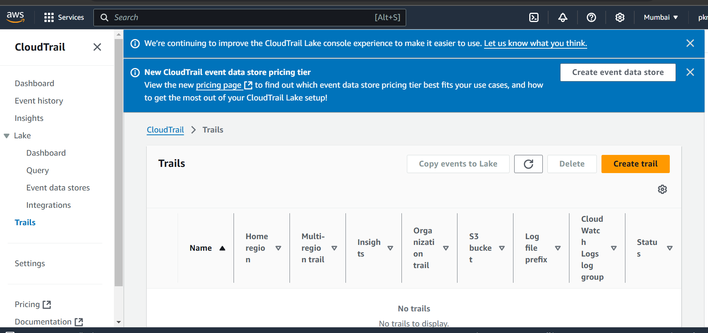

# Lecture 38

S3 is global buckets are regional!!
 
 By default s3 buckets are private ,even public buckets objects are still private !!

> By default versioning is not enabled

> ACL (Access Control list)

When setting up Elastic Bean Stalk , you have created s3 bucket too , to store environment variable!!

To delete this bucket ,go inside bucket then permissions there you first need to delete the bucket policy then only you will be able to delete the bucket created 
by beanstallk, but first empty the bucket!!

let us create bucket , bucket name is universal so create something and put AccountId
at last so that bucket name can be unique!!

private bucket ACLs disabled!!ACLs disabled only IAM policy can be used to access bucket!!

public bucket ACLs enabled--> Objects in this bucket can be owned by other AWS accounts. Access to this bucket and its objects can be specified using ACLs.

we choose disabled for now!!Recommended one is always private bucket!!

then comes Block Public Access settings for this bucket!as private bucket so do not uncheck it!!
> Note:if uncheck it then it will be public bucket!!

for public bucket ACLs enabled!! Bucket versioning disabled for now!!

then encryption see the default one we have put!!

Encrypion decryption is managed by AWS!!

In Advanced settings

for now we disable it , then create bucket!!

If you enable it object will be locked in bucket!!

To create public bucket!! ACLs enabled!! Object Ownership needs to be decided recommended bucket ownner as object ownner ,uncheck Block public access and acknowledge it!!

in s3 you have 2 types of buckets

1. general purpos bucket
2. directory bucket(latest) (super fast ,low latency , single digit ms latency)(billable)

only diffenence between two is directory bucket has single digit ms latency ,it is just very fast!!

so now we created two bucket private and public

when opening a bucket you have following options:

In objects we upload all the objects!!

>Note:To upload object >160 Gb you need to upload via CLI and do multi part upload via CLI,rest api or SDKs

On upload only you see bucket URL and then you see permissiosions,as we have opened private bucket so permissions can only be given by IAM policies!!

on scroll down you see storage classes!!

S3 express Onezone is for directory buckets!!

default one is standard one!! 

if objects are not used frequently so put them to infrequently accessed, if not used at all put them to glacier!!

>Note:prefix means subfolder

>Note:In CLI you get URI of s3 by which you identify s3 bucket object!!

>Note:Object URL is used on browser to identify object!!

if object URl you open , you will not be open that using internet as private Object!!Although you can share by presigned URL!!

>Note:Presigned url works with every bucket whether public or private bukcet or even with private and public object!!

In private bucket you see make public using ACL greyed out as ACL is not in private bucket!!
 whereas in below public bucket you can see option

 

 If there is logs file then we have a  option called Query with SQl select where you can use SQL to query !!

 

 see if you open Object URL of object in public bucket it will still not open as even though bucket is public object is still private , you need to make it public by ACL!!Just actions> make public by ACL > Make public and then access!!

 After that you will be able to access

 ## Vesioning

 let us create  a new bucket and upload object to bucket and enable show version

 

 we upload same image 3 times

 

 Filename should be same for object to be in versions!!
 we deleted the object then on object let see versions!!

 

 if you not click on show version then you will not be able to see the object!! when you show version then you will be able to see delete marker!!

 now to get latest version back just delete the delete marker!!

 In production , versioning is enabled mostly as we get to restore the object!!as sometimes freshers can delete the objects!!

 To Suspend versioning go to properties

 

>Note:To suspend versioning , you can add a additional layer of MFA so that no one other than admin change Versioning!!This can be done by CLI!!

when you click on edit

just click on suspend !! 

Existing object will have no effect of this!!Now when you upload there will be no versioning!!

>Note:Now if you upload object and delete that , you will get delete marker but now as versioning is disabled so now you delete delete marker object will not be restored

But if you delete old object which we upload when versioning was there, you get delete marker and on deletion of that you get object back!!

>Note:Now we again enable versioning!! we delete the object which we upload when no versioning was not there!! there comes delete marker and when you delte that you get old object back!! as here versioning takes precedence

In properties we have server access logs!! On enabling you see you can select bucket where logs will be stored!! that can be this bucket or some another bucket!!

To see object level logs ! use this!

We use CloudTrail to get logs , anything we do in AWS it is recorded in cloud trail!!

Two types of events in cloudtrail!!

Data events !! like someone chnage data in file !! these are not logged by default!!

Here we have something called cloudtrail insights!! used to get notification of unusuaul activities!!just to get your account more safe!

on left you see event history!! We can create Athena table here which help us to do query on the evensts!!

Just need to click on create Athena tables!!

On left you have trail you can use this to get logs of anything!!

 EventBridge can be used to get all events!!

to get notification of anyone have done anything!! click on create event notification!!

 we have 3 destination where we can get the notifications!! also using lambda we can perform some operations !!

 

 if might get this error!! google it to resolve the issue!!

Transfer acceleration--> to speed up transfer

Requester pays:

When enabled, the requester pays for requests and data transfer costs, and anonymous access to this bucket is disabled

Static website hosting : To host static website so for this we need public bucket!!

After you upload html files just make it public using ACLs!!

And on properties static website hosting just enable it !! put index.html and then you get URL of that website!!