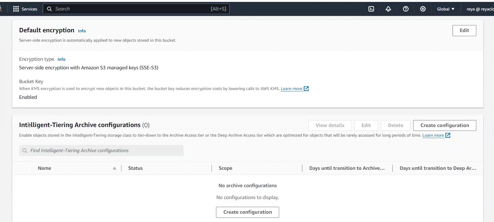
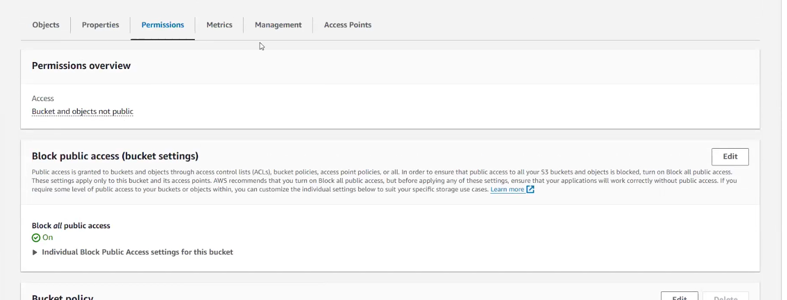

# Notes Lecture 39

When you create bucket then go inside bucket and then in properties!!

you see this option!!Objects in Intelligent tier when not used for long time is moved to Archive Access tier or
deep archive access tier!!

Here just click on configuration! You just can read and select the option!!
This is for intelligent access tier !!

Now let us see permissions!!

 
 first option tells bucket is private and then block public access if you edit this you can make public 
 bucket private and vice versa!!

## CORS (cross origin resource sharing)

we want to take some data from another bucket!!

we have index.html in bucket 1 which has link of another object in another
bucket called bucket 2!!

In bucket 2 you need to enable CORS!!

To enable static website hosting in bucket 1 make sure you have public static html pages!! so first bucket should be public and then object should be made public by ACL!!

then in bucket> properties> static website hosting>enable
put object name and then save!!

in 2nd bucket (public) we upload load.html(2nd html which we want to access from 1st bucket)!! in index.html we put link of this object!!Load.html should be public too!!

>Note: Both the buckets are public

in bucket2 >permissions> CORS >edit

on CORs you see learn more !!you get configuration json , where you need to change allowOrigin key and put bucket URL!!

now we move to metrics!! where all storage about bucket is listed!!

here we have storage class analysis!! which tells which object is frequently used and which is not used frequently!!
which gives you csv you just need to create configuration!!

Then we have replication metrics (CRR concept)!! To monitor CRR we use it!!

### Management

In management we have lifecycle rules and replication rules!!

Lifecycle rules --> change object storage class automatically to some other storage class!! we can create rules for prefix also!!

