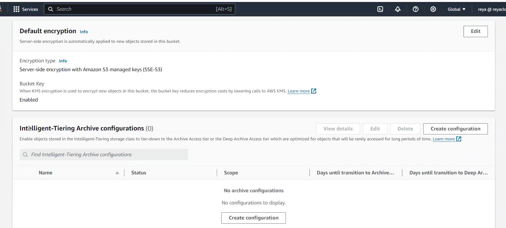
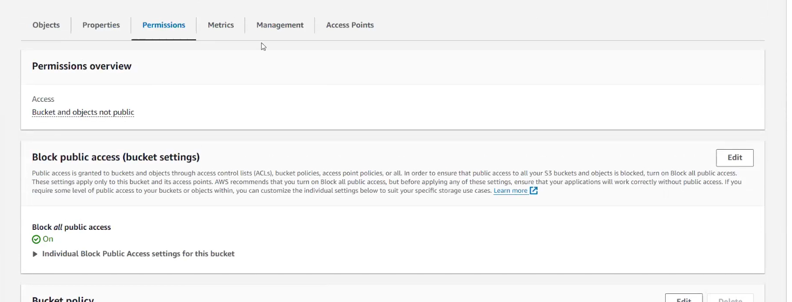

# Notes Lecture 39

When you create bucket then go inside bucket and then in properties!!

you see this option!!Objects in Intelligent tier when not used for long time is moved to Archive Access tier or
deep archive access tier!!

Here just click on configuration! You just can read and select the option!!
This is for intelligent access tier !!

Now let us see permissions!!

 
 first option tells bucket is private and then block public access if you edit this you can make public 
 bucket private and vice versa!!

## CORS (cross origin resource sharing)

we want to take some data from another bucket!!

we have index.html in bucket 1 which has link of another object in another
bucket called bucket 2!!

In bucket 2 you need to enable CORS!!

To enable static website hosting in bucket 1 make sure you have public static html pages!!
then in bucket> properties> static website hosting>enable
put object name and then save!!