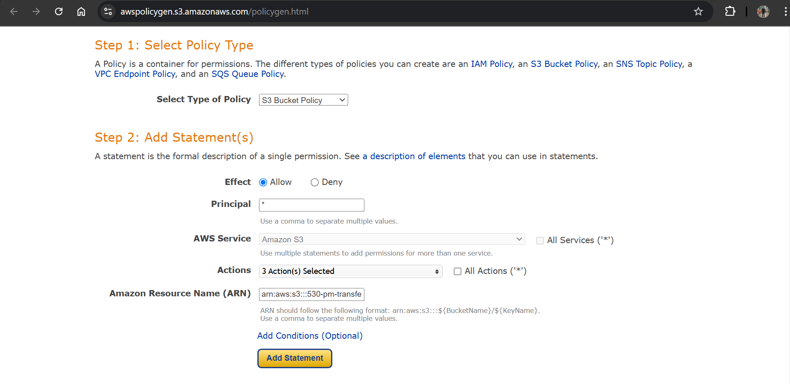
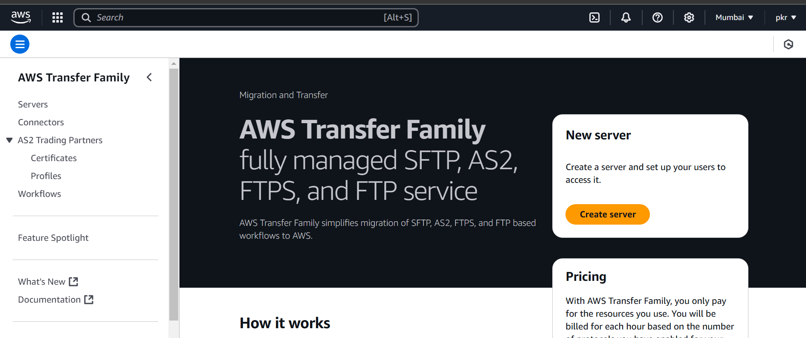
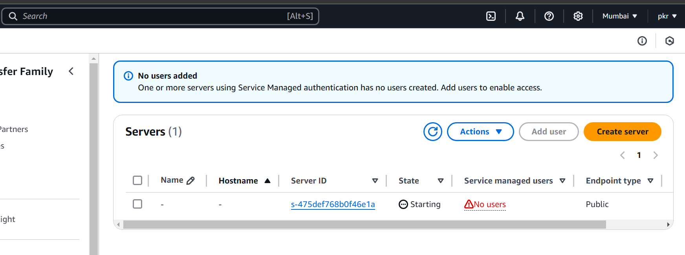
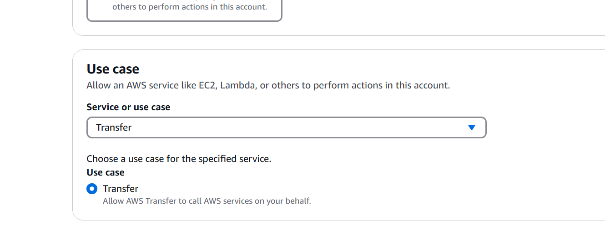
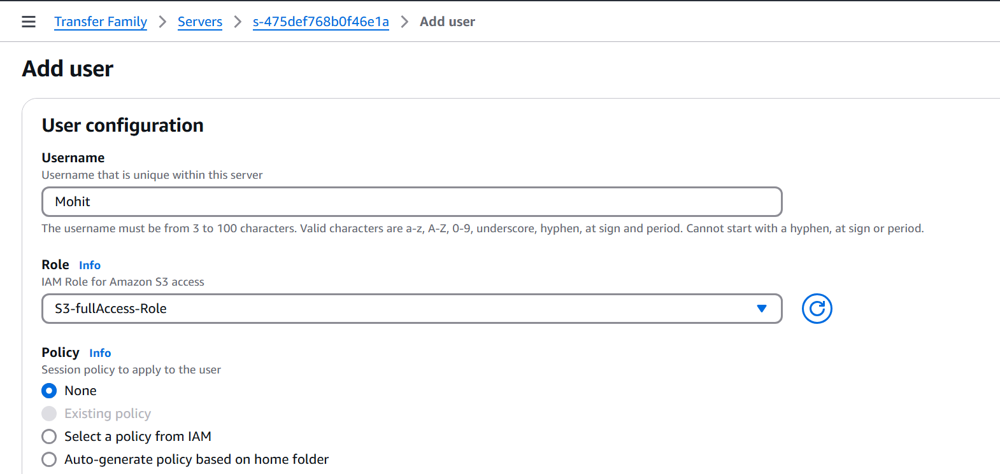
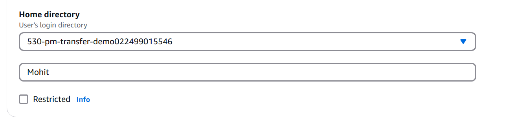
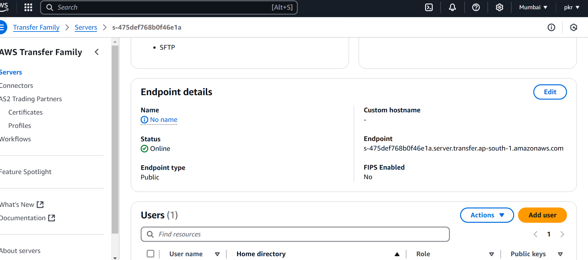

# Lecture 40 AWS transfer family

The AWS Transfer Family is a service offered by Amazon Web Services (AWS) that provides secure and managed file transfer capabilities. It simplifies moving files to and from AWS Storage services like Amazon S3 or Amazon EFS. It securely transfers data using protocols like SFTP, and FTPS while seamlessly integrating with the existing security measures. This means we can migrate and automate file transfers without disrupting the users or applications; everything works the same way behind the scenes.


It supports the following protocols:

- SFTP (Secure File Transfer Protocol): This is a secure version of FTP (File Transfer Protocol) that encrypts both data and commands during transfer, ensuring confidentiality and integrity.

- FTPS (FTP Secure): Another secure option that uses TLS/SSL for encryption, providing a secure channel for file transfers.

- FTP (File Transfer Protocol): While not inherently secure, it’s still an option for transferring non-sensitive data.

- AS2 (Applicability Statement 2): Specifically designed for secure and reliable transfer of EDI (Electronic Data Interchange) transactions.
Customer upload file in your S3 , customer does not have AWS account!! Customer should be able to download and upload to your s3 , no use of IAM user as he does not have any account!! 

### Benefits
The AWS Transfer Family offers several benefits that make it an attractive solution for managing file transfers to and from the AWS cloud:

- Scalability: We don’t have to worry about managing infrastructure or provisioning additional resources as the data transfer needs fluctuate. Built-in autoscaling ensures the service adapts to the workload demands.

- Flexible user authentication: It supports various user authentication methods, allowing us to integrate with existing systems like Active Directory or LDAP or manage credentials directly within the service. This simplifies access control and ensures that users have the right permissions.

- Seamless data integration: The Transfer Family enables further processing and analysis by storing transferred files natively in AWS S3 or EFS. We can leverage other AWS services like S3 for data storage and access or use services like Amazon Translate or Comprehend to extract insights from the transferred data.

- Easy to use: The intuitive interface and API make setting up file transfer endpoints and user access simple. Users can continue using their existing SFTP clients without changing their workflow.

- Familiar AWS management: The Transfer Family integrates seamlessly with other AWS services we might already use. We can leverage IAM for access control, CloudWatch for monitoring, KMS for encryption, and CloudTrail for auditing—all within the familiar AWS management experience.

- Fully managed service: The Transfer Family eliminates the need to manage the file transfer infrastructure. It scales automatically, handles security, and integrates with other AWS services, saving time and resources.

- Cost-effective: With a pay-as-you-go pricing model, we only pay for the resources we use, making it a cost-effective solution for businesses of all sizes.

We know FTP(file transfer protocol),using this customer put file in S3 by use of transfer family!!


Transfer family is managed by AWS!! We just need to create transfer server!! we use protocol SFTP!!

Customer can use tool called FileZilla for SFTP tranfer!!

>We create S3 public bucket!!

There is another protocol called FTPS(FTP over SSL)

>Note: Using transfer family we can transfer in S3 or EFS!!

### How AWS Transfer Family works
Here’s a general workflow for how AWS Transfer Family facilitates secure file transfer between on-premises servers and AWS storage services:

1. Setup: We configure a server endpoint within the Transfer Family service. This involves specifying the transfer protocol (SFTP, FTPS, FTP, or AS2), security settings, and authentication methods. Then, we define user accounts and access permissions, determining which users can access the server endpoint and what actions they can perform (e.g., upload, download, delete files). We also choose our preferred storage destination within AWS, either an S3 bucket for object storage or an Amazon EFS file system for a managed file system.

2. File transfer: Depending on the chosen protocol, users initiate file transfers using standard SFTP clients (WinSCP, FileZilla) or custom scripts. The Transfer Family service authenticates users based on the configured methods (Active Directory, LDAP, or internal credentials). Data transfer occurs securely using the chosen protocol (SFTP, FTPS encrypting data and commands; AS2 adding digital signatures and message receipts).

3. Data storage and processing (optional): Transferred files are automatically saved to the designated S3 bucket or EFS file system within AWS storage. We can leverage other AWS services for further processing or analysis. For example, we could use AWS Lambda functions triggered by file uploads to perform data validation, encryption, or virus scanning tasks.

4. Monitoring and management: The Transfer Family service provides logs and metrics for monitoring file transfer activity. Amazon CloudWatch can track upload/download volume, user access attempts, and potential errors.

Let’s assume we want to securely transfer large product image files from our on-premises servers to AWS for faster website loading times. We can utilize the AWS Transfer Family by setting up an SFTP server endpoint with user access for authorized personnel within the Transfer Family workflow. Photographers can then use their familiar SFTP clients to upload product images to the designated S3 bucket. The transferred images are stored securely in S3, readily accessible for website content management, while the Transfer Family service manages user authentication, encryption, and monitoring of the entire file transfer process.


You need to create transfer server , you get DNS name for that !!we use SFTP protocol!! In transfer server we put a user name!!

Here we use public key and private key concept to login ,not username and password of customer!!
we get private key (.ppk )!!

>Note:Also we do not want customer to give all permissions of bucket we give only put bucket and get bucket permissions to customer!!So we use bucket policies for this!!

>Note: For transfer server we create IAM role so that it can access to put data in S3!!Trustes entity is transfer server

## Steps
1. Create public bucket (if you think deleted data has needs no backup then dont use versioning)
2. create bucket policy
3. create transfer server
4. create IAM role
5. add user
6. give transfer server name,username and private key 


1. create bucket done

2. in bucket go to permissions>bucket policy on edit go to policy generator ,as we do not want customer to have full access as public bucket!! public should not have full accesss so using bucket policy!!

it open a new policy generator window



In principal put * , we have selected 3 actions put Object, get Object and List Bucket!!


For security we have put a condition that only specific ip adress should be able to upload to s3!!
we get the policy

```json
{
  "Id": "Policy1734199008418",
  "Version": "2012-10-17",
  "Statement": [
    {
      "Sid": "Stmt1734199003844",
      "Action": [
        "s3:GetObject",
        "s3:ListBucket",
        "s3:PutObject"
      ],
      "Effect": "Allow",
      "Resource": "<ARN name here>",
      "Condition": {
        "IpAddress": {
          "aws:SourceIp": "106.219.120.224"
        }
      },
      "Principal": "*"
    }
  ]
}
```
put this in s3 bucket policy!!

To give permissions to all sub folders put ARN/* so that customer get permission to get and put in all subfolders of bucket!!

now go to aws transfer family and create server!!



we enable SFTP then click on next

service managed  identity provider then next

we choose public accesss endpoint!!

choose where to push either s3 or efs we choose s3

create a new logs group!!

Mananged workflow we put empty for now !! but if we need something like a notification should come 

we have its own security policy!!

Server host key we will choose for individual! so no neeed to chnange it keep everything default!!



Wait until server get started!!

## IAM role
let us create IAM Role



then on next page give full accesss of s3 to server!! select tarnsfer as trusted entity!!

we need to attach this role to transfer server!!

Now when server is online click on add user!! add role to that user!!



In home directory we choose user name as from username folder will be created and user will upload to that folder



download putty it has puttyGen with it ,it help to generate public key!!just click on generate and copy entire key!! that is public key 

and then on puttyGEn save private for same public key!!

after creating user you see EndPoint!!



Now to transfer file can use mobaxterm or filezilla!!
