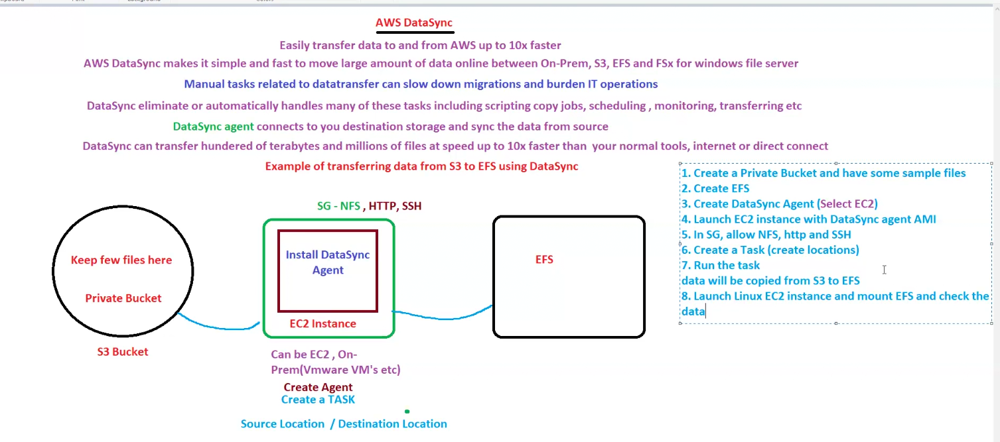
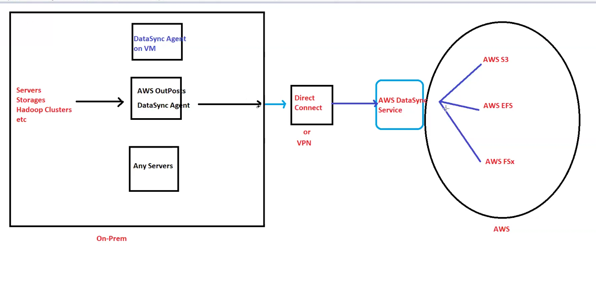

# Lecture 41

In s3 we have bucket policy ,that is no way reated to IAM policy!!

There is a tool called s3 browser ,which is used to access s3!!

For glacier ,we have tool called Fast Glacier!!

Now let us see problem , In on-premises we have a lot of data ,we want to sync with AWS(S3,EFS,Fsx)!!How to sync?

We have to set up script and cron expression so that data be synched!!

Or you have s3 data and you need to put that in EFS!!

These can be acheived by a service called Datasync!

AWS DataSync is another data discovery and transfer service. The service enables users to seamlessly transfer files and objects between AWS storage services, as well as between on-premises storage systems and AWS storage services. AWS DataSync uses end-to-end encryption to safely migrate data between storage services. It supports many on-premises storage systems, AWS, and other cloud storage services.

AWS DataSync service allows organizations to copy their active data sets into Amazon S3, Amazon EFS, and Amazon FsX for Windows File Server.

## How AWS DataSync works
AWS DataSync can be classified into AWS DataSync Discovery and AWS DataSync transfer. DataSync Discovery helps migrate data from on-premises resources to AWS by collecting data and providing guidance. DataSync transfer, with the aid of DataSync Discovery, then transfers data to AWS.

### AWS DataSync discovery
DataSync Discovery uses an agent to connect to the on-premises storage system. After a successful connection, the discovery job runs, sending collected data to AWS DataSync Discovery. Based on the collected data, DataSync Discovery recommends the user AWS storage services. Let’s understand an agent and discovery job in detail.

### Agent
An agent is a pre-configured virtual machine image used by AWS DataSync Discovery to collect information about the on-premises storage systems. With the agent, DataSync Discovery understands how the storage resources are configured and being used on-premises. It allows connection with the management interface of on-premises or on-cloud storage systems and can read and write to it.

### Discovery job
It refers to the task initiated to gather information about on-premises storage systems. It is run when the user successfully deploys the AWS Discovery agent and adds the on-premises storage system to DataSync Discovery. The job expires after 31 days.

## AWS DataSync transfer architecture
AWS DataSync transfers can be categorized into three categories:

- Transferring data between on-premises and AWS: We can migrate data from our on-premises storage (file servers, object storage, databases) to AWS storage services (S3 buckets, EFS file systems) using DataSync. This involves installing a DataSync agent on our on-premises servers to securely connect with AWS. We then configure a task specifying the source and destination locations, along with transfer options like scheduling and encryption. DataSync utilizes a secure and efficient process to move the data between our on-premises environment and the AWS cloud.

- Transferring data between AWS storage services: DataSync also simplifies moving data between different storage services within the AWS cloud. We can configure a DataSync task to transfer data between S3 buckets, EFS file systems, or other AWS storage services. No on-premises agent is required since both source and destination reside within AWS. DataSync utilizes the internal AWS network for efficient data movement, optimizing transfer speeds and performance.

- Facilitating data transfer between AWS and another cloud platform: While DataSync doesn’t directly handle data transfer outside AWS, we can use it as a hybrid approach. We can first configure a DataSync task to transfer data from our on-premises storage or another cloud platform to a staging location within AWS. This utilizes the DataSync agent on our on-premises servers if applicable. However, to transfer the data from AWS to an external destination (another cloud platform or on-premises storage), we’ll need to use separate tools or services like manual download, third-party data migration services, or cloud provider native tools (if the target is another cloud platform).

## Use cases
AWS DataSync is a very beneficial service to fulfill organizational and industrial needs.

- Data migration: Consider an e-commerce retail company accumulating a large volume of customer transaction data stored on its on-premises servers. The company decides to migrate this data to AWS for cost-effectiveness and easy access. The ideal solution for this scenario is that the company deploys AWS DataSync agents in their on-premises environment and configures a data transfer task to move their transaction data to Amazon S3 buckets in AWS. AWS DataSync’s in-flight encryption will provide security, and transferring data to Amazon S3 will provide cost-effectiveness and accessibility.

- Storage for cold data: Consider a financial services firm that has a large amount of historical transaction records that are seldom accessed but can not be permanently deleted. Keeping these records is costly for the company. The company wants to archive this cold data while maintaining accessibility requirements. In this case, AWS DataSync can be used to transfer the firm’s cold data directly to Amazon S3 Glacier archive storage classes. The firm should configure DataSync to automatically move infrequently accessed data from their on-premises storage systems to S3 Glacier, reducing their on-premises storage costs significantly.

---

On premises and AWS connected by VPN!! or you can use AWS direct connect !! It(DataSync) is 10 times faster !!Also no need to write scripts!!

An agent will send the data to data sync!We have used agent in cloudwatch logs!! here this agent communicate both side ,syncing the data!!

If sync between various AWS services , then agent will be installed in ec2!It is faster than any tools!!So DataSync helps to do Data Migaration!!

>Note:We can use AMI that has Datasync agent is installed we can use that too for dataSync agent, for AWS to AWS transfer!!

This was for AWS to AWS !!

Now let us see architecture of On-premises to AWS!!

>Note:AWS set up private cloud in on-premises that service is called as OutPost service by AWS

43:51 practical started!!

