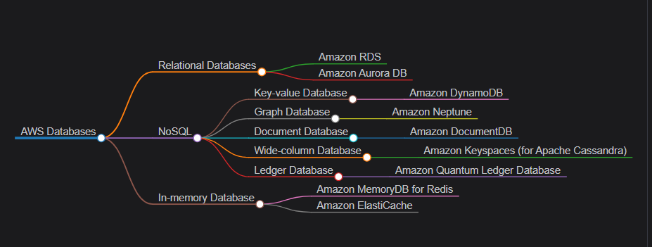
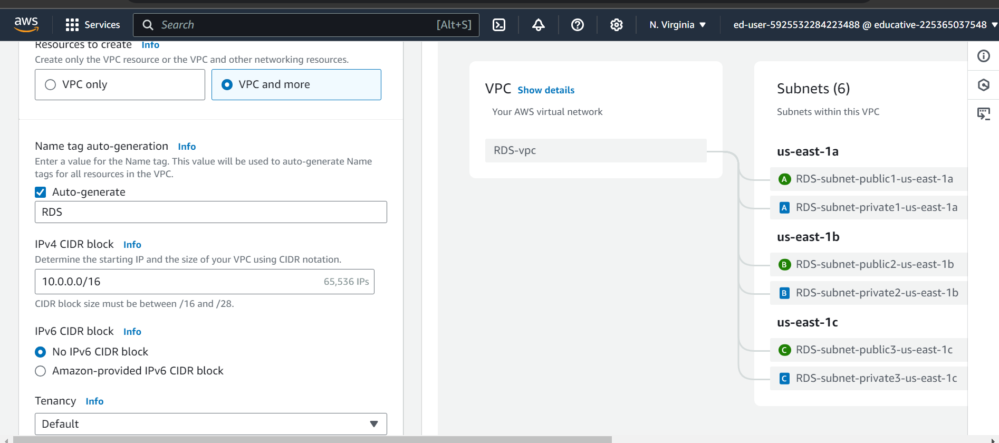
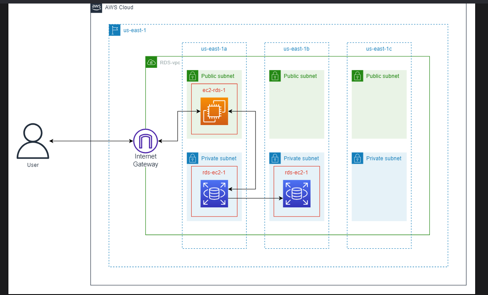
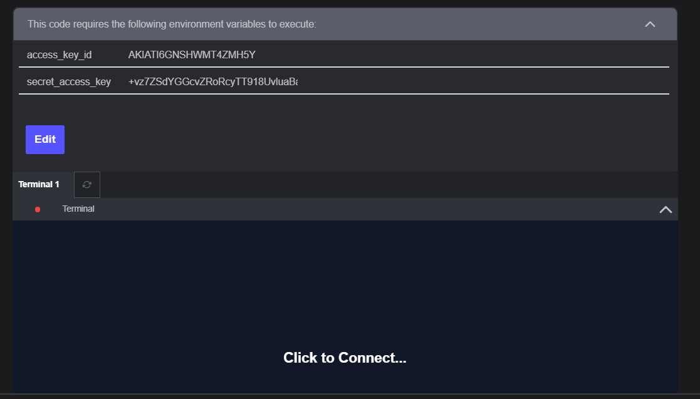
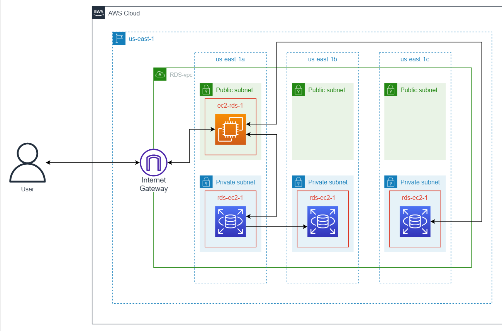
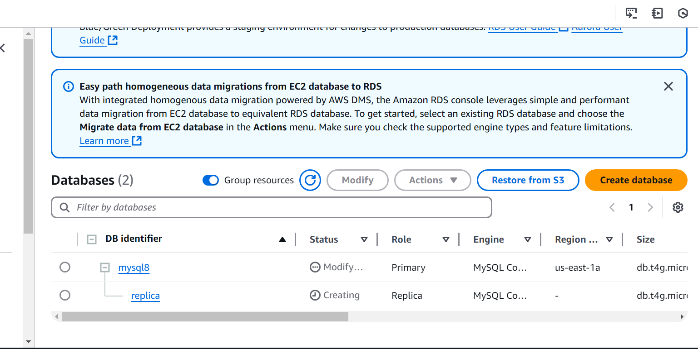

# RDS from 2023 batch
AWS provides several database solutions in almost all famous categories of databases. We have different options for relational databases with various popular database engines. AWS has a wide range of purpose-built NoSQL, in-memory, ledger, and key-value databases.



Key terminologies
Before moving to the details of the database, let’s have a quick look at common terminologies:

- Transaction: A logical unit of work that is performed on the database to retrieve or modify the data. A transaction can consist of multiple operations, which will be considered complete when all the operations are successful. It must comply with the ACID properties.

- Indexing: A technique used to optimize data retrieval by reducing the number of accesses to the database. It creates indexes of the frequently accessed columns, which makes it easy to locate and access data in the database.

- Partitioning: Dividing the data into smaller datasets to improve performance.

- Sharding: Distributing the data across several servers to enhance performance and scalability.

- ACID: A group of properties that are used to check database operations in a transaction. ACID stands for Atomicity, Consistency, Isolation, and Durability. These properties ensure that the database is always valid even if an unexpected event occurs in the system.

    - Atomicity ensures that a single transaction always results in either success or failure. There can’t be a case when a part of the transaction is successful, and another part is failed. If something like this happens, the complete transaction is rolled back.

    - Consistency ensures that the database before and after the execution of the transaction is always consistent.

    - Isolation ensures the independent execution of multiple transactions. No transaction interferes with another transaction so that the database remains consistent after completing the transactions.

    - Durability ensures that once a transaction is completed, the changes made by the transaction are permanent, even if the database crashes.

## Amazon Relational Database Service (RDS)

Amazon Relational Database Service (RDS) is a fully managed database service that allows easy setup, operations, scalability, and high availability in the cloud. It provides cost-effective solutions for scalable and reliable businesses. It is suitable for structured and relational data store requirements.

### DB instance
DB instance in Amazon RDS is an isolated database environment and a basic building block of RDS. A single DB instance can have multiple databases, which can be accessed using client tools and applications. There can be multiple DB instances grouped together under a single cluster. Database instances can be spread across multiple Availability Zones to achieve high availability. 


### DB engines
A database engine is a software that runs on the DB instance. Each version of an engine specifies certain functionalities and features. RDS maintains parameter groups for clusters and instances based on the engine version that defines the configurations of the DB engine. Currently, Amazon RDS supports the following database engines:

- Amazon Aurora 

- MySQL

- PostgreSQL

- Oracle

- Microsoft SQL Server

- IBM Db2

- MariaDB

### DB instance classes
DB instance class defines the computational resources we require for our application or business. Price is calculated based on the instance we choose for our database. That’s why it is very important to select the right instance from the class that best suits our needs. Database instances are categorized into the following four classes based on their usage and requirements:

- General-purpose

- Memory-optimized

- Burstable-performance

- Optimized Reads


## Working with Relational Databases: A Beginner's Guide to AWS RDS practical

### Create a VPC

Before we can start working with RDS, we'll have to set up other resources that are required while creating an RDS DB instance. The first of those resources is VPC (virtual private cloud). An RDS DB instance must be created inside a VPC. This is to enhance security and provide network isolation. So before we learn how to create an RDS database, we must create a VPC inside which we can then place the database instance. The architecture diagram below shows the infrastructure that we'll set up in this task:

Follow the steps below to create a VPC:

- Use the search bar to search for "VPC" and select "VPC" from the search results. This redirects you to the VPC Dashboard.

- Click the "Create VPC" button. You'll be redirected to the "Create VPC" page, where you must configure the VPC according to your requirements.

- From the "Resources to create" section, select the "VPC and more" option. This option gives us more configurability options.

- In the "Name tag auto-generation" section, write RDS in the input field to name the VPC as RDS-vpc.

- Keep the IP settings as they are.

- In the "Number of Availability Zones (AZs)" section, select "3" to get 3 availability zones.

- Select "None" for the "VPC" endpoints.

- Keep all other settings as they are, and click the "Create VPC" button to create the VPC. You'll be redirected to the "Create VPC workflow" page, and your VPC will be created in a while with a success message.



### Create an EC2 Instance

EC2 and RDS can be used together to build scalable and highly available applications on AWS. EC2 provides the computing power needed to run the application, while RDS provides a managed database service that offloads the burden of database administration tasks.

In this task, we’ll create an EC2 instance that we’ll link with our RDS instance to mimic the real-world scenario. The illustration below depicts the infrastructure we’ll have in place at the end of this task.

Follow the steps below to create an EC2 instance:

- Use the search bar to search for "EC2" and select "EC2" from the search results. This redirects you to the EC2 dashboard.

- Click "Instances" from the "Instances" section in the sidebar.

- Click the "Launch instances" button. You’ll be redirected to the "Launch an instance" page, where you’ll need to configure the instance you want to create.

- In the "Name and tags" section, write RDS-client as the name of the instance.

- From the "Application and OS Images (Amazon Machine Image)" section, select the "Ubuntu" option.

- Open the drop-down menu of the “Amazon Machine Image (AMI)” field and select the “Ubuntu Server 22.04 LTS (HVM), SSD Volume Type” option.

- Choose "t2.micro" as the instance type.

- You’ll connect with this instance using an SSH client. For that, you’ll need a key pair associated with it. Follow the steps given below to create a key pair for the instance:

- In the "Key pair (login)" section, click "Create new key pair" option.

- Enter RDS-client-key-pair as the key pair name.

- Ensure that "RSA" and ".pem" are selected as "Key pair type" and "Private key file format" respectively.

- Click the "Create key pair" button.

- The keys will be created and the RDS-client-key-pair.pem file containing the key will be downloaded to your PC.

- Click the "Edit" button in the "Network settings" section to edit the network settings.

- In the newly editable settings, select the "RDS-vpc" as the VPC from the drop-down list.

- Let’s make the EC2 publicly accessible by selecting "RDS-subnet-public1-us-east-1a" from the subnet list.

Select "Enable" from the drop-down list under "Auto-assign public IP" to assign a public IP to this instance.

- Under the "Firewall (security groups)" section, select the "Create security group" option. Security groups are rules that manage the inbound and outbound traffic for an associated instance at the instance level. Selecting the "Create security group" option will open a new subsection. To set the configurations of the security group, do the following:

- Name the security group as RDS-client-security-group.

- Under "Inbound security groups rules," ensure that "SSH" is selected as the rule type and "Anywhere" as the source type.

- In the "Configure storage" section, make sure that "gp2" is selected as the storage type.

- Keep all other sections as they are and click the "Launch instance" button to launch the instance.

- Return to the "Instances" page using the link in the sidebar. You need to wait till the instance state of the newly created instance becomes "Running."

- Click the instance ID of the "RDS-client" instance and copy the "Public IPv4 address" from the instance dashboard. This IP address will be used to connect to the instance later.

## Create an RDS DB Instance

The basic building block of Amazon RDS is a DB instance. A DB instance is a logical database manager environment that can be created and managed using the Amazon RDS. It can be thought of as a virtual machine running a specific database engine that is dedicated to a particular user or application. Each DB instance can contain the data for one or more databases that are associated with the specified database engine version and configuration settings.

Follow the steps below to create a MYSQL DB instance using RDS:

- Use the search bar to search for "RDS" and select "RDS" from the search results. This redirects you to the Amazon RDS service dashboard.

- Click the "Create database" button to start the process of creating a new DB instance.

- You'll have to start by choosing the database creation method. Select the "Standard create" option, which will allow you to customize the instance configurations according to your needs.

- From the "Engine options" section, select "MySQL" as the database engine, as you'll be working with the MySQL database in this lab.

- From the available version 8 MySQL engine options, kindly select the one you prefer.

- From the "Templates" section, select the "Dev/Test" option because it'll allow you to select the deployment options.

- In the "Availability and Durability" section, select "Single DB instance" as the template for the DB instance. The "Single DB instance" option creates a single instance in a single availability zone, whereas the "Multi-AZ DB instance" option creates two instances in different availability zones. It provides data redundancy as the standby instance acts as the primary instance when the primary instance fails because of any reason. The last deployment option, the "Multi-AZ DB cluster," is the best-performing and most expensive option. It creates two read replicas along with the primary instance in different availability zones. Having multiple read replicas in different availability zones reduces the read time. These replicas also act as standby instances and can be used in case the primary instance fails for any reason.


- Under the "Settings" section, select “Self-managed” from “Credentials management” and fill in the information for the DB instance details. Enter mysql8 as the DB instance identifier, admin as the master username, and a master password of your own choice.

- In the "Instance configuration" section, select "Burstable classes (includes t classes)" and then select "db.t4g.micro" option.

- In the "Storage" section, select "Magnetic" as the "Storage type" and write 10 as the allocated storage.

- Click the refresh button on the top right side of the “Connectivity” section to refresh the list of available EC2 instances. After that, select "Connect to an EC2 compute resource" and choose the "RDS-client" instance from the EC2 instances drop-down list.

- Keep the "Database authentication" and "Monitoring" sections as they are.

- Under the "Additional configuration" section, you can configure the backup and maintenance settings for the DB instance, including the backup retention period and maintenance window. That option is activated by default. Keep it as it is since you'll have to use this functionality later.

- Make sure the "Enable deletion protection" option is unselected. Leave everything else as it is in this section.

- Click the "Create database" button to launch the DB instance. Wait for the instance to be created, which may take a few minutes.

- Click the name of the newly created instance. Copy the endpoint from the "Connectivity & security" section and save it to be used later when connecting to this instance.

### Connect with the Database Instance

Follow the steps below to connect to the database:

- Open the RDS-client-key-pair.pem file you downloaded using an IDE. Copy the contents of that file and paste it into the widget below. (we are putting in educative CLI which has Aws CLI installed already)

- Click the "Run" button of the widget to open a terminal.

- Enter the following command in the terminal:

```bash
chmod 400 usercode/RDS-client-key-pair.pem
```
This command sets the correct file permissions of the file containing your key.

- Execute the following command to connect to the EC2 instance:

```bash
ssh -i usercode/RDS-client-key-pair.pem ubuntu@{public-ipv4-address}
```

- Replace the {public-ipv4-address} address with the IPv4 address of your instance that you saved earlier.

- This is your first time connecting to the instance, so you'll be prompted to accept the EC2 instance's host key. Type yes to continue. A connection with your instance will be established. The root@educative will change to ubuntu@ip{private-ipv4-address}, where {private-ipv4-address} is the private IPv4 address of EC2 instance.

- Once the instance is connected, update the apt library by running this command:
```bash
sudo apt update
```

- After the package library has been updated, execute this command to install the MySQL client:
```bash
sudo apt install mysql-client-core-8.0
```

- Now execute the following command to connect with the database:

```bash
mysql -h {endpoint} -P 3306 -u admin -p
```
Replace {endpoint} with the endpoint of the DB instance saved earlier.

- You'll be asked to provide the password you set up while creating the instance. Enter the database password.

- Your database will be connected upon providing the password, and you'll see a welcome message.

- Now that the database is connected, we can use MySQL commands to perform all the operations that we can perform with any MySQL database.

### Multi-AZ Deployment

Multi-AZ deployment allows us to store our data in multiple availability zones to enable fault tolerance. The secondary database created in another availability zone contains all the data stored in the primary database and is dormant. In case of a primary DB instance failure, Amazon RDS automatically fails over to the secondary instance, ensuring that the database remains available with minimal downtime. In this task, we'll create a secondary instance for our database. The architecture diagram below shows the infrastructure that will be in place at the end of this lab.



Follow the steps below to deploy the database in multiple availability zones:

- Open the AWS console and use the search bar to search for "RDS." Select "RDS" from the search results. This redirects you to the Amazon RDS service dashboard.

- Select the "DB Instances" under the "Resources" section.

- Select the "mysql8" database instance from the list.

- Click the "Actions" button to open its drop-down menu and select "Convert to Multi-AZ deployment" to deploy your DB instance to multiple availability zones.

- A window will pop up and ask you if you want this conversion to take place during the maintenance window or immediately. Select "Apply immediately" and click the "Convert to Multi-AZ" button. This will start the modification process.

- The modification may take 10–15 minutes. You'll see a success message at the top of the console once the deployment has been done.

- Once you see the success message, use this command in the terminal below to see the detail of the DB instance:

```bash
aws rds describe-db-instances --db-instance-identifier mysql8
```
- In the output of the command, you should see a MultiAZ variable set to true which shows that Multi-AZ deployment is now active.


on every educative aws CLi you see access key and secret key given!! this means using this cli is already logged in to account!!

### Create Read Replicas

A read replica is a read-only copy of a database instance. It allows us to lessen the read traffic of the primary database instance. This can improve database performance, increase scalability, and reduce the load on the primary database instance. Read replicas can be created in a different region or availability zone to reduce the risk of failure. We can also create read replicas in the same availability zone as the primary DB instance to improve the performance of the database by reducing latency.

In this task, we'll create a read replica of the database instance. The architecture diagram below shows the infrastructure that will be in place by the end of this task.



While creating the primary DB instance, automatic backups were enabled by default, and we kept it as is. This backup on the source instance is required for us to create a read replica.

Follow the steps below to create a read replica of the DB instance:

- In the "mysql8" instance dashboard, click the "Actions" button to open its drop-down menu.

- Select "Create read replica" to create a read replica of your DB instance. You'll be redirected to another page where you'll set the configurations of the read replica.

- In the "Settings" section, enter Replica as "DB instance identifier."

- Keep the other settings as they are and click the "Create read replica" button. The replica creation will start, and you'll be redirected to the "Databases" page of the "Amazon RDS." Wait till the value in the "Status" column becomes "Available."

You'll see a success message when the creation process completes, and the read replica will be visible in the list of database instances.

>Note: The read replica may take 5–15 minutes to create.



This read replica has its own endpoint. We can connect with this instance just like we connected with the primary DB instance in Task 5. For that, we'll have to replace the {endpoint} in mysql -h {endpoint} -P 3306 -u admin -p command with the endpoint of the read replica.

### Clean Up

It is always a good practice to clean up the resources once we stop using them to avoid getting billed for them. Let's finish this lab by cleaning up the resources we created.

#### Delete the DB instances
Let's start by deleting the databases:

- Head over to the "Databases" page of "Amazon RDS." You'll see the original instance and its replica in the database list.

- Select the read replica and click the "Actions" button.

- Select "Delete" from the drop-down list.

- Type delete me in the input field of the pop-up and click the "Delete" button to delete the replica.

- Now select the original DB instance and select the "Delete" action from the drop-down list of the "Actions" button.

- Uncheck "Create final snapshot" and "Retain automated backups" and check the acknowledgment check box that'll appear. Enter delete me in the input field and click the "Delete" button to delete the DB instance.

>Note: The deletion process takes time, so you should not wait for it to complete. You can directly move to the “Terminate the EC2 instance” subtask. You can execute the following subtask after the DB instance deletion process has completed.

#### Delete other database-related resources
After the database instance gets deleted, do the following:

- Head over to the "Resources" section of the Amazon RDS dashboard.

- Just like we deleted the read replica, delete the following resource:

     - Subnet groups

#### Terminate the EC2 instance
Now follow these steps to terminate the EC2 instance we created:

Head over to the EC2 dashboard using the search bar.

- Click "Instances (running)" in the resource section.

- Select the "RDS-client" instance that you created.

- Click the "Instance state" button to open a drop-down list and then select "Terminate instance" from the drop-down list.

- Click the "Terminate" button in the pop-up window to confirm termination.

#### Delete the key pair
Follow the steps below to delete the key pair that was associated with our EC2 instance:

- Open the sidebar and click the "Key Pairs" option under "Network & Security."

- Select the "RDS-client-key-pair" from the list.

- Click the "Action" drop-down button and then click the "Delete" option.

- Enter Delete in the pop-up prompt and click the "Delete" button.

#### Delete the security group
Follow these steps to delete the security group:

- Open the sidebar and click the "Security Groups" option under "Network & Security."

- Select the "RDS-client-security-group" security group from the list.

- Click the "Action" drop-down button and then click the "Delete security groups" option.

- In the popup prompt, click the "Delete" button.

#### Delete the VPC
The last thing that we need to delete is the VPC. Follow these steps to delete it:

- Search for "VPC" using the search bar and select "VPC" from the results to go to the VPC dashboard.

- Select "VPCs" under the "Resources by Region" section to see the list of VPCs.

- Select "RDS-vpc" from the list and open the drop-down list of actions by clicking the "Actions" button.

- Choose "Delete VPC" from the drop-down list. A new window will pop up.

- Enter delete in the input field of the new window and click the "Delete" button to delete the VPC.