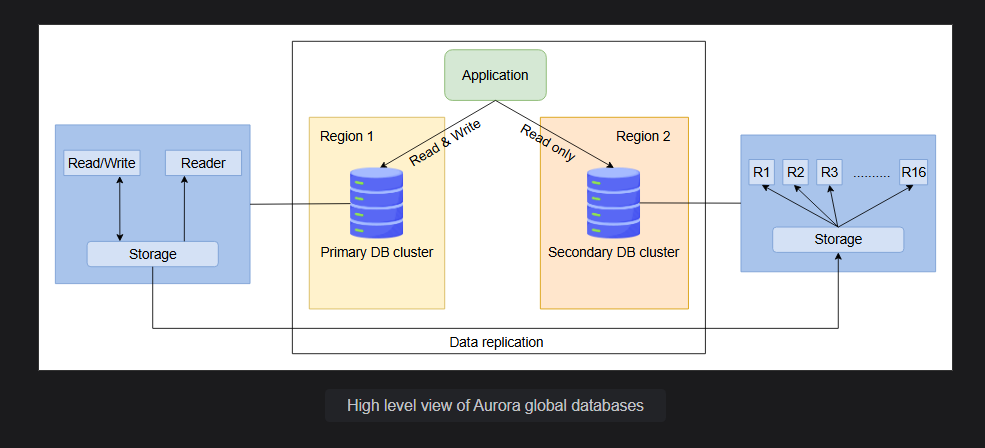

# RDS 

This is from old lecture lec-47  of 2023 batch and lec-44 of 2024 batch!!In DB services we talk about RDS !!

RDS supoorts 7 engines!!

In ec2 we call ec2 instance here we call it RDS db instance!!

We need to understand Read replica and Multi AZ!! Already seen in educative practical!!

Application read and write in DB!!

If you want to connect to DB In application we need hostname(End point):portnumber ,username and password!!

Every Db is connected via EndPoint!!

Here we cannot login like SSH as this is Platform as a service!! we can just connect to DB!!

Whenver we create RDS instance it's role is instance only!!

There are some applications like Business Intelligence tools (read from DB and generate lots of report) which are read only!! for those application we create read replica so that whole load not comes to main DB!!

In primary DB we write and all read replica we read!! Every read replica has it own end point!!

Amazon RDS read replicas have separate endpoints from the primary database instance. Each read replica is assigned its own endpoint, which allows applications to connect directly to it for read operations.

This setup is beneficial for distributing the read workload, improving the overall performance and scalability of your application.

>Note:If you try to write in read replica it will give error!!

After creating read replica role will be Primary of main Db!!

Read replica can be in multiple regions !! for application in multiple regions!! All write on master server
and all read on replica !! all the write will be synched with replica after some time!! so after writes read will happen
asynchronously!!

Read replica is not for high availability it is just to __increase performance__!!

>Note: we can have max 5 read replicas

We can promote read replica to stand alone DB instance!!After promotion it is considered as normal instance !!
To make it primary we need to make it's read replica!!

## Multi AZ or Cluster

Group of DB instance is called as Cluster!! This is used for __high availability__!!

If you select Multi AZ ,one more Db instance will be created but we will not be able to see it!! it
will be managed by AWS!! here data replication will be synchronous between 2 Db's!!

>Note:If you enable Multi AZ you need to pay double the amount!!

if anything wrong happen to your db instance!! immediately failoover will happen to multi AZ DB instance
(Master sb be replaced by Multi AZ db instance)!!

>Note:here both the db instance have same endpoints!! so no effect on the application!! Also we will not be 
able to know if failoover happended or not!!

If someone deleted table failover will not happen, it happens when something wrong with whole DB!!

We can also enable Multi AZ for read replicas!!

You can reserve DB instances for 1 or 3 years!!

Multi AZ doubles the bill!! so select it after thinking a lot!!

## RDS features

Backups here is called as snapshot!!Backup of entire engine is snapshot!!

If backup of only 1 table , then this needs to be done by us only!! this is not managed by AWS!!

Patching/Updates of RDS handled by AWS!! 

We can also encrypt Databases!!can use KMS!!

To get performance we have performance insights!!

We have retention period (time for which backup is present max it can be 35 days) for Automatic backup !!

For manual backup there is no retention period .it will be there till you delete it!!

We can also export snapshot to s3!!

Snapshots can be shared from one region to other also to one account to other!!

>Note:if we need to increase from t2.micro to some other db instance type , we need to stop db instance so
there will be a downtime,no autoscaling here!!

we can have autoscaling at storage level as we can provide min storage and max storage , when your min 
storage full ,it will increase storage automatically!!

>Note:You will be charged only for storage you are using not for max storage when exceeds min storage!!

Parameter group are engine level variables!!

##  Aurora

AWS is 5 times faster than postgresql and 3 times than mySQL!!

Amazon Aurora is a fully managed, cost-effective, and high-performance relational database. It allows us to use the power and flexibility of popular open-source databases like MySQL and PostgreSQL with enhanced throughput. We can create and configure Amazon Aurora using the same Amazon RDS Management Console.

AWS has it's propiatory Engine -Aurora!!It is comptaible with mysql and postgres!! Aws will always recommend to use it!!

 In aurora you can create 15 Read replica whereas in other you can create only 
5 read replica!!

Aurora gives a load balancer for read replica on top of 15 read replica!!

The configuration of Amazon Aurora includes a DB cluster that can consist of one or multiple DB instances. Even a single DB instance will be a part of a DB cluster because of the underlying storage architecture of the Amazon Aurora. Cluster storage consisting of multiple nodes is associated with the DB cluster that can span multiple availability zones, and the cluster’s data is copied to all the nodes.

Aurora is serverless!! based on load power get increased !! it is too much advanced !! it is highly billable!!

### High availability in Amazon Aurora
Amazon Aurora offers high availability for storage and computing independent of each other. 

- High availability for storage: Amazon Aurora is highly available from a data and computing perspective. It separates the compute layer from the storage layer in Aurora, allowing it to replicate data and make it highly available irrespective of the DB instances’ state. Aurora creates six copies of the data and spreads it across three AZs in the same AWS Region. All these copies are attached to the DB cluster and get updated synchronously.

- High availability for compute: While working in a Multi-AZ deployment, Aurora creates one primary DB instance and one read replica or read-only instance in different AZs. Amazon Aurora DB cluster can have up to 15 read replicas and a primary instance across different Availability Zones. Read replicas do not add additional storage costs, as all the DB instances use the same shared storage. Aurora replicas can be configured as a failover point, meaning that if a primary instance goes down, the replica instance will be promoted to the primary instance.

### Aurora backups and snapshots storage
There are two types of backup options in Aurora: automated (continuous) and snapshots (manual). The automated backups are incremental and store all changes within the specified retention period. The retention period of automated backups can be from 1 to 35 days, and we can restore the database to any point in time within the retention period.

>Note: The default retention period for Amazon Aurora is seven days, and it does not charge for backups with one day retention period.

Snapshots are the full backups of the DB cluster, and their size is equal to the volume of the cluster at the time the snapshot is taken. Snapshots taken within the retention period of automated backup get free unlimited storage, but once the retention period is over, snapshots are charged monthly per GB usage.

### Aurora global databases
Global databases are the secondary DB clusters spanning up to five read-only DB clusters in different AWS Regions. Each read-only DB cluster can have 16 (because there is no writer instance) reader instances. The primary DB cluster performs the read/write operations and replicates the data asynchronously to the secondary DB clusters. Global databases are best suitable for applications and businesses that want to show their presence worldwide.

### Cross-region read replicas
Amazon Aurora allows the creation of replicas in different AWS Regions to ensure maximum availability and readability. Cross-region replication can be achieved using Aurora global databases or the native replication schemes of MySQL and PostgreSQL. Aurora MySQL uses its traditional approach of binary logs (binlog) for cross-region replication, while Aurora PostgreSQL does not support cross-region replication, but we can use global databases to create read replicas in different regions.
### Aurora Serverless
Aurora Serverless is an on-demand configuration for MySQL and PostgreSQL-compatible databases. It allows autoscaling, monitoring and managing workload, and adjusting the capacity of the database according to the applications’ needs. Because it provisions on-demand resources therefore, it is more cost-efficient than the standard Aurora clusters.

There are two versions of Aurora Serverless. The v2 is the latest version that is faster and more compatible with other Aurora features and is recommended. Let’s see some of the common use cases, advantages, and requirements of Aurora Serverless v2 in the table below:

| Use Cases	| Advantages|
|------------|------------|
| Capacity planning: No need to worry about changing the DB instance class with the varying workload. Aurora Serverless v2 can take care of this automatically. Existing provisioned Aurora clusters can be modified to serverless and vice versa.|Cost-effective: Aurora Serverless saves the cost of provisioning fixed-size DB instances while not being used to their full capacity. |
|OLTP: In applications like online transaction processing, there are chances of a surge in user interaction. Amazon Aurora Serverless v2 helps autoscale the read replicas according to the workload, and once the traffic becomes normal, it scales down the DB replicas.|Capacity management: Aurora Serverless helps monitor and manage database workload and capacity. |
|Multi-tenant applications: We don’t need to manage the database capacity for each application. Aurora Serverless v2 monitors the workload of individual applications and manages the capacity accordingly. This can save us a lot of time in manual monitoring and managing because each application can have its different workload routine.|Autoscaling: Aurora Serverless v2 provides easy and fast scaling of compute and memory capacity as required. It happens seamlessly, and no delay is experienced in the workload. The support of Aurora global databases also helps in scaling.
|New applications: We can deploy new applications with Aurora Serverless v2 if we are not sure about the workload of our application. Aurora Serverless will autoscale the DB cluster if required. This will save us from incurring extra charges for provisioning DB instances in larger instance classes.|More advanced than v1: Aurora Serverless v2 is more efficient than v1. It is designed for the variable workload and it scales up and down faster than the v1. V2 is more granular as it changes the capacity by 0.5 Aurora Capacity Units (ACUs).
|Development and testing: We can also use Aurora Serverless in a testing environment. Instead of fixed-size database capacity, we can define minimum and maximum capacity, and the Aurora Serverless will perform the autoscaling as required.|Extended support: Aurora Serverless v2 supports the Aurora features like reader DB instances, global databases, and IAM DB authentication, which are unavailable in v1. 

## RDS proxy

Completely managed by AWS!

some people open so many connections to db instance!! so on top of rds engine we have rds proxy!!

RDS proxy pull all connections and delete unwanated connection!!It is chargable!!

All the secrets can be stored in a service called as __Secret manager__ (keys ,username ,passwords)

RDS supports secret manager to get credentials!!

RDS proxy is private (must be accessed from VPC)!! Remember DB is always private!!

