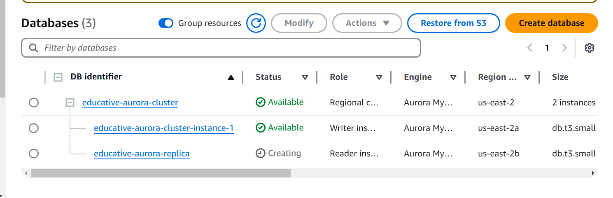

# Getting Started with Amazon Aurora Database Engine

Amazon Aurora is a relational database that allows us to use features of MySQL and PostgreSQL. It uses the Amazon RDS console interface to manage and administer tasks like patching, repairing, failure, and backup. Aurora DB has a cluster hierarchy, so we can find all the instances under one umbrella.

Amazon Aurora also supports smooth migration from Amazon RDS, using MySQL or PostgreSQL, to the relevant versions of the Aurora DB. Amazon Aurora allows us to create up to 15 read replicas across different availability zones of an AWS region. This way, we achieve high availability that'll help us in many situations, including the case of a database failure and to reduce latency to retrieve data from the database.

## Launch ec2

Let’s create an instance by following the steps below:

- Go to ec2


- On the “Launch an instance” page, name your instance.

- Under “Application and OS Images (Amazon Machine Image),” select “Quick Start,” and select “Ubuntu” from the available OS. Selecting this expands a list of available machines. Ensure that the “Ubuntu Server 22.04 LTS (HVM), SSD Volume Type” AMI with 64-bit (x86) architecture is selected.

- Under “Instance type”, select the t2.micro option.

- For “Key pair (login),” select the default value, “Proceed without a key pair (Not recommended).”

- Click the “Edit” button in the “Network settings” section.

Here, we need to define rules for the AWS security group. It controls traffic rules and acts like a virtual firewall for the instances.

- Leave the “VPC-required” option in its default state.
- Under the “Firewall (security groups),” set the name to ec2-aurora-sg, and add a description of the security group.
- We have one security group rule already added in the “Type” category as ssh. Keep it unchanged, and click the “Add security group rule” button.
- For “Type,” select Custom TCP. Enter 3000 in the “Port range” field.
- For “Source type,” select “Anywhere.”
- For the “Description,” write “HTTP” because we define this rule for traffic coming from HTTP.
- Under the “Configure storage” section, ensure that the 8 GiB storage and Amazon EBS gp2 option is selected.
- Keep the remaining settings at default, and click the “Launch instance” button.
- Once the instance is launched successfully, go to the instances dashboard and wait until the value of the “Instance state” column becomes Running.

## Create an Aurora DB Cluster

Once our instance is up and running, we’ll create an Aurora DB cluster. We have two versions of Aurora available: one is MySQL compatible, and the other is PostgreSQL compatible.

The illustration below depicts the provisioned infrastructure of this task:


In this task, we’ll use Aurora MySQL to configure our database. Follow the steps below to create an Aurora DB cluster:

- Type “RDS” in the search bar of the AWS management console and click the RDS service.
- From the left panel, select “Databases,” and click the “Create database” button. Ensure that you are in the us-east-2 region.
- Once the page is loaded, under the “Choose a database creation method” section, select the “Standard create” option.
- Under the “Engine options” section, select the “Aurora (MySQL Compatible)” option and leave the remaining options at their default.
- Select the “Aurora (MySQL 5.7) 2.11.5” option from the drop-down menu of the “Engine version” field.
- Under the “Templates,” select “Dev/Test.”

- Under the “Settings” section:
    - Name the Aurora cluster as educative-aurora-cluster. This identifier is used in the cluster’s endpoint.
    - Keep the value for the “Master username” as admin. This master username is used to get access to the database.
    - Under the “Credentials management” field, select the “Self managed” option.
    - Use educative123 as a password in the “Master password” field that’ll be used for logging in to the database, and rewrite it in the “Confirm master password” field.

- Under the “Instance configuration” section, select “Burstable classes (includes t classes).” Ensure that db.t3.small is selected from the drop-down.
- Under the “Availability & durability” section, keep the “Don’t create an Aurora Replica” option selected.
- Under the “Connectivity” section:
    - For “Compute resource,” select the “Connect to an EC2 compute resource” option.
    - For “EC2 instance,” select the instance you created in the previous task.
    - Keep the remaining settings at their default.

>Note: Our AWS region must have at least two availability zones; otherwise, our Aurora DB will not be created.

- Under the “Monitoring” section, uncheck the checkbox with the “Enable Enhanced monitoring” option.
- Expand the “Additional configuration” section, and write educative_db in the “Initial database name” field. This is a name that Amazon will give to our database when the DB instance is created. The database will not be created if we don’t name it.
- Keep the remaining settings at their default, and click the “Create database” button at the end of the page.


This process will take some time to complete. On the databases dashboard, we’ll see two new entries. One is educative-aurora-cluster, and the second is educative-aurora-cluster-instance-1. We’ll have to wait until the “Status” column for both entries becomes Available. After this, click the cluster name, and at the bottom of the page, you’ll see the “Connected compute resources” section. Under this section, you’ll see that our EC2 instance is listed as a connected resource.


## Set Up a Web Server

In this task, we’ll install an express server to host our web pages and connect with the database.

The illustration below depicts the provisioned infrastructure of this task:


Follow the steps below to install an express server on our EC2 instance, make a database connection using MySQL, and then run an application to insert data.

- Write “EC2” in the search bar of the AWS management console, and click the EC2 service.
- Select “Instances” from the left panel, open your instance, and click the “Connect” button.
- On the “Connect to instance” page, under the “EC2 Instance Connect” tab, click the “Connect” button. Don’t change the default username, ubuntu in our case. It’ll open an EC2 instance terminal in a new browser tab.
- Execute the following commands to install the express server and MySQL client in the instance terminal.

```bash
mkdir eduapp
cd eduapp/
curl -o- https://raw.githubusercontent.com/nvm-sh/nvm/v0.38.0/install.sh | bash
. ~/.nvm/nvm.sh
nvm install 16
npm install --save express
npm install --save mysql
```
By executing the commands above, we’ve installed express and MySQL. Next, we’ll create an HTML form that’ll be used to send data to the database. Execute the following command to create a file:

```bash
cat > form.html << EOF
```
html code

```html
<!-- HTML file-->
<!DOCTYPE html>
<html lang="en"> 
<head>
  <title>Data Entry Form</title>
</head>
<body>
<div>
  <form method="POST">
    <input type="email" name="youremail" placeholder="Email Address" required>
    <input type="text" name="yourname" placeholder="Name" required>
    <input type="submit" value="Insert Record">
  </form>
</div>
</body>
</html>
```
Once we’ve created the form.html file, we’ll create a table in our database named educative_db. We’ll be creating an insertData.js file that’ll connect with the Aurora DB, run an express server, serve a web page (form.html), and insert the data into the database. Execute the following command to create and open insertData.js file in the edit mode:

```bash
nano insertData.js
```

We have the code for the insertData.js file in the widget below. We’re creating a database table named users that has three columns id, username, and email.

Replace the placeholders in lines 6 and 8 before copying the contents of the file. The host must be the endpoint name of your database cluster. To get the endpoint name of your cluster, do the following:

- Search for “RDS” in the search bar, and open RDS service in a new tab.
- Go to “Databases,” and open your cluster.
- Under the “Connectivity & security” tab, we’ll see the “Endpoints” section. There will be two entries in this section—one is of type Writer instance, and the other is Reader instance.
- Copy the Writer instance endpoint and paste it in place of <ENDPOINT_OF_WRITER_INSTANCE>.

Replace <YOUR_PASSWORD> with the master password given at the time of cluster creation.

Once the placeholders have been replaced, copy the code


```javascript
const express = require("express");
const mysql = require("mysql");
const bodyParser = require('body-parser');

const db = mysql.createConnection({
  host: "<ENDPOINT_OF_WRITER_INSTANCE>",
  user: "admin",
  password: "<YOUR_PASSWORD>",
  database: "educative_db",
});

// Connect to MySQL
db.connect((err) => {
  if (err) throw err;

  db.query(
    'CREATE TABLE IF NOT EXISTS users(id int NOT NULL AUTO_INCREMENT, username varchar(30), email varchar(255), PRIMARY KEY(id));',
    function (error, result, fields) {
      console.log("Table has been created successfully");
  });
});

const app = express();

const PORT = process.env.PORT || 3000;
app.listen(PORT, () => {
  console.log('Server started on port 3000');
});

// get our app to use body parser 
app.use(bodyParser.urlencoded({ extended: true }))

app.get('/', (req, res) => {
  res.sendFile(__dirname + '/form.html');
});

app.post('/', (req, res) => {
  if (req.body.yourname && req.body.youremail) {
    console.log('Request received');
    let name = req.body.yourname;
    let email = req.body.youremail;

    var sql = `INSERT INTO users (username, email) VALUES ('${name}', '${email}')`;
    db.query(sql, function (err, result, fields) {
      if (err) res.send(err);
      if (result) res.send({ username: name, email: email });
      if (fields) console.log(fields);
    });
  } else {
    console.log('Missing a parameter');
  }
});

```
Once we’ve added the code to the insertData.js file, we’ll use the Ctrl+o + enter command to save the file, and Ctrl+x to exit the editor.

Next, we’ll run this file by executing the following command in the EC2 instance terminal.

```bash
node insertData.js
#Server started on port 3000
#Table has been created successfully
```
### Access the server
Let’s see how we can access our application running on an express server and insert data into the database.

- On the EC2 instance terminal page, we have the instance ID, name, and public and private IP address listed at the bottom.

- Copy the public IP address, append:3000/ as a port number, and paste it into the browser’s address bar. The URL must look like http://IP-ADDRESS:3000/. Ensure that you are accessing it through HTTP, not HTTPS.

- When you access the public IP, you’ll see a basic form with two input fields and one button. Fill the fields with appropriate data, and press the “Insert Record” button to insert data into the users table.

- Let’s go back to the EC2 instance terminal tab. Here, we’ll see the message “Request received” in the terminal. We can add multiple records using the same public IP address.

- Once we are done adding records, we’ll close the connection using the Ctrl+c command in the instance terminal.
### Task summary
Our web application runs on an EC2 instance, and we have established a connection with the Aurora DB to store and retrieve data.

Additionally, we can get information about the database that we are connected to and the table fields by using the following MySQL commands in the insertData.js file:

- DESCRIBE educative_db.users
- SELECT DATABASE()


## Create Aurora DB Read Replica

Our application runs on an EC2 instance that can communicate with the Aurora DB cluster. We have established the connection by using the endpoint of the writer instance, but we can read the data from the database using the same endpoint. This would work perfectly for small applications making a few read-and-write requests simultaneously.

Now, think of a real-world application that the Aurora DB backs, which has many read-write requests per second. In this case, if the traffic to read from the database and to write into it is served by a single endpoint, it’ll get choked. With Aurora DB Read Replica, we can route our read-only traffic to the reader instance. This way, we have one endpoint for writing and one for reading.

There could be another scenario when our writer instance gets failed. By default, the Aurora cluster has only one primary/ writer instance; if it fails, we have to wait a bit longer for Aurora to launch a new instance to replace the primary instance. But, if we have Read Replicas available, Aurora will promote one of the replicas as the primary instance, and the wait time for this process is less than the spinning up of a new instance. One Aurora cluster can have up to 15 Read Replicas in different availability zones within a region.

We want our Aurora cluster to be highly available when a failure is detected. In this task, we will introduce high availability (HA) to our cluster by creating a Read Replica.

The illustration below depicts the provisioned infrastructure of this task:


Let's create a replica of our primary/writer instance by following the steps below:

- Go to the “RDS” dashboard, select “Databases” from the left panel, and click the name of your Aurora cluster.

- Notice the column “Region & AZ” value for the writer instance. It should be us-east-2a, us-east-2b, or us-east-2c, depending on your cluster in the us-east-2 region. Aurora recommends creating our Read Replica in a different AZ as our writer instance. Additionally, we can see the value of the “Multi-AZ” column, and it should be “No”.

- Click the “Actions” button at the top right corner of the page, and click the “Add reader” option.

- On the “Add reader” page, give the educative-aurora-replica name to your reader instance in the “DB instance identifier” text field.

- Under the “Instance configuration” section, ensure that the “Burstable classes (includes t classes)” option is selected and db.t3.small is selected from the drop-down.

- Under the “Connectivity” section, select an availability zone from the drop-down list. Your Read Replica will be created in that zone. Ensure that you select a different AZ than your writer instance.

- Keep the remaining settings at their default, and click the “Add reader” button.

On the “Databases” page, you'll notice that there is another instance under your cluster with the role “Reader instance” and status “Creating.” This process will take a few minutes, and now we can see that the value of the “Multi-AZ” column has been updated to “2 Zones,” which meansg we now have instances in two different zones.

>Note: You have to wait till the status of this instance becomes “Available” otherwise, the connection to this instance will not establish. Keep refreshing the page to view the latest state of the instance.



## Testing the Reader Instance

We have achieved high availability in the Aurora DB cluster by creating a replica node/ instance. It's time to test the reader instance for a use case to make read requests to the database. In this task, we’ll use our node application, create a new page that'll connect to the endpoint of this reader instance, and make read requests to the database.

The illustration below depicts the provisioned infrastructure of this task:


Let's follow the steps below to test the reader instance:

on ec2 run

```bash
cd eduapp
nano retrieveData.js
```

```javascript
const express = require("express");
const mysql = require("mysql");

const db = mysql.createConnection({
  host: "<ENDPOINT_OF_REPLICA_INSTANCE>",
  user: "admin",
  password: "<YOUR_PASSWORD>",
  database: "educative_db",
});

// Connect to MySQL
db.connect((err) => {
  if (err) throw err;
  console.log("Connected to database");
});

const app = express();

const PORT = process.env.PORT || 3000;
app.listen(PORT, () => {
  console.log('Server started on port 3000');
});

app.get('/', (req, res) => {
  let sql = `SELECT * FROM users`;
  let query = db.query(sql, function (err, result, fields) {
    if (err) {
      throw err;
    }
    res.send(result);
  });
});
```


In the code above, we connect with our educative_db database and access its reader instance. Once we’ve pasted the above code in the EC2 instance terminal, we’ll execute the following command to run the server.


Let's try to make a post request using the connection created in the retrieveData.js file.

- Stop the server using the Ctrl+c command on the EC2 instance terminal

- Open the retrieveData.js file using the nano retrieveData.js command.

- Copy the code  below and paste it at the end of the file. Save the changes using the Ctrl+o + enter command and then use the Ctrl+x command to exit the editor mode.

- Execute the file again, and try to access the URL http://PUBLIC-IP:3000/adduser. You'll get an error in the terminal with the sqlMessage field having The MySQL server is running with the --read-only option so it cannot execute this statement message.


```javascript
app.get("/adduser", (req, res) => {
  let post = { username: "John Doe", email: "johndoe@example.com" };
  let sql = "INSERT INTO users SET ?";
  let query = db.query(sql, post, (err) => {
    if (err) {
      console.log(err.sqlMessage);
      res.send(err.sqlMessage);
    }
    else {
      res.send("user added");
    }
  });
});

```

## Testing Instance Failover

In this task, we'll check the behavior of the replica instance in the case of the primary instance failure. We'll configure the Aurora replica as a failover so that Aurora automatically promotes the replica instance to the primary instance when a failure is detected in the primary instance. The illustration below depicts the state of the resources when database failure happens.


### Configure the replica as a failover
Follow the steps below to configure the Aurora replica as a failover:

- Go to the “RDS” dashboard, and open the “Databases” page.

- Select the replica/reader instance, and click the “Modify” button at the top of the page.

- Under the “Additional configuration” section, select tier-0 as failover priority. Aurora promotes the replica with the highest failover priority to the primary instance. If we have multiple replicas, we can assign different failover priorities to different replicas.

- Click the “Continue” button. On the next page, under the “Schedule modifications” section, select the “Apply immediately” option, and click the “Modify DB instance.” The modifications will take a few minutes. Wait until the status of the reader instance becomes “Available.”

- Our reader instance has been configured for a DB failover.

### Test the failover
Let's see the behavior of our reader instance in case of the writer instance failure.

Initially


-Select the writer instance, click the “Actions” button from the top of the page, and select the “Failover” option.

- Click the “Failover” button on the “Failover DB Cluster” page.

After some time, the replica instance will be promoted to the primary instance, and the previous primary instance will become a reader instance. It usually takes around 60 seconds to complete the failover process, but depending on the database activity, it can take longer.

After


## Clean Up

Now that we’ve completed all the tasks, we’ll clean up the resources we’ve created.

- Go to the “RDS” dashboard, and open the “Databases” page.
- Select the primary instance under the DB cluster, click the “Actions” buttons, and select the “Delete” option.
- It’ll open a confirmation pop-up. Write “delete me” and click the “Delete” button. Deleting the instance will take some time; once it is deleted, the reader instance will become the primary instance.
- Select the instance (this time, you have only one instance, which is a primary one) again, and delete it.

- In the confirmation pop-up, you’ll have additional options. Aurora allows you to make a snapshot of your database in case you want to use it again. - - We’ll not create a snapshot for this lab, so uncheck the “Create final snapshot” option and check the acknowledgment to delete backups, snapshots, and files.

- Write “delete me” in the text field, and click the “Delete” button. Deleting all the instances deletes the cluster automatically. Wait until the database is deleted.

- Go to the “EC2” dashboard, and select your instance on the “Instances” page.

- Click the “Instance state” button, and select the “Terminate instance” option.

- Click the “Terminate” button on the confirmation box. After some time, the value of the “Instance state” column will become “Terminated.”