# Lecture 44 (Developer's topic)

Increase performace- ElasticCache

we know what cache is !! How it works!!

Application code need to be such that it find data in elasticcache first then go to RDS, Aws engineer not do that!! After getting data from RDs we put in cache!! Frequently accessed data is put in elastic cache!!

It is in memory DB caching service!!

ElasticCache supports two engine !! MemcacheD and Redis!!

Redis Supports High Availability ,Failover , Persistant data (stop and start redis ,data will be there),Backups whereas MemcacheD does not support any of these so people use Redis mostly!!

ElasticCache is mostly for read purpose!!

Basically whenevr you connect to server , You are in a session ,session data has all credentials ,ip adress etc which is stored in cookies , Elastic Cache can be used to store that data!!

>Note:It is Also  serverless! you can go with a server like choose instance type or be serverless based on traffic it will increase storage

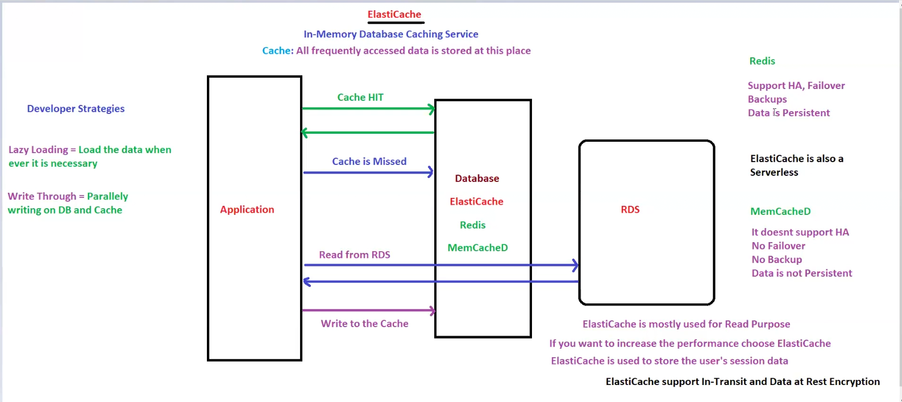

## Lazy loading and write through difference

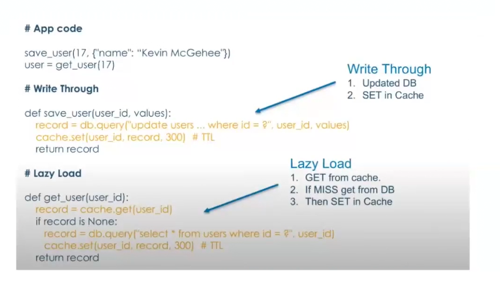

AWS Outposts is a fully managed service from Amazon Web Services (AWS) that extends AWS infrastructure, services, APIs, and tools to virtually any on-premises or edge location. It provides a hybrid cloud solution that allows you to run applications seamlessly across on-premises and AWS environments.

AWS Outposts is like bringing the AWS cloud into your own building. Imagine you have a piece of AWS sitting in your office or data center. It lets you use AWS services (like servers, storage, and databases) right where you need them, instead of only in the AWS cloud.

How It Works:
- Order It: Pick the setup you need, and AWS will deliver it to you.
- Set It Up: AWS will install the equipment at your location.
- Use It: You use AWS tools like normal, but now part of AWS is in your building.
- Relax: AWS keeps it updated and running smoothly.

Why Use It?
- For Low Latency: If your apps need super-fast responses or need to work with machines nearby, this helps.
- For Special Rules: If you have rules saying your data must stay in your country or building.
- For Local Work: If you want to process data nearby but still connect to the AWS cloud.

ElasticCache is service having 2 engine :redis and memcached like RDS is service having 6 engines!!

Redis is widely used so let us see that in detail!!

Cluster --> collection of shards!!

Shard --> collection of nodes!!In 1 shard there are 6 nodes!!1 Primary and 5 read replica!!

In 1 cluster you can have 500 shard!!

If no cluster mode then only one shrad if cluster mode enabled then can have 500 shrad!!

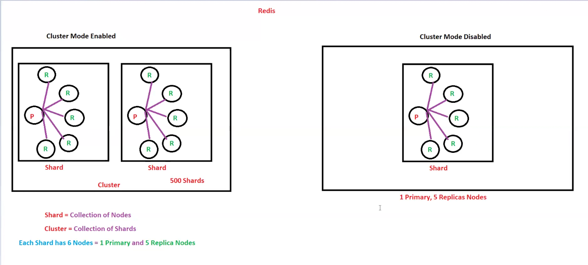

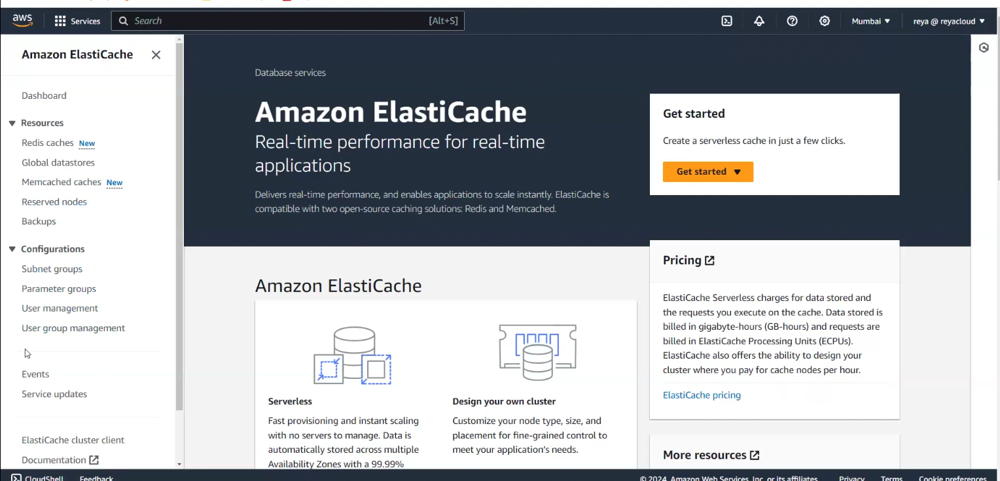

This elasticCache menu is very much similar to RDS!!

we choose to create MemcacheD

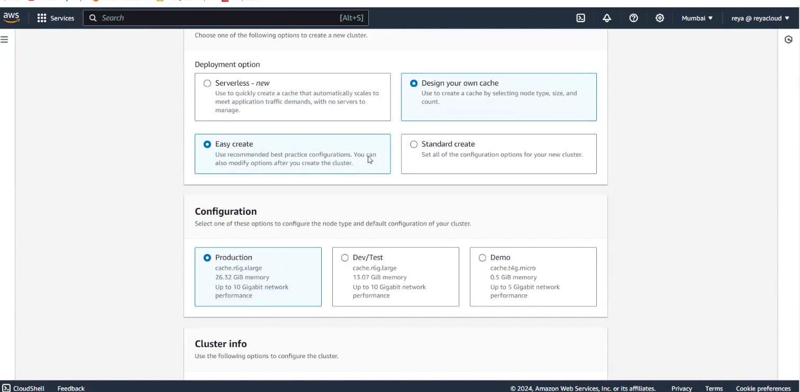

Easy create just everything is automatically selected and in Standard create we 
need to create everything!!

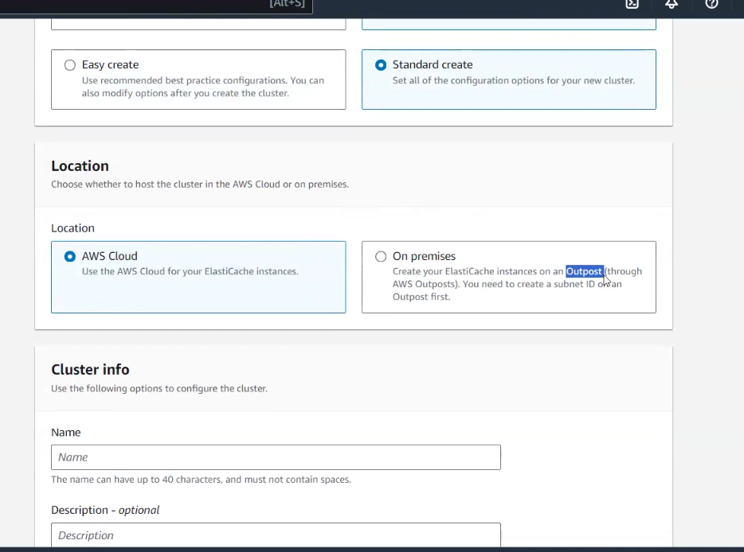

we choose standard create where we choose location as AWS cloud as on On premises cache will be sent to our location!!
That an outpost!!

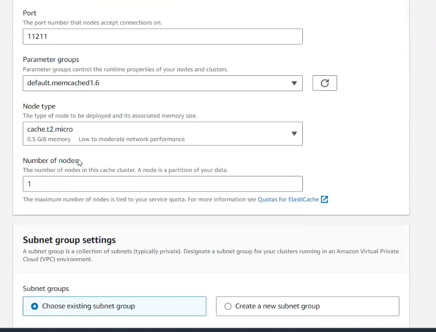

see the above options we have selected!!Rest all same as RDS!!

>Note:To get max limits of any service see service Quotas Just select the 
service and you will get the Quotas

Adjustability means we can increase by raising the ticket to AWS!! If not adjustable it means we cannot increase it!!

>Note:ElasticCache is a key-value DB in backend!!

While Choosing redis you will get option to cluster mode enable or disable!!

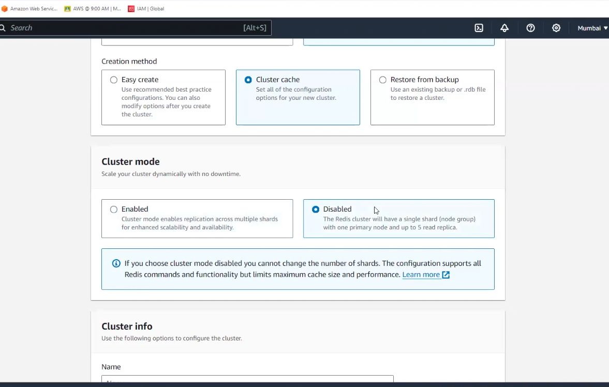

If enabled it asks how many shrad and in every shrad how many max node you need!!

Redis supports backup and extra thing we have seen already than memcached!

Global datasource is just replication in another region!!

## Task

Connect redis cluster to Ec2!!

## Amazon DynamoDB (another devloper topic)

Nothing to do on console!!No engine ,nothing!!

Amazon DynamoDB is a fully managed, schemaless NoSQL database service that handles all management tasks, including monitoring the hardware capacity, software updates, and patches. It offers fast and predictable performance and seamless scalability. DynamoDB automatically replicates data across three availability zones in an AWS Region to provide high availability and durability.

It provides an encryption mechanism to prevent us from worrying about data protection. We can scale up and down DynamoDB according to the data amount without downtime. It also supports on-demand backup, point-in-time restore, and long-term retention for regulatory compliance.

### Core components of DynamoDB

NoSQL--> Not Only SQL

Facebook,Amazon not using RDBMS ,as they need super-fast response so they use NoSQL (non-relational DB)!! They provide very fast response!!

SQL is very much restricted NoSQL is not restricted, In SQl you need to respect the relation!!

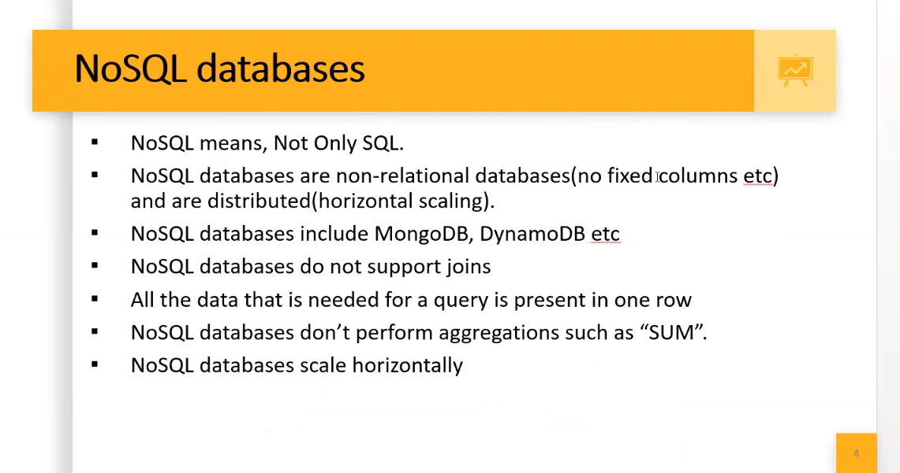

e.g. Redis,MongoDB, casandra etc

>Note:Sql is for complex queries but Nosql is for super-fast response,not for complex queries

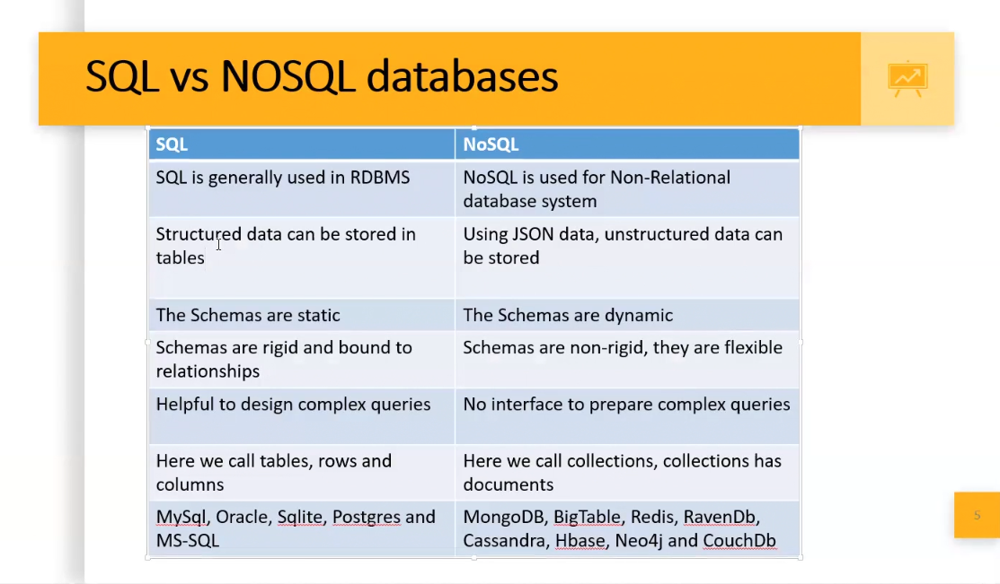

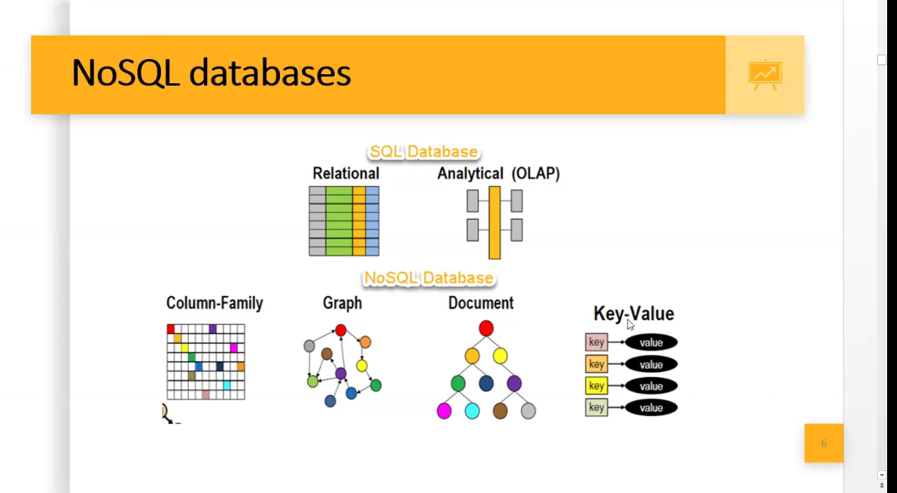

Redis is key-value Nosql

DynamoDB support document and key-value both!!

Redshift support columnar ,used for big-data!!

There are three main components of Amazon DynamoDB that help to store data, maintain ordering and structure, and query the data:

- Tables: The table is the main entity, like we have in relational databases. It stores the data about a particular entity/thing in the form of items and maintains relations. 

- Items: An item is a collection of attributes that describe the item’s properties. An item is unique among the other items. Items are the same as other databases’ records, rows, or tuples. In DynamoDB, we can have unlimited items in a table, and a table can exist without any item.

- Attributes: An attribute is a building block of a table. It defines an item’s properties and nature. The type of an attribute remains the same for each item in a table. In DynamoDB, attributes can be considered columns or fields of other databases.

DynamoDB maintains keys and indexes to manage and organize data efficiently.

In Rds we increase capacity of server by changing capacity of chnaging instance type!!

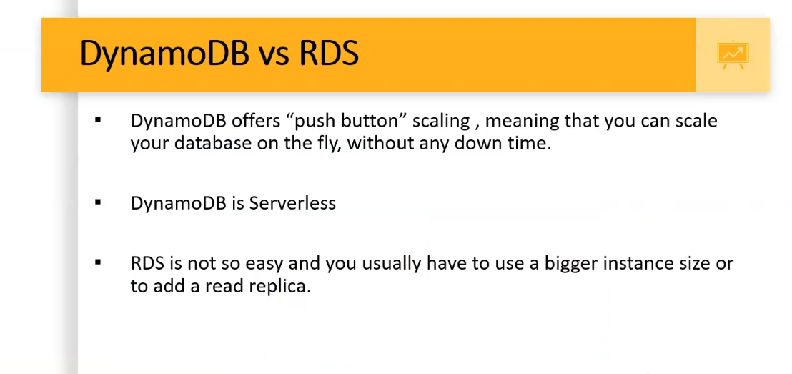

In RDS we need to stop machine to scale-up !! In here we have RCU (read capacity unit) and WCU(Write capacity unit)
if we want to scale up we just put in these and dynamoDB will scale up!!

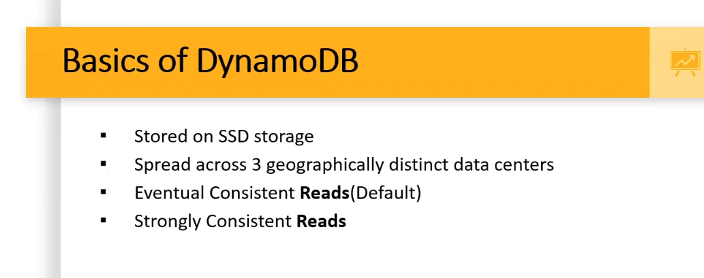

Two consistency model 
1. ECR ( Eventually consistency reads)(slowly read)(default)
2. SCR (Strongly consistency reads)(immediately read)

in DynamoDB we give PK called as Partition Key!! this is first column we give when we create Nosql table!!It is 
manadatory!!

If we want to add two tables but two tables have same keys!! We can do that by composite key which is comination of 
partition key and sort key (eg empId+PhoneNo)!! But phoneNo should be unique!! sort key is optional , Partition key is
mandatory!!

Primarykey or partition key is also called as Hash attribute!! and sort key is also called as range attribute!!

DynamoDB streams has logs about what items you have change ,it notes logs whatevr you chnage!!

Kinesis DataStream can also be used to get item level change!!

You can set TTL time for a record , suppose you take netflix subscription for 3 months ,then The AWS engineer put record with TTL of 3 months
after 3 months ,it will be deleted from table !! so after 3 months this is how your subscription get over!!

Indexes we know in table!!It help to speed up the search!!Without index you need to go row by row!!
2 types of index
1. LSI(Local secondary index)(partition key+ any sort key)(can be created only at time of creating table)
2. GSI(Global secondary index)(any partition key +any sort key)(can be created any time)

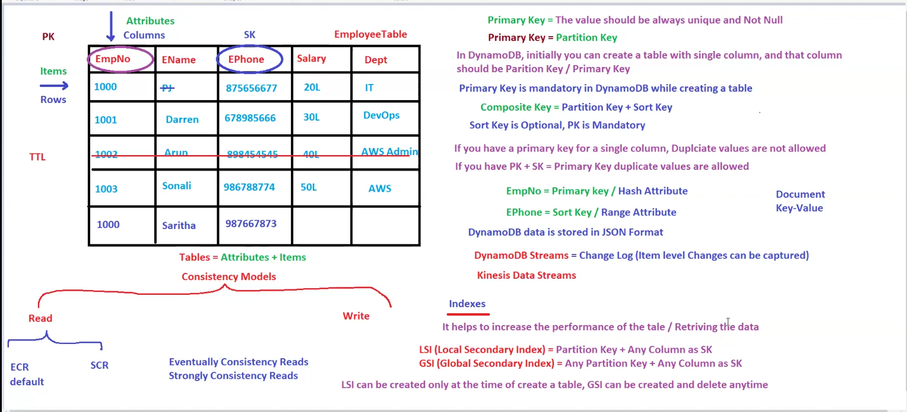
