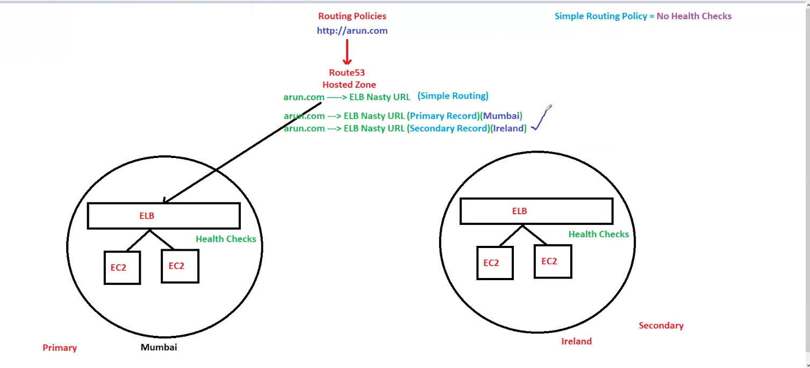

# Lecture 46 Route53

Route53 is DNS service,53 is DNS port number ,it is all about route, nasty URl we chnage to a beautiful url!!

DNS keeps track of hostname and IP!! and converts one another to each other!!

>Route53,Cloudfront,s3,IAM is Global

DNS is all about records!!

In route53 we create hostedzone!!

Route 53 is a scalable Domain Name System (DNS) service. The “53” in Route 53 refers to the TCP and UDP port number 53, a standard port for DNS services. However, before diving into the concepts of Route 53, let's briefly review how DNS works.

## What is DNS?
Every device connected to the internet has its unique IP address, enabling communication with it. When we browse the internet, we access web applications hosted on servers, each identified by a distinct IP address. For instance, consider the case of educative.io. If we assume that the content of educative.io is stored on a server with the IP address 104.18.2.119, then educative.io is a domain name that directs users to this server. We can access the same content using the educative.io domain name or the server’s IP address.

Let’s explore how DNS resolves the domain request for educative.io. Here, we will assume that the TLD server responds with the address of the authoritative server responsible for educative.io.

- Resolver and Root DNS: The client domain requests are forwarded to the DNS resolver. The DNS resolver then forwards the requests to the root server, and the root server responds with the TLD server address.

    
- Resolver and TLD name server: The DNS resolver forwards the client request to that TLD server. The TLD server interprets the request and responds with the address of the responsible authoritative server.

    
- Resolver and authoritative server: The DNS resolver receives the response from the TLD server and forwards the request to the responsible authoritative server. The authoritative server contains the Resource records and zone files for each domain. The authoritative server resolves the query and responds to the DNS resolver with the educative.io server’s IP address.

    

- Response to the user: The DNS resolver provides the client with the response and stores this response in its cache memory for any possible requests that it might receive in the future. The user connects to the server to access educative.io.

    

## Route53 features
1. it can provide domains like godaddy etc
2. can do domain registration ,DNS routing
3. Health check
4. Routing policies

When you create hosted zone ,hosted zone name should be same as domain name like if domain name is boom.com then hostedZone name is boom.com!!

We create record in hostezone where we map our domainName to nastyURL!!

So when request comes to route53 , route53 routes the request from boom.com to nastyurl!!

HostedZone is container of records!!

2 types of hostedZone
1. public hostedZone(Application working on interent use this)
2. private hostedzone(if want to use url within VPC) in case of intranet like within company we want to access

### What is Route 53?
Route 53 collaborates with top-level domain registries such as .com, .io, .net, and .org. When a domain is registered using Route 53, it first checks with the registry for that top-level domain if it is available. Route 53 then automatically makes itself the DNS service for the domain by doing the following:

1. Route 53 creates a hosted zone with the same name as the domain.

2. Route 53 allocates a set of four name servers to the newly created hosted zone. When users attempt to access the registered domain through their web browsers, these name servers direct the browser to the appropriate resources, such as a web server or other services.

3. Route 53 retrieves the name servers associated with the hosted zone and links them with the registered domain to ensure seamless DNS resolution.

4. As the registration process concludes, Route 53 forwards the domain information to the registrar responsible for managing domain registrations. 

5. The registrar then forwards the domain information to the corresponding registry, which maintains a database of domain registrations for specific top-level domains, such as .com. Additionally, certain details may be included in the public WHOIS database for transparency and accessibility.

Whenever you create a public hosted zone 2 records are created within record
1. Ns(Name server) record (Nameserver is group of 4 servers)
2. SOA record (admin of Hosted zone)

These records are created and managed by AWS!! If you delete Ns record you will not be able to get NastyUrl from Domain name so website will not be working!!

If you get domain from godaddy you need to create hosted zone yourself and do some configuration , it is recommended to get domain from route53 only ,then route 53create hosted zone automatically!!

### Rout53 Records

CName record is billable so not used much so we go for ALias record mostly as free and can connect Url to any resource!!

Mostly we use A record and Alias record!!

pj.com is called as Main domain or Naked domain or Zone apex record

and admin.pj.com or hello.pj.com is sub domain!!

Cname records does not support naked domains so can use ALias!! for subdomains you can use cname!!

>Note:If customer wants ip adress of website use Global Accelerator

## Routing policies
Routing policies are the rules and algorithms that route traffic to different endpoints like IP addresses, AWS resources, or other domain names based on various criteria. Route 53 offers several routing policies to allow users to implement sophisticated traffic routing strategies:

- Simple routing policy: It allows users to configure standard DNS records without additional routing logic. It is typically used to route traffic to a single resource, such as a web server for a website. No health checks here! If mumbai region is where your website hosted goes down , then website will go down!!

- Failover routing policy: It allows users to define a primary resource and a standby (failover) resource in another region, along with health checks to monitor each resource’s availability. It is designed to provide high availability by routing traffic to a backup resource.

    

    Here AWS route53 doing healthcheck too, so here we switch to secondary if primary falls!!

    >Note:Another Solution:In case of website maiantainence, as that is static web page so we can put that in s3 so we can point second record can point to s3 website endpoint

- Weighted routing policy: It enables users to control the distribution of traffic among multiple resources by assigning weights to each resource. This allows traffic splitting based on specified ratios, providing flexibility in testing new deployments or allocating traffic based on resource capabilities. 

    

    20 percent traffic goes to server1, 70 percent to server2

- Latency routing policy: It routes traffic to the resource with the lowest latency for the user, ensuring optimal performance and minimal response times.

    request get connected wherever latency is low!!

- Geolocation routing policy: It directs traffic based on the user’s geographic location, ensuring that users are routed to the nearest available resource or a resource optimized for their region.

    based on user location!! we want different langauge based on location on webpage!!

    we create as many record as many regions we have!!Route53 automatically gets location based on that it will redirect to that route!!

    

- Geoproximity routing policy: Geoproximity routing policy routes traffic based on the user’s geographic location and the location of AWS resources, considering factors like latency and proximity.

- Multivalue routing policy: Multivalue Routing Policy combines elements of simple routing and failover routing to improve availability and fault tolerance.(not used)(same as single routing policy but it has health checks)

- IP-based routing policy: IP-based routing policy directs traffic based on the IP address of the requesting device or DNS resolver. It allows users to define routing rules based on IP addresses or ranges, ensuring that requests from specific devices or networks are directed to designated resources.

Remembering the routing policies can come in handy during the exams and in real-world scenarios.

In order to purchase domain AWS charge 1000RS per year!!You will need that to have practicals!!

How to get domain in Route53!!

1. Go to Route53> registered domains
2. Go to Register Domain
3. write domain and you get price and then checkout!

