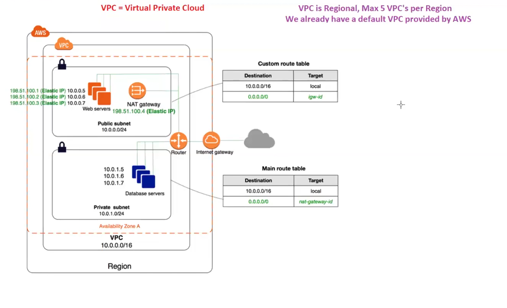

# Lecture 48 VPC(Virtual Private Cloud)
AWS is public cloud , so whatever you use will automatically be public so if you
want anything to be private then we have a private cloud in AWS called as virtual
Private Cloud!!

So everything should be inside VPC as everything is private!! VPC is like virtual data centre you have!!
We can have 5 max VPC in region so it is regional service!!

For every region we have a defualt VPC!!

Virtual Private Cloud (VPC) in Amazon Web Services is an important component for constructing flexible and secure cloud architectures. Functioning as an isolated virtual network environment within the AWS cloud, a VPC enables users to define their own virtual network topology, including IP address ranges, subnets, route tables, and network gateways.

## Key components of VPC
The following are some key components that are important to establish and manage a networking environment:

- Subnets: Within a VPC, subnets are like smaller neighborhoods, dividing the overall IP address range into manageable segments. Each subnet is associated with a specific Availability Zone (AZ), which ensures redundancy and fault tolerance. For example, you might have one subnet for web servers and another for databases, each located in different AZs, to mitigate the impact of failures.

- Internet gateways: Internet gateways are the connection points between the VPC and the wider internet. They allow instances within the VPC to communicate with resources outside the VPC, such as websites, APIs, and external databases.

- Route tables: Think of route tables as traffic directors within the VPC. They determine how network traffic flows between subnets and external networks like the internet. For instance, a route table might specify that traffic destined for the internet should be directed through the internet gateway, while internal traffic stays within the VPC.

- Elastic IP addresses (EIP): EIPs are like reserved parking spots for instances within the VPC. They provide a static IP address that can be associated with an instance, ensuring that the instance maintains the same public-facing IP address even if it’s stopped and restarted.

## Components of VPC explained

here we can see NAT gateway ,internet gateway ,router,public and private subnet!!

we talk about in order vpc ,internet gateway,public subnet,private subnet,NAT gateway, Routing tables!!

Till now we have internet access to ec2 ,that internet is provided by Internet Gateway!! Only job to Internet gateway is to provide internet to
vpc!!We call it IGW in short!!

Public subnet exposed to internet and private subnet not exposed to internet!!
Components like load balancer needs internet are put in public subnet and components like RDS no need of internet
are put in private subnet!!

Public subnet traffic is routed to IGW!! as IGW provides internet!!

In private subnet you see some DB server ,here we need internet for some traffic!!
we have NAT gateway (network adress transaltor)(translates network adress means translates IP adresss)
At NAT gateway ,private ip is chnaged with Public ip and with that public IP , that will go to IGW!!

In case any hacker comes ,he will be able to come to NAT gateway only!!

>Note:public subnet traffic routed to IGW!! private subnet traffic routed to NAT gateway!!

NAT gateway should be in public subnet as it needs internet acess from IGW
 so always NAT gateway is put in
public subnet as IGW can be accessed by public subnet!!

There are 3 subnets in Mumbai region in default VPC!! all the subnets are public as we able to connect to ec2 instance!!
as all 3 subnets are public so no NAT gateway as no private subnet !! so default VPC is not having NAT!!

## Steps to create VPC
1. create VPC
2. create IGW and attach to VPC
3. create public subnet
4. create private subnet
5. create NAT gateway

## Routing table

1. public routing table --> All traffic(0.0.0.0) is routed to IGW , attached to public subnet
2. private routing table--> All traffic routes to NAT gateway , attached to private subnet!!

>Note:all traffic means 0.0.0.0 ip

>Note:No need to worry about Router !! it will be configuered by AWS!!

From our laptop on internet we cannot connect to private subnet but can connect to public subnet!!
But we want to connect to private subnet!!

So we create Baston server or jump server (just an ec2 instance) in public subet!!
from this server we connect to private server!!

